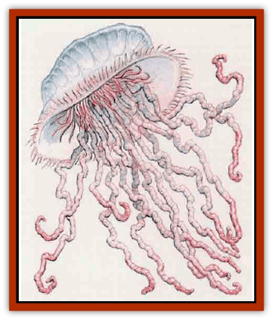
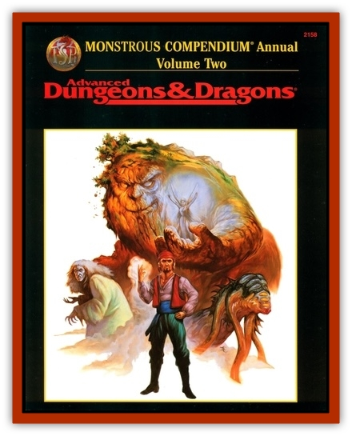

# Jellyfish - Giant

| Statistic | **Jellyfish, Giant** |
| --- | --- |
| **Activity Cycle:** | Day |
| **Alignment:** | Neutral |
| **Armor Class:** | 9 |
| **Climate/Terrain:** | Tropical ocean |
| **Damage/Attack:** | 1d10 |
| **Diet:** | Carnivore |
| **Frequency:** | Uncommon |
| **Hit Dice:** | 1 to 4 |
| **Intelligence:** | Non- (0) |
| **Magic Resistance:** | Nil |
| **Morale:** | Average to Steady (8-12) |
| **Movement:** | 1 |
| **No. Appearing:** | 1-10 |
| **No. of Attacks:** | 1 |
| **Organization:** | Solitary |
| **Size:** | S to L (2½-10') |
| **Special Attacks:** | Paralyzation |
| **Special Defenses:** | Transparent |
| **THAC0:** | 1-2 HD: 19 / 3-4 HD: 17 |
| **Treasure:** | Nil |
| **XP Value:** | 1 HD: 65 / 2 HD: 120 / 3 HD: 175 / 4 HD: 270 |

Portugese men-o-war are giant jellyfish that float in warm sea waters, trailing their deadly tentacles below. They most often float at or just below the suface of the ocean, and often wash up on beaches during storms. Some types are are nearly transparent; it is 90% probable that these will be undetected unless the creature encountering them is able to detect invisible objects.

**Combat:** The portugese man-o-war is a drifting hazard with no perceptible intelligent control of its movements except an instinctive reaction to avoid pain. Any creature touching the tentacles takes damage from their poison and must make a successful saving throw vs. paralyzation or be paralyzed for several hours. Paralyzed creatures will be drawn up by the tentacles and devoured in 3d4 turns.

Each portugese man-o-war has 10 to 40 tentacles. Their number and length is a function of the creature's size; for each Hit Die, the tentacles are 10 feet long. The diameter is also a function of Hit Dice. A 1 Hit Die portugese man-o-war is 2½ feet in diameter and has 10 tentacles that are 10 feet long. A 2 Hit Dice portugese man-o-war has a 5-foot diameter and 20 tentacles of 20-foot length. A 3 Hit Dice creature has a diameter of 7½ feet and 30 tentacles of 30-foot length, and a 4 Hit Dice creature has a diameter of 10 feet and 40 tentacles that trail downward 40 feet.

Each tentacle requires but a single hit point to sever, but this does not damage the creature. Only hits on the creature's body will kill it. Severed tentacles regenerate in several days.

**Habitat/Society:** Adult portugese men-o-war are solitary drifters, borne on warm ocean tides, though chance may well bring them together in larger numbers. They are most common in tropical shallows, and are rarely found deeper than light can easily penetrate (about 30 to 40 feet).

Occasionally storms wash portugese men-0-war up onto beaches, where their tentacles become partially buried in the sand and hard to see. This might result in a nasty surprise for a creature walking barefoot on the sand or digging by hand. Of course, scavengers like small crabs and sea birds make short work of the beached jellyfish.

**Ecology:** Certain types of small fishes seem to be immune to the paralytic poison and take refuge from larger predators among the tentacles, effectively luring such predators to the man-o-war. Some primitive tribes use the tentacles of portugese men-o-war in crude traps, and might construct crude scourges of short-lived effectiveness frnm the tantacles.

**Sea Swarm**

  Immature portugese men-0-war are occasionally found in great swarms in tropical seas. They are attracted to light and vibration, and can deliver nasty stings to the unprotected. Being caught in such a swarm can be dangerous. The swarm as a whole is treated as a single mature of 2 Hit Dice; exceptionally large gatherings can be treated as multiple swarms. Each swarm as a whole has one attack per round, inflicting 1d4 points of damage and requiring a saving throw vs. paralysis. As such swarms move slowly and erratically, it is unlikely that a creature will suffer more than one attack unless the swarm is magically controlled, These jellyfish are too small to devour all but the smallest creatures they paralyze; however, they will feed on the scraps left by predators who tear apart their victims. Sea swarms can appear as a result of aquatic monster summoning.

---
## Discovery & Documentation

**Source Publication:** Monstrous Compendium, 1995 Annual, Volume 2 (1995)
**Campaign Setting:** Advanced Dungeons & Dragons 2nd Edition
**Author(s):** Jon Pickens

### Other Creatures Found in This Source Book
   * [[Aboleth_Savant|Aboleth, Savant]]
   * [[Addazahr|Addazahr]]
   * [[Amiq_Rasol|Amiq Rasol]]
   * [[Arch-Shadow|Arch-Shadow]]
   * [[Automaton_Scaladar|Automaton, Scaladar]]
   * [[Automaton_Trobriand's|Automaton, Trobriand's]]
   * [[Bat_Sporebat|Bat, Sporebat]]
   * [[Beetle_Dragon|Beetle, Dragon]]
   * [[Bi-nou|Bi-nou]]
   * [[Boggle|Boggle]]
   * [[Brownie_Dobie|Brownie, Dobie]]
   * [[Brownie_Quickling|Brownie, Quickling]]
   * [[Cat_Crypt|Cat, Crypt]]
   * [[Cat_Great_Cath_Shee|Cat, Great, Cath Shee]]
   * [[Centaur-kin_Dorvesh|Centaur-kin, Dorvesh]]
   * [[Centaur-kin_Gnoat|Centaur-kin, Gnoat]]
   * [[Centaur-kin_Ha'pony|Centaur-kin, Ha'pony]]
   * [[Centaur-kin_Zebranaur|Centaur-kin, Zebranaur]]
   * [[Chronolily|Chronolily]]
   * [[Curst|Curst]]
   * [[Darktentacles|Darktentacles]]
   * [[Dinosaur_Aquatic|Dinosaur, Aquatic]]
   * [[Dinosaur_II|Dinosaur II]]
   * [[Dinosaur_III|Dinosaur III]]
   * [[Doppelganger_Greater|Doppelganger, Greater]]
   * [[Dragon_Brine|Dragon, Brine]]
   * [[Dragon_Half-|Dragon, Half-]]
   * [[Dragon-kin_Sea_Wyrm|Dragon-kin, Sea Wyrm]]
   * [[Dwarf_Wild|Dwarf, Wild]]
   * [[Ekimmu|Ekimmu]]
   * [[Elemental_Nature|Elemental, Nature]]
   * [[Elf_Winged|Elf, Winged]]
   * [[Fish_Great_Glacier|Fish (Great Glacier)]]
   * [[Fish_Subterranean|Fish, Subterranean]]
   * [[Fish_Toril|Fish (Toril)]]
   * [[Flareater|Flareater]]
   * [[Flumph|Flumph]]
   * [[Froghemoth|Froghemoth]]
   * [[Ghost_Casurua|Ghost, Casurua]]
   * [[Ghost_Ker|Ghost, Ker]]
   * [[Ghul|Ghul]]
   * [[Ghul-Kin|Ghul-Kin]]
   * [[Giant_Half-giant|Giant, Half-giant]]
   * [[Golem_Burning_Man|Golem, Burning Man]]
   * [[Golem_Phantom_Flyer|Golem, Phantom Flyer]]
   * [[Gulguthhydra|Gulguthhydra]]
   * [[Hakeashar|Hakeashar]]
   * [[Horse_Moon-|Horse, Moon-]]
   * [[Human_Dragonslayer|Human, Dragonslayer]]
   * [[Human_Vistana|Human, Vistana]]
   * [[Kalin|Kalin]]
   * [[Kholiathra|Kholiathra]]
   * [[Laerti|Laerti]]
   * [[Leucrotta_Greater|Leucrotta, Greater]]
   * [[Lich_Suel|Lich, Suel]]
   * [[Lurker_Shadow|Lurker, Shadow]]
   * [[Lycanthrope_Werepanther|Lycanthrope, Werepanther]]
   * [[Lycanthrope_Wereshark|Lycanthrope, Wereshark]]
   * [[Mammal_Herd_II|Mammal, Herd II]]
   * [[Marl|Marl]]
   * [[Meenlock|Meenlock]]
   * [[Mimic_Greater|Mimic, Greater]]
   * [[Mold_II|Mold II]]
   * [[Mummy_Creature|Mummy, Creature]]
   * [[Nyth|Nyth]]
   * [[Ooze_Slime_Jelly_Ghaunadan|Ooze/Slime/Jelly, Ghaunadan]]
   * [[Palimpsest|Palimpsest]]
   * [[Peltast|Peltast]]
   * [[Plant_Dangerous_II|Plant, Dangerous II]]
   * [[Pleistocene_Animal|Pleistocene Animal]]
   * [[Pudding_Subterranean|Pudding, Subterranean]]
   * [[Raggamoffyn|Raggamoffyn]]
   * [[Snake_Serpent|Snake, Serpent]]
   * [[Snake_Serpent_Vine|Snake, Serpent Vine]]
   * [[Sphinx_Draco-|Sphinx, Draco-]]
   * [[Sprite_Seelie_Faerie|Sprite, Seelie Faerie]]
   * [[Sprite_Unseelie_Faerie|Sprite, Unseelie Faerie]]
   * [[Squealer|Squealer]]
   * [[Turtle_Giant|Turtle, Giant]]
   * [[Umpleby|Umpleby]]
   * [[Vizier's_Turban|Vizier's Turban]]
   * [[Wall_Walker|Wall Walker]]
   * [[Webbird|Webbird]]
   * [[Yak-Man|Yak-Man]]
   * [[Zorbo|Zorbo]]
