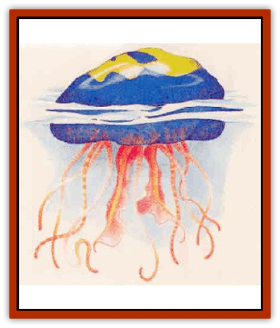

# Jellyfish - Giant - Mystara

| Statistic | **Death's Head** | **Galley** | **Marauder** |
| --- | --- | --- | --- |
| **Activity Cycle:** | Any | Any | Any |
| **Alignment:** | Neutral | Neutral | Neutral |
| **Armor Class:** | 6 | 8 | 9 |
| **Climate/Terrain:** | Nonarctic ocean | Nonarctic ocean | Nonarctic ocean |
| **Damage/Attack:** | 1d12 each (tentacle sting) | 1d8 each (tentacle sting) | 1d10 each (tentacle sting) |
| **Diet:** | Carnivore | Carnivore | Carnivore |
| **Frequency:** | Rare | Rare | Uncommon |
| **Hit Dice:** | 6 | 5 | 4 |
| **Intelligence:** | Non- (0) | Non- (0) | Non- (0) |
| **Magic Resistance:** | 10% | Nil | Nil |
| **Morale:** | Average (10) | Average (10) | Average (10) |
| **Movement:** | Sw 3 | Sw 12 | Sw 1 |
| **No. Appearing:** | 1d4 | 1d6 | 1d10 |
| **No. of Attacks:** | 24 (1d6/target) | 16 (1d4/target) | 40 (1d4/target) |
| **Organization:** | School | School | School |
| **Size:** | H (14' diameter) | L (12' diameter) | L (10' diameter) |
| **Special Attacks:** | Poison | Spit venom | Paralysis, surprise |
| **Special Defenses:** | Nil | Nil | Nil |
| **THAC0:** | 15 | 15 | 17 |
| **Treasure:** | U | Nil | Nil |
| **XP Value:** | 2,000 | 975 | 975 |

Each variety of these huge, nearly transparent creatures possesses stinging tentacles up to 100 feet long. The tentacles look like weeds hanging down in the water, but these giant jellyfish can manipulate their tentacles to attack prey.

[[Jellyfish_Giant|Giant jellyfish]] stay afloat by storing air in one or more large bladders, which make up the majority of their bodies. They float on or near the surface of the ocean.

**Marauder**

  The marauder measures 10 feet across and has 40 tentacles. Its body is almost transparent, making it nearly undetectable (-5 to opponents' surprise rolls). The marauder can use only 1d4 tentacles against each opponent, but it can engage up to 10 at once.

Each tentade causes 1d10 points of damage. The creature stung must make a saving throw vs. paralysis or be paralyzed for 1d10 rounds. Paralyzed opponents are automatically hit by 1d4 tentacles each round the paralyzation remains in effect. The marauder draws its paralyzed victim toward its mouth and can devour all flesh from a man-sized morsel in 3d4 turns.

A tentacle can be severed with a single point of cutting damage, but only hits scored on the creature's body count toward its hit point total. Tentacles regenerate in several days.

**Death's Head**

  The death's head takes its name from a pattern on its body that resembles a skull. The jellyfish measures 14 feet across and has 24 tentacles, Its body is midnight blue, and the characteristic death's head mark ranges from yellow to fluorescent green.

This aggressive jellyfish initiates attacks. It can bring 1d6 tentacles to bear against an opponent, with each tentacle inflicting 2 points of damage. The sting is fatal; any creature stung by a tentacle must make a saving throw vs. poison or die. A successful saving throw means the opponent makes all rolls at a -4 penalty for 1d8 turns; penalties are not cumulative for subsequent hits. This jellyfish can engage four foes at once.

Many sailors harbor a superstitious fear toward the death's head. If they spot one, they consider it a sign that someone is going to die.

**Galley**

  So named because it is both a fast swimmer and a deadly surface combatant, this multicolored jellyfish measures 12 feet long and is shaped like a flattened oval. It uses the optical sensory organs on its body and its tentacles to detect prey. The galley has 16 tentacles. It can aim four tentacles at a single opponent, and can attack up to four targets at once. Each tentacle infficts 1d8 points of damage.

The galley's deadliness stems from its poison delivery. Using its sensory organs, this creature can sense the presence of a foe on the surface; using specialized, tubelike tentacles, it shoots a stream of venom up to 20 feet away (requiring an attack roll). A creature struck by the stream must make a successful saving throw vs. paralysis or be paralyzed for 2d4 rounds. Paralyzed opponents are hit automatically by any tentacle attacks.

A venom attack roll 4 higher than the number needed to hit means the venom has struck the opponent's eyes. In this case, the opponent is blinded for 3d4 rounds and must make a successful saving throw to avoid paralysis.

Galleys instinctivelv follow ships and often attack objects or creatures tossed overboard.

---
## Discovery & Documentation

**Source Publication:** Mystara Appendix (1994)
**Campaign Setting:** Mystara
**Author(s):** John Nephew, Teeuwynn Woodruff, John Terra, Skip Williams

### Other Creatures Found in This Source Book
   * [[Actaeon|Actaeon]]
   * [[Agarat|Agarat]]
   * [[Ash_Crawler|Ash Crawler]]
   * [[Baldandar|Baldandar]]
   * [[Bargda|Bargda]]
   * [[Bhut|Bhut]]
   * [[Bird_Mystara|Bird (Mystara)]]
   * [[Blackball|Blackball]]
   * [[Choker|Choker]]
   * [[Coltpixie|Coltpixie]]
   * [[Crone_of_Chaos|Crone of Chaos]]
   * [[Darkhood|Darkhood]]
   * [[Darkwing|Darkwing]]
   * [[Decapus|Decapus]]
   * [[Deep_Glaurant|Deep Glaurant]]
   * [[Diabolus|Diabolus]]
   * [[Dimensional_Warper|Dimensional Warper]]
   * [[Dragon_Mystara_Crystalline|Dragon (Mystara), Crystalline]]
   * [[Dragon_Mystara_Jade|Dragon (Mystara), Jade]]
   * [[Dragon_Mystara_Onyx|Dragon (Mystara), Onyx]]
   * [[Dragon_Mystara_Ruby|Dragon (Mystara), Ruby]]
   * [[Drake_Mystara|Drake (Mystara)]]
   * [[Dragonfly|Dragonfly]]
   * [[Dusanu|Dusanu]]
   * [[Elemental_of_Chaos_Air_Earth|Elemental of Chaos, Air/Earth]]
   * [[Elemental_of_Chaos_Fire_Water|Elemental of Chaos, Fire/Water]]
   * [[Elemental_of_Law_Air_Earth|Elemental of Law, Air/Earth]]
   * [[Elemental_of_Law_Fire_Water|Elemental of Law, Fire/Water]]
   * [[Familiar_Mystara|Familiar (Mystara)]]
   * [[Frost_Salamander|Frost Salamander]]
   * [[Fundamental_Air_Earth|Fundamental, Air/Earth]]
   * [[Fundamental_Fire_Water|Fundamental, Fire/Water]]
   * [[Gargantua_Mystara|Gargantua (Mystara)]]
   * [[Geonid|Geonid]]
   * [[Ghostly_Horde|Ghostly Horde]]
   * [[Giant_Athach|Giant, Athach]]
   * [[Giant_Hephaeston|Giant, Hephaeston]]
   * [[Golem_Drolem|Golem, Drolem]]
   * [[Golem_Mystara_I|Golem (Mystara) I]]
   * [[Golem_Mystara_II|Golem (Mystara) II]]
   * [[Golem_Mystara_III|Golem (Mystara) III]]
   * [[Gray_Philosopher|Gray Philosopher]]
   * [[Guardian_Warrior|Guardian Warrior]]
   * [[Gyerian|Gyerian]]
   * [[Herex|Herex]]
   * [[Hivebrood|Hivebrood]]
   * [[Horde|Horde]]
   * [[Hsiao|Hsiao]]
   * [[Huptzeen|Huptzeen]]
   * [[Hutaakan|Hutaakan]]
   * [[Imp_Mystara|Imp (Mystara)]]
   * [[Kna|Kna]]
   * [[Kopru|Kopru]]
   * [[Lizard_Mystara|Lizard (Mystara)]]
   * [[Lizard-kin_Mystara|Lizard-kin (Mystara)]]
   * [[Lupin|Lupin]]
   * [[Lycanthrope_Werejaguar_Mystara|Lycanthrope, Werejaguar (Mystara)]]
   * [[Lycanthrope_Wereswine|Lycanthrope, Wereswine]]
   * [[Magen|Magen]]
   * [[Manikin|Manikin]]
   * [[Mek|Mek]]
   * [[Mujina|Mujina]]
   * [[Nagpa|Nagpa]]
   * [[Neh-thalggu|Neh-thalggu]]
   * [[Nightshade_Mystara|Nightshade (Mystara)]]
   * [[Nuckalavee|Nuckalavee]]
   * [[Pegataur|Pegataur]]
   * [[Phanaton|Phanaton]]
   * [[Plant_Dangerous_Mystara|Plant, Dangerous (Mystara)]]
   * [[Plasm|Plasm]]
   * [[Rakasta|Rakasta]]
   * [[Rock_Man|Rock Man]]
   * [[Sabreclaw|Sabreclaw]]
   * [[Sacrol|Sacrol]]
   * [[Scamille|Scamille]]
   * [[Shapeshifter|Shapeshifter]]
   * [[Shargugh|Shargugh]]
   * [[Shark-kin|Shark-kin]]
   * [[Sollux|Sollux]]
   * [[Spectral_Death|Spectral Death]]
   * [[Spectral_Hound|Spectral Hound]]
   * [[Spider-kin|Spider-kin]]
   * [[Spirit_Mystara|Spirit (Mystara)]]
   * [[Statue_Living|Statue, Living]]
   * [[Surtaki|Surtaki]]
   * [[Tabi|Tabi]]
   * [[Thoul|Thoul]]
   * [[Thunderhead|Thunderhead]]
   * [[Tiger_Ebon|Tiger, Ebon]]
   * [[Topi|Topi]]
   * [[Tortle|Tortle]]
   * [[Vampire_Velya|Vampire, Velya]]
   * [[White_Fang|White Fang]]
   * [[Worm_Mystara|Worm (Mystara)]]
   * [[Wyrd|Wyrd]]
   * [[Yowler|Yowler]]
   * [[Zombie_Lightning|Zombie, Lightning]]
