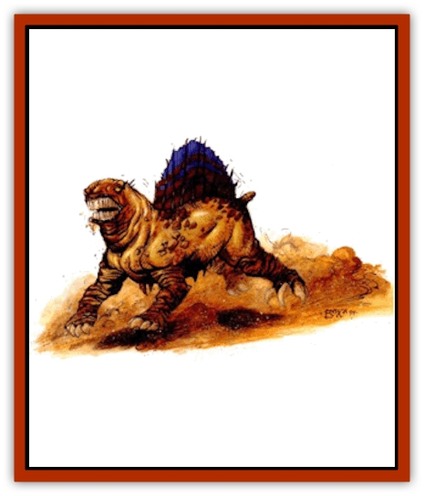
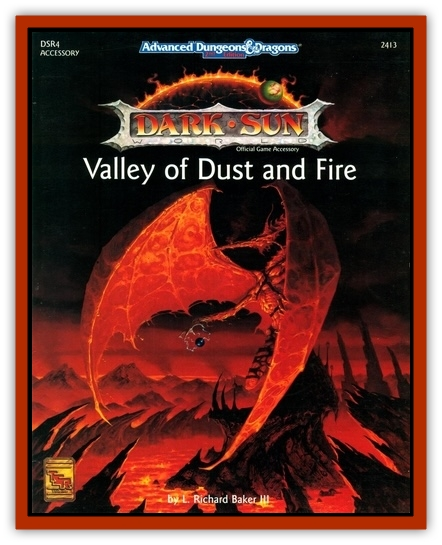

# Jhakar

| Statistic | **Jhakar** |
| --- | --- |
| **Activity Cycle:** | Night |
| **Alignment:** | Neutral |
| **Armor Class:** | 4 |
| **Climate/Terrain:** | Any (Tablelands) |
| **Damage/Attack:** | 2d4 |
| **Diet:** | Carnivore |
| **Frequency:** | Uncommon |
| **Hit Dice:** | 2+3 |
| **Intelligence:** | Animal (2-4) |
| **Magic Resistance:** | Nil |
| **Morale:** | Elite (13-14) |
| **Movement:** | 15 |
| **No. Appearing:** | 2-8 |
| **No. of Attacks:** | 1 |
| **Organization:** | Pack |
| **Size:** | S (2' high, 4' long) |
| **Special Attacks:** | Seizing bite |
| **Special Defenses:** | Nil |
| **THAC0:** | 17 |
| **Treasure:** | Nil |
| **XP Value:** | 175 |

The jhakar (singular and plural) is a powerful reptilian predator resembling a scaled bulldog. Its hide is thick and wrinkled, and it has four short, muscular legs and a short, stumpy tail. The jhakar's head is mostly mouth, with a blunt snout and a gaping, powerful maw. Its ears and eyes are well-protected beneath heavy ridges of bone and double sets of lids. The jhakar is sandy brown in color, with a darker snout and claws.

In the wild, the jhakar hunts in small packs that fiercely attack to pull down all but the most formidable prey. However, the creature is better known in cities as a domesticated guard-beast and tracker of escaped slaves. Domestic jhakar are savage and unpredictable creatures, greatly feared by would-be thieves and escaping slaves.

**Combat:** Jhakar are notorious for their tenacity and singleminded attacks. If the jhakar scores a hit during melee, it seizes its opponent in its jaws, refusing to release the prey until either the victim or the jhakar is dead. Each round after the initial hit, the jhakar hits automatically for normal bite damage and tries to drag its foe down. The jhakar's jaws grip its opponents with an effective 18/00 Strength.

Jhakar who have seized prey can overbear it. Due to their extreme ferocity and strength, they overbear as size M creatures. The overbearing attempt occurs at the same time the continuing bite damage takes effect. An overbearing attack is made at the jhakar's normal THAC0, at +4 against size S characters and -4 against size L characters. Multilegged creatures gain an additional -2 for each additional leg beyond two, so [[Thri-kreen|thri-kreen]] are overborne at -4 altogether. Each additional jhakar who has seized the victim contributes +1 to the overbearing roll. If the jhakar succeeds in overbearing, the victim is pulled down and must fight prone. Wild packs of jhakar flock to prey pulled down by their companions. Prone creatures are attacked at +4 to hit.

**Habitat/Society:** The jhakar is often domesticated as a blood-hound or guard-beast. It is an aggressive and stupid creature and has difficulty recognizing its handler from one day to the next. However, it is an excellent tracker, and once on the scent, it never gives up the chase.A wild pack of jhakar hunts a man or an elf as readily as any wild creature. Once they have scented prey, they never give up. Jhakar attack in one bounding rush, hissing like steam-kettles when they catch sight of their prey.

**Ecology:** The jhakar is a dangerous predator that is not particularly strong as an individual, but extraordinarily dangerous in a pack. Most creatures of the desert give a jhakar pack a wide berth. [[Tembo|Tembo]] are mortal enemies of the jhakar.

---
## Discovery & Documentation

**Source Publication:** DSR4 Valley of Dust and Fire (1992)
**Campaign Setting:** Dark Sun
**Author(s):** L. Richard Baker III

### Other Creatures Found in This Source Book
   * [[Drake_Lesser_Athas_Silt|Drake, Lesser (Athas), Silt]]
   * [[Golem_Athas_Magma|Golem (Athas), Magma]]
   * [[Human_Draxan|Human, Draxan]]
   * [[Human_Ka'Ardan|Human, Ka'Ardan]]
   * [[Kaisharga|Kaisharga]]
   * [[Silt_Horror_Black|Silt Horror, Black]]
