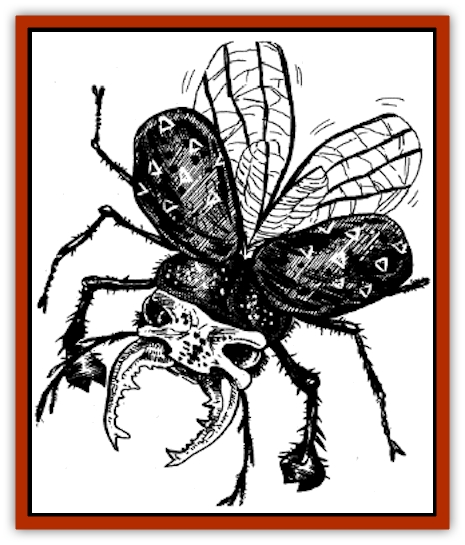

# Jishin Mushi

| Statistic | **Jishin Mushi** |
| --- | --- |
| **Activity Cycle:** | Night |
| **Alignment:** | Neutral |
| **Armor Class:** | 3 |
| **Climate/Terrain:** | Temperate forests |
| **Damage/Attack:** | 2-16 |
| **Diet:** | Carnivore |
| **Frequency:** | Very rare |
| **Hit Dice:** | 5+4 |
| **Intelligence:** | Animal (1) |
| **Magic Resistance:** | Nil |
| **Morale:** | Average (8) |
| **Movement:** | 9, Fl 3 (D) |
| **No. Appearing:** | 1-3 |
| **No. of Attacks:** | 1 |
| **Organization:** | Solitary |
| **Size:** | L (8-10' long) |
| **Special Attacks:** | Tremor |
| **Special Defenses:** | Nil |
| **THAC0:** | 15 |
| **Treasure:** | Nil |
| **XP Value:** | 420 |

The jishin mushi is a giant carnivorous [[Insect_Giant|insect]]. Also known as the earthquake [[Beetle_Giant|beetle]], it is capable of generating tremors of extraordinary magnitude.

The jishin mushi has six legs and a plump body. A tough, bluegreen carapace covers its back, while thick gray plates protect its underside. Its legs are covered with black bristles and end in flat, bony hooks. These hooks are useless as weapons but helpful for digging.

The earthquake beetle's carapace conceals a pair of wing sheaths. When it takes flight, the beetle raises the sheathes to expose four wings. The two smaller wings near the head help the creature maneuver. The two larger wings behind propel the insect through the air, beating so rapidly they nearly become invisible. When the beetle lands, it withdraws all four wings beneath the sheaths to keep them protected.

Two antlerlike feelers extend from the top of the creature's head. Both are covered with tiny hairs. The feelers are the beetle's primary sensory organs, providing a powerful sense of smell. With them, a jishin mushi can smell prey up to 100 yards distant.

A pair of bulbous black eyes sit atop the beetle's head, and two strong mandibles curl out from its mouth. The jagged mandibles are well suited for crushing and tearing food, as well as for attacking enemies.

**Combat:** The jishin mushi is not aggressive by nature, attacking only to defend itself and to kill edible prey. Its powerful mandibles can inflict 2-16 (2d8) hit points of damage per bite. The mandibles also are used to grasp and drag victims back to the privacy of the forest. However, the mandibles are poorly designed to clamp objects, and most grasped victims easily can slip free. For this reason, the jishin mushi will ordinarily continue its attacks until its victim is dead or unconscious before dragging him off to eat.

The creature's most dangerous weapon is its ability to create tremors in the earth. By striking its abdomen on the ground, the jishin mushi generates a small tremor, which grows in intensity with repeated blows. The effects of these tremors over successive rounds are as follows:

<ul><li>Round 1: Any creature within 5 feet of the jishin mushi must make a successful saving throw vs. breath weapon or be knocked to the ground</li><li>Round 2: Any creature within 10 feet must make a successful saving throw vs. breath weapon or be knocked to the ground.</li><li>Round 3: The radius of the tremors extends to 15 feet. Those within 5 feet of the creature are thrown violently about, suffering 1-6 hit points of damage and losing the opportunity to make an attack that round.</li><li>Round 4: The radius extends to 20 feet. Those within 10 feet suffer 1-6 points of damage and lose the opportunity to attack.</li><li>Round 5: The radius extends to 25 feet. Those within 15 feet suffer 1-6 points of damage and lose the opportunity to attack. Cracks in the earth begin to appear within 5 feet of the creature.</li><li>Round 6: The radius extends to 30 feet. Those within 20 feet suffer 1-6 points of damage and lose the opportunity to attack. The area within 10 feet of the creature suffers the effects of an *earthquake* spell. At this point, the jishin mushi must take to the air to avoid the consequences of its own deeds.</li></ul>**Habitat/Society:** Jishin mushi establish lairs in the deep woods, beneath piles of decaying vegetation, in crevasses, or - in especially large forests - in the trunks of rotting trees that have fallen to the ground. Occasionally, the beetles will burrow tunnels if the earth is soft enough. In any case, a jishin mushi's lair is only temporary. The creature spends all waking hours prowling the forests in search of food. After a strenuous night of hunting, it rests in the nearest suitable lair.

**Ecology:** A jishin mushi eats all types of meat. It is particularly fond of oxen and sometimes attacks these animals as they work in a farmer's fields.

The ichor of the jishin mushi is greatly prized by incense makers, fetching as much as 2 tael for a flask. Certain primitive tribes consider larval jishin mushi a delicacy.

---
## Discovery & Documentation

**Source Publication:** MC6 Kara-Tur Appendix (1990)
**Campaign Setting:** Kara-Tur (Forgotten Realms)
**Author(s):** Rick Swan

### Other Creatures Found in This Source Book
   * [[Bajang|Bajang]]
   * [[Bakemono|Bakemono]]
   * [[Bisan|Bisan]]
   * [[Buso|Buso]]
   * [[Carp_Giant|Carp, Giant]]
   * [[Centipede_Spirit|Centipede, Spirit]]
   * [[Chu-u|Chu-u]]
   * [[Con-tinh|Con-tinh]]
   * [[Doc_cu'o'c|Doc cu'o'c]]
   * [[Duruch'i-lin|Duruch'i-lin]]
   * [[Flame_Spirit|Flame Spirit]]
   * [[Foo_Creature|Foo Creature]]
   * [[Gaki|Gaki]]
   * [[Gargantua|Gargantua]]
   * [[Goblin_Rat|Goblin Rat]]
   * [[Hai_Nu|Hai Nu]]
   * [[Hannya|Hannya]]
   * [[Hengeyokai|Hengeyokai]]
   * [[Hsing-sing|Hsing-sing]]
   * [[Hu_Hsien|Hu Hsien]]
   * [[Human_Kara-Tur|Human (Kara-Tur)]]
   * [[Ikiryo|Ikiryo]]
   * [[Kala|Kala]]
   * [[Kaluk|Kaluk]]
   * [[Kappa|Kappa]]
   * [[Korobokuru|Korobokuru]]
   * [[Krakentua|Krakentua]]
   * [[Kuei|Kuei]]
   * [[Memedi|Memedi]]
   * [[Men-shen|Men-shen]]
   * [[Nat|Nat]]
   * [[Ningyo|Ningyo]]
   * [[Oni|Oni]]
   * [[P'oh|P'oh]]
   * [[P'oh_Gohei|P'oh, Gohei]]
   * [[Shan_Sao|Shan Sao]]
   * [[Shirokinukatsukami|Shirokinukatsukami]]
   * [[Spirit_Folk|Spirit Folk]]
   * [[Spirit_Nature|Spirit, Nature]]
   * [[Spirit_Stone|Spirit, Stone]]
   * [[Tako|Tako]]
   * [[Tengu|Tengu]]
   * [[Wang-Liang|Wang-Liang]]
   * [[Yuan-ti_Histachii|Yuan-ti, Histachii]]
   * [[Yuki-on-na|Yuki-on-na]]
