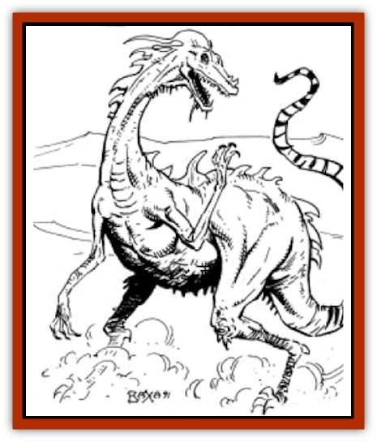

# Jozhal

| Statistic | **Jozhal** |
| --- | --- |
| **Activity Cycle:** | Night |
| **Alignment:** | Chaotic neutral |
| **Armor Class:** | 3 |
| **Climate/Terrain:** | Tablelands and Hinterlands |
| **Damage/Attack:** | 1d6 or by weapon -2 or 1d4/1d4 |
| **Diet:** | Omnivore |
| **Frequency:** | Rare |
| **Hit Dice:** | 4 |
| **Intelligence:** | Very (11-12) |
| **Magic Resistance:** | 10% |
| **Morale:** | Steady (11-12) |
| **Movement:** | 18 |
| **No. Appearing:** | 5-10 (1d6+4) |
| **No. of Attacks:** | 1 |
| **Organization:** | Family |
| **Size:** | S (4' tall) |
| **Special Attacks:** | Uses magical items &amp; spells |
| **Special Defenses:** | Camouflage |
| **THAC0:** | 17 |
| **Treasure:** | U |
| **XP Value:** | 1,400 |

**Psionics Summary**

| Level | Dis/Sci/Dev | Attack/Defense | Score | PSPs |
| --- | --- | --- | --- | --- |
| 4 | 2/2/9 | EW,PB/IF,TS | 14 | 80 |

**Psychoportation -** *Science:* banishment; *Devotions:* dimensional door, time shift, time/space anchor, teleport trigger.

**Telepathy -** *Science:* contact; *Devotions:* ego whip, psionic blast, intellect fortress, thought shield, mind bar.

**Spells** - 1) *detect magic*, *cure light wounds*, *detect poison*, *locate animals or plants*, *magical stone*; 2) *silence 15' radius*, *hold person*, *flame blade*; 3) *locate object*, *dispel magic*.

Standing about four feet tall, the jozhal is a small, two-legged reptile with a skinny tail, a long flexible neck, and a narrow, elongated snout. Its mouth is filled with needle sharp teeth, and its lanky arms end in small, three-fingered hands with an opposable thumb. Although the jozhal's hide is covered with scales, they are so small as to be unnoticeable at first, and it appears to more akin to a man's skin or a [[Baazrag|baazrag's]] rough hide. The jozhal can change the hue of its skin at will, either to match the color of its environment, or to stand out against it.

**Combat:** Generally, the jozhal prefers to avoid combat. It attempts to flee, then use its ability to change skin color to hide from pursuers (they must roll their Wisdom or less on 1d20 to find the jozhal). Should the pursuer get too close to the jozhal without actually seeing it, the jozhal will attack. The victim must make a surprise check with a -2 penalty.

During the actual fight, the lozhal attempts to defend itself first with psionics and magic, then with any magical items it currently possesses (roll on Table 88 in *DMG*, results calling for armor, shields, or weapons count as no magical item in jozhal's possession). If that fails, it will bite with its teeth for 1d8 points of damage, or strike with any weapon available to it (with a -2 damage modifier.)

**Habitat/Society:** The jozhal live in small family groups of four to five creatures. They are extremely intelligent and cunning, but regard humans or demihumans as foolish, dangerous creatures and will rarely tolerate them.

Jozhals are attracted to magic of all sorts, and whenever they see humans or demihumans passing they track the party down and attempt to cast a *detect magic* spell on the group. If the spell reveals any magical items, they will try to sneak into camp and steal them.

**Ecology:** Jozhals forage for food (roots and tubers), and eat almost any sort of small reptile, snake, or insect. Their magic is akin to that of elemental clerics, and is therefore not destructive to the environment around them.

The jozhal clan's intellect is best reflect in its relationship to the world around it. They are very careful never to destroy the life-giving world in which they live, always making use of every bit of scrap and refuse that they find. They carry this to extremes, even practicing cannibalism and using the bones of their dead to construct weapons and tools.

---
## Discovery & Documentation

**Source Publication:** Dark Sun Campaign Setting (original) (1991)
**Campaign Setting:** Dark Sun
**Author(s):** Timothy B. Brown, Troy Denning, William W. Connors, J. Robert King, Brom and Tom Baxa,

### Other Creatures Found in This Source Book
   * [[Animal_Domestic_Athas_I|Animal, Domestic (Athas) I]]
   * [[Belgoi|Belgoi]]
   * [[Braxat|Braxat]]
   * [[Dragon_of_Tyr|Dragon of Tyr]]
   * [[Dune_Freak|Dune Freak]]
   * [[Gaj|Gaj]]
   * [[Giant_Athach|Giant, Athach]]
   * [[Gith|Gith]]
   * [[Kluzd|Kluzd]]
   * [[Silk_Wyrm|Silk Wyrm]]
   * [[Tembo|Tembo]]
   * [[Wezer|Wezer]]
