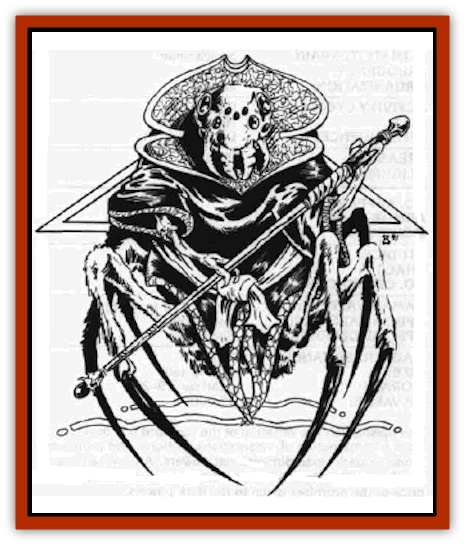

# K'r'r'r

| Statistic | **K'r'r'r** |
| --- | --- |
| **Activity Cycle:** | Day |
| **Alignment:** | Lawful neutral |
| **Armor Class:** | 5 |
| **Climate/Terrain:** | Wildspace, jungle |
| **Damage/Attack:** | By weapon or 1-4 |
| **Diet:** | Carnivore |
| **Frequency:** | Rare |
| **Hit Dice:** | 3 |
| **Intelligence:** | High (13-14) |
| **Magic Resistance:** | Standard, +4 vs. illusions |
| **Morale:** | Fanatic (17-18) |
| **Movement:** | 12 |
| **No. Appearing:** | 10-40 |
| **No. of Attacks:** | 1 |
| **Organization:** | Community |
| **Size:** | M (5-6' tall) |
| **Special Attacks:** | Nil |
| **Special Defenses:** | Nil |
| **THAC0:** | 18 |
| **Treasure:** | A (N) |
| **XP Value:** | 1,400 |

The k'r'r'r are sentient [[Spider|spiders]] that developed in deep space. Unfettered by a dependency on gravity. the k'r'r'r are not locked into the two-dimensional thought processes that seem to affect other races. Their homes and ships can be built of three-, four-, or five-sided designs to suit their needs.

The k'r'r'r are firm in their belief that their place is at the apex of creation. The rest of the Known Spheres is a larder for their kitchens and a quarry for their constructions. It is their destiny to exploit all the resources that their gods have made available to them. The k'r'r'rs' duty is to organize themselves so that they may fully grasp that destiny.

The k'r'r'r look like thin spiders resting on stiltlike legs. Whereas most spiderlike beings are relatively horizontal with bodies held close to the ground, the k'r'r'r are upright with torsos held 2 feet off the ground. This disparity is attributed to a superior design granted by the gods.

The k'r'r'r come in shades of black and dark blue. A skyblue strain is a natural mutation, and they are considered touched by the gods and treated with inordinate respect.

**Combat:** The forward pair of legs are smaller than the other six, and they end in delicate claws used for manipulating tools and weapons. The head is multieyed but dominated by two primary orbs. The multiple eyes coupled with high Intelligence provide the race with a +4 to saving throws versus illusion/phantasm spells. The head also has great jaws that allow the k'r'r'r to bite if it is weaponless.

K'r'r'r prefer spears, pole arms, and other piercing weapons to the shorter weapons such as maces. They are physically hampered when using weapons that require slashing strokes, such as swords, and they suffer a -1 to hit penalty with them. K'r'r'r do not use bows, but they can use specially modified and mounted crossbows and starwheel pistols, though each weapon takes an additional round for the k'r'r'r to load. In combat, the k'r'r'r who have such weapons fire the first round then use their pole arms thereafter. Those without a secondary weapon will bite for 1-4 points of damage.

One k'r'r'r in 10 has exceptional abilities. Half of these are higher level fighters, with additional 1-6 HD. The other half are specialist priests of levels 3-12. These specialized priests have limited access to spells (All, Guardian, Protection, and Sun spheres only), and they are used primarily as helmsmen for exploration and colonization vessels.

**Habitat/Society:** The k'r'r'r believe they have the right to colonize and exploit the remainder of the universe. Their logic to support this philosophy is straightforward: Other races in space apparently come from one groundling society or another - they have no more purpose in space than does a fish on land. The k'r'r'r, however, were born to the void.

To that end the k'r'r'r are expanding their infiltration of various spheres through use of their unity fleets. These fleets are like caravans to the stars, identical ships being constructed and sent out one after another. The ships are modular, and once they arrive on the scene they can link up to form larger, more powerful ships to defeat an enemy. The peculiar nature of the k'r'r'r allows their ships to move quickly on a tactical scale, even if the ships have linked together and exceed the normal 100-ton limit. It is a combination of the k'r'r'rs' mindset and their specialized helms that allows them to pull off this maneuver - a maneuver that other races, even with k'r'r'r helms, have not been able to duplicate.

The k'r'r'r are led by their strongest fighter, supported by priests. The fighter and priests are likened to empty vessels that must be filled by the k'r'r'r spider-god called the Wise Queen. Her body is jet black, and she has a humanish mold to her face. The k'r'r'r consider her superior to all other gods just as the k'r'r'r are superior to all other creatures.

There is a disturbing similarity between the k'r'r'r Wise Queen and the [[Elf_Drow|Dark Elves']] Llolth. The drow goddess is extremely chaotic and utterly evil - could she be advising and providing spiritual leadership for a group of neutral but primarily lawful spider-creatures? The answer is unknown.

**Ecology:** The k'r'r'r are carnivores and will eat any creature. including their own dead, in order to survive. However, they are extremely efficient feeders end do not need to eat often, and a single meal will hold a k'r'r'r for two months or more. There will be dried meats of unknown origin on k'r'r'r ships.

---
## Discovery & Documentation

**Source Publication:** Legend of the Spelljammer (1991)
**Campaign Setting:** Spelljammer
**Author(s):** Jeff Grub

### Other Creatures Found in This Source Book
   * [[Beholder_Kasharin|Beholder, Kasharin]]
   * [[Lich_Master|Lich, Master]]
   * [[Shivak|Shivak]]
