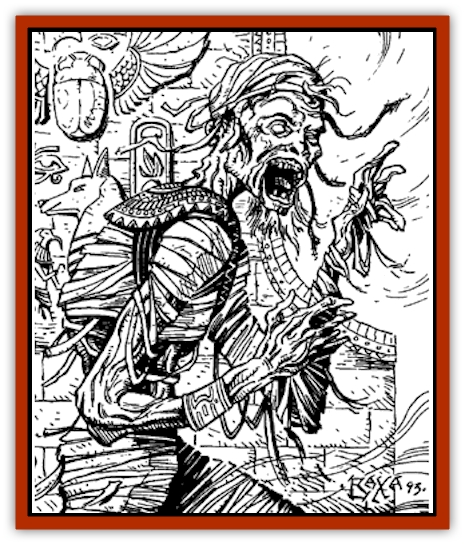

# Ka

| Statistic | **Ka** |
| --- | --- |
| **Activity Cycle:** | Night |
| **Alignment:** | Lawful neutral |
| **Armor Class:** | 1 |
| **Climate/Terrain:** | Desert, rivers, subterranean |
| **Damage/Attack:** | 2d10 |
| **Diet:** | Spirit food |
| **Frequency:** | Very rare |
| **Hit Dice:** | 9+6 |
| **Intelligence:** | Average to Genius (8-18) |
| **Magic Resistance:** | Nil |
| **Morale:** | Fearless (20) |
| **Movement:** | 9 |
| **No. Appearing:** | 1 or 2-12 |
| **No. of Attacks:** | 1 |
| **Organization:** | Solitary or small bands |
| **Size:** | M (5-7') |
| **Special Attacks:** | Fear, spellwriting, curse, statue animation |
| **Special Defenses:** | Weapon resistances, spell immunities and resistances, spirit doors |
| **THAC0:** | 11 |
| **Treasure:** | A |
| **XP Value:** | 14,000 |

A ka is a kind of super-[[Mummy|mummy]]. Once, the ka was a noble, king, or pharaoh. After death, the mummified body continued to live on in the tomb as an undead monster. A ka is not necessarily evil. It attacks only when its tomb offerings are threatened or when under the control of a cleric. A ka looks like a normal mummy - i.e., as a bandage-wrapped corpse.

**Combat:** Like a normal mummy, a ka possesses supernatural strength that lets its blows do more than normal damage. Instead of a rotting disease, however, a successful hit by a ka imparts a curse upon the victim. DMs may make up their own curses or may use the following table (roll 1d20; all curses last until removed):

|  |
| --- |
| 1-3 | Ill luck. All future rolls for the cursed individual are -1 on a roll of 1, -2 on a roll of 2, or -3 on a roll of 3. |
| 4-7 | Withering touch. An arm or leg withers and becomes useless. (4 = right arm, 5 = left arm, 6 = right leg, 7 = left leg; loss of a leg reduces movement by 3). |
| 8-11 | Mutation. A body part becomes mutated to some other form (8 = a leg, 9 = torso, 10 = an arm, 11 = head). |
| 12-14 | Alteration. An attribute chosen at random is lowered by -1. |
| 15-18 | Death wish. Extra damage is received in subsequent attacks. (15 = +1, 16 = +2, 17 = +3, 18 = double damage). |
| 19-20 | Cursed item. One magical item, chosen at random, loses its benefits on a 19 (as per cancellation). On a 20, the item actually becomes cursed (use the closest appropriate cursed item from the Treasure Tables; hence a sword +3 would become a cursed sword -2). |

As with mummies, the mere sight of a ka may cause fear and revulsion in any creature. A save vs. spells must succeed or the victim will be paralyzed with fright for 1-6 melee rounds. There are no bonuses to the die roll.

A ka can be harmed only by magical weapons, which do only half normal damage. *Sleep*, *charm*, *hold*, cold, poison, paralysis, *polymorph*, and electricity do not harm it. It suffers only half damage from fire or holy water. A *raise dead* spell turns a ka into a normal human (of 10th-level fighting ability) unless the ka saves vs. spells.

A ka has a limited magical ability. A word written by it has the force of a *command* spell. It takes a full round to inscribe such a word. Characters need not see the written word for the spell to take effect.

The ka is able to fragment its spirit. These spirit fragments can inhabit special magical stone statues within the ka's tomb. Treat these statues as [[Golem_I_Greater_Golem|stone golems]]. A ka can inhabit 1-4 statues at a time. If the ka's mummified body is destroyed, its will lives on in the statues. Inside a statue, however, a ka no longer possesses its curse or magical writing powers, and it may be affected by forms of attacks to which the mummified body is immune. Note that the ka has no power to activate any other statue but those in its tomb.

A ka may also walk through special spirit doors carved into stone or wood or painted on a wall when the body was buried. A ka could walk through a spirit door carved into rock, attack the party, then retreat back inside its tomb.

A cleric has the same chance to turn a ka as he does a vampire.

**Habitat/Society:** A ka was once a living ruler. It still retains some friendliness toward character races, especially members of its own race and nation. Thus a human ka has an affinity for humans, a [[Dwarf|dwarven]] ka for dwarves, etc. This affinity is even stronger if, in the DM's opinion, the ka and character share the same cultural background.

If no attempt is made to steal its tomb treasures, a ka may be placated by showing it reverence and giving it additional grave goods. Such goods may vary from simple food to elaborate treasures. At the DM's discretion, a ka that has become placated may be asked questions that require simple yes-or-no answers. The greater the offerings, the greater the knowledge such a ka may impart.

Wealthy individuals are usually buried alone. A ka is, hence, generally encountered as a solitary creature. Sometimes, however, many graves are crowded into one tomb to discourage robbers. In this case, the tomb is shared by a related group of kas.

---
## Discovery & Documentation

**Source Publication:** Dragon198 (1993)
**Campaign Setting:** Dragon Magazine
**Author(s):** 

### Other Creatures Found in This Source Book
   * [[Angreden|Angreden]]
   * [[Ghoul_Goop|Ghoul, Goop]]
   * [[Vartha|Vartha]]
   * [[Wight_King-|Wight, King-]]
   * [[Wraith-King|Wraith-King]]
