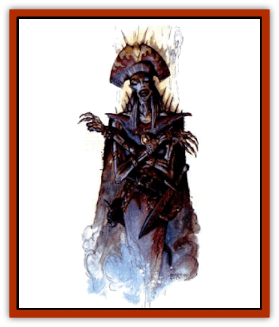

# Kaisharga

| Statistic | **Kaisharga** |
| --- | --- |
| **Activity Cycle:** | Any |
| **Alignment:** | Any evil |
| **Armor Class:** | As in life, or 0 |
| **Climate/Terrain:** | Any |
| **Damage/Attack:** | 1d10 or by weapon type |
| **Diet:** | None |
| **Frequency:** | Very rare |
| **Hit Dice:** | As in life, minimum 10 HD |
| **Intelligence:** | Exceptional (15-16) or better |
| **Magic Resistance:** | 5% per HD |
| **Morale:** | Fanatic (18) |
| **Movement:** | 12 |
| **No. Appearing:** | 1 (1-3) |
| **No. of Attacks:** | As in life, or 1 |
| **Organization:** | Solitary |
| **Size:** | M (6' tall) |
| **Special Attacks:** | See below |
| **Special Defenses:** | See below |
| **THAC0:** | As in life, or 11 |
| **Treasure:** | E,S,T,V (&times;2) |
| **XP Value:** | 22,000 + 2,500 per HD over 10 |

**Psionics Summary**

| Level | Dis/Sci/Dev | Attack/Defense | Score | PSPs |
| --- | --- | --- | --- | --- |
| =HD | 4/6/17 | all/all | 18 | 100 |

**Clairsentience -** *Science:* detection; *Devotions:* psionic sense, spirit sense.

**Psychokinesis -** *Science:* telekinesis; *Devotions:* control body, control winds, levitation, stasis field.

**Psychoportation -** *Science:* teleport; *Devotions:* dimensional door, dimension walk, time/space anchor.

**Telepathy -** *Sciences:* domination, ejection, mind link, psionic blast; *Devotions:* awe, ego whip, contact, id insinuation, life detection, psionic crush, send thoughts.

The kaisharga are a class of [[Undead_Athas_General_Information|Athasian undead]] similar to the [[Lich|liches]] of other worlds. They have sought undeath, unnaturally extending their lives past the endurance of their mortal frames. Unlife gives them many terrible powers. Kaisharga appear as a gaunt, wasted humans with grayish, thinly stretched skin. They wear the trappings they preferred in life and their eyes burn with a green fire.

**Combat:** The change to undeath raises the kaisharga's effective Strength, Dexterity, and Constitution scores to 20. Kaisharga gain +5 hp per die for Constitution and can reroll a 1. Kaisharga gain the psionic abilities listed above if they were formerly wild talents, if they were psionicists, they may recalculate their power scores to reflect their new ability scores. Wizard, psionicist, and templar kaisharga attack rolls are 1d8, and warrior kaisharga attack rolls are 1d10.

Kaisharga are immune to *charm*, *sleep*, *enfeeblement*, *polymorph*, cold, electricity, insanity, and *death* spells. They can only be struck by +1 magical weapons or by creatures of 6 HD or more. Kaisharga possess an *aura of fear* that forces any living creature within 60 feet to successfully save vs. spells or flee for 5-20 rounds. Characters of 8th level or 8 HD are immune to this aura of fear. The touch of the kaisharga inflicts 1d10 points of damage from their deathly cold and paralyzes the victim unless the victim makes a successful save vs. paralyzation.

Kaisharga have magical items appropriate to their class. Warriors usually have magical weapons and armor and wizards have rings and wands. All skills and knowledge remain with the kaisharga after their transformation to unlife, so wizards and templars may cast spells and warriors may have weapon specialization.

**Habitat/Society:** Kaisharga are seldom encountered. They live in shadowy places, directing other undead and living beings to work their schemes for them.

**Ecology:** The kaisharga is a dreadful creature that has turned its back on the rightful order of things, trading life for power. It has no place in the living world. If encountered outside the Valley of Dust and Fire, the kaishargas tend to be a solitary mage. Within Ur Draxa, the [[Dragon_of_Tyr|Dragon]] confers undeath on any of its servants who prove exceptionally capable, loyal, and efficient.

---
## Discovery & Documentation

**Source Publication:** DSR4 Valley of Dust and Fire (1992)
**Campaign Setting:** Dark Sun
**Author(s):** L. Richard Baker III

### Other Creatures Found in This Source Book
   * [[Drake_Lesser_Athas_Silt|Drake, Lesser (Athas), Silt]]
   * [[Golem_Athas_Magma|Golem (Athas), Magma]]
   * [[Human_Draxan|Human, Draxan]]
   * [[Human_Ka'Ardan|Human, Ka'Ardan]]
   * [[Jhakar|Jhakar]]
   * [[Silt_Horror_Black|Silt Horror, Black]]
