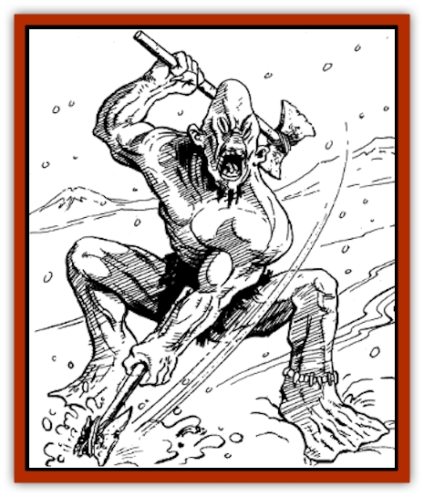
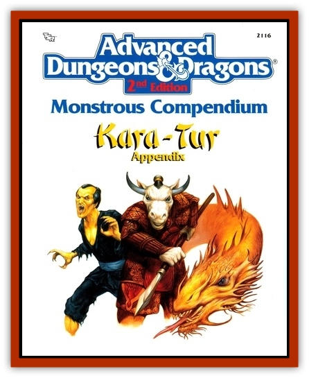

# Kala

| Statistic | **Cave Kala** | **Earth Kala** |
| --- | --- | --- |
| **Activity Cycle:** | Any | Any |
| **Alignment:** | Neutral | Neutral |
| **Armor Class:** | -1 | 2 |
| **Climate/Terrain:** | Arctic hills, mountains, and plains | Arctic hills, mountains, and plains |
| **Damage/Attack:** | 1-8/1-8 or by weapon | 1-6/1-6 or by weapon |
| **Diet:** | Carnivore | Carnivore |
| **Frequency:** | Rare | Rare |
| **Hit Dice:** | 8 | 6 |
| **Intelligence:** | Low (5-7) | Low (5-7) |
| **Magic Resistance:** | Nil | Nil |
| **Morale:** | Steady (12) | Steady (11) |
| **Movement:** | 9 | 6 |
| **No. Appearing:** | 1-10 | 1-12 |
| **No. of Attacks:** | 2 | 2 |
| **Organization:** | Pack | Pack |
| **Size:** | M (6' tall) | M (6' tall) |
| **Special Attacks:** | Pain | Disease |
| **Special Defenses:** | Nil | Nil |
| **THAC0:** | 13 | 15 |
| **Treasure:** | Nil | P |
| **XP Value:** | 1,400 | 650 |

The kala are a primitive spirit race of ferocious flesh-eaters and cannibals found in icy wastelands.

Two varieties exist: the cave kala and the earth kala. The cave kala are slightly more common. Physically similar to humans, cave kala have elongated heads that narrow to points. They're usually bald. Their skin is pale yellow and cold to the touch. They have dull black eyes, big ears, and long snouts that dangle over their upper lips. Razor-sharp talons grow from their fingers. Their feet are broad and flat, enabling them to move easily over snow and ice. Kala are inured to the cold; regardless of weather, they don no more than a loincloth of leather or fur.

Kala speak their own language as well as the language of human and humanoid tribes in the immediate area.

**Combat:** Kala are always hungry, and all warm-blooded creatures are potential meals. The kala attack victims on sight, pursuing relentlessly. On occasion, a ravenous band of kala will raid human camps and villages for food.

All kala are expert trackers and hunters. They can follow any trail that's up to 48 hours old, with an 80% base chance of success. This chance drops 10% for each additional day the trail has grown cold. (For instance, if a trail was made 3 days-or 72 hours-ago, kala have a 70% base chance of following it.)

These vicious carnivores attack with their clawed hands or wield primitive stone axes. They hold one axe in each each hand, and each weapon inflicts 1-8 hit points of damage. Assume that half a kala band carries these axes.

The bite of a kala (make a normal attack roll) inflicts no damage, but it injects a terrible toxin. The venom causes progressive pain unless the victim makes a successful saving throw vs. poison. These pains begin slowly and build in intensity. On the first round of effect, the victim notices discomfort similar to a strong headache. On the second round, the pain spreads, causing the victim to suffer a -1 penalty on his attack and damage rolls, and a +1 penalty on all saving throw rolls. By round three, the pain is quite strong, increasing the penalties to -2/ +2. By round four, the pain is excruciating, and the penalties are -4/ +4. By round five, the pain is so great that it incapacites the victim; he cannot move, attack, or take any other actions. From the time of the initial bite, the pains last for 1-3 turns.

Kala are immune to all types of cold-based attacks.

**Habitat/Society:** Cave kala make their lairs in mountain caves in the most desolate reaches of frigid wastelands. They live in family groups of 2-8 (2d4) males, an equal number of females, and a number of immature kala equal to 25% of the adults. The largest male serves as the group's leader.

During the yearly mating season, males often engage in fierce battles for the most desirable females. The losing males are banished from the group. Bitter and humiliated, these solitary kala are especially dangerous.

**Ecology:** Kala eat all types of meat, consuming carrion and occasionally each other in times of scarce game. Villages near kala territory sometimes offer sizeable bounties for the creatures' heads (or similar evidence of their destruction).

**Earth Kala**

  Earth kala are a smaller and slower species of kala who have no permanent lairs. They are nomads, moving their camps according to the season and the supply of game. Physically, they resemble cave kala, but the earth kala's skin is rosy pink and they have blonde or dark brown hair.

Earth kala share the outlook and abilities of their cave-dwelling cousins. Like the cave kala, they can wield stone axes in each hand. Earth kala cannot inject poison with their bite. Instead, they can use their breath to cause disease to all who fail their saving throw vs. death. This breath has a range of 5 feet, a width of 2 feet, and can be used three times per day. The breath disease slowly weakens its victim, causing him to lose 1-6 hit points per day. While so diseased, the victim cannot heal or benefit from a *potion of healing* or from *cure light wounds* or similar spells. Only *cure disease* or a similar spell can negate the effects.

---
## Discovery & Documentation

**Source Publication:** MC6 Kara-Tur Appendix (1990)
**Campaign Setting:** Kara-Tur (Forgotten Realms)
**Author(s):** Rick Swan

### Other Creatures Found in This Source Book
   * [[Bajang|Bajang]]
   * [[Bakemono|Bakemono]]
   * [[Bisan|Bisan]]
   * [[Buso|Buso]]
   * [[Carp_Giant|Carp, Giant]]
   * [[Centipede_Spirit|Centipede, Spirit]]
   * [[Chu-u|Chu-u]]
   * [[Con-tinh|Con-tinh]]
   * [[Doc_cu'o'c|Doc cu'o'c]]
   * [[Duruch'i-lin|Duruch'i-lin]]
   * [[Flame_Spirit|Flame Spirit]]
   * [[Foo_Creature|Foo Creature]]
   * [[Gaki|Gaki]]
   * [[Gargantua|Gargantua]]
   * [[Goblin_Rat|Goblin Rat]]
   * [[Hai_Nu|Hai Nu]]
   * [[Hannya|Hannya]]
   * [[Hengeyokai|Hengeyokai]]
   * [[Hsing-sing|Hsing-sing]]
   * [[Hu_Hsien|Hu Hsien]]
   * [[Human_Kara-Tur|Human (Kara-Tur)]]
   * [[Ikiryo|Ikiryo]]
   * [[Jishin_Mushi|Jishin Mushi]]
   * [[Kaluk|Kaluk]]
   * [[Kappa|Kappa]]
   * [[Korobokuru|Korobokuru]]
   * [[Krakentua|Krakentua]]
   * [[Kuei|Kuei]]
   * [[Memedi|Memedi]]
   * [[Men-shen|Men-shen]]
   * [[Nat|Nat]]
   * [[Ningyo|Ningyo]]
   * [[Oni|Oni]]
   * [[P'oh|P'oh]]
   * [[P'oh_Gohei|P'oh, Gohei]]
   * [[Shan_Sao|Shan Sao]]
   * [[Shirokinukatsukami|Shirokinukatsukami]]
   * [[Spirit_Folk|Spirit Folk]]
   * [[Spirit_Nature|Spirit, Nature]]
   * [[Spirit_Stone|Spirit, Stone]]
   * [[Tako|Tako]]
   * [[Tengu|Tengu]]
   * [[Wang-Liang|Wang-Liang]]
   * [[Yuan-ti_Histachii|Yuan-ti, Histachii]]
   * [[Yuki-on-na|Yuki-on-na]]
