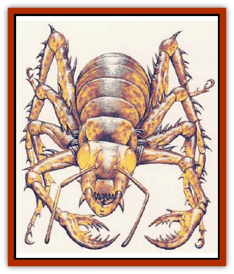

# Kalin

| Statistic | **Kalin** |
| --- | --- |
| **Activity Cycle:** | Any |
| **Alignment:** | Lawful neutral |
| **Armor Class:** | 5 |
| **Climate/Terrain:** | Subterranean |
| **Damage/Attack:** | 1-10/1-10/2-12 |
| **Diet:** | Carnivore |
| **Frequency:** | Uncommon |
| **Hit Dice:** | 7 |
| **Intelligence:** | Animal (1) |
| **Magic Resistance:** | Nil |
| **Morale:** | Fanatic (18) |
| **Movement:** | 18, Cl 9 |
| **No. Appearing:** | 1-6 |
| **No. of Attacks:** | 3 |
| **Organization:** | Solitary or mated pair |
| **Size:** | L (12' long) |
| **Special Attacks:** | Grapple |
| **Special Defenses:** | Nil |
| **THAC0:** | 13 |
| **Treasure:** | Nil |
| **XP Value:** | 650 |

Kalin are large insectoid creatures that appear to be a monstrous mix of [[Spider|spider]] and [[Ant|ant]]. Mottled brown to yellow chitinous plates cover their long bodies. Oversized, glowing eyes jut out over tremendous mandibles that look to be able to snap a [[Dray|dray]] in half. Its sharp-edged forward limbs can make deadly slashing attack, and the kalin are equally at home on horizontal or vertical surfaces.

There are two types of kalin: wild kalin and kalin mounts. Kalin mounts are used by an elite branch of [[Dregoth|Dregoth's]] templars. These kalin riders are as meantempered and aggressive as the insectoids they ride. Except for saddles and riders, there are no distinguishing features to differentiate wild kalin from those raised as templar mounts.

**Combat:** A kalin makes three attack in a single round of combat. Its two slashing limbs attack like swords, causing 1d10 points of damage with every hit. Its crushing mandibles deliver 2d6 points of damage. In addition, if the bite is successful, the kalin grapples its victim and holds it tight (causing an additional 1d6 points of damage per round). The next round of combat, held victims are hit automatically by both slashing limbs (roll damage normally, though no attack rolls are needed that round). A victim can break free of the crushing hold by making a successful open doors roll. If the victim doesn't break free, the slashing attack hit again automatically in the next round, and so on until the victim frees himself or is killed.

A kalin will ignore attacks made against it in favor of dealing with a victim held in its mandibles. The creature prefers to finish of a held victim before turning its attention to other prey. If it is reduced to less than half its total hit points, it will abandon the held victim in order to defend itself.

Kalin have the ability to walk up cave walls and across ceilings due to the sticky barbs on the end of each of their long limbs. They can even carry riders on these trips, provided the riders are prepared and holding on tight. Kalin riders are trained to travel wherever the kalin decide to go.

Each insectoid emits a sticky strand from its thorax. Like a spider's web, the strand can be used to lower a kalin from the ceiling to the ground below. Kalin riders often use this ability to surprise foes (-2 to opponents' surprise rolls). Kalin and riders that strike from above with surprise cause double damage in the initial round of combat (if they make successful attack rolls).

**Habitat/Society:** Dregoth and his followers discovered the kalin living in the under-region when they arrived. While aggressive, the kalin are not as chaotic as the [[Wall_Walker|wall-walkers]] of Kragmorta. (The two species do seem to be enemies, however, competing for the same food and living space in the under-region.) The templars were eventually able to train a small number of kalin to serve as mounts for their elite warriors. In addition to the 100 or so kalin in the templars' service, the nearby tunnels and caves are home to many wild kalin that have yet to be tamed.

In the wild, kalin are solitary predators who are nomadic in nature. They do not establish nests except to lay eggs. Then, they join as mated pairs until the eggs hatch, at which time the parents and offspring go their separate ways. The kalin serving the templars of New Giustenal barely get along, as their aggressive natures make it difficult to have more than a few in close proximity. The pens where they are kept are designed to keep the creatures separate in order to lower the incidents of kalin attacking kalin.

Kalin naturally live to be about five years old, reaching maturity in as little as six months' time.

**Ecology:** Kalin eat meat, often hunting their own food, though the trained kalin receive food on a daily basis. Kalin females lay eggs once per year, averaging 10 ofspring per season. Eggs hatch three months after being laid, and the male remains with the eggs throughout their incubation period.

The second generation dray use the chitinous plates of the kalin to fashion armor, weapons, and tools. They rarely kill kalin for this purpose. Instead, they wait for mounts to die or search the nearby tunnels for wild kalin that have expired.

**Kalin Riders**

  Dregoth's most elite troops are the kalin riders. These mid-level templars ride the ferocious kalin, predatory insects the Dread King discovered in the under-region For now, the kalin riders patrol the ceilings of New Giustenal looking for trouble in the streets below. Most citizens hate these troops because of the viciousness of the mounts. Kalin have been known to rip the arm off a passing dray for no particular reason, and even their riders often have trouble controlling the kalin bloodlust.

Dregoth has four squadrons of 25 kalin riders available to him at present. These troops are to lead the assault on the surface world when the time comes, and they have gotten the best share of the vast magical armament Dregoth has prepared.

Kalin riders are all 5th level templars armed with magical weapons (usually a *long sword +1*). They wear enchanted kalin hide armor, and carry either metal weapons or weapons crafted from the limbs of their mounts. Officers are usually 8th-level templars who wield metal weapons with enchantments as high as +3.

Finally, every kalin squadron has a defiler from the College of Blackspire assigned to it. The mage will be of 7th-10th level (1d6+6), and will also have five randomly assigned magical items. Use the tables in the *DMG* to assign these. If an item of excessive power is generated, reroll the result until something more reasonable is generated.

Kalin riders are ferocious opponents. They are trained to fight in cooperation with their mounts, so both a kalin and its rider can attack the same foe in the same round of combat. In battle situations, a kalin rider and its mount receive a +2 initiative bonus due to their tenacious, extremely aggressive attack style.

---
## Discovery & Documentation

**Source Publication:** Monstrous Compendium, 1995 Annual, Volume 2 (1995)
**Campaign Setting:** Advanced Dungeons & Dragons 2nd Edition
**Author(s):** Jon Pickens

### Other Creatures Found in This Source Book
   * [[Aboleth_Savant|Aboleth, Savant]]
   * [[Addazahr|Addazahr]]
   * [[Amiq_Rasol|Amiq Rasol]]
   * [[Arch-Shadow|Arch-Shadow]]
   * [[Automaton_Scaladar|Automaton, Scaladar]]
   * [[Automaton_Trobriand's|Automaton, Trobriand's]]
   * [[Bat_Sporebat|Bat, Sporebat]]
   * [[Beetle_Dragon|Beetle, Dragon]]
   * [[Bi-nou|Bi-nou]]
   * [[Boggle|Boggle]]
   * [[Brownie_Dobie|Brownie, Dobie]]
   * [[Brownie_Quickling|Brownie, Quickling]]
   * [[Cat_Crypt|Cat, Crypt]]
   * [[Cat_Great_Cath_Shee|Cat, Great, Cath Shee]]
   * [[Centaur-kin_Dorvesh|Centaur-kin, Dorvesh]]
   * [[Centaur-kin_Gnoat|Centaur-kin, Gnoat]]
   * [[Centaur-kin_Ha'pony|Centaur-kin, Ha'pony]]
   * [[Centaur-kin_Zebranaur|Centaur-kin, Zebranaur]]
   * [[Chronolily|Chronolily]]
   * [[Curst|Curst]]
   * [[Darktentacles|Darktentacles]]
   * [[Dinosaur_Aquatic|Dinosaur, Aquatic]]
   * [[Dinosaur_II|Dinosaur II]]
   * [[Dinosaur_III|Dinosaur III]]
   * [[Doppelganger_Greater|Doppelganger, Greater]]
   * [[Dragon_Brine|Dragon, Brine]]
   * [[Dragon_Half-|Dragon, Half-]]
   * [[Dragon-kin_Sea_Wyrm|Dragon-kin, Sea Wyrm]]
   * [[Dwarf_Wild|Dwarf, Wild]]
   * [[Ekimmu|Ekimmu]]
   * [[Elemental_Nature|Elemental, Nature]]
   * [[Elf_Winged|Elf, Winged]]
   * [[Fish_Great_Glacier|Fish (Great Glacier)]]
   * [[Fish_Subterranean|Fish, Subterranean]]
   * [[Fish_Toril|Fish (Toril)]]
   * [[Flareater|Flareater]]
   * [[Flumph|Flumph]]
   * [[Froghemoth|Froghemoth]]
   * [[Ghost_Casurua|Ghost, Casurua]]
   * [[Ghost_Ker|Ghost, Ker]]
   * [[Ghul|Ghul]]
   * [[Ghul-Kin|Ghul-Kin]]
   * [[Giant_Half-giant|Giant, Half-giant]]
   * [[Golem_Burning_Man|Golem, Burning Man]]
   * [[Golem_Phantom_Flyer|Golem, Phantom Flyer]]
   * [[Gulguthhydra|Gulguthhydra]]
   * [[Hakeashar|Hakeashar]]
   * [[Horse_Moon-|Horse, Moon-]]
   * [[Human_Dragonslayer|Human, Dragonslayer]]
   * [[Human_Vistana|Human, Vistana]]
   * [[Jellyfish_Giant|Jellyfish, Giant]]
   * [[Kholiathra|Kholiathra]]
   * [[Laerti|Laerti]]
   * [[Leucrotta_Greater|Leucrotta, Greater]]
   * [[Lich_Suel|Lich, Suel]]
   * [[Lurker_Shadow|Lurker, Shadow]]
   * [[Lycanthrope_Werepanther|Lycanthrope, Werepanther]]
   * [[Lycanthrope_Wereshark|Lycanthrope, Wereshark]]
   * [[Mammal_Herd_II|Mammal, Herd II]]
   * [[Marl|Marl]]
   * [[Meenlock|Meenlock]]
   * [[Mimic_Greater|Mimic, Greater]]
   * [[Mold_II|Mold II]]
   * [[Mummy_Creature|Mummy, Creature]]
   * [[Nyth|Nyth]]
   * [[Ooze_Slime_Jelly_Ghaunadan|Ooze/Slime/Jelly, Ghaunadan]]
   * [[Palimpsest|Palimpsest]]
   * [[Peltast|Peltast]]
   * [[Plant_Dangerous_II|Plant, Dangerous II]]
   * [[Pleistocene_Animal|Pleistocene Animal]]
   * [[Pudding_Subterranean|Pudding, Subterranean]]
   * [[Raggamoffyn|Raggamoffyn]]
   * [[Snake_Serpent|Snake, Serpent]]
   * [[Snake_Serpent_Vine|Snake, Serpent Vine]]
   * [[Sphinx_Draco-|Sphinx, Draco-]]
   * [[Sprite_Seelie_Faerie|Sprite, Seelie Faerie]]
   * [[Sprite_Unseelie_Faerie|Sprite, Unseelie Faerie]]
   * [[Squealer|Squealer]]
   * [[Turtle_Giant|Turtle, Giant]]
   * [[Umpleby|Umpleby]]
   * [[Vizier's_Turban|Vizier's Turban]]
   * [[Wall_Walker|Wall Walker]]
   * [[Webbird|Webbird]]
   * [[Yak-Man|Yak-Man]]
   * [[Zorbo|Zorbo]]
