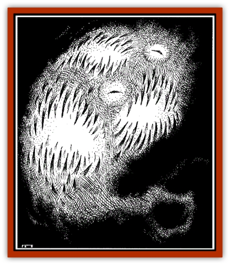
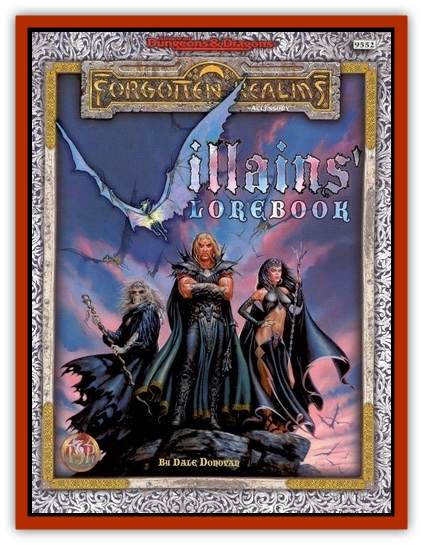

# Kalmari

| Statistic | **Kalmari** |
| --- | --- |
| **Activity Cycle:** | Any |
| **Alignment:** | Lawful evil |
| **Armor Class:** | -6 |
| **Climate/Terrain:** | Any |
| **Damage/Attack:** | 1d10/1d6 |
| **Diet:** | Carnivore |
| **Frequency:** | Very rare: Rare in Acheron |
| **Hit Dice:** | 3+3 |
| **Intelligence:** | Average |
| **Magic Resistance:** | 100% |
| **Morale:** | Champion (16) |
| **Movement:** | 6 |
| **No. Appearing:** | 1 |
| **No. of Attacks:** | 2 |
| **Organization:** | Solitary |
| **Size:** | M |
| **Special Attacks:** | Swallow, entangle |
| **Special Defenses:** | +2 or better weapons to hit; Slain only by consumed & rejected magical item |
| **THAC0:** | 17 |
| **Treasure:** | Nil |
| **XP Value:** | 2,000 |

In its natural state, a kalmari is an amorphous being with a smoky, mistlike consistency. It appears as an inverted teardrop, with a 3'-long prehensile tail. The beast has two unblinking yellow eyes that it can move to different parts of its surface in order to follow multiple foes. The most striking feature of the kalmari, however, is its inordinately large, tooth-filled maws which seem to stretch all the way around its body. When the creature opens wide its jaws, the mouth appears to cover the majority of the kalmari's body. The kalmari also can possess the body of a living being without affecting that being's appearanc

**Combat:** A bite from the kalmari's jaws inflicts 1d10 points of damage and the tail can whip a target for 1d6 points of damage. When a natural 20 results from the tail's attack roll, no damage is done but the victim is entangled. An entangled victim is allowed one Bend Bars/Lift Gates roll to escape; otherwise only severing the tail itself by inflicting 10 points of damage there on a called shot (see the DMG for details) frees the entangled victim.

The kalmari's most fearsome ability is that, on any attack roll (for the creature's mouth) that is 4 or more higher than the number required to hit that target, the target is swallowed whole. For instance, if the kalmari needed to roll a 12 or better to hit a target, any natural roll of 16 or greater would mean that the target had been swallowed whole by the creature. Swallowed creatures will be digested in a number of rounds equal to their experience level/Hit Dice. Swallowed victims are helpless. After this time, the victim is gone forever and cannot be raised or resurrected. The kalmari will not attempt to swallow a second target until the first victim is dead.

The kalmari can be struck only by +2 or better magical weapons and is 100% immune to spells. While sufficiently enchanted weapons can damage the beast, even they cannot kill it. If reduced to 0 hp by such weapons, the kalmari is simply banished back to its home plane of Acheron - bearing a great grudge against those who sent it home against its will.

The only vulnerability a kalmari possesses is that it cannot digest magic in any form. This is related to its immunity to magic spells; the nature of the beast and the nature of magic in the Realms are simply incompatible. All magical items worn or carried by a victim the kalmari has swallowed are regurgitated by the beast the round after ingestion. Offensive magical items such as weapons, wands, staves, and so on are then capable of damaging and destroying the beast regardless of their enchantment. Weapons are granted an additional +2 bonus both to attack and damage rolls vs. the creature and the spell-like effects of wands, rods, staves, rings, etc., now inflict damage on the kalmari normally; the beast's Magic Resistance no longer applies to those items. If, for example, the kalmari ingests and rejects a *wand of fire*, *fireballs* from that item can kill the kalmari. Fireballs from any source other than that *wand* still do not harm the creature.

Note that any items swallowed and rejected by one kalmari do not gain these benefits against any other members of the species.

**Habitat/Society:** Little is known of the habits of the creature on its home plane, but in the Realms a kalmari is normally summoned by a mage to act as a guard for some important item, person, or place.

To remain on this plane or an extended period of time (see Ecology below), a kalmari must have a body composed of material native to the plane. This material can be either a living being or an inanimate vessel that allows the creature movement and a means to manifest its jaws and eyes. A kalmari within a host body can exist in the Realms indefinitely, but once the creature leaves a host, it has only 10 minutes to find another or be compelled to return to Acheron. A host body retains its normal Armor Class, but can withstand only 10 hit points of damage before it is rent asunder as the kalmari erupts from it, killing the host. The noise made by an emerging kalmari is that of 1,000 snakes hissing at once. A living target of a kalmari's possession must be willing, though that decision could be coerced (through force, blackmail, or magic).

**Ecology:** Once free of a host body, the kalmari must find another within 10 minutes or be banished back to Acheron. As a rule, these creatures seem to enjoy the power they wield in the Realms and are loath to leave. Their lawful nature also contributes to their “stubbornness” in this matter and also is part of the reason they are chosen as guardians of important mountain passes, potent magical items, fabulous treasures, and secret passages. How kalmari reproduce is unknown, though fission is most likely. Whether fission is possible in the Realms or only in the beast's home plane of Acheron is also unknown at this time.

**History:** Only one instance of a kalmari existing in the Realms for any length of time is recorded at this time. The creature apparently was summoned from Acheron by the wicked sorceress CASSANA to serve as a “pet.” The first open encounter between natives of the Realms and the kalmari occurred in the year 1357 DR during a period where Cassana had lent use of the creature to an illicit mercantile group known as the Iron Throne. The kalmari was placed in a human shell (a minor Iron Throne functionary unaware of the true costs involved) for the mission. The Iron Throne planned to use the beast to tighten its grip on Shadow Gap, an important mountain pass.

When the functionary publicly announced the closing of the pass and admitted to the murder of a contact of a local group of adventurers, a member of the group attacked the man. The warrior's blow (with his enchanted sword) split the body wide open, allowing the kalmari to escape. The creature promptly swallowed the warrior whole, sword and all. The kalmari rejected the sword, which was left untouched by the fleeing crowd.

The sword was recovered by a band of heroes that included Alias the tattooed swordswoman. Alias saw the above-described events in a dream. During their time in Shadow Gap and not long after Alias's dream, the kalmari entered their camp and attacked. Alias used Cassana's sigil, tattooed on her arm, to hold the sorceress's creature at bay until the halfling bard Olive Ruskettle retrieved the late warrior's sword. Olive and the saurial paladin Dragonbait then used the ingested-and-rejected weapon to destroy the beast.

Even though Cassana herself has perished, the secret of summoning such beasts will likely find its way to other unscrupulous wizards' hands.

---
## Discovery & Documentation

**Source Publication:** Villains' Lorebook (1998)
**Campaign Setting:** Forgotten Realms
**Author(s):** Dale Donovan, Bill Olmesdahl, Todd Lockwood

### Other Creatures Found in This Source Book
   * [[Balhiir|Balhiir]]
   * [[Chosen_One|Chosen One]]
   * [[Darkenbeast|Darkenbeast]]
   * [[Dread_Warrior|Dread Warrior]]
   * [[Phaerimm|Phaerimm]]
   * [[Pteraman|Pteraman]]
   * [[Shadevari|Shadevari]]
   * [[Shadowmasters_the_Malaugrym|Shadowmasters (the Malaugrym)]]
   * [[Tanar'ri_Lesser_Yochlol|Tanar'ri, Lesser, Yochlol]]
