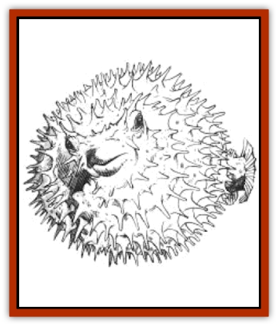

# Kalothagh

| Statistic | **Kalothagh** |
| --- | --- |
| **Activity Cycle:** | Any |
| **Alignment:** | Neutral |
| **Armor Class:** | 7 |
| **Climate/Terrain:** | Any/Ocean |
| **Damage/Attack:** | 1-2 or 1-6 (&times;4) |
| **Diet:** | Carnivore |
| **Frequency:** | Uncommon |
| **Hit Dice:** | 4+4 |
| **Intelligence:** | Low (5-7) |
| **Magic Resistance:** | Nil |
| **Morale:** | Average (10) |
| **Movement:** | Sw 12 |
| **No. Appearing:** | 2-12 |
| **No. of Attacks:** | 1 or 4 |
| **Organization:** | School |
| **Size:** | L (12' long) |
| **Special Attacks:** | Shoots spines |
| **Special Defenses:** | See below |
| **THAC0:** | 15 |
| **Treasure:** | Q (&times;3) |
| **XP Value:** | 270 |

The kalothagh, also known as the prickleback, is an aquatic version of the [[Manticore|manticore]]. Though sluggish and not particularly aggressive, the kalothagh is a known man-eater, which makes it a creature to be avoided.

The kalothagh is a plump fish resembling a pin cushion. Its body is covered with four-foot.long spines. Its scales are mottled with dull splotches of green and brown. It has small black eyes that bulge from the top of its head, translucent fins, a dark, fan-like tail. and a smooth, pink belly. Its sharp teeth protrude from its mouth to form a small beak.

**Combat:** The kalothagh is 80% undetectable when hiding in seaweed. If the kalothagh is �badly damaged' (that is, if it loses 75% or more of its hit points), it inflates a special bladder running the length of its body, then floats belly-up to the surface. It deflates when the danger has passed.

The kalothagh's primary weapons are its spines. It has a total of 32 spines and can shoot up to four spines per round at targets up to 90' away. A volley of spines is always directed to the same target, but the target can be in any position relative to the kalothagh except directly under it; thanks to the location of its eyes, the kalothagh can see in all directions. Once a spine has been fired, a new one grows in its place in 1d6 weeks.

When a victim is struck by a spine, there is a 20% chance that the spine becomes lodged in his flesh. The spines are covered with small curved barbs resembling fishhooks, making it difficult to pull the spines free. When a spine is pulled from the victim's flesh, the victim suffers an additional 1d4 points of tearing damage. The creature also has a weak bite that inflicts 1-2 points of damage.

Creatures or characters engaged in melee combat with the kalothagh must roll a Dexterity check (with a +2 bonus applied to the Dexterity score) for each round of combat. A creature or character who tails the Dexterity check has been impaled on one of the kalothagh's spines and suffers 1-2 points of damage. The impaled victim has a 50% chance per round of freeing himself if he takes no actions other than attempting to pry himself loose; if successful, he risks suffering additional tearing damage from the hooked barbs as described above. If he does not free himself, he suffers an additional 1-2 for each subsequent round he remains impaled on the spine.

The spines of the kalothagh contain a weak poison; those struck by the spines roll saving throws vs. poison with a +4 bonus. If the victim fails the saving throw, he suffers an additional 2 points of damage from the attack, and a +2 penalty to his Armor Class for the next 2d6 hours A victim can only be affected once by the poison of a particular kalothagh within the same 24-hour period.

Though kalothagh are not devoid of intelligence, they seldom make coordinated attacks. They avoid potential enemies that are excessively large or appear to be especially ferocious. Because of their passive nature, kalothagh do not fight among themselves for prey; all kalothagh that bring down a victim share in the feast.

**Habitat/Society:** Kalothagh can be found in all the oceans of Krynn, though they prefer warm waters to cold. They make crude lairs in underwater caves or depressions in the ocean floors and line them with shiny gems collected from sunken ships or stolen from the treasure caches of other ocean dwellers. Kalothagh seldom stray more than a mile or so from their lairs.

Thanks to their spines, mating always ends in the death of the male. Females lay 10d6 spiny eggs at once a process that always ends in the death of the female.

**Ecology:** The kalothagh has little commercial value - in fact, sailors consider a belly-up kalothagh floating on the surface to be an omen of economic disaster. Because of the weak poison that permeates its body, the kalothagh is inedible. Certain primitive tribes carefully snap the spines from dead kalothagh and use them for weapons. Some have attempted to use their air bladders as containers for liquids, but the bladders tend to decay within a few weeks after removal. The carnivorous kalothagh subsists on all varieties of prey.

---
## Discovery & Documentation

**Source Publication:** MC4 Dragonlance Appendix (w/binder #2) (1989)
**Campaign Setting:** Dragonlance
**Author(s):** Rick Swan

### Other Creatures Found in This Source Book
   * [[Anemone_Giant_Sea|Anemone, Giant Sea]]
   * [[Bear_Ice|Bear, Ice]]
   * [[Beast_Undead|Beast, Undead]]
   * [[Bird_Krynn|Bird (Krynn)]]
   * [[Disir|Disir]]
   * [[Draconian_Aurak|Draconian, Aurak]]
   * [[Draconian_Baaz|Draconian, Baaz]]
   * [[Draconian_Bozak|Draconian, Bozak]]
   * [[Draconian_Kapak|Draconian, Kapak]]
   * [[Draconian_General_Information|Draconian, General Information]]
   * [[Draconian_Sivak|Draconian, Sivak]]
   * [[Draconian_Proto-_Traag|Draconian, Proto-, Traag]]
   * [[Dragon_Amphi|Dragon, Amphi]]
   * [[Dragon_Astral|Dragon, Astral]]
   * [[Dragon_Kodragon|Dragon, Kodragon]]
   * [[Dragon_Krynn_Othlorx_General_Information|Dragon (Krynn), Othlorx, General Information]]
   * [[Dragon_Krynn_General_Information|Dragon (Krynn), General Information]]
   * [[Dragon_Sea|Dragon, Sea]]
   * [[Dreamshadow|Dreamshadow]]
   * [[Dreamwraith|Dreamwraith]]
   * [[Dwarf_Daergar|Dwarf, Daergar]]
   * [[Dwarf_Hill_Neidar|Dwarf, Hill, Neidar]]
   * [[Dwarf_Mountain_Hylar|Dwarf, Mountain, Hylar]]
   * [[Dwarf_Theiwar|Dwarf, Theiwar]]
   * [[Dwarf_Zakhar|Dwarf, Zakhar]]
   * [[Elf_Half-|Elf, Half-]]
   * [[Elf_High_Qualinesti|Elf, High, Qualinesti]]
   * [[Elf_High_Silvanesti|Elf, High, Silvanesti]]
   * [[Elf_Sea_Dargonesti|Elf, Sea, Dargonesti]]
   * [[Elf_Sea_Dimernesti|Elf, Sea, Dimernesti]]
   * [[Elf_Wild_Kagonesti|Elf, Wild, Kagonesti]]
   * [[Eyewing|Eyewing]]
   * [[Fetch|Fetch]]
   * [[Fire_Minion|Fire Minion]]
   * [[Fireshadow|Fireshadow]]
   * [[Gnome_Tinker|Gnome, Tinker]]
   * [[Gurik_Cha'ahl|Gurik Cha'ahl]]
   * [[Haunt_Knight|Haunt, Knight]]
   * [[Horax|Horax]]
   * [[Human_Krynn|Human (Krynn)]]
   * [[Imp_Blood_Sea|Imp, Blood Sea]]
   * [[Kani_Doll|Kani Doll]]
   * [[Kender|Kender]]
   * [[Kyrie|Kyrie]]
   * [[Lizard_Man_Krynn|Lizard Man (Krynn)]]
   * [[Minotaur_Krynn|Minotaur, Krynn]]
   * [[Ogre_High|Ogre, High]]
   * [[Ogre_Krynn|Ogre (Krynn)]]
   * [[Phaethon|Phaethon]]
   * [[Saqualaminoi|Saqualaminoi]]
   * [[Shadowperson|Shadowperson]]
   * [[Shimmerweed|Shimmerweed]]
   * [[Skrit|Skrit]]
   * [[Spectral_Minion|Spectral Minion]]
   * [[Spider_Krynn|Spider (Krynn)]]
   * [[Stag|Stag]]
   * [[Tayling|Tayling]]
   * [[Thanoi|Thanoi]]
   * [[Tylor|Tylor]]
   * [[Wichtlin|Wichtlin]]
   * [[Wyndlass|Wyndlass]]
   * [[Yaggol|Yaggol]]
