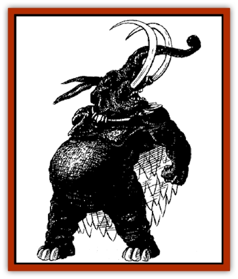

# Kaluk

| Statistic | **Kaluk** |
| --- | --- |
| **Activity Cycle:** | Any |
| **Alignment:** | Chaotic evil |
| **Armor Class:** | 6 |
| **Climate/Terrain:** | Temperate hills and forests |
| **Damage/Attack:** | 2-12/2-12 |
| **Diet:** | Special |
| **Frequency:** | Very rare |
| **Hit Dice:** | 11 |
| **Intelligence:** | Average (8-10) |
| **Magic Resistance:** | See below |
| **Morale:** | Elite (13) |
| **Movement:** | 15 |
| **No. Appearing:** | 1 |
| **No. of Attacks:** | 2 |
| **Organization:** | Solitary |
| **Size:** | L (9' tall) |
| **Special Attacks:** | See below |
| **Special Defenses:** | See below |
| **THAC0:** | 10 |
| **Treasure:** | See below |
| **XP Value:** | 6,000 |

A greater spirit, the kaluk is a manifestation of human avarice and a scourge of the greedy.

The kaluk resembles an [[Elephant|elephant]] that walks on it hind legs. Its frame is thinner than an elephant's, and it has a huge, protruding belly. A sparse layer of short silver hair covers its thick black hide, which has the texture of leather and smells like rotting meat. The beast has the legs and feet of an elephant, but its arms are those of a human powerhouse. Its fingers are blunt stubs that cannot effectively manipulate tools or weapons. It has ears like a hare, a trunklike snout, and two huge, bulging violet eyes with black pupils. Two crimson tusks extend from its mouth, curving outward to a length of 5'. It wears a sparkling cape of golden scales that brushes the ground when it walks.

The kaluk speaks the languages of all animals. It also speaks the trade language, and the languages of any humans common to the area it inhabits.

**Combat:** The kaluk is motivated by an insatiable lust for wealth. It continually seeks out human victims to rob. When a kaluk encounters a victim, it demands that he give up all of his gems, coins, and other treasure. The kaluk has no interest in weapons, unless they are made of precious metals or are encrusted with jewels. The beast has no interested in magical items, either, except enchanted jewelry or gems, such as a *pearl of the rising tide*. Victims who offer even token resistance are attacked without mercy.

The kaluk can make two goring attacks per round with its tusks, inflicting 2-12 (2d6) hit points of damage each. It can use *ESP* and *detect invisibility* at will. Three times per day, it can use *suggestion* and *steam breath*, as per the spells. It can envelope itself in a *stinking cloud* three times per day, extending to a radius of 10 feet. Once per month it can place an victim in *temporal stasis* (suspended animation) by touching the victim with its hand. There is no saving throw. The effects last until the magic is removed by *dispel magic* or the *temporal reinstatement* (the reverse of *temporal stasis*).

The kaluk is immune to all *charm*, *sleep*, and *hold* spells.

**Habitat/Society:** The kaluk has no permanent lair, roaming the hills and forests that border human settlements in search of victims to rob. Fearful of retaliation, it enters villages or cities only when wilderness victims are especially scarce.

Kaluk are asexual and do not reproduce biologically. When a kaluk nears the end of its 500-year life span, it seeks out a human who has led a life of greed and avarice. Sometimes a representative of the Celestial Bureaucracy will suggest a suitably greedy human to an aging kaluk. The kaluk tracks down its victim, places him in *temporal stasis*, and carries him to a secluded wooded area. The kaluk chants and dances around the immobile body for a full day. At the end of the day, the kaluk removes its horns and attaches them to the human's head. This triggers a transformation; the human becomes a new kaluk.

When the new kaluk appears, the old kaluk dies. Its aged flesh crumbles from its body, leaving only a pile of black bones. The new kaluk is obliged to bury the bones, digging a deep grave in the earth with its tusks.

Humans can bribe a kaluk to leave them alone by presenting an offering of joss-paper. Joss-paper is a piece of parchment about 4 inches square, made from bamboo wood pulp and imbedded with pieces of gold leaf. If a kaluk who has ambushed a human is offered a section of joss-paper, the beast will accept the joss-paper and attach it to his cape. The kaluk then immediately loses all interest in the human and seeks out a stream or other reflective surface so that he can admire the new addition to his cape. Joss-paper is extremely difficult to manufacture; only characters with the paper-maker proficiency are able to make joss-paper of a quality that is acceptable to kaluk.

**Ecology:** The kaluk eats all the treasure it acquires, including coins, gems, jewelry, and magical items. All items are digested immediately. A defeated kaluk's body holds no treasure.

Many people consider the kaluk to be symbol of excess and self-indulgence. They sometime engrave a kaluk head on eating utensils, amulets, and pottery as a reminder to avoid gluttony.

A kaluk's arm or leg bone can serve as a club +2. If any tree branch is rubbed in the powdered tusk of a kaluk, it will function as a *divining rod* as per the spell for the next 1-4 days. A kaluk's golden cape may fetch as much as 10,000 ch'ien from collectors.

---
## Discovery & Documentation

**Source Publication:** MC6 Kara-Tur Appendix (1990)
**Campaign Setting:** Kara-Tur (Forgotten Realms)
**Author(s):** Rick Swan

### Other Creatures Found in This Source Book
   * [[Bajang|Bajang]]
   * [[Bakemono|Bakemono]]
   * [[Bisan|Bisan]]
   * [[Buso|Buso]]
   * [[Carp_Giant|Carp, Giant]]
   * [[Centipede_Spirit|Centipede, Spirit]]
   * [[Chu-u|Chu-u]]
   * [[Con-tinh|Con-tinh]]
   * [[Doc_cu'o'c|Doc cu'o'c]]
   * [[Duruch'i-lin|Duruch'i-lin]]
   * [[Flame_Spirit|Flame Spirit]]
   * [[Foo_Creature|Foo Creature]]
   * [[Gaki|Gaki]]
   * [[Gargantua|Gargantua]]
   * [[Goblin_Rat|Goblin Rat]]
   * [[Hai_Nu|Hai Nu]]
   * [[Hannya|Hannya]]
   * [[Hengeyokai|Hengeyokai]]
   * [[Hsing-sing|Hsing-sing]]
   * [[Hu_Hsien|Hu Hsien]]
   * [[Human_Kara-Tur|Human (Kara-Tur)]]
   * [[Ikiryo|Ikiryo]]
   * [[Jishin_Mushi|Jishin Mushi]]
   * [[Kala|Kala]]
   * [[Kappa|Kappa]]
   * [[Korobokuru|Korobokuru]]
   * [[Krakentua|Krakentua]]
   * [[Kuei|Kuei]]
   * [[Memedi|Memedi]]
   * [[Men-shen|Men-shen]]
   * [[Nat|Nat]]
   * [[Ningyo|Ningyo]]
   * [[Oni|Oni]]
   * [[P'oh|P'oh]]
   * [[P'oh_Gohei|P'oh, Gohei]]
   * [[Shan_Sao|Shan Sao]]
   * [[Shirokinukatsukami|Shirokinukatsukami]]
   * [[Spirit_Folk|Spirit Folk]]
   * [[Spirit_Nature|Spirit, Nature]]
   * [[Spirit_Stone|Spirit, Stone]]
   * [[Tako|Tako]]
   * [[Tengu|Tengu]]
   * [[Wang-Liang|Wang-Liang]]
   * [[Yuan-ti_Histachii|Yuan-ti, Histachii]]
   * [[Yuki-on-na|Yuki-on-na]]
