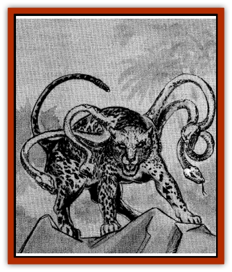

# Kamatlan

| Statistic | **Kamadan** | **Kamatlan** |
| --- | --- | --- |
| **Activity Cycle:** | Any | Any |
| **Alignment:** | Neutral | Chaotic evil |
| **Armor Class:** | 4 | 4 |
| **Climate/Terrain:** | Tropical jungle or forest | Any tropical |
| **Damage/Attack:** | 1-3/1-3/1-6/1-4 (&times;6) | 1-3/1-3/1-8/1-4 (&times;4) |
| **Diet:** | Carnivore | Carnivore |
| **Frequency:** | Rare | Very rare |
| **Hit Dice:** | 4+2 | 5+2 |
| **Intelligence:** | Low (5-7) | Semi- (2-4) |
| **Magic Resistance:** | Nil | Nil |
| **Morale:** | Average (8-10) | Steady (11-12) |
| **Movement:** | 15 | 15 |
| **No. Appearing:** | 1 | 1 |
| **No. of Attacks:** | 9 | 7 |
| **Organization:** | Solitary | Solitary |
| **Size:** | L (5-6' long) | L (6-7' long) |
| **Special Attacks:** | Breath weapon | Poison |
| **Special Defenses:** | Nil | Nil |
| **THAC0:** | 17 | 15 |
| **Treasure:** | C | Nil |
| **XP Value:** | 975 | 975 |

Kamatlan resemble large [[Cat_Great|jaguars]] with two snakes growing from each shoulder. They are very likely related to [[Displacer_Beast|displacer beasts]].

A kamatlan's coat is generally medium yellow in hue, and is covered with dark spots. The snakes extend about three feet from its shoulders, and are sandy colored with a diamond pattern. A rattle, much like that of a rattlesnake, tips the kamatlan's tail, and rattles when the beast is frightened or otherwise agitated.

**Combat:** A kamatlan stalks its prey cautiously before attacking, though its rattle sometimes betrays its presence. The kamatlan is a fearsome opponent, hissing, growling, and rattling during battle. When it attacks, it uses its front claws and its bite, as well as the bites of the snakes. Victims bitten by a snake must make saving throws against poison at +3 or contract an incapacitating illness which has an onset time of 1-4 turns and lasts for 2-8 days.

**Habitat/Society:** Kamatlan are relatively new additions to Maztica, having appeared in various places during the Night of Wailing. Presumably, they were spawned in some manner by Zaltec.

Kamatlan prowl the uncivilized parts of Maztica, and may be found in jungle, desert, or mountains. They climb and swim superbly, and spend a great deal of time in tree tops when in a forested area. They often stalk their prey for hours before pouncing.

Kamatlan are solitary and territorial, and they come together only rarely and briefly to mate. Mating may take place at any time of year. Two months after mating, the female lays 1-4 large, leathery eggs, which she buries in a shallow hole. The eggs hatch two months later, producing half-sized young with only 2+2 Hit Dice but all the attack abilities of an adult. The young mature in about six months.

**Ecology:** Kamatlan have little to fear from other predators, except for those much larger like [[Dragon_General_Information|dragons]] and giants. Being a mixture of snake and jaguar, however, they provide excellent materials for hishna magic, and almost any part of a kamatlan's body can be put to use by a hishnashaper. Men, therefore, hunt them whenever they are discovered.

**Kamadan**

  A relative of the kamatlan, the kamadan lives in parts of Toril other than Maztica. A kamadan resembles a large [[Cat_Great|leopard]], with a long body, a tawny coat, and rosetteshaped spots. Three green snakes, about three feet long each, sprout from each shoulder. A kamadan's tail is like that of any large cat.

The kamadan attacks much like its Maztican cousin, with claws, a bite, and its snake heads. The bites of a kamadan's snakes are not poisonous, but the creature does have a formidable breath weapon. Three times per day, a kamadan can breathe a cloud of sleep gas 20' long and 10' wide. The effects of the cloud are much like those of a wizard's *sleep* spell; creatures with 4+3 or more Hit Dice are unaffected, and the cloud puts creatures totaling 2d4 Hit Dice to sleep. No saving throw is allowed against this effect, though it only affects those within the area of the gas cloud.

Kamadans hunt and reproduce much like kamatlans, with similar mating times and gestation periods. They seldom dig holes for their eggs, preferring to hide them under foliage.

These beasts are seldom prey, but have more enemies than their Maztican relatives. Their tongues make useful components for *sleep potions*.

---
## Discovery & Documentation

**Source Publication:** Maztica (boxed set) (1998)
**Campaign Setting:** Maztica (Forgotten Realms)
**Author(s):** Douglas Niles

### Other Creatures Found in This Source Book
   * [[Chac|Chac]]
   * [[Jagre|Jagre]]
   * [[Plumazotl|Plumazotl]]
