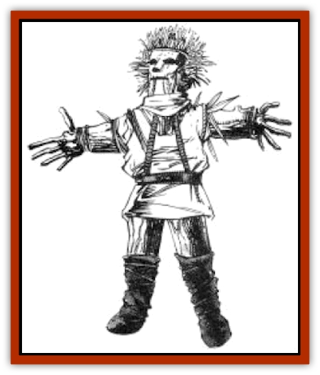

# Kani Doll

| Statistic | **Kani Doll** |
| --- | --- |
| **Activity Cycle:** | As per the enchantment |
| **Alignment:** | Chaotic evil |
| **Armor Class:** | 10 |
| **Climate/Terrain:** | Rural societies of any terrain or climate |
| **Damage/Attack:** | 1-4 |
| **Diet:** | None |
| **Frequency:** | Rare |
| **Hit Dice:** | 2 |
| **Intelligence:** | Non- (0) |
| **Magic Resistance:** | Nil |
| **Morale:** | Fearless (never checks) |
| **Movement:** | 9 |
| **No. Appearing:** | 2-12 |
| **No. of Attacks:** | 1 |
| **Organization:** | None |
| **Size:** | T (6&rdquo; tall) |
| **Special Attacks:** | Continuous attacks |
| **Special Defenses:** | Nil |
| **THAC0:** | 19 |
| **Treasure:** | Nil |
| **XP Value:** | 35 |

In their usual form, kani dolls are created by members of primitive tribes to serve as simple good-luck charms; they have no life of their own. However, when enchanted by evil forces, they become chillingly relentless killers.

Kani dolls are crude representations of humans and animals, most commonly constructed from wood, cloth, feathers, grass, and other cheap, easily available materials. A doll's form indicates its alleged charm - a rabbit doll, for instance, supposedly gives speed to its owner's legs, while a raccoon supposedly improves its owner's dexterity. The dolls are quite detailed; kani dolls in the shape of a bird are covered with hundreds of tiny feathers meticulously sewn into the cloth, while kani dolls in the shape of a rabbit are covered with actual rabbit fur.

In most cases, a kani doll has no actual magical properties and is no more useful than any other superstitious totem. However, it is possible to enchant the dolls to grant the charms represented by their forms. The power of enchanted kani dolls is directly related to the artistry of its creation. Many people can make attractive, authentic-looking dolls, but the rituals required to actually charm a doll are known only to a few wizards in Krynn's most remote tribes. It takes about a month for a skilled creator to make a kani doll.

Certain tribal mages are able to enchant the dolls with evil forces. When a kani doll is perverted to evil, it attacks that which it has been charmed to enhance. Thus, a rabbit doll might try to chew its victim's hamstrings, while a raccoon doll might mutilate its victim's hands. Normal kani dolls are harmless and inanimate; the statistics listed above refer to the animated perversions.

The enchantments of kani dolls activate them at specific times. For instance, a cat doll might activate seven nights after it was given as a gift while a rabbit doll might activate only during a full moon.

**Combat:** A kani doll always attacks with its mouth or beak. If it scores a hit, it inflicts 1d4 points of damage, then continues to chew, causing an additional 1 point of damage per round until it is destroyed or its purpose is achieved. Certain kani dolls might be instructed to protect a particular area from intruders, while others might be instructed to attack the first person or creature they see, pursuing if necessary. Since a kani doll has no mind, it knows no tear. Thus, it never checks morale, always pressing relentlessly to its target.

The movement and Armor Class statistics listed above do not necessary apply to all kani dolls. These statistics can vary according to the craftsmanship of a particular doll and the materials from which it was made. A well-crafted rabbit doll might have a movement rate of 12, while a hawk doll made of feathers might be able to fly at a movement rate of 6 (B). A turtle doll might have an AC of 9, but crawl at a movement rate of 2.

Following are some typical dolls, their typical movement rates, and their ACs. Each doll's alleged charm is also listed (but the dolls don't actually have these properties).

| Form | Alleged Charm | Movement | AC |
| --- | --- | --- | --- |
| Rabbit | Speed | 12 | 10 |
| Turtle | Safety | 2 | 9 |
| Hawk | Sight | Fl 6 (B) | 8 |
| Cat | Stealth | 12 | 10 |
| Great cat | Courage | 15 | 9 |
| Dove | Love | Fl 3 (B) | 8 |
| Bear | Strength | 12 | 8 |
| Owl | Wisdom | Fl 3 (B) | 8 |
| Raccoon | Dexterity | 9 | 10 |
| Human | Luck | 12 | 10 |

**Habitat/Society:** Kani dolls can be found in the villages of primitive tribes throughout Krynn. The vast majority of dolls are harmless and inactive, when tribesmen discover the existence of evil dolls, they are immediately burned, burled, or cast into the sea. However, submerged or buried kani dolls remain active, ready to strike at anyone unfortunate enough to encounter them.

**Ecology:** Aside from their use as good luck charms, some primitive cultures use kani dolls as toys for their children, or bury them with their dead to offer protection in the afterlife. Wealthy collectors have been known to pay vast sums for specific kani dolls to complete their collections.

---
## Discovery & Documentation

**Source Publication:** MC4 Dragonlance Appendix (w/binder #2) (1989)
**Campaign Setting:** Dragonlance
**Author(s):** Rick Swan

### Other Creatures Found in This Source Book
   * [[Anemone_Giant_Sea|Anemone, Giant Sea]]
   * [[Bear_Ice|Bear, Ice]]
   * [[Beast_Undead|Beast, Undead]]
   * [[Bird_Krynn|Bird (Krynn)]]
   * [[Disir|Disir]]
   * [[Draconian_Aurak|Draconian, Aurak]]
   * [[Draconian_Baaz|Draconian, Baaz]]
   * [[Draconian_Bozak|Draconian, Bozak]]
   * [[Draconian_Kapak|Draconian, Kapak]]
   * [[Draconian_General_Information|Draconian, General Information]]
   * [[Draconian_Sivak|Draconian, Sivak]]
   * [[Draconian_Proto-_Traag|Draconian, Proto-, Traag]]
   * [[Dragon_Amphi|Dragon, Amphi]]
   * [[Dragon_Astral|Dragon, Astral]]
   * [[Dragon_Kodragon|Dragon, Kodragon]]
   * [[Dragon_Krynn_Othlorx_General_Information|Dragon (Krynn), Othlorx, General Information]]
   * [[Dragon_Krynn_General_Information|Dragon (Krynn), General Information]]
   * [[Dragon_Sea|Dragon, Sea]]
   * [[Dreamshadow|Dreamshadow]]
   * [[Dreamwraith|Dreamwraith]]
   * [[Dwarf_Daergar|Dwarf, Daergar]]
   * [[Dwarf_Hill_Neidar|Dwarf, Hill, Neidar]]
   * [[Dwarf_Mountain_Hylar|Dwarf, Mountain, Hylar]]
   * [[Dwarf_Theiwar|Dwarf, Theiwar]]
   * [[Dwarf_Zakhar|Dwarf, Zakhar]]
   * [[Elf_Half-|Elf, Half-]]
   * [[Elf_High_Qualinesti|Elf, High, Qualinesti]]
   * [[Elf_High_Silvanesti|Elf, High, Silvanesti]]
   * [[Elf_Sea_Dargonesti|Elf, Sea, Dargonesti]]
   * [[Elf_Sea_Dimernesti|Elf, Sea, Dimernesti]]
   * [[Elf_Wild_Kagonesti|Elf, Wild, Kagonesti]]
   * [[Eyewing|Eyewing]]
   * [[Fetch|Fetch]]
   * [[Fire_Minion|Fire Minion]]
   * [[Fireshadow|Fireshadow]]
   * [[Gnome_Tinker|Gnome, Tinker]]
   * [[Gurik_Cha'ahl|Gurik Cha'ahl]]
   * [[Haunt_Knight|Haunt, Knight]]
   * [[Horax|Horax]]
   * [[Human_Krynn|Human (Krynn)]]
   * [[Imp_Blood_Sea|Imp, Blood Sea]]
   * [[Kalothagh|Kalothagh]]
   * [[Kender|Kender]]
   * [[Kyrie|Kyrie]]
   * [[Lizard_Man_Krynn|Lizard Man (Krynn)]]
   * [[Minotaur_Krynn|Minotaur, Krynn]]
   * [[Ogre_High|Ogre, High]]
   * [[Ogre_Krynn|Ogre (Krynn)]]
   * [[Phaethon|Phaethon]]
   * [[Saqualaminoi|Saqualaminoi]]
   * [[Shadowperson|Shadowperson]]
   * [[Shimmerweed|Shimmerweed]]
   * [[Skrit|Skrit]]
   * [[Spectral_Minion|Spectral Minion]]
   * [[Spider_Krynn|Spider (Krynn)]]
   * [[Stag|Stag]]
   * [[Tayling|Tayling]]
   * [[Thanoi|Thanoi]]
   * [[Tylor|Tylor]]
   * [[Wichtlin|Wichtlin]]
   * [[Wyndlass|Wyndlass]]
   * [[Yaggol|Yaggol]]
