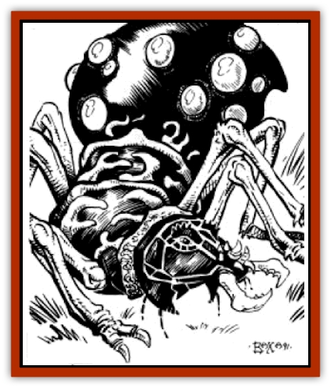

# Kank - Wild

| Statistic | **Kank, Wild** |
| --- | --- |
| **Activity Cycle:** | Any |
| **Alignment:** | Neutral |
| **Armor Class:** | 5 |
| **Climate/Terrain:** | Stony barrens, tablelands |
| **Damage/Attack:** | 1-6 or 1-6/1-8 |
| **Diet:** | Omnivore |
| **Frequency:** | Common |
| **Hit Dice:** | 3 |
| **Intelligence:** | Animal (1) |
| **Magic Resistance:** | Nil |
| **Morale:** | Average (8-10) |
| **Movement:** | 15 |
| **No. Appearing:** | 50-500 |
| **No. of Attacks:** | l or 2 |
| **Organization:** | Hive |
| **Size:** | L (8' long) |
| **Special Attacks:** | Crush/Poison |
| **Special Defenses:** | Nil |
| **THAC0:** | 17 |
| **Treasure:** | Nil |
| **XP Value:** | 175 |

Not all [[Animal_Domestic_Athas_I|kanks]] on Athas are maintained by the nomad herdsmen. Many herds of kanks roam wild across the Tablelands.

Kanks are large, docile insects with black, segmented, chitinous exoskeletons, covering their head, thorax and abdomen, Kanks grow up to eight feet in length, four feet in height, and can weigh as much as 400 pounds. At the front of their head, kanks sport a pair of sharp pincers which they use for both feeding and fighting. The thorax of a kank has six legs. Each leg has a strong claw at its end, allowing the creature to grip the surfaces it walks upon. Like most insects, the kank's abdomen has no appendages and is supported by the rest of its body.

**Combat:** When kanks engage in combat, it is usually the soldier type that is involved, as they are the best suited to fight. A soldier kank will strike with its pincers, doing 1-8 points of damage on a successful attack. Any victim hit by a soldier kank is also injected with Class O poison (save vs. poison or be paralyzed in 2-24 rounds). If the attack roll against a foe is 15 or higher and that is a hit, the victim is also grappled; each round thereafter the victim suffers an extra 1-6 points of crushing damage in addition to the normal 1-8 points of damage and poison attack in the first round. Breaking free from the grapple of a kank requires a Strength roll at a -2 penalty. Companions of the victim may attempt to free him by attacking the kank's pincers. A total of 5 points of damage is all that is required to loose the victim.

**Habitat/Society:** Being [[Insect_Giant|insects]], wild kanks organize themselves into hives, each consisting of soldiers, food producers, and brood queens. The soldiers serve as the hive workers, collecting materials which can be used to build nests for the brood queens, as well as the protectors of the queens and food producers. Soldiers also gather food for the adult members of the hive. This food takes the form of most types of leaves and fronds, and an occasional animal.

Food producing kanks secret large, melon-sized globules of green honey which is used to the feed the young of the hive. These globules are stored on the abdomens of the food producers, and when food is sources are limited, are used to feed the older members of the hive as well as the young.

Brood queens are the members of the hive that produce eggs, usually in batches of 20 to 50. Once the brood queens have laid their eggs, it is the soldiers duty to fiercely defend the area until the eggs hatch.

Wild kanks generally choose an area for egg laying where there is an abundant amount of available vegetation for food.

**Ecology:** The honey globules produced by food-producing kanks are very sweet and fetch a high price when used in trade and barter. They can sustain a man for several days with no other means of nourishment.

Kank exoskeleton can be used as armor when cleaned, but is very brittle and has a 20% chance of breaking whenever hit by a weapon. A much more common use of kank exoskeleton is in the construction of [[Golem_Athas_I|chitin golems]], automatons created by powerful defiler wizards.

---
## Discovery & Documentation

**Source Publication:** MC12 Dark Sun Appendix I - Terrors of the Desert (1991)
**Campaign Setting:** Dark Sun
**Author(s):** Tom Prusa, Louis J. Prosperi, Walter M. Baas

### Other Creatures Found in This Source Book
   * [[Animal_Herd_Athas|Animal, Herd (Athas)]]
   * [[Animal_Household_Athas|Animal, Household (Athas)]]
   * [[Antloid_Desert|Antloid, Desert]]
   * [[Banshee_Dwarf|Banshee, Dwarf]]
   * [[Beetle_Agony|Beetle, Agony]]
   * [[Bog_Wader|Bog Wader]]
   * [[Brambleweed|Brambleweed]]
   * [[B'rohg|B'rohg]]
   * [[Burnflower|Burnflower]]
   * [[Cat_Psionic|Cat, Psionic]]
   * [[Cha'thrang|Cha'thrang]]
   * [[Cistern_Fiend|Cistern Fiend]]
   * [[Clam_Giant|Clam, Giant]]
   * [[Cloud_Ray|Cloud Ray]]
   * [[Drake_Athas_Air|Drake (Athas), Air]]
   * [[Drake_Athas_Earth|Drake (Athas), Earth]]
   * [[Drake_Athas_Fire|Drake (Athas), Fire]]
   * [[Drake_Athas_Water|Drake (Athas), Water]]
   * [[Dune_Runner|Dune Runner]]
   * [[Dune_Trapper|Dune Trapper]]
   * [[Elemental_Athas_Greater_Air|Elemental (Athas), Greater, Air]]
   * [[Elemental_Athas_Greater_Earth|Elemental (Athas), Greater, Earth]]
   * [[Elemental_Athas_Greater_Fire|Elemental (Athas), Greater, Fire]]
   * [[Elemental_Athas_Greater_Water|Elemental (Athas), Greater, Water]]
   * [[Elemental_Athas_Lesser_Air_Earth|Elemental (Athas), Lesser, Air/Earth]]
   * [[Elemental_Athas_Lesser_Fire_Water|Elemental (Athas), Lesser, Fire/Water]]
   * [[Elemental_Athas_General_Information|Elemental (Athas), General Information]]
   * [[Erdland|Erdland]]
   * [[Esperweed|Esperweed]]
   * [[Flailer|Flailer]]
   * [[Floater|Floater]]
   * [[Giant_Athas|Giant (Athas)]]
   * [[Golem_Athas_I|Golem (Athas) I]]
   * [[Golem_Athas_II|Golem (Athas) II]]
   * [[Golem_Athas_III|Golem (Athas) III]]
   * [[Golem_Athas_General_Information|Golem (Athas), General Information]]
   * [[Halfling_Renegade|Halfling, Renegade]]
   * [[Hej-kin|Hej-kin]]
   * [[Id_Fiend|Id Fiend]]
   * [[Insect_Swarm_Athas|Insect Swarm (Athas)]]
   * [[Kirre|Kirre]]
   * [[Megapede|Megapede]]
   * [[Mul_Wild|Mul, Wild]]
   * [[Nightmare_Beast|Nightmare Beast]]
   * [[Plant_Carnivorous_Athas|Plant, Carnivorous (Athas)]]
   * [[Pterran|Pterran]]
   * [[Pterrax|Pterrax]]
   * [[Pulp_Bee|Pulp Bee]]
   * [[Pyreen|Pyreen]]
   * [[Rasclinn|Rasclinn]]
   * [[Razorwing|Razorwing]]
   * [[Roc_Athas|Roc (Athas)]]
   * [[Sand_Bride|Sand Bride]]
   * [[Sand_Cactus|Sand Cactus]]
   * [[Sand_Vortex|Sand Vortex]]
   * [[Scrab|Scrab]]
   * [[Silt_Horror|Silt Horror]]
   * [[Silt_Runner|Silt Runner]]
   * [[Sink_Worm|Sink Worm]]
   * [[Sloth_Athas|Sloth (Athas)]]
   * [[So-ut|So-ut]]
   * [[Spider_Cactus|Spider Cactus]]
   * [[Spider_Crystal|Spider, Crystal]]
   * [[Spirit_of_the_Land|Spirit of the Land]]
   * [[T'Chowb|T'Chowb]]
   * [[Thrax|Thrax]]
   * [[Tohr-kreen_I|Tohr-kreen I]]
   * [[Villichi|Villichi]]
   * [[Zhackal|Zhackal]]
   * [[Zombie_Plant|Zombie Plant]]
