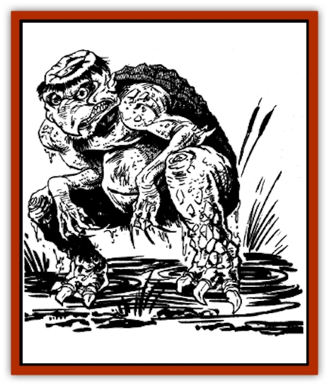

# Kappa

| Statistic | **Common Kappa** | **Kappa-Ti** | **Vampiric Kappa** |
| --- | --- | --- | --- |
| **Activity Cycle:** | Any | Any | Night |
| **Alignment:** | Chaotic evil | Chaotic evil | Chaotic evil |
| **Armor Class:** | 3/-2 | 3 | 0/-2 |
| **Climate/Terrain:** | Tropical, subtropical, and temperate lakes and rivers | Tropical, subtropical, and temperate lakes and rivers | Tropical, subtropical, and temperate water |
| **Damage/Attack:** | 5-10/5-10 | 10-20/10-20 | 5-10/5-10/1-6 |
| **Diet:** | Carnivore | Carnivore | Carnivore |
| **Frequency:** | Rare | Very rare | Very rare |
| **Hit Dice:** | 4 | 8 | 7+7 |
| **Intelligence:** | Low to average (5-10) | Low to average (5-10) | Average (8-10) |
| **Magic Resistance:** | Nil | Nil | Nil |
| **Morale:** | Steady (11) | Steady (11) | Steady (12) |
| **Movement:** | 6, Sw 18 | 12, Sw 36 | 9, Sw 18 |
| **No. Appearing:** | 1-6 | 1 | 1-2 |
| **No. of Attacks:** | 2 | 2 | 3 |
| **Organization:** | Family | Solitary | Solitary |
| **Size:** | S (2' tall) | M (4-5' tall) | S (3' tall) |
| **Special Attacks:** | Nil | Nil | Strength drain |
| **Special Defenses:** | Regeneration | Regeneration, camouflage | Regeneration |
| **THAC0:** | 17 | 13 | 13 |
| **Treasure:** | D | D | D |
| **XP Value:** | 270 | 1,400 | 2,000 |

The kappa are a race of amphibious humanoids who live in freshwater lakes, ponds, rivers, and streams.

They are small creatures, standing about 2' tall and weighing about 20 pounds. All kappa have bent backs and a crouched posture. At a distance, they're often mistaken for small monkeys. A hard shell covers their backs.

Kappas are covered with scales - usually dark green with yellow splotches, but occasionally dull blue with yellowish brown accents. Both males and females have protruding pot bellies. They also have pouches near the base of their abdomens, like kangaroos. The kappa's feet resemble those of a snapping turtle, each with three webbed toes ending in hooked claws. Their hands are similarly webbed. Long, razor-sharp talons extend from their fingertips. Their heads are flat and plump, and their broad mouths are filled with multiple rows of hooked teeth. Their round, bright eyes are usually red or yellow. A transparent lid covers the eyes, enabling the creature to see clearly underwater. Most kappa have long noses resembling a bird's beak, but some have shorter, more humanlike noses.

Like other amphibians, kappa are cold-blooded. They are clammy to the touch, and smell vaguely of fish. With their unique lungs, kappa can breathe both water and air.

The top of a kappa's head is concave, forming a small bowl. The kappa fills the bowl with water from his or her home (a lake, river, or pond). This water is the source of a kappa's strength; if the fluid is spilled, he or she loses vitality. In emergencies, kappa can refill their head-bowls with fresh water from any source. A thin ridge of hair encircles the base of the kappa's head-bowl. The hair is usually cut short, but scholarly and artistic kappa let this hair grow long to symbolize their intellectualism.

Kappa speak their own language. Most adult kappa also can speak the language common to the area they inhabit.

**Combat:** Generally, a kappa's behavior is unpredictable and extreme. They delight in the discomfort of others, but they are usually polite at first, even to potential prey. So self centered are kappa that potential victims sometimes can placate them by complimenting their manners, appealing to their egos, and offering money and valuables. But if the kappa is insulted, hungry, or just plain ornery, it shows no mercy. In many areas of Kara-Tur, kappa are a major cause of drowning, since they enjoy ambushing unsuspecting victims and dragging them beneath the water.

Despite their small size, all kappa boast incredible Strength (18/00), which grants them a +3 bonus to their attack and damage rolls. In combat, they fight with their clawed hands, viciously rending their victims. Kappa prefer not to use most weapons, but may attack with daggers and darts if they're available. Some kappa arm themselves with rocks.

With their supple bodies, kappa move fluidly on both land and water. Their ease of movement and tough scales provide an admirable defense. They are difficult to harm from behind, since their protective shell gives them an AC of -2 for rear attacks.

Each kappa family has developed and mastered its own style of martial arts, including 1-6 special maneuvers in that style. These maneuvers commonly involve grappling and holding. They also include techniques that throw an opponent off balance and inflict maximum damage. Typical special maneuvers are Feint, Concentrated Push, Crushing Blow, Eagle Claw, and Great Throw.

Kappa are so proud of their prowess as hand-to-hand fighters that they often offer a victim the chance to wrestle. If the victim wins, the kappa will grant him free passage. If he loses, the kappa will drag him underwater and eat him.

One of the kappa's favorite contests is finger wrestling. The kappa and the victim link their smallest fingers while standing on the shore, then attempt to pull each other into the water. To simulate this contest, the kappa and the victim each attempt a "bend bars/lift gates" roll. The kappa uses his Strength of 18/00. If both wrestlers succeed or fail in a particular round, nothing happens. If the victim succeeds and the kappa fails, the victim wins and is allowed to go on his way. If the kappa succeeds and the victim fails, the victim has been pulled underwater.

About 10% of adult male kappa can cast spells. This talent is innate; the spellcaster does not have to memorize the spells. However, the kappa only can cast spells while he is within one mile of his home. The creature casts spells as if he were a wu jen whose level equals the kappa's Hit Dice. For example, a vampiric kappa with this ability has 7 HD; he casts as 7th-level wu jen. Kappa have access to any of the wu jen spells listed in the *Oriental Adventures* book, but they favor the water-based magic. All kappa are immune to water-based spells.

Kappa can regenerate 1 hp per round. Although a kappa cannot regrow a severed limb, he can rejoin it to his body if he is left undisturbed to rest for a period of 4-7 (1d4 + 1) weeks.

The kappa's most vulnerable point is his head-bowl. If this bowl is emptied, the kappa's powers are severely diminished. His Strength becomes normal; typically, that means it drops to 10. He also loses his ability to regenerate damage, and loses 2 hit points per round until the water is restored.

Emptying the head-bowl is not as likely as it may seem. Although kappa occasionally can be tricked into bowing (and spilling the water), the majority are too clever for this. In combat, the water can be spilled if the opponent makes a successful "bend bars/lift gates" roll for this purpose, or if he executes an appropriate martial arts maneuver.

About 5% of all kappa release a *death curse* when they die. The *death curse* is cast by the kappa's spirit on the opponents who defeated him in his final battle. Up to four opponents can receive the *death curse*. Each affected opponent must save vs. death magic exactly four rounds after the kappa's death. Those who fail their saving throws acquire a permanent -4 penalty to their attack and saving throw rolls; additionally, everyone within a 30' radius of a cursed character suffers a -2 penalty to their attack and saving throw rolls for as long as they remain within that radius. The *death curse* only can be lifted by a *remove curse* spell cast by a shukenja of 10th level or higher.

**Habitat/Society:** Kappa live in bodies of fresh water, making their lairs under rocks and bridges. They have an extreme aversion to salt water, and exposure to salt water for extended periods of time usually is fatal.

A kappa lair is often marked by a large stump or flat rock near the surface of the water. Usually, the landmark is concealed by a circle of high weeds or marsh grass. The kappa uses this stump or rock as a sunning spot. Under the water, a large rock or pile of stones conceals the entrance to the actual lair, which opens into a tunnel that leads to a small, water-filled cavern. A hole in the cavern floor contains the kappa's treasure, which comprises coins, jewelry, and magical items taken from victims. The treasure hole is concealed by a large stone.

A kappa family consists of 2-6 adult males with an equal number of females. The number of children equals the total number of adults. Mating is initiated by the females, who vigorously pursue the male of their choice until the male submits. A female lays 1-6 eggs every year, about half of which actually hatch. The mother keeps the eggs hidden in her pouch, and carries the young in her pouch for up to a year after they hatch. A young kappa grows quickly, reaching full maturity in about five years. They can walk, swim, and speak as soon as they hatch, however. Kappa live to be about 100 years old.

These creatures are oblivious to the problems and concerns of others - even members of their own families. A kappa rarely will come to the aid of endangered kin unless he himself would benefit. Before he will act, his own safety must be reasonably assured and he must be fairly confident that his efforts will lead to personal gain - such as treasure or food.

Humans who share an area with a kappa learn to throw food and trinkets into his water as an offering. These humans write the names of their family members on the gifts, so the kappa is aware of their source. On rare occasions, a kappa acquires a deep respect for a particular human who is especially helpful, deferential, or threatening; in such cases, the kappa may offer to teach the human some of its skills.

**Ecology:** Kappa eat humans, cows, and sheep when they can get them; otherwise they content themselves with fish. They are especially fond of horseflesh, and often attempt to drag these animals to their doom. Kappa also enjoy cucumbers and melons.

**Kappa-Ti**

  Kappa-ti are larger, faster, stronger versions of the common kappa. Their Strength is 19 (+4 to combat rolls) and they grow to a height of 5 feet. They lack a protective shell. Common kappa find them repulsive. Kappa-ti always are encountered alone or in mated pairs. Their natural camouflage gives them a 75% chance of avoiding detection in the wild.

**Vampiric Kappa**

  [[Vampire_General_Information|Vampiric]] kappa resemble common kappa in behavior, but they differ physically. Vampiric kappa are somewhat taller and weigh slightly more, and their eyes glow with a red fire. Their scales are tougher and more resilient. On dry land, the agile vampire is significantly faster. Vampiric kappa also tend to be more intelligent.

Vampiric kappa share the strength and cunning of common kappa, as well as their spellcasting abilities. In addition, vampiric kappa can make biting attacks. Once a successful bite has been scored, a vampiric kappa retains its grip, draining 1 point of Strength each round (but causing no further damage). This grip can be broken in three ways: by slaying the vampiric kappa, emptying its head-bowl, or making a successful "bend bars/lift gates" roll. If the victim's Strength reaches 0, he is slain.

Any victim of the kappa's bite has a 50% chance of contracting a debilitating disease. This disease causes the loss of 1-3 Strength points per day until cured, or until the victim dies. If the disease is cured - by *cure disease* or a similar spell, for example - the victim recovers 2-3 Strength points per day of rest.

Vampiric kappa seldom live in families with children. They dwell alone or with a mate. They prey on any living creatures they encounter, including other kappa.

---
## Discovery & Documentation

**Source Publication:** MC6 Kara-Tur Appendix (1990)
**Campaign Setting:** Kara-Tur (Forgotten Realms)
**Author(s):** Rick Swan

### Other Creatures Found in This Source Book
   * [[Bajang|Bajang]]
   * [[Bakemono|Bakemono]]
   * [[Bisan|Bisan]]
   * [[Buso|Buso]]
   * [[Carp_Giant|Carp, Giant]]
   * [[Centipede_Spirit|Centipede, Spirit]]
   * [[Chu-u|Chu-u]]
   * [[Con-tinh|Con-tinh]]
   * [[Doc_cu'o'c|Doc cu'o'c]]
   * [[Duruch'i-lin|Duruch'i-lin]]
   * [[Flame_Spirit|Flame Spirit]]
   * [[Foo_Creature|Foo Creature]]
   * [[Gaki|Gaki]]
   * [[Gargantua|Gargantua]]
   * [[Goblin_Rat|Goblin Rat]]
   * [[Hai_Nu|Hai Nu]]
   * [[Hannya|Hannya]]
   * [[Hengeyokai|Hengeyokai]]
   * [[Hsing-sing|Hsing-sing]]
   * [[Hu_Hsien|Hu Hsien]]
   * [[Human_Kara-Tur|Human (Kara-Tur)]]
   * [[Ikiryo|Ikiryo]]
   * [[Jishin_Mushi|Jishin Mushi]]
   * [[Kala|Kala]]
   * [[Kaluk|Kaluk]]
   * [[Korobokuru|Korobokuru]]
   * [[Krakentua|Krakentua]]
   * [[Kuei|Kuei]]
   * [[Memedi|Memedi]]
   * [[Men-shen|Men-shen]]
   * [[Nat|Nat]]
   * [[Ningyo|Ningyo]]
   * [[Oni|Oni]]
   * [[P'oh|P'oh]]
   * [[P'oh_Gohei|P'oh, Gohei]]
   * [[Shan_Sao|Shan Sao]]
   * [[Shirokinukatsukami|Shirokinukatsukami]]
   * [[Spirit_Folk|Spirit Folk]]
   * [[Spirit_Nature|Spirit, Nature]]
   * [[Spirit_Stone|Spirit, Stone]]
   * [[Tako|Tako]]
   * [[Tengu|Tengu]]
   * [[Wang-Liang|Wang-Liang]]
   * [[Yuan-ti_Histachii|Yuan-ti, Histachii]]
   * [[Yuki-on-na|Yuki-on-na]]
