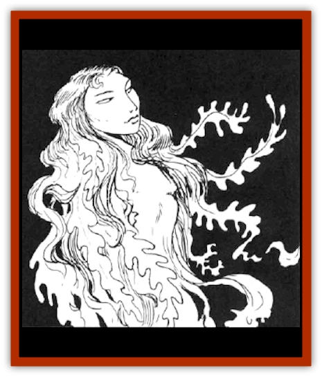

# Kelpie

| Statistic | **Kelpie** |
| --- | --- |
| **Activity Cycle:** | Any |
| **Alignment:** | Neutral evil |
| **Armor Class:** | 3 |
| **Climate/Terrain:** | Temperate or tropical/Saltwater |
| **Damage/Attack:** | Nil |
| **Diet:** | Photosynthesis |
| **Frequency:** | Very rare |
| **Hit Dice:** | 5 |
| **Intelligence:** | Low-Average (5-10) |
| **Magic Resistance:** | Nil |
| **Morale:** | Elite (13) |
| **Movement:** | 9, Sw 12 |
| **No. Appearing:** | 1-4 |
| **No. of Attacks:** | Nil |
| **Organization:** | Solitary |
| **Size:** | M (6-7' tall) |
| **Special Attacks:** | See below |
| **Special Defenses:** | See below |
| **THAC0:** | 15 |
| **Treasure:** | D |
| **XP Value:** | 420 |

The kelpie is a form of intelligent, aquatic plant life that is able to alter its shape and cast a *charm* spell. Its purpose is to drown the foolish.

Its basic form is a mass of animate seaweed. It is able to alter its form to resemble a green-clad woman, green [[Horse|horse]], or [[Hippocampus|hippocampus]]. Whatever the form, its substance is still green seaweed. A kelpie can communicate telepathically with those in its embrace.

**Combat:** A kelpie lacks actual offensive abilities. When a humanoid male approaches, the kelpie reshapes itself into the form of a woman or mount. Although the result is a grotesque mockery that is 95% delectable in daylight, the kelpie can enhance its deception through magic.

Once per day, the kelpie can cast a *charm* spell with a -2 penalty to the victim's saving throw. The kelpie's *charm* works only against humanoid males. If the victim fails the saving throw, he perceiess the kelpie as the most desirable woman (or mount) that he can imagine. He leaps into the water, intending to hold or possess the kelpie. The kelpie then wraps itself around the *charmed* man, who happily drowns as he tries to breathe water. Victims suffer 2d10 points of damage each round until they either die, surface for air, or are protected from drowning. The kelpie then takes the body back to her lair, where it is consumed. Even if the kelpie cannot reach its victim, the spell will force the man to swim toward her and drown himself.

If the victim is able to breathe water, he does not drown. Drowning-immune victims still happily entwine themselves within the kelpie's embrace. Kelpies are confused by such occurrences; they do not attempt to negate such protection and may actually welcome their victim's continued activity.

If the kelpie is encountered on dry land, the victim acts as its protector if his companions attack the kelpie. Although he is confused and enraged by his companions' perceived treachery, he does anything he can to protect his beloved kelpie.

Once the kelpie is slain, the *charm's* effect immediately ends. The victim is also freed if he survives until the *charm* expires.

Due to the kelpie's water-drenched form, fire attacks inflict only half damage (none if a saving throw is made). Kelpies are invisible to infravision.

**Habitat/Society:** One legend tells that the kelpie was created by a vengeful sea god as a means of punishing men who were rash enough to sail the seas without giving the sea god his rightful dues. Since few women were sailors at the time, they were spared the kelpie's curse. A less-widely told legend recounts how kelpies were created by [[Archomental_Evil|Olhydra]], the Elemental Princess of Evil Water Creatures. In respect to her own gender, Olhydra made all women immune to her creations' charms.

Kelpies are normally found in the ocean waters. Kelpies are usually found within the top 100 feet of the ocean. Kelpies are very adaptable and may make their home in any body of water, even artificial or subterranean ones.

While in humanoid or equine form, they are able to walk on dry land for up to 1-3 hours. If they are encountered on land, they may still try to charm men. Such victims are of course safe from drowning, at least for the moment. They accompany, carry, and protect the kelpie.

Kelpies reproduce asexually. They increase in size to seven feet, then break into two to four independent kelpies. Kelpies can do this as often as once a month if victims are plentiful and they haven't been fed on too much by local fish. Kelpies have no defenses against fish, and other aquatic grazers, who perceive them as seaweed to be eaten.

Treasure is usually found in the remains of a kelpie's victims. If treasure is found on a kelpie, it is most likely attached to the decayed remains still clutched within its fronds.

**Ecology:** Kelpie sprouts are worth 500 gp. The sprouts are initially too small to use magic, but they can grow in a month into full-grown kelpies if given ample care. Kelpies may ally themselves with powerful creatures and occasionally guard submerged treasures.

---
## Discovery & Documentation

**Source Publication:** MC2 Volume II (1993)
**Campaign Setting:** Advanced Dungeons & Dragons 2nd Edition
**Author(s):** Jay Batista, Scott Bennie, Grant Boucher, William W. Connors, Steve Gilbert, Heike Kubasch, James Lowder, David Edward Martin, Bruce Nesmith, Jean Rabe, Rick Swan, John J. Terra, Gary L. Thomas

### Other Creatures Found in This Source Book
   * [[Ant|Ant]]
   * [[Ant_Lion_Giant|Ant Lion, Giant]]
   * [[Ape_Carnivorous|Ape, Carnivorous]]
   * [[Baboon|Baboon]]
   * [[Badger|Badger]]
   * [[Barracuda|Barracuda]]
   * [[Beetle_Giant|Beetle, Giant]]
   * [[Bulette|Bulette]]
   * [[Bullywug|Bullywug]]
   * [[Dwarf_Duergar|Dwarf, Duergar]]
   * [[Dwarf_Gully|Dwarf, Gully]]
   * [[Eagle|Eagle]]
   * [[Eel|Eel]]
   * [[Elemental_Air_Kin|Elemental, Air Kin]]
   * [[Elemental_Water_Kin|Elemental, Water Kin]]
   * [[Elemental_Water_Kin_Water_Weird|Elemental, Water Kin, Water Weird]]
   * [[Firestar|Firestar]]
   * [[Firetail|Firetail]]
   * [[Fish_Giant|Fish, Giant]]
   * [[Frog|Frog]]
   * [[Gorgon|Gorgon]]
   * [[Hawk|Hawk]]
   * [[Heucuva|Heucuva]]
   * [[Hippocampus|Hippocampus]]
   * [[Hippogriff|Hippogriff]]
   * [[Kenku|Kenku]]
   * [[Killmoulis|Killmoulis]]
   * [[Kuo-Toa|Kuo-Toa]]
   * [[Lamia|Lamia]]
   * [[Lammasu|Lammasu]]
   * [[Lamprey|Lamprey]]
   * [[Leech|Leech]]
   * [[Leprechaun|Leprechaun]]
   * [[Leucrotta|Leucrotta]]
   * [[Locathah|Locathah]]
   * [[Lycanthrope_Wereboar|Lycanthrope, Wereboar]]
   * [[Lycanthrope_Werefox|Lycanthrope, Werefox]]
   * [[Mammal_Minimal|Mammal, Minimal]]
   * [[Mammal_Small|Mammal, Small]]
   * [[Mimic|Mimic]]
   * [[Morkoth|Morkoth]]
   * [[Muckdweller|Muckdweller]]
   * [[Myconid|Myconid]]
   * [[Naga|Naga]]
   * [[Obliviax|Obliviax]]
   * [[Octopus_Giant|Octopus, Giant]]
   * [[Otyugh|Otyugh]]
   * [[Piranha|Piranha]]
   * [[Plant_Dangerous_I|Plant, Dangerous I]]
   * [[Plant_Intelligent|Plant, Intelligent]]
   * [[Poltergeist|Poltergeist]]
   * [[Porcupine|Porcupine]]
   * [[Rat_Osquip|Rat, Osquip]]
   * [[Roc|Roc]]
   * [[Roper|Roper]]
   * [[Rot_Grub|Rot Grub]]
   * [[Rust_Monster|Rust Monster]]
   * [[Sahuagin|Sahuagin]]
   * [[Sea_Lion|Sea Lion]]
   * [[Sea_Horse_Giant|Sea Horse, Giant]]
   * [[Shambling_Mound|Shambling Mound]]
   * [[Shark|Shark]]
   * [[Sphinx|Sphinx]]
   * [[Squid_Giant|Squid, Giant]]
   * [[Stirge|Stirge]]
   * [[Swanmay|Swanmay]]
   * [[Tarrasque|Tarrasque]]
   * [[Tasloi|Tasloi]]
   * [[Triton|Triton]]
   * [[Troglodyte|Troglodyte]]
   * [[Urchin|Urchin]]
   * [[Urd|Urd]]
   * [[Weasel|Weasel]]
   * [[Wolverine|Wolverine]]
   * [[Yellow_Musk_Creeper|Yellow Musk Creeper]]
