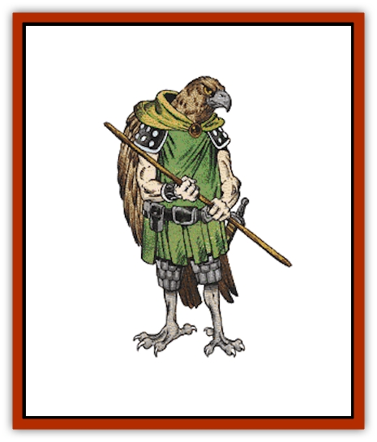

# Kenku

| Statistic | **Kenku** |
| --- | --- |
| **Activity Cycle:** | Any |
| **Alignment:** | Neutral |
| **Armor Class:** | 5 |
| **Climate/Terrain:** | Any land |
| **Damage/Attack:** | 1-4/1-4/1-6 or by weapon |
| **Diet:** | Omnivore |
| **Frequency:** | Uncommon |
| **Hit Dice:** | 2-5 |
| **Intelligence:** | Average (8-10) |
| **Magic Resistance:** | 30% |
| **Morale:** | Elite (13) |
| **Movement:** | 6, Fl 18 (D) |
| **No. Appearing:** | 2-8 |
| **No. of Attacks:** | 3 or 1 |
| **Organization:** | Clan |
| **Size:** | M (5-7' tall) |
| **Special Attacks:** | Nil |
| **Special Defenses:** | See below |
| **THAC0:** | 2 HD: 19 / 3-4 HD: 17 / 5 HD: 15 |
| **Treasure:** | F |
| **XP Value:** | 2 HD: 175 / 3 HD: 420 / 4 HD: 650 / 5 HD: 975 |

Kenku are bipedal, humanoid [[Bird|birds]] that use their powers to annoy and inconvenience the human and demihuman races.

The typical kenku resembles a humanoid [[Hawk|hawk]] wearing human clothing. Kenku have both arms and wings. The wings are usually folded across the back and may be mistaken at a distance for a large backpack. Height ranges from 5 to 7 feet. The feathers are predominantly brown with white underfeathers and face markings. The eyes are a brilliant yellow.

**Combat:** All kenku have the skills of 4th-level thieves. They are expert fighters and usually attack with a scimitar or quarterstaff. If unarmed, they attack with either pair of claws (two attacks for 1d4 points of damage apiece) and their beak (1d6 points of damage). If they are on foot, they use the hand claws. If in flight, the foot claws are used. They do not usually kill unless their own lives are threatened by the survival of their foe. All kenku have well-developed disguise skills. They have a 50% chance of passing for human, although their disguises often have telltale large noses.

A 3-Hit Die kenku has one 1st-level wizard spell, usually *magic missile*. Once each 30 days a kenku can *shape change* and retain that shape for up to seven days. A 4-Hit Die kenku has an extra 1st-level spell, often *shocking grasp*. They gain the innate ability to *become invisible* with no limitation on duration or frequency of use. A 5-Hit Dice kenku leader gains an additional 2nd-level mage spell, usually *mirror image* or *web*, and the innate ability to *call lightning* (the same as the 3rd-level priest spell).

**Habitat/Society:** Kenku are a secretive race that lives among the human and demihuman races without the bulk of the population ever being aware of their presence.

If a group of kenku is encountered, the group's size determines its composition. A group of five or fewer contains two 2-Hit Dice and three 3-Hit Dice kenku. A group of six or seven has a leader with 4 Hit Dice, three kenku with 3 Hit Dice, and the rest have 2 Hit Dice. A group of eight kenku adds a supreme leader of 5 Hit Dice.

Kenku do not speak; although they may give out bird-like squawks, these are gibberish. Kenku apparently communicate with each other telepathically. They are adept at symbols, sign language, and pantomime.

Kenku may appear to be friendly, helpful, and even generous. They freely give treasure to humans and demihumans, but it is rarely genuine and crumbles into dust within a day. They may offer nonverbal advice to humanoids, but this is carefully designed to mislead. It may actually lead the party into dangers and difficulties they might otherwise have avoided. As a rule of thumb, kenku have only a 5% chance of actually helping people.

The actual structure of kenku society is elusive. The kenku themselves either refuse to comment or lie. Those kenku lairs that have been encountered tend to be small underground chambers or cave complexes. It is believed that large caverns deep underground may hold sizeable kenku communities, including individuals of 6 Hit Dice or more and with greater magical powers.

Kenku reproduction is similar to that of large birds. The female lays a clutch of two to four eggs that hatch after 60 days. New hatchlings are featherless, helpless, and have 1 hit point each. Hatchlings grow swiftly and gain 1 hit point each month. Within six to eight months they have adult feathers and are able to function independently as 1-Hit Die kenku. At this point they can begin to learn to use the skills they need as adults (thieving, fighting, disguise). If a hatchling is captured, it either lacks this training or has whatever minimal skills it acquired before capture.

Younger kenku (3 Hit Dice or less) are reckless and prone to audacious plans. They have been known to pass themselves off as gods and collect the worshipers's offerings. Older kenku are more reserved and cunning, preferring to kidnap wealthy humans and demihumans as a source of revenue.

**Ecology:** Domestically raised kenku are prized as servants. Kenku eggs are commonly sold for 250 gp, hatchlings for 300-500 gp. However, this is a form of slave trade, with all the attendant complications. If a kenku discovers captive kenku, it will attempt to secretly rescue the captive and, if possible, kidnap the slave trader or owner. They will avenge slain kenku.

---
## Discovery & Documentation

**Source Publication:** MC2 Volume II (1993)
**Campaign Setting:** Advanced Dungeons & Dragons 2nd Edition
**Author(s):** Jay Batista, Scott Bennie, Grant Boucher, William W. Connors, Steve Gilbert, Heike Kubasch, James Lowder, David Edward Martin, Bruce Nesmith, Jean Rabe, Rick Swan, John J. Terra, Gary L. Thomas

### Other Creatures Found in This Source Book
   * [[Ant|Ant]]
   * [[Ant_Lion_Giant|Ant Lion, Giant]]
   * [[Ape_Carnivorous|Ape, Carnivorous]]
   * [[Baboon|Baboon]]
   * [[Badger|Badger]]
   * [[Barracuda|Barracuda]]
   * [[Beetle_Giant|Beetle, Giant]]
   * [[Bulette|Bulette]]
   * [[Bullywug|Bullywug]]
   * [[Dwarf_Duergar|Dwarf, Duergar]]
   * [[Dwarf_Gully|Dwarf, Gully]]
   * [[Eagle|Eagle]]
   * [[Eel|Eel]]
   * [[Elemental_Air_Kin|Elemental, Air Kin]]
   * [[Elemental_Water_Kin|Elemental, Water Kin]]
   * [[Elemental_Water_Kin_Water_Weird|Elemental, Water Kin, Water Weird]]
   * [[Firestar|Firestar]]
   * [[Firetail|Firetail]]
   * [[Fish_Giant|Fish, Giant]]
   * [[Frog|Frog]]
   * [[Gorgon|Gorgon]]
   * [[Hawk|Hawk]]
   * [[Heucuva|Heucuva]]
   * [[Hippocampus|Hippocampus]]
   * [[Hippogriff|Hippogriff]]
   * [[Kelpie|Kelpie]]
   * [[Killmoulis|Killmoulis]]
   * [[Kuo-Toa|Kuo-Toa]]
   * [[Lamia|Lamia]]
   * [[Lammasu|Lammasu]]
   * [[Lamprey|Lamprey]]
   * [[Leech|Leech]]
   * [[Leprechaun|Leprechaun]]
   * [[Leucrotta|Leucrotta]]
   * [[Locathah|Locathah]]
   * [[Lycanthrope_Wereboar|Lycanthrope, Wereboar]]
   * [[Lycanthrope_Werefox|Lycanthrope, Werefox]]
   * [[Mammal_Minimal|Mammal, Minimal]]
   * [[Mammal_Small|Mammal, Small]]
   * [[Mimic|Mimic]]
   * [[Morkoth|Morkoth]]
   * [[Muckdweller|Muckdweller]]
   * [[Myconid|Myconid]]
   * [[Naga|Naga]]
   * [[Obliviax|Obliviax]]
   * [[Octopus_Giant|Octopus, Giant]]
   * [[Otyugh|Otyugh]]
   * [[Piranha|Piranha]]
   * [[Plant_Dangerous_I|Plant, Dangerous I]]
   * [[Plant_Intelligent|Plant, Intelligent]]
   * [[Poltergeist|Poltergeist]]
   * [[Porcupine|Porcupine]]
   * [[Rat_Osquip|Rat, Osquip]]
   * [[Roc|Roc]]
   * [[Roper|Roper]]
   * [[Rot_Grub|Rot Grub]]
   * [[Rust_Monster|Rust Monster]]
   * [[Sahuagin|Sahuagin]]
   * [[Sea_Lion|Sea Lion]]
   * [[Sea_Horse_Giant|Sea Horse, Giant]]
   * [[Shambling_Mound|Shambling Mound]]
   * [[Shark|Shark]]
   * [[Sphinx|Sphinx]]
   * [[Squid_Giant|Squid, Giant]]
   * [[Stirge|Stirge]]
   * [[Swanmay|Swanmay]]
   * [[Tarrasque|Tarrasque]]
   * [[Tasloi|Tasloi]]
   * [[Triton|Triton]]
   * [[Troglodyte|Troglodyte]]
   * [[Urchin|Urchin]]
   * [[Urd|Urd]]
   * [[Weasel|Weasel]]
   * [[Wolverine|Wolverine]]
   * [[Yellow_Musk_Creeper|Yellow Musk Creeper]]
