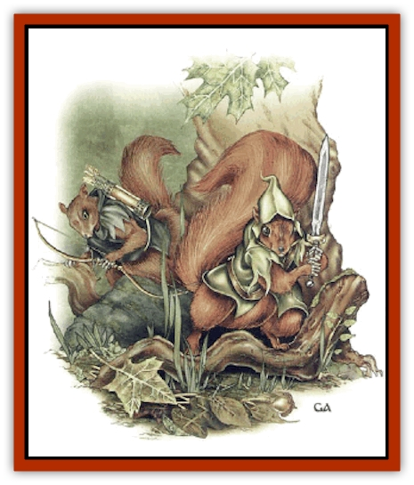

# Kercpa

| Statistic | **Kercpa** |
| --- | --- |
| **Activity Cycle:** | Day |
| **Alignment:** | Neutral to Chaotic good |
| **Armor Class:** | 3 |
| **Climate/Terrain:** | Temperate forest |
| **Damage/Attack:** | 1d3 |
| **Diet:** | Herbivore |
| **Frequency:** | Rare |
| **Hit Dice:** | 1 |
| **Intelligence:** | Average to High (8-14) |
| **Magic Resistance:** | Nil |
| **Morale:** | Steady (12); with elves Elite (14) |
| **Movement:** | 9, Cl 15 |
| **No. Appearing:** | 3-12 |
| **No. of Attacks:** | 1 weapon or 3 bow |
| **Organization:** | Tribe |
| **Size:** | T (1-1½' tall) |
| **Special Attacks:** | Surprise (-5), +4 with bows |
| **Special Defenses:** | Surprised only on 1, save as 7 HD (Dex 19 bonus); dodge missiles |
| **THAC0:** | 19 |
| **Treasure:** | Nil |
| **XP Value:** | 1 HD: 65 / 2 HD: 120 / 3 HD: 175 / 4 HD: 270 / Shaman 1-4: 175 / Shaman 5th: 270 / Wizard: +1 HD |

The kercpas, a reclusive race of intelligent squirrel-folk, inhabit dense forests far from human civilization. Shy of most races except [[Elf|elves]], and skilled at remaining undetected, these small archers are rarely seen, even when their homes are nearby.

Only a foot to eighteen inches tall, kercpas look like large red squirrels (sciuridae tamiasciurus), complete with bushy tails that help them keep their balance as they move along slender tree branches. Their eyes are brightly intelligent and green or hazel, though blue is not unknown. Their garb is similar to that of wood elves - green, russet, tan, and dark brown - enabling them to blend in with their surroundings. They do not cover their hands or feet, for this would impede their climbing. In the trees, they are as nimble and acrobatic as normal squirrels, running and leaping from branch to branch with astonishing grace and ease.

Kercps speak their own chattering language, and many speak the language of other forest races: sylvan or wild elvish, [[Treant|treant]], [[Sprite|pixie]], and so on. About one in ten know at least a little of the common tongue. Among themselves, kercpas can signal (using a system of whistles and bird calls) to 100 yards distance.

**Combat:** Kercpas are peaceful by nature. However, they are quite able to defend themselves, their homes, and their elven allies with a skill that belies their small size and rather harmless appearance. If motionless in forest terrain, they are 90% likely to remain unseen. Their great stealth in woodlands imposes a -5 penalty on others' surprise rolls. Their own keen senses mean they are surprised only on a roll of 1.

Though they never wear armor, their size and phenomenal agility combine to give kercpas an excellent Armor Class of 3. They make all saving throws as 7 Hit Die creatures - adjusted, when applicable, as if by a Dexterity of 19 (-4). Further, a kercpa can try to dodge any missile directed at it, provided that it could see the attack launched. A successful saving throw vs. death magic (modified by dexterity) means the kercpa successfully dodged the attack, regardless of the attack roll. A kercpa can dodge up to two missiles per round in this way.

If forced into melee, kercpas wield tiny swords and spears that inflict only 1d3 points of damage. Aware of the disadvantage they suffer in hand-to-hand combat against most foes, kercpas prefer to use their tiny, toy-like bows. Though these have only half the range and damage potential of a short bow (range: 25/50/75 yards; damage: 1d3), kercpa skill honed by intense training makes them formidable weapons; a kercpa can fire three times per round, with an attack bonus of +4.

A typical kercpa strategy is to take to the trees, surround the enemy and, darting in and out of concealment, rain a relentless barrage of stinging missiles from all sides. They usually are content to wound, discourage, and drive off intruders who do not press them. It is not uncommon for a band of [[Orc|orcs]], [[Gnoll|gnolls]], or other forest marauders thus assaulted to believe themselves under attack by scores of the creatures when they are faced by only a dozen or so. The kercpas do their best to encourage this mistaken impression.

Should their opponents be too numerous to drive away, the kercpas try to lead the intruders out of their territory, goading them to the chase with taunts and jeers. The kercpa hope to fragment a larger band, get them hopelessly seperated and lost in the woods, and then deal with the smaller groups one at a time. Some tribes, particularly those dwelling in or near enemy-infested lands, will lead pursuers into an area of the forest rigged with concealed pits, deadfalls, and other traps. If this fails, the kercpas send runners to alert the nearest elves.

Kercpas coordinate and their tactics with a simple signaling system of whistles and bird calls (range: 100 yards). While limited in its range of expression, this system is an invaluable advantage in combat relying on cunning, stealth, subterfuge, and deception.

Throughout kercpa territory, the squirrel-folk stash caches of arrows and other supplies (in hollow branches, etc.), eliminating the need to return to the village to restock. All adults are intimately familiar with their home areas. Except in unusual cases - a quarry able to fly, *pass without trace*, or *dimension door*, for example - kercpas can track enemies in their home area like rangers. Kercpas with spellcasting ability use magic to support these tactics. Favorites include *ventrilloquism*, *taunt*, *wall of fog*, and *mirror image*.

**Habitat/Society:** A typical kercpa tribe consists of 100-300 adults, and a number of young equal to 20% of this number. Male and female kercpas are equally skilled fighters, while the young are noncombatants. The two key elements of kercpa society are the defenders and the shamans.

<b class="bk">Defenders:** One in every 20 kercpas is an exceptional individual with 2 Hit Dice. For every 100 in a community, one is a leader of 3 or 4 Hit Dice. As the most skilled fighters, the defenders organize patrols, maintain the village's defenses, and lead the tribe in attack, retreat and, if necessary, evacuation. They take their duties seriously, and will not hesitate to sacrifice themselves for the tribe if the situation warrants.

The base THAC0s, and base saving throws of defenders increase with their Hit Dice; for examples a 3 HD defender has a THAC0 of 17 and the base saving throw of a 9 HD creature.

Through trade with pixies, any defender is 25% likely to have 1d4 *sleep arrows* (save vs. poison or sleep 1d6 hours). These will not be wasted on enemies that can be defeated by other means.

<b class="bk">Shamans:** All kercpa tribes are led by a shaman of 4th or 5th level. For every 50 kercpas in the tribe, there will be 1d2 lesser shamans of 1st to 3rd level. Shamans receive an additional 1d4 points for every level they possess beyond the first, and fight as if having an additional Hit Die for every two levels they possess. They can cast spells from the following spheres: all, animal, creation, divination, healing, plant, sun, and weather. Kercpa shamans are skilled herbalists and can treat numerous ailments. A typical kercpa healing potion restores 1d4+1 hit points; any kercpa traveling far outside the village is 75% likely to have one.

Kercpa shamans are responsible for preserving the tribe's health, providing advice and spiritual guidance, and presiding over ceremonies. In theory, the shamans govern all internal tribal matters, but in actuality kercpas are by nature cooperative, working together for the common good of the forest community. Internal and intertribal strife is unknown.

Most of the tribe's defenders are male, while most of the shamans are female. This is by no means the rule, and exceptions are not uncommon. The genders are in all ways equal (and difficult for outsiders to tell apart). Kercpas marry for life, and mates are fiercely protective of their young and of each other.

Some adult kercpas, as many as 5%, dabble in magic, perhaps due to their close relationship with elves. These cast spells as wizards of up to 4th level. They rarely team spells of an offensive nature, and never those involving fire.

Kercpa villages consist of many small buildings located high among the branches, usually spread out among several trees. An elaborate highway of vine ladders and bridges connect their buildings. A village is difficult to see from the ground; even observant outsiders have but a 5% chance to notice it. Actively scanning high into the trees increases the chance to 10%. Villages in deciduous trees are more easily spotted in winter; the base chances are 15% and 50%, respectively. In practice, the kercpas' vigilant scouts make it impossible for an intruder to come within a mile of one without their knowledge.

The squirrel-folk live by foraging. Dozens of small bands strike out daily from early spring to late fall to gather food, water, and other necessities. Surplus is stored away for the winter. Unlike true squirrels, kercpas do not hibernate. They are less active in the winter, and often sleep for much greater lengths of time. At least a third of the tribe remains active at all times in the event of a threat. Kercpas are strictly vegetarian; despite their archery skill, they do not hunt. Foraging expeditions rarely take them more than 10 miles from the village. If a tribe becomes too large for the immediate area, a group, mainly younger couples, breaks off to found a new village. Tribes in the same region meet on an annual basis (usually summer solstice) for a great festival. These celebrations last several days. The tribes renew familial ties, hold council on matters of mutual concern, introduce young adults to possible mates, and exchange goods and information. Music, song, dance, story-telling, friendly contests of archery, tumbling and speed, as well as an overabundance of food and blackberry wine, round out the festive nature of the gathering.

The simple kercpa religion pays homage to a single deity, an earth goddess. The goddess, while said to be able to take any form in nature, is usually depicted as a vast oak tree. Religious ceremonies are few compared to those of most other races, and pious obligations are fulfilled simply by living in harmonious accord with nature.

Faced with ethical dilemma, kercpas seek precedent in the fables of Rititisk the Clever - the mythical patriarch of the race - and try to emulate his example. Besides being entertaining stories of adventure in their own right - tales of Rititisk thwarting monstrous evil [[Spider|spiders]], outwitting oafish giants (humans), questing to the ends of the earth for enchanted ever-striking arrows and the like - the fables contain lessons to guide the kercpas through all as of life. They are essential to every young kercpa's education.

Strangers traveling through kercpa lands will be trailed and their actions scrutinized (ideally without the kercpas revealing their presence) and allowed to pass unhindered if they do not cause harm to the forest. This remains the case even with obviously evil creatures such as orcs and [[Goblin|goblins]]. The only exceptions to the kercpas' elusiveness include certain sylvan neighbors who share an interest in preserving the woodland. Kercpas have ties of friendship and alliance to elves, [[Sprite|sprites]], and treants. They are indispensable to their elven neighbors, as they convey messages between camps, run errands, and keep them up to date on the latest happenings of the greater forest. In exchange, the elves serve at times as guardians and mentors for the squirrel-folk's children. Young kercpas delight in the company of these elegant, graceful beings, running amok through their homes and pestering their elves friends with endless questions and requests for talk of "olden times". Most elves seem to genuinely enjoy the kercpas' company as well.

On infrequent occasions, some human rangers and druids have made contact with and befriended (and been befriended by) the kercpas. A few bolder kercpas have been known to befriend parties of good-aligned adventurers, especially those containing elves, acting as guides and otherwise helping with their knowledge of the wilderness. Such examples of eccentric behavior are uncommon.

**Ecology:** The presence of kercpas is virtually unnoticeable; forests inhabited for twenty generations appear as virgin woodland even to careful scrutiny. As even the concept of money is unknown to kercpas, they have produced and amassed little that others are interested in acquiring. This has not prevented evil creatures from hunting them out of sheer malice, however.

Frequent threats to the kercpas include giant spiders</a> of all types, <a href=\/appendix/ettercap">ettercaps</a>, [[Stirge|stirges]], and even some raptors (such as [[Owl|giant owls]]). Kercpas are usually born singularly, though twins and triplets are more common than with humans. They become mature at 15 and usually marry soon thereafter. Kercpas have an average life expectancy of 60 years.

---
## Discovery & Documentation

**Source Publication:** Monstrous Compendium, 1997 Annual, Volume 4 (1995)
**Campaign Setting:** Advanced Dungeons & Dragons 2nd Edition
**Author(s):** Jon Pickens

### Other Creatures Found in This Source Book
   * [[Anemone_Giant_Sea|Anemone, Giant Sea]]
   * [[Asperii|Asperii]]
   * [[Bainligor|Bainligor]]
   * [[Beast_of_Chaos|Beast of Chaos]]
   * [[Blindheim|Blindheim]]
   * [[Bloodsipper_Far_Realm|Bloodsipper (Far Realm)]]
   * [[Bulette_Gohlbrorn|Bulette, Gohlbrorn]]
   * [[Child_of_the_Sea|Child of the Sea]]
   * [[Clockwork_Horror|Clockwork Horror]]
   * [[Clockwork_Swordsman|Clockwork Swordsman]]
   * [[Coral|Coral]]
   * [[Darklore|Darklore]]
   * [[Dharculus|Dharculus]]
   * [[Dolphin_Athas|Dolphin (Athas)]]
   * [[Dragon_Neutral_Moonstone|Dragon, Neutral, Moonstone]]
   * [[Dragon_Prismatic|Dragon, Prismatic]]
   * [[Dream_Stalker|Dream Stalker]]
   * [[Dragon-kin_Albino_Wyrm|Dragon-kin, Albino Wyrm]]
   * [[Echyan|Echyan]]
   * [[Firestar|Firestar]]
   * [[Firetail|Firetail]]
   * [[Fish_Ascallion|Fish, Ascallion]]
   * [[Fish_Deep_Ocean|Fish, Deep Ocean]]
   * [[Fish_Tropical|Fish, Tropical]]
   * [[Fish_Vurgens|Fish, Vurgens]]
   * [[Fogwarden|Fogwarden]]
   * [[Fraal|Fraal]]
   * [[Giant_Crag|Giant, Crag]]
   * [[Gibberling_Brood|Gibberling, Brood]]
   * [[Glutton_Sea|Glutton, Sea]]
   * [[Golden_Ammonite|Golden Ammonite]]
   * [[Golem_Brass_Minotaur|Golem, Brass Minotaur]]
   * [[Golem_Gemstone|Golem, Gemstone]]
   * [[Golem_Maggot|Golem, Maggot]]
   * [[Groundling|Groundling]]
   * [[Hermit_Sea|Hermit, Sea]]
   * [[Hound_of_Law|Hound of Law]]
   * [[Human_Amazon|Human, Amazon]]
   * [[Human_Pygmy|Human, Pygmy]]
   * [[Inquisitor|Inquisitor]]
   * [[Kreel|Kreel]]
   * [[Lycanthrope_Lythari|Lycanthrope, Lythari]]
   * [[Mercurial|Mercurial]]
   * [[Mold_Chromatic|Mold, Chromatic]]
   * [[Mummy_Bog|Mummy, Bog]]
   * [[Neh-thalggu|Neh-thalggu]]
   * [[Nymph_Grain|Nymph, Grain]]
   * [[Nymph_Unseelie|Nymph, Unseelie]]
   * [[Octopus_Octo-Jelly|Octopus, Octo-Jelly]]
   * [[Puddingfish|Puddingfish]]
   * [[Sea_Demon|Sea Demon]]
   * [[Shade|Shade]]
   * [[Shadowrath|Shadowrath]]
   * [[Shark_Athas|Shark (Athas)]]
   * [[Siren_Ravenloft|Siren (Ravenloft)]]
   * [[Skeleton_Variant|Skeleton, Variant]]
   * [[Skyfish|Skyfish]]
   * [[Spectral_Scion|Spectral Scion]]
   * [[Spyder_Fiend|Spyder Fiend]]
   * [[Squid_Squark|Squid, Squark]]
   * [[Tanar'ri_Lesser_Uridezu|Tanar'ri, Lesser, Uridezu]]
   * [[Troll_Mutate|Troll Mutate]]
   * [[Vaati|Vaati]]
   * [[Vampire_Cerebral|Vampire, Cerebral]]
   * [[Varkha|Varkha]]
   * [[Wizshade|Wizshade]]
   * [[Worm_Lukhorn|Worm, Lukhorn]]
   * [[Wyste|Wyste]]
   * [[Yugoloth_Lesser_Gacholoth|Yugoloth, Lesser, Gacholoth]]
   * [[Zombie_Mud|Zombie, Mud]]
