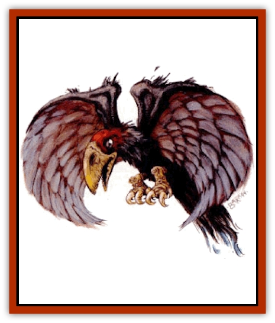

# Kes'trekel

| Statistic | **Kes'trekel** |
| --- | --- |
| **Activity Cycle:** | Day |
| **Alignment:** | Neutral |
| **Armor Class:** | 6 |
| **Climate/Terrain:** | Any (especially harsher regions) |
| **Damage/Attack:** | 1d4+1 |
| **Diet:** | Carnivore |
| **Frequency:** | Uncommon |
| **Hit Dice:** | 1+2 |
| **Intelligence:** | Animal (1) |
| **Magic Resistance:** | Nil |
| **Morale:** | Unsteady (5-7) |
| **Movement:** | 1, Fl 24 (C) |
| **No. Appearing:** | 3-30 (3d10) |
| **No. of Attacks:** | 1 |
| **Organization:** | Flock |
| **Size:** | S (1' tall) |
| **Special Attacks:** | Flock attack |
| **Special Defenses:** | Nil |
| **THAC0:** | 19 |
| **Treasure:** | Nil |
| **XP Value:** | 35 |

The scourge of the Tablelands, kes'trekel are vile [[Bird|avian creatures]] that feast upon desert carrion. Although they are weak and cowardly in small groups, kes'trekel can become a devastating force in larger numbers.

Kes'trekel are fairly scrawny in appearance, with black plumage graying from the constant exposure. The only spot of appreciable color is found on the head, where the vivid crimson stands out like the blood it resembles. Standing barely a foot tall on short, taloned feet, kes'trekel are extremely vulnerable on the ground. In the air however, their 3-foot wing span is more than enough to carry it aloft.

Kes'trekel communicate among themselves through calls and guttural squawks. They make no attempt to learn other languages.

**Combat:** Alone, kes'trekel are more nuisance than threat. Their claws, made more for rending already rotting flesh than fresh meat, cause 2-5 points of damage. Opponents who are moving tend to scare them off.

In groups kes'trekel are more fearsome. For every two kes'trekel present more than five, they gain a +1 to their Morale. Multiple kes'trekel are able to swarm about their targets like insects, making deadly strafing attacks. Instead of an attack roll for each individual kes'trekel, make a single attack roll and a single damage roll for the group. Every two kes'trekel present more than five confer an additional +1 to the attack and damage rolls. For example, a character attacked by a flock of 25 kes'trekel would be hit at +10 and receive 12-15 points (1d4+11) of damage and each kes'trekel would fail a Morale check only if a 13-15 is rolled.

In groups of 20 or more, the kes'trekels' minuscule brains can link together to produce the telepathic psionic effect of aversion. The flock maintains this power as a group, having a combined PSP total equal to the number present, with a power score of 10. For every kes'trekel in the group more than 20, the power score increases by one point.

A kes'trekel is extremely territorial, using its aversion power to scare trespassers from its nest areas. Also, each kes'trekel receives a +4 to its Morale check when defending its home.

**Habitat/Society:** Kes'trekel congregate in flocks, adopting mates only long enough to reproduce. A female lays 3-6 eggs each year. She stays with the nest for one month until the eggs hatch and two more months while the young mature.

Kes'trekel flocks are not migratory, preferring to inhabit their particular region for centuries if the elements allow. The nests they build in the available crags and trees are temporary, used but once per set of offspring.

When defending their home regions, kes'trekel cooperate as a flock, raining a veritable torrent of pecks and scratches upon any who dare invade.

**Ecology:** Wild kes'trekel are impossible to domesticate. Those hatched from stolen eggs make excellent watch birds. In such cases, the kes'trekels' cowardly nature loses out to their defensive nature. Many merchants rely on the squawked warnings of their avian sentinels. In Nibenay, kes'trekel eggs are considered a delicacy, provided the eggs are procured and eaten within two weeks of being laid. As expected, such versatility makes kes'trekel eggs an expensive commodity.

Kes'trekel detect prey with a dual combination of senses. The stench of death carries far across the blistering desert winds. Kes'trekel olfactory glands are more than adequate to pick up the scent. Once airborne, they depend on keen eyesight to locate their decaying meals. Some barbaric customs in the Ringing Mountains involve eating the eyes of recently dead kes'trekel to imbue the consumer with better vision. Such rituals are ineffective, but sometimes myth and tradition are stronger than logic.

Feral kes'trekel have a life span of approximately 15 years. Domestic kes'trekel sometimes live as long as 25 years.

---
## Discovery & Documentation

**Source Publication:** Dark Sun Appendix II - Terrors Beyond Tyr (1991)
**Campaign Setting:** Dark Sun
**Author(s):** Jim Atkiss, Steve Brown, Timothy B. Brown, Andrew P. Morris, Bruce Nesmith, Wes Nicholson, Bill Slavicsek

### Other Creatures Found in This Source Book
   * [[Aarakocra_Athas|Aarakocra (Athas)]]
   * [[Animal_Domestic_Athas_II|Animal, Domestic (Athas) II]]
   * [[Aviarag|Aviarag]]
   * [[Baazrag|Baazrag]]
   * [[Baazrag_Boneclaw|Baazrag, Boneclaw]]
   * [[Bloodgrass|Bloodgrass]]
   * [[Cactus_Hunting|Cactus, Hunting]]
   * [[Cactus_Rock|Cactus, Rock]]
   * [[Cilops|Cilops]]
   * [[Crodlu|Crodlu]]
   * [[Dagorran|Dagorran]]
   * [[Dhaot|Dhaot]]
   * [[Drake_Lesser_Athas_General_Information|Drake, Lesser (Athas), General Information]]
   * [[Drake_Lesser_Athas_Magma|Drake, Lesser (Athas), Magma]]
   * [[Drake_Lesser_Athas_Rain|Drake, Lesser (Athas), Rain]]
   * [[Drake_Lesser_Athas_Silt|Drake, Lesser (Athas), Silt]]
   * [[Drake_Lesser_Athas_Sun|Drake, Lesser (Athas), Sun]]
   * [[Dray|Dray]]
   * [[Drik|Drik]]
   * [[Dune_Reaper|Dune Reaper]]
   * [[Dwarf_Athas|Dwarf (Athas)]]
   * [[Elemental_Beast_Athas_Air|Elemental Beast (Athas), Air]]
   * [[Elemental_Beast_Athas_Earth|Elemental Beast (Athas), Earth]]
   * [[Elemental_Beast_Athas_Fire|Elemental Beast (Athas), Fire]]
   * [[Elemental_Beast_Athas_Water|Elemental Beast (Athas), Water]]
   * [[Elf_Athas|Elf (Athas)]]
   * [[Fael|Fael]]
   * [[Feylaar|Feylaar]]
   * [[Fordorran|Fordorran]]
   * [[Giant_Half-giant|Giant, Half-giant]]
   * [[Giant_Shadow|Giant, Shadow]]
   * [[Golem_Athas_Magma|Golem (Athas), Magma]]
   * [[Golem_Athas_Salt|Golem (Athas), Salt]]
   * [[Golem_Athas_General_Information|Golem (Athas), General Information]]
   * [[Gorak|Gorak]]
   * [[Halfling_Athas|Halfling (Athas)]]
   * [[Human_Athas|Human (Athas)]]
   * [[Jhakar|Jhakar]]
   * [[Kaisharga|Kaisharga]]
   * [[Klar|Klar]]
   * [[Krag|Krag]]
   * [[Kragling|Kragling]]
   * [[Lirr|Lirr]]
   * [[Mastyrial|Mastyrial]]
   * [[Meorty|Meorty]]
   * [[Mul|Mul]]
   * [[Nikaal|Nikaal]]
   * [[Paraelemental_Beast_General_Information|Paraelemental Beast, General Information]]
   * [[Paraelemental_Beast_Magma|Paraelemental Beast, Magma]]
   * [[Paraelemental_Beast_Rain|Paraelemental Beast, Rain]]
   * [[Paraelemental_Beast_Silt|Paraelemental Beast, Silt]]
   * [[Paraelemental_Beast_Sun|Paraelemental Beast, Sun]]
   * [[Pakubrazi|Pakubrazi]]
   * [[Psionocus|Psionocus]]
   * [[Psurlon|Psurlon]]
   * [[Raaig|Raaig]]
   * [[Retriever_Obsidian|Retriever, Obsidian]]
   * [[Ruktoi|Ruktoi]]
   * [[Ruvoka_Athas|Ruvoka (Athas)]]
   * [[Sand_Howler|Sand Howler]]
   * [[Scorpion_Athas|Scorpion (Athas)]]
   * [[Seed_Brain|Seed, Brain]]
   * [[Silt_Horror_Black|Silt Horror, Black]]
   * [[Silt_Horror_Magma|Silt Horror, Magma]]
   * [[Silt_Horror_Red|Silt Horror, Red]]
   * [[Silt_Spawn|Silt Spawn]]
   * [[Slig|Slig]]
   * [[Spider_Athas|Spider (Athas)]]
   * [[Spinewyrm|Spinewyrm]]
   * [[Ssurran|Ssurran]]
   * [[Stalking_Horror|Stalking Horror]]
   * [[Tarek|Tarek]]
   * [[Tari|Tari]]
   * [[Thri-kreen|Thri-kreen]]
   * [[T'liz|T'liz]]
   * [[Tohr-kreen_II|Tohr-kreen II]]
   * [[Tohr-kreen_III|Tohr-kreen III]]
   * [[Trin|Trin]]
   * [[Tul'k|Tul'k]]
   * [[Undead_Athas_General_Information|Undead (Athas), General Information]]
   * [[Wraith_Athas|Wraith (Athas)]]
   * [[Xerichou|Xerichou]]
   * [[Zombie_Thinking|Zombie, Thinking]]
