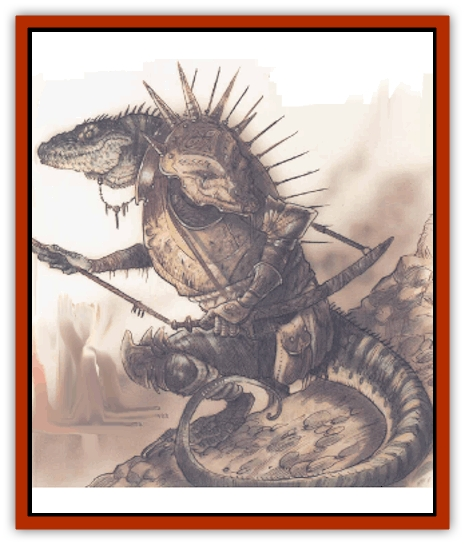

# Khaasta

| Statistic | **Khaasta** |
| --- | --- |
| **Activity Cycle:** | Any |
| **Alignment:** | Chaotic neutral (evil) |
| **Armor Class:** | 5 (2) |
| **Climate/Terrain:** | Any |
| **Damage/Attack:** | By weapon +1/1d6 |
| **Diet:** | Carnivore |
| **Frequency:** | Rare |
| **Hit Dice:** | 3+3 |
| **Intelligence:** | Very (11-12) |
| **Magic Resistance:** | Nil |
| **Morale:** | Steady (11-12) |
| **Movement:** | 9 |
| **No. Appearing:** | 6-24 |
| **No. of Attacks:** | 1 weapon and 1 bite |
| **Organization:** | Band |
| **Size:** | M (6-7' tall) |
| **Special Attacks:** | Nil |
| **Special Defenses:** | Nil |
| **THAC0:** | 17 |
| **Treasure:** | B, individual J,K,L |
| **XP Value:** | 175 |

The khasta are raiders, slavers, and smugglers who plague the Outlands and the chaotic planes. They're vicious, unreliable cutthroats and cross-traders who'll turn stag on a cutter as soon as look at him. Only two things really matter to a khaasta: prestige and wealth. Wealth is fairly easy to accumulate and display, but the khaasta code of prestige is a convoluted and twisted set or rules of conduct that rewards backstabbing, conniving, and deceit. To a khaasta, there's nothing so wonderful as peeling a powerful enemy and living to give him the laugh.

Khaasta bear a passing resemblance to [[Lizard_Man|lizardmen]] of the Prime Material Plane. They're humanoid in form, but their bodies are covered with tough, small scales, and they have long, powerful tails. A khaasta's face has a blunt, lizardlike snout and its head is crowned with a flaring crest. A khaasta's colorful scales create intricate, unique patterns that're never repeated from individual to individual. Unlike their more primitive relations, khaasta dress in bronzed plate armor and wield exotic weapons.

Khaasta typically travel in roving trader-bands, although the trade of any particular group can turn to extortion, kidnaping, or smuggling at a moment's notice. Since they have no innate planewalking abilities, khaasta are forced to walk the Great Road to get from plane to plane and must rely entirely on portals or conduits.

**Combat:** All khaasta, both male and female, consider themselves warriors and hold themselves ready for a fight at any time. Their tough scales provide a natural AC of 5, but khaasta typically wear bronze breastplates, greaves, and half-helms that improve their AC to 2. Khaasta are capable of delivering serious damage with their bites, and typically wield a large two-handed sword, halberd, or battle axe; their considerable Strength gives them a +1 to damage rolls. They can both bite and attack with a weapon in the same round.

Khaasta often use [[Lizard|giant lizards]] as mounts and prefer to fight mounted whenever possible. Fighting mounted gives the khaasta a +1 bonus to hit characters on foot and also provides them with the additional combat power of their mount.

Note that a khaasta cannot use its bite attack while fighting from a mount. Whether on foot or mounted, khaasta are excellent archers, and almost all khaasta can use composite long bows in addition to any other weapons they may have.

**Habitat/Society:** A khaasta's home is its band. Typically. a khaasta band wanders caravan-style across the planes, seeking opportunities for trade or pillage wherever it goes. There'll always be a number of giant lizards equal to half again the number of khsasta present as mounts and pack-beasts.

Khaasta bands are notoriously chaotic and disorganized. They believe in the rule of the strong, and there are constant challenges of authority and schemes for advancement among the khaasta. Long ago they learned to resolve these differences by ritualistic, nonlethal combat; in ancient times the race almost dueled itself to extinction.

While dealing with a khaasta band is a dicey thing. it doesn't always have to turn out badly. Khaasta can be excellent sources of information, muscle, or illicit goods, as long as a cutter can meet their price and demonstrate (forcibly) that he's too tough to challenge or turn stag on. See, the khaasta code demands that they just take from the weak instead of dealing with 'em, and if a khaasta perceives itself to be in a position of strength it'll try to take what it wants.

One last note: Never assume that a khaasta's going to do what it promised it would. Another part of the khaasta code is the challenge of the strong by any means available. Even if a khaasta doesn't think it can take a basher on today, it's likely to plan an ambush or stack the odds somehow in a fight tomorrow.

**Ecology:** Khaasta don't have many friends out on the planes, and in some of the places thes travel they'rw the low sods on the food chain. Consequently, they take any opportunity to live well today. There's nothing too good for a khaasta cockpot, including fellow travelers or the local natives if that's the easiest meal at hand.

Khaasta young are carefully guarded by their parents until they reach 7 to 10 years of age. In an average band, a group of young equal to half the number of adults can be found tending the pack lizards or acting as noncombative scouts and sentries. Usually, about half the adults remain to guard the caravan while the rest raid or deal with outsiders.

**Khaasta Chieftain**

  The leader of a khaasta band is usually a warrior of exceptional size, strength, and cunning. Typically, a khaasta chieftain has 4+4 to 6+6 Hit Dice, a THAC0 of 15, and a useful magical item or two to help it stay on top. Khaasta chieftains gain a +3 damage bonus with weapons due to their Strength.

**Khaasta Wise One**

  A band of 15 or more khaasta may have a wise one with them (50% chance). Wise ones are counselors and shamans to the khaasta chieftains, existing outside the code of challenge. Khaasta wise ones have the spell abilities of a 4th-level cleric and are defended by 2 to 4 khaasta warriors. Although the wise ones claim they are uninterested in the khaasta power struggles, it's not unusual to find bands where the wise one is pulling the strings of a chieftain it advises.

---
## Discovery & Documentation

**Source Publication:** Planescape II (1996)
**Campaign Setting:** Planescape
**Author(s):** Rich Baker, Karen S. Boomgarden

### Other Creatures Found in This Source Book
   * [[Aasimar|Aasimar]]
   * [[Abrian|Abrian]]
   * [[Arcane|Arcane]]
   * [[Balaena|Balaena]]
   * [[Beholder-kin_Observer|Beholder-kin, Observer]]
   * [[Bloodthorn|Bloodthorn]]
   * [[Bonespear|Bonespear]]
   * [[Darkweaver|Darkweaver]]
   * [[Demarax|Demarax]]
   * [[Dhour|Dhour]]
   * [[Eater_of_Knowledge|Eater of Knowledge]]
   * [[Eladrin_Greater_Firre|Eladrin, Greater, Firre]]
   * [[Eladrin_Greater_Ghaele|Eladrin, Greater, Ghaele]]
   * [[Eladrin_Greater_Tulani|Eladrin, Greater, Tulani]]
   * [[Eladrin_Lesser_Bralani|Eladrin, Lesser, Bralani]]
   * [[Eladrin_Lesser_Coure|Eladrin, Lesser, Coure]]
   * [[Eladrin_Lesser_Noviere|Eladrin, Lesser, Noviere]]
   * [[Eladrin_Lesser_Shiere|Eladrin, Lesser, Shiere]]
   * [[Fhorge|Fhorge]]
   * [[Ghostlight|Ghostlight]]
   * [[Guardinal_Avoral|Guardinal, Avoral]]
   * [[Guardinal_Cervidal|Guardinal, Cervidal]]
   * [[Guardinal_General_Information|Guardinal, General Information]]
   * [[Guardinal_Equinal|Guardinal, Equinal]]
   * [[Guardinal_Leonal|Guardinal, Leonal]]
   * [[Guardinal_Lupinal|Guardinal, Lupinal]]
   * [[Guardinal_Ursinal|Guardinal, Ursinal]]
   * [[Hollyphant|Hollyphant]]
   * [[Incantifer|Incantifer]]
   * [[Ironmaw|Ironmaw]]
   * [[Keeper|Keeper]]
   * [[Leomarh|Leomarh]]
   * [[Monster_of_Legend|Monster of Legend]]
   * [[Mortai|Mortai]]
   * [[Noctral|Noctral]]
   * [[Quill|Quill]]
   * [[Razorvine|Razorvine]]
   * [[Reave|Reave]]
   * [[Retriever|Retriever]]
   * [[Rilmani_Abiorach|Rilmani, Abiorach]]
   * [[Rilmani_General_Information|Rilmani, General Information]]
   * [[Rilmani_Argenach|Rilmani, Argenach]]
   * [[Rilmani_Aurumach|Rilmani, Aurumach]]
   * [[Rilmani_Cuprilach|Rilmani, Cuprilach]]
   * [[Rilmani_Ferrumach|Rilmani, Ferrumach]]
   * [[Rilmani_Plumach|Rilmani, Plumach]]
   * [[Shadowdrake|Shadowdrake]]
   * [[Spellhaunt|Spellhaunt]]
   * [[Spider_Hook|Spider, Hook]]
   * [[Sunfly|Sunfly]]
   * [[Sword_Spirit|Sword Spirit]]
   * [[Tanar'ri_Lesser_Bulezau|Tanar'ri, Lesser, Bulezau]]
   * [[Tanar'ri_Lesser_Maurezhi|Tanar'ri, Lesser, Maurezhi]]
   * [[Tanar'ri_Lesser_Yochlol|Tanar'ri, Lesser, Yochlol]]
   * [[Tanar'ri_General_Information|Tanar'ri, General Information]]
   * [[Tanar'ri_True_Alkilith|Tanar'ri, True, Alkilith]]
   * [[Terlen|Terlen]]
   * [[Tso|Tso]]
   * [[T'uen-rin|T'uen-rin]]
   * [[Vaporighu|Vaporighu]]
   * [[Vorr|Vorr]]
   * [[Wastrel|Wastrel]]
   * [[Wraithworm|Wraithworm]]
   * [[Yugoloth_Lesser_Canoloth|Yugoloth, Lesser, Canoloth]]
   * [[Zoveri|Zoveri]]
