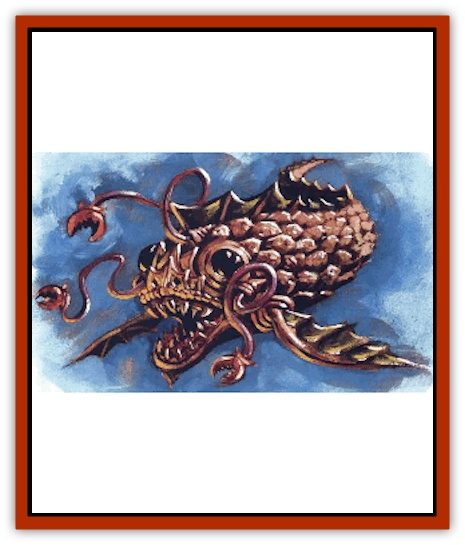

# Khargra

| Statistic | **Khargra** |
| --- | --- |
| **Activity Cycle:** | Any |
| **Alignment:** | Neutral |
| **Armor Class:** | -3 |
| **Climate/Terrain:** | Elemental Plane of Earth (Any underground on PMP) |
| **Damage/Attack:** | Nil (arms), 3d6 (bite) |
| **Diet:** | Minerals |
| **Frequency:** | Common (Extremely rare on PMP) |
| **Hit Dice:** | 6 |
| **Intelligence:** | Semi- (2-4) |
| **Magic Resistance:** | Nil |
| **Morale:** | Elite (13-14) |
| **Movement:** | 15 (3 out of element) |
| **No. Appearing:** | 1d8 (1d6 on PMP) |
| **No. of Attacks:** | 3 |
| **Organization:** | School (Herd on PMP) |
| **Size:** | S (3½' long) |
| **Special Attacks:** | Surprise |
| **Special Defenses:** | Immune to heat and cold |
| **THAC0:** | 9 |
| **Treasure:** | See below |
| **XP Value:** | 1,400 |

Khargra swim through the earth, riding geological movements like a fish swims through the water by riding the currents. Some berks even call khargra "earth fish", but the name's really not any more accurate that calling birds "air fish".

Mature khargra reach a length of about 3-4 feet, their bodies roughly conical in shape and narrower toward the rear. Positioned around the front are two eyes and three tiny sheaths that hold the khargra's thin arms. These arms can extend up to 3 feet from the pocketlike sleeves.

The khargra's 1-foot-wide mouth is filled with tiny curved metallic teeth that open like an iris. This constantly working maw draws in earth, absorbing required elements and expelling the rest, propelling the creature further ahead. Canny bashers can thus always tell where a khargra's passed, for threads of softer, churned each wind through the solid rock. Most folks can't spot such subtleties unless their eye's been trained to catch them.

**Combat:** As the khargra passes through stone and earth, it maintains a phased state not wholly the same as most matter. Unless a basher can somehow perceive a khargra's approach through the solid rock, victims attacked by one of the creatures suffer a -5 penalty to their surprise rolls. A khargra attacks only those who possess refined metals or large amounts of valuable ores. Normally, such victims are found in air-tilled bubbles or tunnels that infrequently occur on the plane. In these cases, the khargra leaps out of the stone (up to 10 feet) to attack.

All three arms or the khargra strike at a victim, each as a 12-Hit Dice monster. The arms themselves inflict no damage, but at least one must strike the target before the khargra can use its bite attack. Once it grasps an opponent, the creature uses its suprising strength to drag the victim toward its always-gaping maw. The victim may make a bend bars/lift gates roll to attempt to escape the creature's grip. If the sod fails the roll, he is bitten in the same round in which he is grabbed.

The khargra's horrible irising mouth, designed to crush stone, inflicts appalling damage upon flesh (3d6 points). On an attack roll of 16 or better, the khargra also destroys a metal weapon or piece of equipment in the possession of the poor sod it's attacking - even if the weapon is being used against it. (Only magical items are granted a saving throw versus this attack.) Some planewalkers have reported seeing a khargra bite a man in full plate armor completely in half by tearing into the sod's midsection.

Due to its speed, stony skin, and semi-intangible nature, the creature is difficult to harm. It's not a matter of magical protection; unlike many planar beasts, the khargra is an entirely natural creature (well, natural for the plane of Earth, anyway). Thus, a basher doesn't need enchanted weapons to fight a khargra - fact is, a canny cutter'll hide his magical metal weapons for fear of having them chewed up in the attack. Heat and cold to any degree don't bother the khargra. Chant has it that some have even been found swimming through the paraplane of Magma.

Travelers to the Inner Planes and those who've met khargra on the Prime have discovered a few of the beasts' weaknesses. A *phase door* spell cast upon a khargra as it passes from an air-filled environment back into its native stone slays the creature. Likewise, a *stone to flesh* or *transmute metal to wood* spell sends the beast directly to the dead-book. *Heat metal* always inflicts maximum damage despite the creature's immunity to fire, and *move earth* stuns it for 1d3 rounds. Lightning inflicts full damage.

Khargra eyes can "see" through earth and stone as a normal creature might see through open air. Some think the beast is blind outside of its element, but no one's ever actually proved this.

**Habitat/Society:** Common throughout the plane of Earth (rare on Mineral, extraordinarily rare anywhere else), khargra pass blissfully through the element, usually ignoring all other creatures. They travel in small schools, although occasionally a particular individual separates from its fellows for a time.

The kargra life cycle seems to consist of three steps: hatching from an egg, growing to maturity on the plane of Earth (and spawning there), and finally travelling to the quasiplane of Mineral, which they seem to regard as some sort of final reward (Even in the Inner Planes, the Rule of Threes holds sway.) No one knows what eventually becomes of the khargra that eventually meet this goal, for though khargra are occasionally found on Mineral, there aren't enough to account for the cast numbers that pass into that plane.

Some say that the creatures' bodies become the minerals found on the plane in a sort or cosmic cycle that's slowly transferring all high-grade ores from Earth to Mineral. 'Course, some say they become bloated gluttons that quickly die from overeating.

A basher might hear a bit of chant claiming that khargra are larval forms of [[Xorn|xorn]] and [[Xorn|xaren]], transforming into these mature forms on the plane of Mineral and then making their way back to the plane of Earth. While xorn and xaren are similar to khargra in nature and diet, and while they're all sometimes encountered near one another on either plane, the theory seems to rely on a significant leap in logic that is - at least with the information possessed currently - unwarranted.

**Ecology:** Khargra feed on high-grade ores. If presented with the opportunity, however, they might attack travellers with refined metallic objects in their possession. These, apparently, are delcacies to the beasts. If a group of planewalkers offers such items willingly, the khargra won't attack - they have no care for flesh.

A dead khargra always has 1d6x100 gp worth of tiny bits of valuable minerals inside its gullet.

---
## Discovery & Documentation

**Source Publication:** MC14 Fiend Folio Appendix (1992)
**Campaign Setting:** Fiends Folio
**Author(s):** Don Bingle, John Terra, Wes Nicholson, Tim Beach, Steve Hardinger, Kris Hardinger, Rob Nicholls, Greg Swedberg, Al Boyce, Vince Garcia, Norm Ritchie

### Other Creatures Found in This Source Book
   * [[Aballin|Aballin]]
   * [[Achaierai|Achaierai]]
   * [[Adherer|Adherer]]
   * [[Algoid|Algoid]]
   * [[Al-Mi'raj|Al-Mi'raj]]
   * [[Apparition|Apparition]]
   * [[Caterwaul|Caterwaul]]
   * [[Coffer_Corpse|Coffer Corpse]]
   * [[Crabman|Crabman]]
   * [[Dark_Creeper|Dark Creeper]]
   * [[Dark_Stalker|Dark Stalker]]
   * [[Darter|Darter]]
   * [[Denzelian|Denzelian]]
   * [[Dune_Stalker|Dune Stalker]]
   * [[Dwarf_Urdunnir|Dwarf, Urdunnir]]
   * [[Falcon_Fire|Falcon, Fire]]
   * [[Faux_Faerie|Faux Faerie]]
   * [[Flawder|Flawder]]
   * [[Fyrefly|Fyrefly]]
   * [[Gambado|Gambado]]
   * [[Garbug|Garbug]]
   * [[Giant_Fhoimorien|Giant, Fhoimorien]]
   * [[Gibberling|Gibberling]]
   * [[Gorbel|Gorbel]]
   * [[Grimlock|Grimlock]]
   * [[Hellcat|Hellcat]]
   * [[Ice_Lizard|Ice Lizard]]
   * [[Iron_Cobra|Iron Cobra]]
   * [[Mantari|Mantari]]
   * [[Penanggalan|Penanggalan]]
   * [[Pernicon|Pernicon]]
   * [[Phantom_Stalker|Phantom Stalker]]
   * [[Retriever|Retriever]]
   * [[Ruve|Ruve]]
   * [[Scathe|Scathe]]
   * [[Sheet_Ghoul_Sheet_Phantom|Sheet Ghoul/Sheet Phantom]]
   * [[Shocker|Shocker]]
   * [[Spanner|Spanner]]
   * [[Stwinger|Stwinger]]
   * [[Sussurus|Sussurus]]
   * [[Symbiotic_Jelly|Symbiotic Jelly]]
   * [[Terithran|Terithran]]
   * [[Thunder_Children|Thunder Children]]
   * [[Troll_Ice|Troll, Ice]]
   * [[Tween|Tween]]
   * [[Umpleby|Umpleby]]
   * [[Volt|Volt]]
   * [[Xill|Xill]]
   * [[Xvart|Xvart]]
   * [[Zygraat|Zygraat]]
