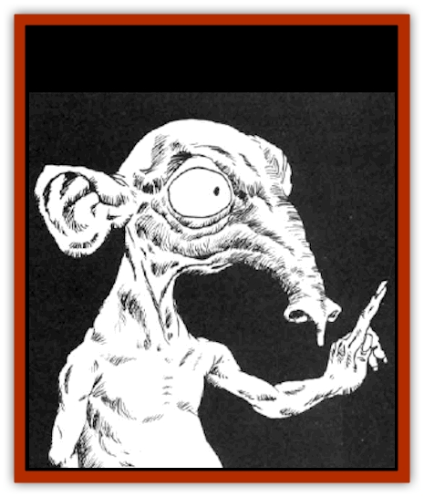

# Killmoulis

| Statistic | **Killmoulis** |
| --- | --- |
| **Activity Cycle:** | Nocturnal |
| **Alignment:** | Neutral (chaotic good) |
| **Armor Class:** | 6 |
| **Climate/Terrain:** | Human areas |
| **Damage/Attack:** | Nil |
| **Diet:** | Omnivore, scavenger |
| **Frequency:** | Uncommon |
| **Hit Dice:** | ½ |
| **Intelligence:** | Average (8-10) |
| **Magic Resistance:** | 20% |
| **Morale:** | Average (8-10) |
| **Movement:** | 15 |
| **No. Appearing:** | 1-3 |
| **No. of Attacks:** | Nil |
| **Organization:** | Solitary |
| **Size:** | Tiny (under 1' tall) |
| **Special Attacks:** | See below |
| **Special Defenses:** | See below |
| **THAC0:** | 20 |
| **Treasure:** | K |
| **XP Value:** | 35 |

Killmoulis are diminutive beings who like to provide useful services but also commit mischief.

A killmoulis is under one foot in height. Although the overall shape is that of a thin humanoid, the head is immense in proportion. Killmoulis have no mouths or chins. They inhale food through their prodigious noses. Killmoulis do not speak but are apperently telepathic. They appear to be sexless.

**Combat:** Killmoulis are basically inoffensive beings. They lack any real ability to attack humans or demihumans. They may use needles to stab [[Rat|rats]]; such attacks cause 1 point of damage.

Killmoulis are very fast and are able to blend into their surroundings. They are only 10% detectable.

**Habitat/Society:** Killmoulis always dwell in places where humans or demihumans are involved in some form of industry, preferably in places where foodstuffs are handled. They make their homes under the floors, within the walls, or atop the dark rafters. They come out only when the workers are gone. Like their distan relatives the [[Brownie|brownies]], the killmoulis are torn between the benevolent perfomrance of useful duties and an mischievous streak to perform harmless tricks. Killmoulis are tireless workers adept at performing simple tasks.

They are always hungry and can devour prodigious amounts of grain, meal, flour, or whatever food is in the area. Their mischief tends to reflect the relationshop with their unwitting landlord. If they are left alone, the tricks tend to be irksome but not unduly destructive. If the landlord tries to capture or harm the killmoulis, such tricks can be destructive, although not overly fatal.

Killmoulis hate [[Dog|dogs]], [[Cat_Small|cats]], and rats, as these animals attack killmoulis. Rats are snared nd stabbed with long needles. Cats and dogs are poisoned if the animals prove a threat to the killmoulis. If the killmoulis are unable to deal with the danger of an area, they pack up and leave for safer buildings.

Killmoulis are extremely shy. Although they like living and working alongside humans and demihumans, the are unable to directly face the "giants". If detected, killmoulis flee in mindless panic. If caught, they may die of fright. Still, despite their reclusive nature, killmoulis can be befriended. They appreciate gifts such as warm food and garments their size. They like to watch their benefactors from hiding. They may even send barely noticeable telepathic messages of thanks and friendliness; the reipients generally perceive these as "warm feelings".

Telepathic or shapechanging humanoids may be able to directly communicate or approach killmoulis. Killmoulis personalities and interests are similar to those of the tradesmen and farmers whose buildings they share. Killmoulis tales are dominated by stories of past friends and enemies, local gossip, and the proper methods of performing tasks. The killmoulis are habitual gossips. If a killmoulis will talk with a person, that person can gain access to an unparalleled spy network, although such information may be heavily slanted toward labor or domestic matters.

The sex of a killmoulis is difficult to judge due to the lack of external characteristics. There are no recorded encounters with immature killmoulis. It is believed that killmoulis reproduce in the same manner as other faerie humanoids such as brownies. Apparently the infants do not nurse (due to the lack of mouths or mammaries) but are born with the ability to inhale food. The actual life expectancy of a killmoulis us unknown (the killmoulis themselves don't keep records of such things) but it may be centuries.

Killmoulis keep small amounts of treasure. These are usually items they have found or scavenged along the way. Although they may steal from hostile "giants", they are happy to share their meager wealth with their friends.

**Ecology:** Killmoulis are a race that has adapted to a symbiotic lifestyle. Wise humans and demihumans welcome these secretive assistants: despite the killmoulis appetites, their word tends to be more valuable than the food they consume. Killmoulis also act as guardians and watchmen against mutual threats, such as vermin and fire.

---
## Discovery & Documentation

**Source Publication:** MC2 Volume II (1993)
**Campaign Setting:** Advanced Dungeons & Dragons 2nd Edition
**Author(s):** Jay Batista, Scott Bennie, Grant Boucher, William W. Connors, Steve Gilbert, Heike Kubasch, James Lowder, David Edward Martin, Bruce Nesmith, Jean Rabe, Rick Swan, John J. Terra, Gary L. Thomas

### Other Creatures Found in This Source Book
   * [[Ant|Ant]]
   * [[Ant_Lion_Giant|Ant Lion, Giant]]
   * [[Ape_Carnivorous|Ape, Carnivorous]]
   * [[Baboon|Baboon]]
   * [[Badger|Badger]]
   * [[Barracuda|Barracuda]]
   * [[Beetle_Giant|Beetle, Giant]]
   * [[Bulette|Bulette]]
   * [[Bullywug|Bullywug]]
   * [[Dwarf_Duergar|Dwarf, Duergar]]
   * [[Dwarf_Gully|Dwarf, Gully]]
   * [[Eagle|Eagle]]
   * [[Eel|Eel]]
   * [[Elemental_Air_Kin|Elemental, Air Kin]]
   * [[Elemental_Water_Kin|Elemental, Water Kin]]
   * [[Elemental_Water_Kin_Water_Weird|Elemental, Water Kin, Water Weird]]
   * [[Firestar|Firestar]]
   * [[Firetail|Firetail]]
   * [[Fish_Giant|Fish, Giant]]
   * [[Frog|Frog]]
   * [[Gorgon|Gorgon]]
   * [[Hawk|Hawk]]
   * [[Heucuva|Heucuva]]
   * [[Hippocampus|Hippocampus]]
   * [[Hippogriff|Hippogriff]]
   * [[Kelpie|Kelpie]]
   * [[Kenku|Kenku]]
   * [[Kuo-Toa|Kuo-Toa]]
   * [[Lamia|Lamia]]
   * [[Lammasu|Lammasu]]
   * [[Lamprey|Lamprey]]
   * [[Leech|Leech]]
   * [[Leprechaun|Leprechaun]]
   * [[Leucrotta|Leucrotta]]
   * [[Locathah|Locathah]]
   * [[Lycanthrope_Wereboar|Lycanthrope, Wereboar]]
   * [[Lycanthrope_Werefox|Lycanthrope, Werefox]]
   * [[Mammal_Minimal|Mammal, Minimal]]
   * [[Mammal_Small|Mammal, Small]]
   * [[Mimic|Mimic]]
   * [[Morkoth|Morkoth]]
   * [[Muckdweller|Muckdweller]]
   * [[Myconid|Myconid]]
   * [[Naga|Naga]]
   * [[Obliviax|Obliviax]]
   * [[Octopus_Giant|Octopus, Giant]]
   * [[Otyugh|Otyugh]]
   * [[Piranha|Piranha]]
   * [[Plant_Dangerous_I|Plant, Dangerous I]]
   * [[Plant_Intelligent|Plant, Intelligent]]
   * [[Poltergeist|Poltergeist]]
   * [[Porcupine|Porcupine]]
   * [[Rat_Osquip|Rat, Osquip]]
   * [[Roc|Roc]]
   * [[Roper|Roper]]
   * [[Rot_Grub|Rot Grub]]
   * [[Rust_Monster|Rust Monster]]
   * [[Sahuagin|Sahuagin]]
   * [[Sea_Lion|Sea Lion]]
   * [[Sea_Horse_Giant|Sea Horse, Giant]]
   * [[Shambling_Mound|Shambling Mound]]
   * [[Shark|Shark]]
   * [[Sphinx|Sphinx]]
   * [[Squid_Giant|Squid, Giant]]
   * [[Stirge|Stirge]]
   * [[Swanmay|Swanmay]]
   * [[Tarrasque|Tarrasque]]
   * [[Tasloi|Tasloi]]
   * [[Triton|Triton]]
   * [[Troglodyte|Troglodyte]]
   * [[Urchin|Urchin]]
   * [[Urd|Urd]]
   * [[Weasel|Weasel]]
   * [[Wolverine|Wolverine]]
   * [[Yellow_Musk_Creeper|Yellow Musk Creeper]]
