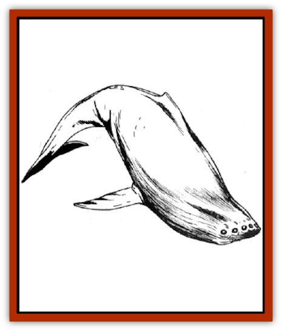

# Kindori

| Statistic | **Kindori** |
| --- | --- |
| **Activity Cycle:** | Any |
| **Alignment:** | Lawful neutral |
| **Armor Class:** | 5 |
| **Climate/Terrain:** | Any space |
| **Damage/Attack:** | 3-30 |
| **Diet:** | Light |
| **Frequency:** | Uncommon |
| **Hit Dice:** | 20 |
| **Intelligence:** | Low (6) |
| **Magic Resistance:** | 5% |
| **Morale:** | Elite (13) |
| **Movement:** | 18 |
| **No. Appearing:** | 2-8 |
| **No. of Attacks:** | 1 (tail) |
| **Organization:** | Pod |
| **Size:** | G (80') |
| **Special Attacks:** | Blinding |
| **Special Defenses:** | Nil |
| **THAC0:** | 3 |
| **Treasure:** | Nil |
| **XP Value:** | 11,000 |

Kindori are called *space whales*, and they are among the largest living creatures found in space. They resemble aquatic [[Whale|whales]] in general shape and are mammals as well. However, they lack any noticeable mouth, and the leading edge of their fishlike bodies is dotted with small eyes.

**Combat:** The kindori tend to be peaceful except when threatened. In normal conditions, this usually means a direct attack, but during herding periods (see below), any individual approaching the herd is seen as a danger.

The kindori's main physical weapon is its massive tail flukes, which it uses to batter its opponents. While kindori recognize the presence of humans, [[Beholder_and_Beholder-kin_I|beholders]], and other small creatures, they direct such attacks first and foremost against the ships that are a1most their size. The kindori work together to batter a single attacker to bits, then go to the next one. until all assailants are defeated.

The leading eyes of the kindori can emit a concentrated blast of light. This light is projected as a cone in the direction of the kindori's choice, with a 500-yard range and a base of 400 yards. All those within the cone must save vs. breath weapon or be blinded for 4-16 rounds. The kindori will use this form of attack against individuals they cannot beat, using the confusion it creates to escape.

**Habitat/Society:** The kindori travel in small groups, called pods, of 2-8 members. For large (7-8 member) pods, there will be a bull of maximum hit points present. This bull will be the forward line of defense if the pod is attacked.

Every so often (roughly annually, depending on the sphere), several pods will gather together into a larger herd of 3-30 members. There will be 3-6 bulls present in such a herd, and during this time, any ships that pass near the herds will be attacked. During herding the male kindori are particularly violent, engaging in tail-slapping contests with other young males (and often with ships that come too close). These tail-slappings create a pecking order within the herd, which in turn determines the mating rights of the various members. The oldest bulls always have first rights among the females, followed by the more powerful young.

The kindori young gestate for six months and are born live in space. A herd will be extremely protective during this time, since the young are prey to [[Scavver|scavvers]] and other attackers.

With these exceptions, kindori are generally peaceful and have been domesticated by a number of spaceborne barbarians. Such groups either travel short distances, such as within an asteroid belt, cluster, or ring; or are far-ranging space nomads making long voyages. The kindori is large enough to maintain its own gravity plane and air envelope, and has no need for air of its own.

The size of the kindori is such that mosses, molds, and other parasites nest on their large backs, which in turn brings other predators to clean them off. A kindori might (20% chance) have 3-18 gray or brown scavvers working over the growing population on their sides.

Some kindori that have been domesticated (see below) later go feral as their masters die or let them loose. These kindori sometimes have the ruins of old buildings (generally called howdahs) on their backs, along with more terrestrial plant and animal life. Such structures and life survive only on the back and sides of the kindori.

**Ecology:** A kindori does not eat as do most other creatures of space. It instead soaks in the rays of the sun, stars, and other shining bodies in its area of space. The "belly" of the kindori is dotted with tiny white patches, each of which sends energy deep within the creature, to be stored within its large mass.

Keeping this belly clean of parasites is a common act of herd be havior, as the great creatures rub each other to flake off old skin and parasites. They are less concerned with their backs, which is why small islands of life often spring up there.

An extremely old or sick kindori can be spotted by the overgrowth of vine and vegetation on it. Such creatures are near death, and often fall prey to the larger scavvers and other creatures.

Even in death kindori are powerful creatures, as their skeletons do not break up when parasites destroy their flesh. Undead creatures such as [[Lich|liches]] and [[Vampire_General_Information|vampires]] often use skeletal kindori as their ships for slow, leisurely invasions of new lands (the undead have forever). Such dead kindori have 15 hull points, plus whatever modifications (weapons, etc) are made to them.

There have been stories of hitching a spelljamming helm to a kindori. It is generally agreed that the action of moving at spelljamming speeds spooks them, and even domesticated kindori will head off for parts unknown, seeking to scrape the irritating helm from their flesh. Some skeletal kindori have been fitted with such helms by undead marauders and used as warships.

The kindori have many natural enemies, including the [[Krajen|krajen]], the [[Dragon_Radiant|radiant dragons]], and the various humaniform races. Beholders and [[Mind_Flayer|mind flayers]], sensitive to the creature's light-emitting eyes, have a particular dislike of them. The former will avoid kindori whenever possible, while the latter will engage in wholesale slaughter of them, massing armadas to take out whole pods that lie too close to their outposts.

The flesh of the kindori can be rendered into oil, much like the aquatic whale, and it is this kindori flesh that is the source of most greek fire for various races. The [[Lizard_Man|lizard men]], who use greek fire regularly, often put together whaling parties to hunt kindori, and are working on a mobile base, towed in pieces by multiple wasp-class ships, that can render the flesh of the creature in the field.

**Domesticated Kindori**

  Savage races in space will often use the kindori for short-range travel, usually in the period before they gain enough savvy and trading goods to deal with the [[Arcane|arcane]] on a regular basis. The "savage races" vary from empires ruled by philosopher kings, to degenerate standard races, to savage marauders who will attack everything in sight.

The kindori can be domesticated, but the savage races will operate in them in pod or herd groups, and will not split the kindori family groups. Only old solitary bulls will be found on their own, and then usually on exploration duty.

The savage races (which can be human, dwarf, elf, gnome, or even halfling) do not cut into the flesh of the kindori, but rather secure buildings, weapon platforms, and the like with short hooks that lightly snag the thick hide of the beast. The savage races will often maintain farms and herd terrestrial beasts on the backs of such creatures, since the kindori have no need of the atmosphere around them.

A typical kindori/savage race group will number some 2-8 kindori, each with a crew of 10-20 warriors. Dress and weapons vary from place to place, from bone spears to bronze armor and short swords. There will be at most one light catapult per kindori, save for the bulls, which can carry heavy catapults. The crew arrangements will be an extension of the savage's native group, with a captain or shaman or chieftain leading the herd.

The savages will trade with spaceborne races (if they are peaceful), but do not like or trust spelljammer helms, which make their mounts mad.

---
## Discovery & Documentation

**Source Publication:** AD&D Adventures In Space (1989)
**Campaign Setting:** Spelljammer
**Author(s):** Jeff Grub

### Other Creatures Found in This Source Book
   * [[Arcane|Arcane]]
   * [[Beholder_and_Beholder-kin_I|Beholder and Beholder-kin I]]
   * [[Beholder_and_Beholder-kin_II|Beholder and Beholder-kin II]]
   * [[Dracon|Dracon]]
   * [[Dragon_Radiant|Dragon, Radiant]]
   * [[Elmarin|Elmarin]]
   * [[Ephemeral|Ephemeral]]
   * [[Giff|Giff]]
   * [[Krajen|Krajen]]
   * [[Neogi|Neogi]]
   * [[Scavver|Scavver]]
