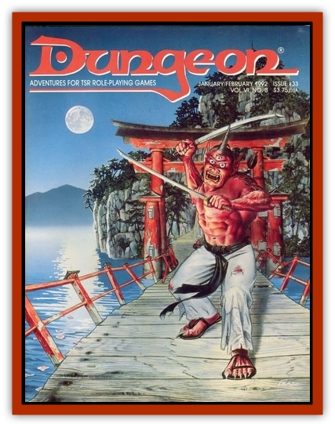

# Kitsune Kasumi

| Statistic | **Kitsune Kasumi** |
| --- | --- |
| **Activity Cycle:** | Night |
| **Alignment:** | Neutral (variable) |
| **Armor Class:** | 6 |
| **Climate/Terrain:** | Any/Forest |
| **Damage/Attack:** | 3-6 (&times;2) |
| **Diet:** | None |
| **Frequency:** | Very rare |
| **Hit Dice:** | 2 |
| **Intelligence:** | Average to very (9-11) |
| **Magic Resistance:** | 20% |
| **Morale:** | Elite (13) |
| **Movement:** | 18 |
| **No. Appearing:** | 2-24 |
| **No. of Attacks:** | 2 |
| **Organization:** | Group |
| **Size:** | S (3' long) |
| **Special Attacks:** | +3 to reaction rolls |
| **Special Defenses:** | See below |
| **THAC0:** | 19 |
| **Treasure:** | Nil |
| **XP Value:** | 190 |

The kitsune kasumi, or "mist foxes" are minor nature spirits associated with misty places. They are beautiful, pure-white [[Mammal_Small|foxes]] with slim and delicate bodies. They usually congregate at night around dead trees in remote groves and abandoned fields, hiding among the trunks and logs in gaseous form during the day. They are highly territorial and will attack any intruders at night. If their grove of trees is destroyed, they will likewise be destroyed, leaving only a faint wisp of mist.

Similar to the hoarfox, they are often spotted at a distance by the pale blue foxfire that they continually breathe. This magical flame adds + 2 to the damage (1-4 hp) caused by the kitsune kasumi's bite attack. They are perfectly silent, even when fighting, and their speed and agility give them a +3 to any reaction rolls and allow them to use their bite attack twice a round. Kitsune kasumi may assume gaseous form at will, making them nearly invisible in the mist except for their foxfires. During combat, there is a 20% chance each round that they will shift to this form instead of making any attacks for that round. Attackers will not know this change has occurred until after the fox spirits have attacked, since their gaseous forms are nearly identical in appearance to their normal ones.

---
## Discovery & Documentation

**Source Publication:** Dungeon #33 (1992)
**Campaign Setting:** Dungeon Magazine
**Author(s):**
