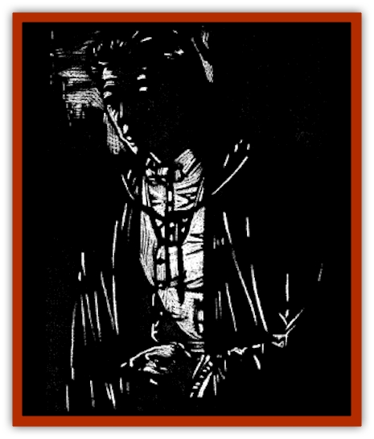

# Kizoku

| Statistic | **Kizoku** |
| --- | --- |
| **Activity Cycle:** | Any |
| **Alignment:** | Lawful evil |
| **Armor Class:** | 0 |
| **Climate/Terrain:** | Rokushima T�iyoo |
| **Damage/Attack:** | 1d10 |
| **Diet:** | Life energy |
| **Frequency:** | Very rare |
| **Hit Dice:** | 10 |
| **Intelligence:** | Exceptional (15-16) |
| **Magic Resistance:** | 20% |
| **Morale:** | Fanatic (17-18) |
| **Movement:** | 12, Fl 18 (C) |
| **No. Appearing:** | 1 |
| **No. of Attacks:** | 1 |
| **Organization:** | Solitary |
| **Size:** | M (6' tall) |
| **Special Attacks:** | Energy drain &amp; spell use |
| **Special Defenses:** | Reanimation |
| **THAC0:** | 11 |
| **Treasure:** | Z |
| **XP Value:** | 9,000 |

A kizoku is an oriental creature that assumes the form of an irresistibly handsome man. He courts beautiful women, leading them to betray and murder their lovers or husbands. This foul deed done, the fiend claims the woman's spirit and devours her life force.

Kizoku look like extremely muscular and handsome oriental men. Their hair is thick and luxurious, their demeanor noble, and their taste in clothing and personal adornment is impeccable. They always seem rich, confident, and trustworthy. Most kizoku appear to be powerful samurai or other warriors, though a few prefer to disguise themselves as wizards or priests. The only clue that might give away the identity of the kizoku is a small, inky black mole shaped like a crescent moon that is always located somewhere visible on his body (usually the face or hands).

When a kizoku consumes a woman's essence, he gains the ability to speak any languages she knew. Because of this, most of these creatures have a plethora of tongues at their disposal.

**Combat:** Although kizoku carry the traditional weapons of a samurai (or an ornate dagger or staff if they appear to be some other class), they prefer not to use these weapons in combat, avoiding melee combat all together if possible. If attacked themselves, they will attempt to flee before resorting to direct violence.

Whenever they must fight, they utilize spells designed to facilitate their escape from the situation or to *hold*, *charm*, or *confuse* their adversaries. They can cast the following spells each once per day at will: *audible glamer*, *change self*, *charm person*, *friends*, *hold portal*, *hypnotism*, *alter self*, *darkness 15' radius*, *forget*, *improved phantasmal force*, *hold person*, *slow*, *wraithform*, *confusion*, and *dimension door*.

Kizoku possess natural *infravision* to 90' and have the ability to *fly* and become *invisible* at will.

For purposes of lifting and throwing, opening doors, and bending bars, kizoku possess 18/00 Strength. Unlike [[Vampire_General_Information|vampires]], however, they do not receive the normal attack and damage bonuses associated with their exceptional strength.

They are slain beyond hope of reanimation only by piercing them through the heart with a wooden stake made from the wood of a weeping willow tree. Any other attack that drives the creature to 0 hit points does not truly kill the kizoku. Even if its body is destroyed, the creature will reform and rise again after 24 hours.

**Habitat/Society:** Kizoku are solitary monsters. They do not associate with one another or have normal families. Their homes are made at the heart of man's cities, where they can find an endless supply of victims to corrupt and feed upon.

Oncee he has chosen a victim, the kizoku secretly visits her whenever possible, bringing her gifts, encouraging her in whatever talents she possesses, and lavishing compliments on her. The kizoku may also bring a woman he is trying to seduce to his home to show her all his fine treasures, promising to make them hers if she will forswear her husband or betrothed and become his.

Time is meaningless to a kizoku once he has chosen a victim. Even if he is driven off by her protectors, the creature will return later to continue his corruption of the innocent maiden.

Through his manipulations of her emotions and desires, the kizoku causes a sort of euphoria in his chosen victim. Whenever she is with him, she feels almost intoxicated with love, vibrant energy, and attractiveness. Conversely, whenever he is away, she feels depressed, unsatisfied with everything in her life, and drab.

Though he does not force his mistress to take any steps to rid herself of her husband or lover, he whispers suggestions to that effect in her ear whenever she seems weakest in her resistance to his pleas for her love. Only by killing her lover or husband can she be truly his, the fiend argues.

Once she agrees to the betrayal and kills her lover, the kizoku claims his new "bride" and takes her to his lair. As their lips meet for a passionate kiss, he claims her spirit and draws her life force out of her body.

**Ecology:** Scholars are undecided as to whether the kizoku is akin to the vampire. Though it may be slain only by a stake through the heart, the kizoku is not itself an undead creature. It lives, breathes, and is warm to the touch. Nevertheless, it feeds off the life energy of living creatures much as a vampire drains energy or blood.

---
## Discovery & Documentation

**Source Publication:** Ravenloft Appendix III (1991)
**Campaign Setting:** Ravenloft
**Author(s):** Kirk Botulla

### Other Creatures Found in This Source Book
   * [[Akikage|Akikage]]
   * [[Animator_Common|Animator, Common]]
   * [[Animator_Greater|Animator, Greater]]
   * [[Animator_Minor|Animator, Minor]]
   * [[Animator_General_Information|Animator, General Information]]
   * [[Bakhna_Rakhna|Bakhna Rakhna]]
   * [[Baobhan_Sith|Baobhan Sith]]
   * [[Beetle_Scarab|Beetle, Scarab]]
   * [[Boneless|Boneless]]
   * [[Boowray|Boowray]]
   * [[Bruja|Bruja]]
   * [[Carrionette|Carrionette]]
   * [[Carrion_Stalker|Carrion Stalker]]
   * [[Cat_Midnight|Cat, Midnight]]
   * [[Cat_Skeletal|Cat, Skeletal]]
   * [[Cloaker_Resplendent|Cloaker, Resplendent]]
   * [[Cloaker_Shadow|Cloaker, Shadow]]
   * [[Cloaker_Undead|Cloaker, Undead]]
   * [[Corpse_Candle|Corpse Candle]]
   * [[Death's_Head_Tree|Death's Head Tree]]
   * [[Doppelganger_Ravenloft|Doppelganger (Ravenloft)]]
   * [[Familiar_Pseudo-|Familiar, Pseudo-]]
   * [[Familiar_Undead|Familiar, Undead]]
   * [[Feathered_Serpent|Feathered Serpent]]
   * [[Fenhound|Fenhound]]
   * [[Figurine_Ceramic|Figurine, Ceramic]]
   * [[Figurine_Crystal|Figurine, Crystal]]
   * [[Figurine_Ivory|Figurine, Ivory]]
   * [[Figurine_Obsidian|Figurine, Obsidian]]
   * [[Figurine_Porcelain|Figurine, Porcelain]]
   * [[Figurine_General_Information|Figurine, General Information]]
   * [[Fleas_of_Madness|Fleas of Madness]]
   * [[Furies|Furies]]
   * [[Geist|Geist]]
   * [[Ghost_Animal|Ghost, Animal]]
   * [[Golem_Flesh_Ravenloft|Golem, Flesh (Ravenloft)]]
   * [[Golem_Mist_Ravenloft|Golem, Mist (Ravenloft)]]
   * [[Golem_Wax_Ravenloft|Golem, Wax (Ravenloft)]]
   * [[Gremishka|Gremishka]]
   * [[Hag_Spectral|Hag, Spectral]]
   * [[Head_Hunter|Head Hunter]]
   * [[Hearth_Fiend|Hearth Fiend]]
   * [[Hebi-No-Onna|Hebi-No-Onna]]
   * [[Hound_Phantom|Hound, Phantom]]
   * [[Hound_Skeletal|Hound, Skeletal]]
   * [[Imp_Wishing|Imp, Wishing]]
   * [[Ivy_Crawling|Ivy, Crawling]]
   * [[Jack_Frost|Jack Frost]]
   * [[Jolly_Roger|Jolly Roger]]
   * [[Lashweed|Lashweed]]
   * [[Leech_Magical|Leech, Magical]]
   * [[Leech_Psionic|Leech, Psionic]]
   * [[Lich_Defiler|Lich, Defiler]]
   * [[Lich_Drow|Lich, Drow]]
   * [[Lich_Elemental|Lich, Elemental]]
   * [[Lich_Psionic|Lich, Psionic]]
   * [[Living_Tattoo|Living Tattoo]]
   * [[Lycanthrope_Loup-garou|Lycanthrope, Loup-garou]]
   * [[Lycanthrope_Werejackal|Lycanthrope, Werejackal]]
   * [[Lycanthrope_Werejaguar_Ravenloft|Lycanthrope, Werejaguar (Ravenloft)]]
   * [[Lycanthrope_Wereleopard|Lycanthrope, Wereleopard]]
   * [[Lycanthrope_Wereray|Lycanthrope, Wereray]]
   * [[Mist_Ferryman|Mist Ferryman]]
   * [[Moor_Man|Moor Man]]
   * [[Obedient|Obedient]]
   * [[Odem|Odem]]
   * [[Paka|Paka]]
   * [[Plant_Blood_Rose|Plant, Blood Rose]]
   * [[Plant_Fearweed|Plant, Fearweed]]
   * [[Radiant_Spirit|Radiant Spirit]]
   * [[Recluse|Recluse]]
   * [[Remnant_Aquatic|Remnant, Aquatic]]
   * [[Rushlight|Rushlight]]
   * [[Sea_Spawn_Master|Sea Spawn, Master]]
   * [[Sea_Spawn_Minion|Sea Spawn, Minion]]
   * [[Shadow_Asp|Shadow Asp]]
   * [[Shattered_Brethren|Shattered Brethren]]
   * [[Skeleton_Archer|Skeleton, Archer]]
   * [[Skeleton_Insectoid|Skeleton, Insectoid]]
   * [[Skin_Thief|Skin Thief]]
   * [[Spirit_Psionic|Spirit, Psionic]]
   * [[Strahd_Skeleton|Strahd Skeleton]]
   * [[Strahd_Zombie|Strahd Zombie]]
   * [[Unicorn_Shadow|Unicorn, Shadow]]
   * [[Vampire_Drow|Vampire, Drow]]
   * [[Vampire_Nosferatu|Vampire, Nosferatu]]
   * [[Vampire_Oriental|Vampire, Oriental]]
   * [[Virus_General_Information|Virus, General Information]]
   * [[Virus_I|Virus I]]
   * [[Virus_II|Virus II]]
   * [[Virus_III|Virus III]]
   * [[Vorlog|Vorlog]]
   * [[Will_O'Dawn|Will O'Dawn]]
   * [[Will_O'Deep|Will O'Deep]]
   * [[Will_O'Mist|Will O'Mist]]
   * [[Will_O'Sea|Will O'Sea]]
   * [[Zombie_Cannibal|Zombie, Cannibal]]
   * [[Zombie_Desert|Zombie, Desert]]
   * [[Zombie_Wolf|Zombie Wolf]]
   * [[Zombie_Fog|Zombie Fog]]
