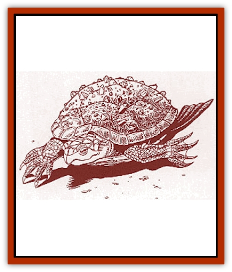

# Kla'a-tah

| Statistic | **Cl�u-rin** | **Kla'a-Tah** |
| --- | --- | --- |
| **Activity Cycle:** | Any | Any |
| **Alignment:** | Neutral evil | Neutral good |
| **Armor Class:** | 0 (-2) | -1 (-3) |
| **Climate/Terrain:** | Temperate and tropical waters | Temperate waters and coastline |
| **Damage/Attack:** | 1d8/1d8/4d8 | 2d4/2d12 |
| **Diet:** | Carnivore | Omnivore |
| **Frequency:** | Very rare | Very rare |
| **Hit Dice:** | 8+3 | 7+1 |
| **Intelligence:** | High (13-14) | High (13-14) |
| **Magic Resistance:** | Nil | Nil |
| **Morale:** | Elite (13-14) | Champion (15-16) |
| **Movement:** | 3, Sw 24 | 6, Sw 18 |
| **No. Appearing:** | 1 | 1 |
| **No. of Attacks:** | 3 (claw/claw/bite) | 2 (claw/bite) |
| **Organization:** | Solitary | Solitary |
| **Size:** | L (10'+ long) | L (12'+ long) |
| **Special Attacks:** | Nil | Nil |
| **Special Defenses:** | Shell | Shell, +2/+4 Saves |
| **THAC0:** | 11 | 13 |
| **Treasure:** | M (&times;50),Q(&times;5); (G) | Q (&times;4) |
| **XP Value:** | 2,000 | 2,000 |

This highly intelligent [[Turtle_Giant|turtle]] is primarily a sea creature, occasionally seen wandering the shores of the tortle people. Its behavior is very similar in manner to that of a good [[Dragon_General_Information|dragon]] - solitary in nature, though sometimes preventing catastrophes about to befall [[Tortle|tortles]]. For this reason, the kla'a-tah is referred to as the Tortle Guardian.

The kla'a-tah boasts a huge, colorful upper shell, often studded with uncut gems. The undershell is pink and extremely hard. The legs and head of the kla'a-tah are a dark red, and the skin looks plated. Its rear feet taper back into two giant flippers, and the front feet have very sharp-edged toenails. The creature's head resembles that of a turtle - with large, deep set eyes and a sharp, powerful horned beak. When out of the water for more than a few minutes, the kla'a-tah coughs with a deep, booming bark.

**Combat:** A kla'a-tah attacks with front claws and a powerful bite. Because of its girth, it can only bring one claw to bear at any particular target in a given round. However, the attack is powerful enough that even the powerful [[Glutton_Sea|sea glutton]] fears this creature.

With the protection its shell offers, a kla'a-tah rarely retreats from combat. If necessary, this giant turtle can pull in its legs and head, partially retreating into its lower shell. This seals off the leg openings and protects (but does not seal off) the head, giving the creature an Armor Class of -3. The kla'a-tah can make extremely quick snapping attacks for a creature its size, extending its neck to get a decent range of motion around the front of its shell. It does not worry too much about rear attacks, as its thick shell is nearly impervious.

Besides the improved Armor Class, the kla'a-tah shell provides some other benefits. The creature has an automatic +2 bonus to all saving throws, and if withdrawn into its shell, the kla'a-tah gains a +4 bonus to all saving throws, including ones for mental attacks. If no saving throw is normally allowed, the kla'a-tah gains one if withdrawn, but without the +4 bonus.

Kla'a-tah have 90-foot infravision, which works in or out of the water. They have a natural ballast system that allows them to float on the surface or submerge for as long as needed. These creatures are completely amphibious and can survive indefinitely in both water and air.

**Habitat/Society:** No more than one kla'a-tah is ever seen at one time, so not much is known about their society. Different kla'a-tah have been seen helping the same tortle community, though, so they must move around. Kla'a-tah are thought to live in deep trenches along the ocean floor. They have been seen sunning themselves on the surface while eating seaweed or the carcass of a freshly-killed sea glutton.

It is known that kla'a-tah have a language of their own. They have been observed conversing with tortle shamans, but whether they will talk to others is unknown. Certainly they have never spoken to anyone but the tortles, and the shamans keep most others away from the large creatures. The tortle people do collect cinnabryl for the kla'a-tah, which the shamans deliver, but they do this out of gratitude rather than payment.

**Ecology:** Kla'a-tah work to keep the sea gluttons from achieving a dominant position in the Western Sea. They can survive on seaweed alone, but they would consider it wasteful not to eat a creature they have taken the effort to kill. Kla'a-tah never overhunt an area. Their population is actually quite small, making them a valuable part of the ecosystem with no need for a larger predator to keep them in check.

*Legend:* Tortle legends have a lot to say about the kla'a-tah, much of it contradictory. One legend claims that the kla'a-tah are indeed Tortle Guardians, set in place by the Immortals to watch over the simple tortle race. Another claims that tortles who master the Red Curse are made into kla'a-tah by the Immortals, to watch over others and lead them down the same path. However, this last one poses a few questions, since kla'a-tah still have Legacies and require cinnabryl.

Other legends about the kla'a-tah relate to the Monoliths of Zul, ancient ruins that the tortles claim were built by their ancestors (much debated by sages). According to these legends, certain tortles achieved enlightenment and grew into the guardians of the rest of the tortle race, helped by the behind-the-scenes work of certain Immortals.

**Cl�u-rin**

  Cl�u-rin protect the evil [[Tortle|snappers]]. A cl�u-rin is a bit smaller and sleeker than a kla'a-tah, allowing it to bring both front claws to bear on a victim as well as its bite. These creatures guard the snappers' waters against intrusion by other races or large sea creatures, such as the sea glutton. Though rarely, they will sometimes come up on shore to attack enemies of the snappers. Cl�u-rin are extremely protective of their territory, defending it against other cl�u-rin as well.

However, the cl�u-rin's protection is not so benevolent as that of the kla'a-tah. It demands that treasure be thrown into the ocean, later collecting it and moving it to its lair. Even if the snappers do not wish protection, a cl�u-rin demands tribute. Snappers have learned better than to argue. The cl�u-rin also gain Legacies and require cinnabryl, which they demand from the snappers as part of their regular tribute. The snappers comply readily, because an Afflicted cl�u-rin is a snapper's worst nightmare.

---
## Discovery & Documentation

**Source Publication:** Monstrous Compendium Savage Coast Appendix (Online Exclusive) (1995)
**Campaign Setting:** Mystara
**Author(s):** Loren L Coleman, Ted James, Thomas Zuvich, Cindi M. Rice

### Other Creatures Found in This Source Book
   * [[Aranea_Savage_Coast|Aranea (Savage Coast)]]
   * [[Arashaeem|Arashaeem]]
   * [[Batracine|Batracine]]
   * [[Cat_Marine|Cat, Marine]]
   * [[Cinnavixen|Cinnavixen]]
   * [[Clockwork_Swordsman|Clockwork Swordsman]]
   * [[Critter_Temple|Critter, Temple]]
   * [[Cursed_One|Cursed One]]
   * [[Deathmare|Deathmare]]
   * [[Dragon_Savage_Coast_Crimson|Dragon (Savage Coast), Crimson]]
   * [[Dragon_Savage_Coast_Red_Hawk|Dragon (Savage Coast), Red Hawk]]
   * [[Echyan|Echyan]]
   * [[Ee'aar|Ee'aar]]
   * [[Enduk|Enduk]]
   * [[Fachan_Savage_Coast|Fachan (Savage Coast)]]
   * [[Feliquine|Feliquine]]
   * [[Fiend_Narvaezan|Fiend, Narvaezan]]
   * [[Frelôn|Frelôn]]
   * [[Ghriest|Ghriest]]
   * [[Glutton_Sea|Glutton, Sea]]
   * [[Goatman|Goatman]]
   * [[Golem_Naâruk|Golem, Naâruk]]
   * [[Golem_Savage_Coast|Golem (Savage Coast)]]
   * [[Grudgling|Grudgling]]
   * [[Heraldic_Servant_I|Heraldic Servant I]]
   * [[Heraldic_Servant_II|Heraldic Servant II]]
   * [[Heraldic_Servant_III|Heraldic Servant III]]
   * [[Heraldic_Servant_IV|Heraldic Servant IV]]
   * [[Heraldic_Servant_V|Heraldic Servant V]]
   * [[Heraldic_Servant_General_Information|Heraldic Servant, General Information]]
   * [[Hermit_Sea|Hermit, Sea]]
   * [[Jorri|Jorri]]
   * [[Juhrion|Juhrion]]
   * [[Leech_Legacy|Leech, Legacy]]
   * [[Lich_Inheritor|Lich, Inheritor]]
   * [[Lizard_Kin_Savage_Coast|Lizard Kin (Savage Coast)]]
   * [[Lupasus|Lupasus]]
   * [[Lupin|Lupin]]
   * [[Lyra_Bird_Saragón|Lyra Bird, Saragón]]
   * [[Malfera|Malfera]]
   * [[Manscorpion_Nimmurian|Manscorpion, Nimmurian]]
   * [[Mythuínn_Folk|Mythuínn Folk]]
   * [[Neshezu|Neshezu]]
   * [[Nikt'oo|Nikt'oo]]
   * [[Nosferatu|Nosferatu]]
   * [[Omm-wa|Omm-wa]]
   * [[Omshirim|Omshirim]]
   * [[Parasite_Savage_Coast|Parasite (Savage Coast)]]
   * [[Phanaton|Phanaton]]
   * [[Plant_Savage_Coast|Plant (Savage Coast)]]
   * [[Pudding_Vermilion|Pudding, Vermilion]]
   * [[Rakasta|Rakasta]]
   * [[Ray_Forest|Ray, Forest]]
   * [[Shedu_Greater_Savage_Coast|Shedu, Greater (Savage Coast)]]
   * [[Shimmerfish|Shimmerfish]]
   * [[Skinwing|Skinwing]]
   * [[Spawn_of_Nimmur|Spawn of Nimmur]]
   * [[Spider-spy|Spider-spy]]
   * [[Spirit_Heroic|Spirit, Heroic]]
   * [[Spirit_Walleran|Spirit, Walleran]]
   * [[Succulus|Succulus]]
   * [[Swampmare|Swampmare]]
   * [[Symbiont_Shadow|Symbiont, Shadow]]
   * [[Tortle|Tortle]]
   * [[Troll_Legacy|Troll, Legacy]]
   * [[Trosip|Trosip]]
   * [[Tyminid|Tyminid]]
   * [[Utukku|Utukku]]
   * [[Voat|Voat]]
   * [[Voat_Herathian|Voat, Herathian]]
   * [[Vulturehound|Vulturehound]]
   * [[Wallara|Wallara]]
   * [[Wurmling|Wurmling]]
   * [[Wynzet|Wynzet]]
   * [[Yeshom|Yeshom]]
   * [[Zombie_Red|Zombie, Red]]
