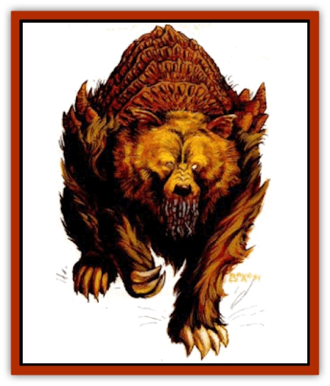

# Klar

| Statistic | **Klar** |
| --- | --- |
| **Activity Cycle:** | Night |
| **Alignment:** | Neutral evil |
| **Armor Class:** | 2 |
| **Climate/Terrain:** | Mekillot Mountains |
| **Damage/Attack:** | 1d8+1/1d8+1/1d10 |
| **Diet:** | Carnivore |
| **Frequency:** | Rare |
| **Hit Dice:** | 11+2 |
| **Intelligence:** | Low (5-7) |
| **Magic Resistance:** | Nil |
| **Morale:** | Elite (16-17) |
| **Movement:** | 15 |
| **No. Appearing:** | 1-2 |
| **No. of Attacks:** | 3 |
| **Organization:** | Family |
| **Size:** | L (9' tall) |
| **Special Attacks:** | Crushing hug |
| **Special Defenses:** | Nil |
| **THAC0:** | 9 |
| **Treasure:** | Nil |
| **XP Value:** | Adults: 6,000 / Young: 650 |

**Psionics Summary**

| Level | Dis/Sci/Dev | Attack/Defense | Score | PSPs |
| --- | --- | --- | --- | --- |
| 12 | 3/3/11 | EW,MT,PsC/IF,MB,M- | 12 | 45 |

**Psychokinesis -** *Science:* telekinesis; *Devotions:* ballistic attack, control body, control sound, inertial barrier.

**Telepathy -** *Sciences:* domination, mind link; *Devotions:* contact, ego whip, invincible foes, mind thrust, psionic crush.

**Psychometabolism -** *Sciences:* nil; *Devotions:* cause sleep, photosynthesis.

The klar looks much like a large kodiak [[Bear|bear]] with a head that seems a little too large for the body. Its back is covered with a chitinous plate It has a thick, stump of a tail that aids its balance when it stands erect.

The klar is large, towering over most Athasian fauna when standing fully erect. Its thick, sandy-colored fur grows as much as six inches long. The klar moves about on all four massive paws. Its long arms reach the ground when erect.

Klars communicate with each other through loud growls, though they use their psionics when they wish to be silent or contact each other over great distances. They have never attempted to speak with humans or demihumans, assuming them to be too stupid to understand a klar. The few who have bothered to investigate the town of Salt View are beginning to change their views about the humans and their kind. Several psionicists have contacted klar and were able to communicate before being ripped to shreds.

**Combat:** The klar readily uses its psionics in battle, preferring to scare opponents by employing invincible foes or ego whip.

In melee combat, a klar buffets and slashes with its two paws, inflicting 2-9 points of damage with each. Two successful hits in one round means that the target is caught in a powerful hug with which the klar means to crush its victim. The hug is an automatic hit, causing 2-20 (2d10) points of damage plus one point for each point of the victim's AC (negative AC means less damage). A victim that makes a successful Strength roll receives only half damage. The klar is fond of playing with its food, so it often releases its victim after a single crush and tries again the next round. A klar that is losing its battle maintains its hold until it or the victim is dead. A held character can attempt to break free of the grab by making a successful Bend Bars/Lift Gates roll. The klar's final attack is a vicious snap with its jaws that causes 1-10 (1d10) points of damage if it connects.

If encountered in its lair, the klar is likely to have 1-2 young present (but never more young than adults). These young have 3-8 HD (1d6+2), cause only half damage with any given attack, have no hug attack, and do not possess enough psionic potential to use their abilities in combat. The klar fight ferociously to protect their young.

The klar's AC is a result of its long, twisting hair and chitinous plate. Some protection also comes from experience in combat. Young klar have an AC 4.

**Habitat/Society:** The klar is not particularly territorial. It is confident enough to know it can find a home anywhere in the mountains by killing other cave-dwellers. In the first several years of a klar.s life, its intense psionic potential tends to overpower its young, untrained mind. An adolescent klar occasionally annihilates its own brain. As a result, the klar grow particularly fierce when trespassers invade while the young are maturing. The klar fears that moving the den will upset the youth.

The life span of a klar ranges from 60-100 years.

**Ecology:** Most creatures prefer to avoid klar caves for obvious reasons. Those that are brave enough to face a klar, and powerful enough to slay it, can earn quite a sum by taking the skin to a tanner. The klar's fur, though less effective when not actually attached to the user, is AC 5, slightly better than most hide armor. Its chitinous shell is impossible to shape without magical aid and is of little use.

---
## Discovery & Documentation

**Source Publication:** Dark Sun Appendix II - Terrors Beyond Tyr (1991)
**Campaign Setting:** Dark Sun
**Author(s):** Jim Atkiss, Steve Brown, Timothy B. Brown, Andrew P. Morris, Bruce Nesmith, Wes Nicholson, Bill Slavicsek

### Other Creatures Found in This Source Book
   * [[Aarakocra_Athas|Aarakocra (Athas)]]
   * [[Animal_Domestic_Athas_II|Animal, Domestic (Athas) II]]
   * [[Aviarag|Aviarag]]
   * [[Baazrag|Baazrag]]
   * [[Baazrag_Boneclaw|Baazrag, Boneclaw]]
   * [[Bloodgrass|Bloodgrass]]
   * [[Cactus_Hunting|Cactus, Hunting]]
   * [[Cactus_Rock|Cactus, Rock]]
   * [[Cilops|Cilops]]
   * [[Crodlu|Crodlu]]
   * [[Dagorran|Dagorran]]
   * [[Dhaot|Dhaot]]
   * [[Drake_Lesser_Athas_General_Information|Drake, Lesser (Athas), General Information]]
   * [[Drake_Lesser_Athas_Magma|Drake, Lesser (Athas), Magma]]
   * [[Drake_Lesser_Athas_Rain|Drake, Lesser (Athas), Rain]]
   * [[Drake_Lesser_Athas_Silt|Drake, Lesser (Athas), Silt]]
   * [[Drake_Lesser_Athas_Sun|Drake, Lesser (Athas), Sun]]
   * [[Dray|Dray]]
   * [[Drik|Drik]]
   * [[Dune_Reaper|Dune Reaper]]
   * [[Dwarf_Athas|Dwarf (Athas)]]
   * [[Elemental_Beast_Athas_Air|Elemental Beast (Athas), Air]]
   * [[Elemental_Beast_Athas_Earth|Elemental Beast (Athas), Earth]]
   * [[Elemental_Beast_Athas_Fire|Elemental Beast (Athas), Fire]]
   * [[Elemental_Beast_Athas_Water|Elemental Beast (Athas), Water]]
   * [[Elf_Athas|Elf (Athas)]]
   * [[Fael|Fael]]
   * [[Feylaar|Feylaar]]
   * [[Fordorran|Fordorran]]
   * [[Giant_Half-giant|Giant, Half-giant]]
   * [[Giant_Shadow|Giant, Shadow]]
   * [[Golem_Athas_Magma|Golem (Athas), Magma]]
   * [[Golem_Athas_Salt|Golem (Athas), Salt]]
   * [[Golem_Athas_General_Information|Golem (Athas), General Information]]
   * [[Gorak|Gorak]]
   * [[Halfling_Athas|Halfling (Athas)]]
   * [[Human_Athas|Human (Athas)]]
   * [[Jhakar|Jhakar]]
   * [[Kaisharga|Kaisharga]]
   * [[Kes'trekel|Kes'trekel]]
   * [[Krag|Krag]]
   * [[Kragling|Kragling]]
   * [[Lirr|Lirr]]
   * [[Mastyrial|Mastyrial]]
   * [[Meorty|Meorty]]
   * [[Mul|Mul]]
   * [[Nikaal|Nikaal]]
   * [[Paraelemental_Beast_General_Information|Paraelemental Beast, General Information]]
   * [[Paraelemental_Beast_Magma|Paraelemental Beast, Magma]]
   * [[Paraelemental_Beast_Rain|Paraelemental Beast, Rain]]
   * [[Paraelemental_Beast_Silt|Paraelemental Beast, Silt]]
   * [[Paraelemental_Beast_Sun|Paraelemental Beast, Sun]]
   * [[Pakubrazi|Pakubrazi]]
   * [[Psionocus|Psionocus]]
   * [[Psurlon|Psurlon]]
   * [[Raaig|Raaig]]
   * [[Retriever_Obsidian|Retriever, Obsidian]]
   * [[Ruktoi|Ruktoi]]
   * [[Ruvoka_Athas|Ruvoka (Athas)]]
   * [[Sand_Howler|Sand Howler]]
   * [[Scorpion_Athas|Scorpion (Athas)]]
   * [[Seed_Brain|Seed, Brain]]
   * [[Silt_Horror_Black|Silt Horror, Black]]
   * [[Silt_Horror_Magma|Silt Horror, Magma]]
   * [[Silt_Horror_Red|Silt Horror, Red]]
   * [[Silt_Spawn|Silt Spawn]]
   * [[Slig|Slig]]
   * [[Spider_Athas|Spider (Athas)]]
   * [[Spinewyrm|Spinewyrm]]
   * [[Ssurran|Ssurran]]
   * [[Stalking_Horror|Stalking Horror]]
   * [[Tarek|Tarek]]
   * [[Tari|Tari]]
   * [[Thri-kreen|Thri-kreen]]
   * [[T'liz|T'liz]]
   * [[Tohr-kreen_II|Tohr-kreen II]]
   * [[Tohr-kreen_III|Tohr-kreen III]]
   * [[Trin|Trin]]
   * [[Tul'k|Tul'k]]
   * [[Undead_Athas_General_Information|Undead (Athas), General Information]]
   * [[Wraith_Athas|Wraith (Athas)]]
   * [[Xerichou|Xerichou]]
   * [[Zombie_Thinking|Zombie, Thinking]]
