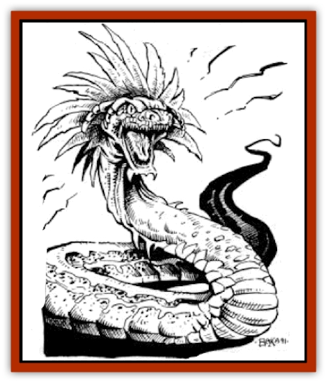

# Kluzd

| Statistic | **Kluzd** |
| --- | --- |
| **Activity Cycle:** | Night |
| **Alignment:** | Neutral |
| **Armor Class:** | 2 (8) |
| **Climate/Terrain:** | Mud flats |
| **Damage/Attack:** | 1-8 |
| **Diet:** | Carnivore |
| **Frequency:** | Very rare |
| **Hit Dice:** | 4 |
| **Intelligence:** | Animal (1) |
| **Magic Resistance:** | Nil |
| **Morale:** | Elite (14) |
| **Movement:** | 12, br 12 |
| **No. Appearing:** | 1-2 |
| **No. of Attacks:** | 1 |
| **Organization:** | Solitary |
| **Size:** | M (6' long) |
| **Special Attacks:** | Suffocation |
| **Special Defenses:** | Nil |
| **THAC0:** | 17 |
| **Treasure:** | Nil |
| **XP Value:** | 270 |

Kluzd are [[Snake|snake]]-like reptiles that inhabit mudflats and other muddy areas. They are about ten feet long and two to three feet in diameter. They can swallow a grown man whole, although this results in a strange, almost comical, bulge in the center of their bodies.

Male kluzd have a distinctive turquoise and white coloration about their head and neck area. Females do not share these bright colors; their bodies are sandy brown flecked with black along their entire length. All kluzd have a series of elongated, feather-like scales around the back of their heads. These flare out to form a large fan when the creature is angered, a primitive mechanism to make it appear larger to its animal opponents.

Kluzd have mere animal intelligence. They can communicate with each other only in a most rudimentary fashion or through magical or psionic means.

**Combat:** When a kluzd senses something moving along the surface of its mud-patch, it swims toward the object and attacks with needle-sharp, barbed teeth. A kluzd can burrow through mud quickly. It cannot burrow through dry dirt or sand.

A successful attack by the creature inflicts 1d8 points of damage. Also, in each round a kluzd will attempt to grapple, attacking whatever portion of the target is beneath the surface of the mud-in the case of a man, this is usually a leg. The victim must save vs. paralyzation or be grappled. Once grappled, the victim must make a bend bars/lift gates roll each round. If the roll is failed, the victim is pulled or kept under the surface of the mud for the entire round. If the roll is successful, the victim doesn't manage to break free, but does reach the surface of the mud to take a breath. If the victim rolls below half his normal bend bars/lift gates number, he breaks free and can flee through the mud for that entire round.

A victim that is held under the mud must hold his breath; the character can hold his breath up to 1/6 of his Constitution score in rounds (rounded up). While attempting to hold his breath beyond this time, the character must roll a Constitution check each round. The first check has no modifiers, but each subsequent check suffers a -2 cumulative penalty. Once a check is failed, the character suffocates. The victim is unable to defend himself with normal weapons or attacks while being held beneath the mud, although he can employ psionic powers. Once the first victim dies, the kluzd will swallow it whole, then submerge to the bottom of the mud and leave any other creatures alone while it feeds.

**Habitat/Society:** Most often, the kluzd is well-protected by its muddy environment; few native predators can submerge themselves in the thick muck to hunt them. Kluzd will only leave the safety of their mud pools when these areas dry out completely. The creatures are far more vulnerable when forced onto the surface of the mud flat. A kluzd will travel in a straight line away from its evaporated burrow in search of a new one - those that don't locate a new mud hole within four days will themselves dry out and perish.

**Ecology:** Kluzd mate when their mudflats dry across the surface to become a broken, hard crust. The female lays a clutch of eggs (1d8 in number) that will hatch and grow to full size in six weeks. Until the young leave the mud pond, their parents will protect them. The young do not hunt. Rather the parents attack creatures that cross the dried surface of the mud flat, dragging them under to feed their children.

---
## Discovery & Documentation

**Source Publication:** Dark Sun Campaign Setting (original) (1991)
**Campaign Setting:** Dark Sun
**Author(s):** Timothy B. Brown, Troy Denning, William W. Connors, J. Robert King, Brom and Tom Baxa,

### Other Creatures Found in This Source Book
   * [[Animal_Domestic_Athas_I|Animal, Domestic (Athas) I]]
   * [[Belgoi|Belgoi]]
   * [[Braxat|Braxat]]
   * [[Dragon_of_Tyr|Dragon of Tyr]]
   * [[Dune_Freak|Dune Freak]]
   * [[Gaj|Gaj]]
   * [[Giant_Athach|Giant, Athach]]
   * [[Gith|Gith]]
   * [[Jozhal|Jozhal]]
   * [[Silk_Wyrm|Silk Wyrm]]
   * [[Tembo|Tembo]]
   * [[Wezer|Wezer]]
