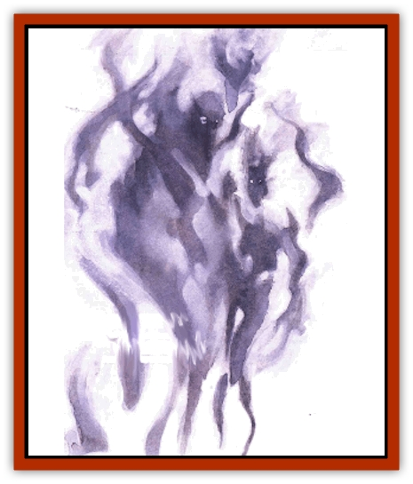

# Klyndes

| Statistic | **Klyndes** |
| --- | --- |
| **Activity Cycle:** | Any |
| **Alignment:** | Neutral |
| **Armor Class:** | 4 |
| **Climate/Terrain:** | Quasiplane of Steam |
| **Damage/Attack:** | 1d6 (&times;4) |
| **Diet:** | Carnivore |
| **Frequency:** | Rare |
| **Hit Dice:** | 4 |
| **Intelligence:** | Very (11-12) |
| **Magic Resistance:** | Nil |
| **Morale:** | Steady (11-12) |
| **Movement:** | Fl 12 (A) |
| **No. Appearing:** | 1 |
| **No. of Attacks:** | 4 |
| **Organization:** | Solitary |
| **Size:** | M (6' tall) |
| **Special Attacks:** | Surprise |
| **Special Defenses:** | Shadow form, immune to heat, needs no air to breathe |
| **THAC0:** | 17 |
| **Treasure:** | Nil |
| **XP Value:** | 650 |

When light filters through the constant haze of the quasiplane of Steam, it creates strange shadows cast upon nothingness. Lacking surfaces on which to form, the shadows nevertheless rise and fall again upon nothing but more steam and other shadows. These impossible steam shadows occasionally coalesce into a creature called a klyndes.

Klyndesi are composed of wispy darkness, existing only in between the water and the air that make up the vaporous atmosphere of the plane of Steam. They are intelligent beings, but they exist in complete isolation - they don't interact with others of their kind in any way whatsoever. In fact, it would seem that they do not even exist in each other's mind. Each klyndes believes itself to be the only such creature, a completely unique being, and there's no convincing it otherwise.

The voice of a klyndes is the hissing of steam. It has no reason to learn the languages of other beings, so all communication with a klyndes must be through spells or magical items.

**Combat:** The klyndes is a dangerous creature, for it preys upon flesh for its sustenance. To find prey, it can slip in and out of a shadowy, nebulous state of being between the bits of vapor on the plane of Steam. While in this misty state, the clyndes can move and watch its surroundings, but it cannot interact with objects and creatures of a more physical nature. It can neither touch nor be touched, harm nor be harmed. Adopting this shadowy nature, a klyndes can pass through even the most secure constructions by slipping through the spaces between the tiniest bits of matter composing all things. Only magical barriers such as a wall of force can keep a klyndes in shadow form at bay.

The klyndes almost always attacks with surprise, inflicting a -2 penalty to opponents' surprise rolls as it abruptly leaps out of its shadowy state and the impossibly small spaces among the steam. The klyndes requieres a full round of inactivity to alter its state from shadow to solid (or vice versa). Taking on a physical form, the klyndes lashes its prey with four long, whiplike limbs ending in razor-sharp blades (inducting 1d6 points of damage each). In this more "real" state, the creature is vulnerable to attack, and so it lashes out only when it feels confident of attaining a good meal.

Even in this vulnerable form, the klyndes is immune to attacks based on heat - magical or otherwise - and requires no air to breathe. Magic that affects water (such as *part water*, *water to dust*, and other similar spells) inflicts 1d4 points of damage upon the creature for every three levels or the spellcaster by removing the water vapor from around the klyndes. This weakness is evident no matter what form the klyndes currently takes, for as both shadow and solid it relies upon the spaces between the minuscule portions of water vapor in the air to support itself.

**Habitat/Society:** As previously mentioned, each klyndes believes itself to be the only one of its kind. There is no society of klyndesi, and there never can be.

Each klyndes sequesters itself deep within the steam - dark, wet places far from any other creature. It has no "lair" per se, but it always moves its resting place away from the presence of other beings. A klyndes spends at least half of its time at rest in a trancelike state, dreaming its alien dreams. The rest of the time it prowls the plane, seeking prey.

**Ecology:** The klyndesi are the only known predators on the plane of Steam. They feed mainly upon creatures called fabere, the docile, gas-filled balloonlike beasts that feed upon the steam itself. 'Course, when the klyndesi find different prey - like visitors to the plane - they're likely to jump at the chance to consume a more exotic meal.

It's not common, but occasionally those of other races develop a working relationship with the klyndesi after convincing them not to attack. The steam creatures are very intelligent, after all, and aren't immune to reasonable arguments.) Such klyndesi might become well-paid assassins or spies, since they're able to use their special powers even away from the plane of Steam. However, klyndesi cannot abide an atmosphere devoid of water vapor, so desert climates are extremely unpleasant to them and voids like the plane of Vacuum instantly slay the creatures.

Cold-blooded alchemists will tell a body that the brain of a klyndes contains certain liquids and unguents important in the making of a *potion of breathing steam* - a mixture similar to a *potion of water breathing*, but one that allows a basher to breathe fire, steam, or water.

---
## Discovery & Documentation

**Source Publication:** Planescape III (1996)
**Campaign Setting:** Planescape
**Author(s):** Monte Cook

### Other Creatures Found in This Source Book
   * [[Animental|Animental]]
   * [[Archomental_Evil|Archomental, Evil]]
   * [[Archomental_Good|Archomental, Good]]
   * [[Belker|Belker]]
   * [[Bzastra|Bzastra]]
   * [[Chososion|Chososion]]
   * [[Darklight|Darklight]]
   * [[Devete|Devete]]
   * [[Devourer_Planescape|Devourer (Planescape)]]
   * [[Dharum_Suhn|Dharum Suhn]]
   * [[Egarus|Egarus]]
   * [[Elemental_Athas_Lesser_Air_Earth|Elemental (Athas), Lesser, Air/Earth]]
   * [[Elemental_Athas_Lesser_Fire_Water|Elemental (Athas), Lesser, Fire/Water]]
   * [[Elemental_Fire_Kin_Salamander_II|Elemental, Fire Kin, Salamander II]]
   * [[Entrope|Entrope]]
   * [[Facet|Facet]]
   * [[Frost_Salamander|Frost Salamander]]
   * [[Fundamental_Air_Earth|Fundamental, Air/Earth]]
   * [[Fundamental_Fire_Water|Fundamental, Fire/Water]]
   * [[Fundamental_All_Elements|Fundamental, All Elements]]
   * [[Garmorm|Garmorm]]
   * [[Homunculus_Elemental|Homunculus, Elemental]]
   * [[Immoth|Immoth]]
   * [[Khargra|Khargra]]
   * [[Magran|Magran]]
   * [[Menglis|Menglis]]
   * [[Nathri|Nathri]]
   * [[Ooze_Sprite|Ooze Sprite]]
   * [[Paraelemental|Paraelemental]]
   * [[Phirblas|Phirblas]]
   * [[Psurlon|Psurlon]]
   * [[Quasielemental_Negative|Quasielemental, Negative]]
   * [[Quasielemental_Positive|Quasielemental, Positive]]
   * [[Rast|Rast]]
   * [[Ravid|Ravid]]
   * [[Ruvoka|Ruvoka]]
   * [[Scile|Scile]]
   * [[Shad|Shad]]
   * [[Shocker|Shocker]]
   * [[Sislan|Sislan]]
   * [[Suisseen|Suisseen]]
   * [[Terithran|Terithran]]
   * [[Thoqqua|Thoqqua]]
   * [[Trilloch|Trilloch]]
   * [[Tsnng|Tsnng]]
   * [[Ungulosin|Ungulosin]]
   * [[Vacuous|Vacuous]]
   * [[Wavefire|Wavefire]]
   * [[Xag-Ya_Xeg-Yi|Xag-Ya/Xeg-Yi]]
   * [[Xill|Xill]]
