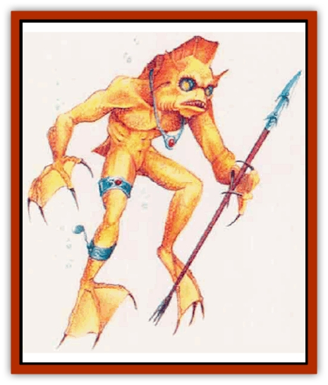

# Kna

| Statistic | **Kna** |
| --- | --- |
| **Activity Cycle:** | Any |
| **Alignment:** | Neutral good (80%)  or neutral evil (20%) |
| **Armor Class:** | 5 |
| **Climate/Terrain:** | Any ocean |
| **Damage/Attack:** | By weapon or 1d4 (claw)/1d4 (claw)/1d3 (bite) |
| **Diet:** | Omnivore |
| **Frequency:** | Commnn |
| **Hit Dice:** | 7 |
| **Intelligence:** | Very (11-12) |
| **Magic Resistance:** | Nil |
| **Morale:** | Elite (14) |
| **Movement:** | Sw 15 |
| **No. Appearing:** | 2d10 |
| **No. of Attacks:** | 1 or 3 |
| **Organization:** | Tribe |
| **Size:** | L (10-12' tall) |
| **Special Attacks:** | Nil |
| **Special Defenses:** | Skin protects against fire, blunt weapons |
| **THAC0:** | 15 |
| **Treasure:** | P (A) |
| **XP Value:** | 975 |

A kna (pronounced NAH) is an aquatic humanoid well known for its strength. These creatures live exclusively in saltwater and cannot breathe air. They vary in occupation from peaceful traders to dangerous pirates.

Kna stand 10 to 12 feet tall and have very muscular builds. Prominent features include large fins on their backs and heads, clawed hands, and bulging eyes. Their orange skin looks scaly but has a rubbery texture. They speak Common and their own tongue and also can communicate in a special silent language.

**Combat:** Knas usually (70%) arm themselves with special bone spears made for underwater use. Some (30% of those armed) also wield light crossbows designed specifically for underwater combat. Unarmed knas attack with their claws and sharp teeth. All knas boast 120-foot infravision.

Due to the knas' rubbery skin, blunt weapons inflict only half damage on them. Their skin also gives them a +1 bonus to saving tbrows vs. normal fire.

Knas cannot breathe air. A kna taken out of the water suffocates in 2d4 rounds.

**Habitat/Society:** Knas live in tribes made up of several family groups (typically 3d4 families per tribe). Each family contains 4d4 adults and half as many noncombatant offspring. Kna children reach maturity in six months.

Like [[Fish|fish]], knas reproduce by laying eggs. All females within a tribe share the same Fertile period; autumn is the most common egg-laying season. A female kna lays an annual clutch of 3d6 eggs, 2d6 of which actually hatch. Two knas are appointed as the children's full-time guardians for six months. During this time, the guardians teach the hatchling everything they need to know to enter the adult world. If players encounter guardians with their charges, each guardian's morale increases to Fearless (20) in combat situations.

Kna tribes dwell in shelters built into large, bargelike platforms that float 20 to 30 feet above the sea bed. The knas construct these platforms from the light internal shells of giant squid and decorate them with bright shells and colored stones. Each tribe has its own distinctive decorative pattern.

Many knas live as peaceful traders, enjoying a prosperous relationship with other intelligent sea races as well as air breathers living along the shore. Sometimes trade between knas and humans is conducted by intermediaries, such as [[Elf_Aquatic|sea elves]], who feel at ease in both environments.

Unfortunately, some tribes that have seen their territories usurped by ships of surface dwellers resort to piracy. These tribes, called the *uyagh* in their own tongue, wreck surface ships on reefs, overcome the crews, and plunder the cargo. Depending on the tribe's temperament and the victims' behavior, the uyagh might spare or slaughter a crew. (Expect the latter if the surface dwellers killed a kna while resisting.) Knas take no prisoners. Peaceful kna tribes, while disapproving of their pirate brethren, do not raise arms against them.

Besides their normal racial language, knas have a special system of hand gestures and body movements that allows them to speak silently, conveying simple concepts like "retreat", "attack", "help", and "friend". Surface dwellers can learn this sign language using a nonweapon proficiency slot.

Knas tame sea creatures for use as watch animals and beasts of burden. Uyagh use larger sea creatures to help tow surface vessels onto reefs. A kna lair has a 60% chance of containing 2d6 domesticated sea creatures, especially [[Hippocampus|hippocampi]] (15%), [[Whale|narwhales]] (25%), [[Whale|common whales]] (20%), [[Dolphin|dolphins]] (20%), and [[Sea_Lion|sea lions]] (20%).

Knas and [[Kopru|koprus]] are sworn enemies, as they compete for the same food supply and habitat. Their constant bickering keeps both races' numbers down.

**Ecology:** Knas hunt many sea creatures that humans consider predators, reducing the population of [[Shark|sharks]], [[Ray|manta rays]], [[Lamprey|lampreys]], and the like.

Unscrupulous alchemists have discovered how to use kna blood as an ingredient for *potions of water breathing*. These alchemists occasionally have been responsible for devastating raids on communities of good and peaceful knas.

---
## Discovery & Documentation

**Source Publication:** Mystara Appendix (1994)
**Campaign Setting:** Mystara
**Author(s):** John Nephew, Teeuwynn Woodruff, John Terra, Skip Williams

### Other Creatures Found in This Source Book
   * [[Actaeon|Actaeon]]
   * [[Agarat|Agarat]]
   * [[Ash_Crawler|Ash Crawler]]
   * [[Baldandar|Baldandar]]
   * [[Bargda|Bargda]]
   * [[Bhut|Bhut]]
   * [[Bird_Mystara|Bird (Mystara)]]
   * [[Blackball|Blackball]]
   * [[Choker|Choker]]
   * [[Coltpixie|Coltpixie]]
   * [[Crone_of_Chaos|Crone of Chaos]]
   * [[Darkhood|Darkhood]]
   * [[Darkwing|Darkwing]]
   * [[Decapus|Decapus]]
   * [[Deep_Glaurant|Deep Glaurant]]
   * [[Diabolus|Diabolus]]
   * [[Dimensional_Warper|Dimensional Warper]]
   * [[Dragon_Mystara_Crystalline|Dragon (Mystara), Crystalline]]
   * [[Dragon_Mystara_Jade|Dragon (Mystara), Jade]]
   * [[Dragon_Mystara_Onyx|Dragon (Mystara), Onyx]]
   * [[Dragon_Mystara_Ruby|Dragon (Mystara), Ruby]]
   * [[Drake_Mystara|Drake (Mystara)]]
   * [[Dragonfly|Dragonfly]]
   * [[Dusanu|Dusanu]]
   * [[Elemental_of_Chaos_Air_Earth|Elemental of Chaos, Air/Earth]]
   * [[Elemental_of_Chaos_Fire_Water|Elemental of Chaos, Fire/Water]]
   * [[Elemental_of_Law_Air_Earth|Elemental of Law, Air/Earth]]
   * [[Elemental_of_Law_Fire_Water|Elemental of Law, Fire/Water]]
   * [[Familiar_Mystara|Familiar (Mystara)]]
   * [[Frost_Salamander|Frost Salamander]]
   * [[Fundamental_Air_Earth|Fundamental, Air/Earth]]
   * [[Fundamental_Fire_Water|Fundamental, Fire/Water]]
   * [[Gargantua_Mystara|Gargantua (Mystara)]]
   * [[Geonid|Geonid]]
   * [[Ghostly_Horde|Ghostly Horde]]
   * [[Giant_Athach|Giant, Athach]]
   * [[Giant_Hephaeston|Giant, Hephaeston]]
   * [[Golem_Drolem|Golem, Drolem]]
   * [[Golem_Mystara_I|Golem (Mystara) I]]
   * [[Golem_Mystara_II|Golem (Mystara) II]]
   * [[Golem_Mystara_III|Golem (Mystara) III]]
   * [[Gray_Philosopher|Gray Philosopher]]
   * [[Guardian_Warrior|Guardian Warrior]]
   * [[Gyerian|Gyerian]]
   * [[Herex|Herex]]
   * [[Hivebrood|Hivebrood]]
   * [[Horde|Horde]]
   * [[Hsiao|Hsiao]]
   * [[Huptzeen|Huptzeen]]
   * [[Hutaakan|Hutaakan]]
   * [[Imp_Mystara|Imp (Mystara)]]
   * [[Jellyfish_Giant_Mystara|Jellyfish, Giant (Mystara)]]
   * [[Kopru|Kopru]]
   * [[Lizard_Mystara|Lizard (Mystara)]]
   * [[Lizard-kin_Mystara|Lizard-kin (Mystara)]]
   * [[Lupin|Lupin]]
   * [[Lycanthrope_Werejaguar_Mystara|Lycanthrope, Werejaguar (Mystara)]]
   * [[Lycanthrope_Wereswine|Lycanthrope, Wereswine]]
   * [[Magen|Magen]]
   * [[Manikin|Manikin]]
   * [[Mek|Mek]]
   * [[Mujina|Mujina]]
   * [[Nagpa|Nagpa]]
   * [[Neh-thalggu|Neh-thalggu]]
   * [[Nightshade_Mystara|Nightshade (Mystara)]]
   * [[Nuckalavee|Nuckalavee]]
   * [[Pegataur|Pegataur]]
   * [[Phanaton|Phanaton]]
   * [[Plant_Dangerous_Mystara|Plant, Dangerous (Mystara)]]
   * [[Plasm|Plasm]]
   * [[Rakasta|Rakasta]]
   * [[Rock_Man|Rock Man]]
   * [[Sabreclaw|Sabreclaw]]
   * [[Sacrol|Sacrol]]
   * [[Scamille|Scamille]]
   * [[Shapeshifter|Shapeshifter]]
   * [[Shargugh|Shargugh]]
   * [[Shark-kin|Shark-kin]]
   * [[Sollux|Sollux]]
   * [[Spectral_Death|Spectral Death]]
   * [[Spectral_Hound|Spectral Hound]]
   * [[Spider-kin|Spider-kin]]
   * [[Spirit_Mystara|Spirit (Mystara)]]
   * [[Statue_Living|Statue, Living]]
   * [[Surtaki|Surtaki]]
   * [[Tabi|Tabi]]
   * [[Thoul|Thoul]]
   * [[Thunderhead|Thunderhead]]
   * [[Tiger_Ebon|Tiger, Ebon]]
   * [[Topi|Topi]]
   * [[Tortle|Tortle]]
   * [[Vampire_Velya|Vampire, Velya]]
   * [[White_Fang|White Fang]]
   * [[Worm_Mystara|Worm (Mystara)]]
   * [[Wyrd|Wyrd]]
   * [[Yowler|Yowler]]
   * [[Zombie_Lightning|Zombie, Lightning]]
