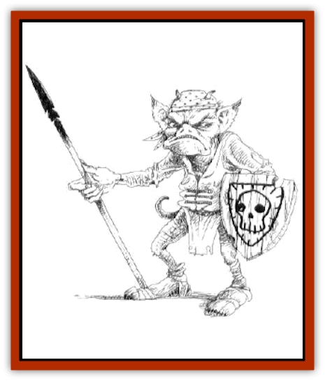

# Kobold - Dragon Mountain

| Statistic | **Kobold, Dragon Mountain** |
| --- | --- |
| **Activity Cycle:** | Any |
| **Alignment:** | Lawful evil |
| **Armor Class:** | 7 (10) |
| **Climate/Terrain:** | Subterranean |
| **Damage/Attack:** | 1-4 or 1-6 (by weapon) |
| **Diet:** | Omnivore |
| **Frequency:** | Uncommon |
| **Hit Dice:** | ½ (1-4 hp) |
| **Intelligence:** | Average (8-10) |
| **Magic Resistance:** | Nil |
| **Morale:** | Average (10) |
| **Movement:** | 6 |
| **No. Appearing:** | 5-20 |
| **No. of Attacks:** | 1 |
| **Organization:** | Clan |
| **Size:** | S (3' tall) |
| **Special Attacks:** | Nil |
| **Special Defenses:** | Nil |
| **THAC0:** | 20 |
| **Treasure:** | J,O (Q&times;5) |
| **XP Value:** | 7 / Chiefs/Guards: 15 / Shamans/Witchdoctors: 35 |

The [[Kobold|kobolds]] of Dragon Mountain are well off compared to their more mundane cousins. They live a prosperous life and are well protected by the [[Dragon_General_Information|dragon]] Infyrana. Having adapted their lifestyle to the halls and passages of the [[Dwarf|dwarven]] stronghold, they are cunning creatures who use their knowledge to outwit opponents. The kobolds of Dragon Mountain are a force to be reckoned with.

**Combat:** The kobolds of Dragon Mountain have adapted to their surroundings so well that they have learned to use many of the old dwarven weapons and traps that were left after the dragon took power. They utilize their resources to the fullest extent possible, and they acquire additional supplies and so forth from the various villages and towns that they raid and plunder. The kobolds understand that they are heavily overmatched in toe-to-toe fights, so they almost never combat enemies this way if they can avoid it. Instead, they try to lure invaders into specially prepared traps where they can bombard the enemy with flaming oil, deadfalls, poisonous arrows, and so forth. Following are some of the kobolds' favorite battle tactics:

A witch doctor casts a *web* spell to entrap enemies and then a large force of warriors fires large quaintities of arrows or jabs repeatedly with spears at them; enemies are lured into an area with a pit trap or some low-lying area from which there is no escape, and a *stinking cloud* spell is cast; a shaman casts *heat metal* on the armor of any warrior while the rest of the force attacks with ranged weapons; a shaman casts *silence, 15' radius* on spellcasters; shamans use any type of *charm* or *hold person* spells to take control of members of adventuring parties. In addition to spellcasting, kobolds in Dragon Mountain like to entrap adventurers with nets and ropes that pin them down while the kobolds attack.

When kobolds do attack face to face, they do not simply jump out and run at adventurers, swinging their weapons. (They know this is the best way to a quick death.) Instead, they prefer to gain surprise through ambush and then swarm over characters, attempting to overbear them. The following additions to the standard overbearing rules in the *Player's Handbook* (and the *Dungeon Master Guide*) should be taken into account, due to the kobolds' smaller size but greater tenacity and ferociousness.

When determining the chance of success for a group of kobolds attempting to overbear an opponent, assume that up to 10 kobolds can swarm a single human-sized opponent, while six can swarm a dwarf, gnome, or halfling. When determining effective Armor Class, do *not* consider the base AC of any armor worn; only take into account the magical protective bonuses from armor, rings, and bracers, along with the natural Dexterity adjustment of the individual from the base AC of 10.

For example, a human male fighter in *plate mail +2* and with a Dexterity of 16 has a normal AC of -1. But for the purpose of the kobolds overbearing him, his effective AC is 6 (magical bonus from the armor is +2 (down to 8) and Dex bonus is -2 (down to 6). Thus, if 10 kobolds swarm the fighter, they have a base chance of 9 to overbear him (a base THAC0 of 20 to overbear an AC of 6 gives a 14, but there is a -4 penalty due to the difference in size, so the adjusted number is 18. The nine additional kobolds participating add a +9 bonus, for a final of 9). Once overbearing is accomplished, more kobolds are required to tie the character up or to strip armor or magical items away. Until extra kobolds arrive, the original 10 must make successful overbearing checks each round to keep the warrior pinned.

**Habitat/Society:** Kobold society within the mountain is heavily supernatural, and therefore the clan leadership descends from the chief to the witchdoctors and shamans.

Kobold shamans are primitive priests, far more concerned with the well-being of their communities (and own aggrandizement) than the typical priest. They take spells from the priestly spheres by praying for them as a priest would. They use their spells for punishment, fortune-telling, and the clan's benefit. Kobold shamans can advance as high as 5th level. The spheres from which they can take their spells include All, Charm, Combat, Divination, Elemental, Guardian, Healing, Necromantic, Protection, Summoning, Sun (reversed), War, and Wards.

They might take part in hunting, war, and spying, but almost never adventure. They perform minor divinations for their people, and even seize control of their clans when they feel the chief is not acting in the tribe's best interests.

The witch doctors are much like the shamans, except that they also combine minor mage spells with their clerical allotment, and are therefore much more rare than the shamans. They may use spells from only one school, though they are not specialist wizards in any way. Unlike shamans, witch doctors can only attain 4th level. They need spellbooks to rememorize their spells. They can use any magical item allowed to wizards.

Kobold witch doctors serve their clans as advisors to the chiefs, scholars, and in time of battle, that extra punch needed to sway the fight. Like the shamans, witch doctors might participate in special activities such as spying or battles, but they never wander off alone - their presence within the clan is much too important. Witch doctors are also likely to be sent to negotiations with witch doctors from other clans, in addition to, it not in place of, a clan chief.

There have been cases within Dragon Mountain of warring clans sending out secret strike forces for the sole purpose of eliminating enemy shamans and witch doctors in order to demoralize the clan. Because of this type of behavior, it is rare to see a shaman or witch doctor without an escort of at least six (and more often 10) kobolds for protection.

For both witch doctors and shamans, the spell level limit that can be memorized (prayed for) and cast is one-half their level rounded up.Thus, a 4th level witch doctor can cast 2nd level spells, while a 5th level shaman can cast 3rd level spells.

The kobolds of Dragon Mountain have as diverse a society as the dwarves before them, and one that is, perhaps, even more complex. Their stratified society allows those at the top to focus on their pursuits without having to work too hard for their labors. Those on the bottom, on the other hand, must constantly toll for their survival. The various clans of the mountain continually struggle with each other in efforts to better their living condition, or to maintain those that they have achieved through similar in-fighting.

However, despite their differences, the kobolds can come together with amazing alacrity to combat any intruders in the mountain. Though the various clans might take advantage of the distractions caused by invaders to better themselves, they will not press the advantage too far. They know that ther is no point in bettering themselves at the price of losing the whole mountain.

At the top of the heap is the king. However, his power is only theoretical, obeyed by the clans when it suits them. The true power is in a council of kobold leaders, who make important decisions and pass them along to the king for ratification. If he disagrees with said policy, they ignore him and implement it anyway. The chieftains are not equal in power; those leading the more powerful clans naturally have a greater say in the policies of Dragon Mountain than those who lead the weaker clans. Those in power propagate their power through decisions that favor them, though they do not abuse this to the point that the rest of the mountain suffers.

Below the chieftains are the shamans and witch doctors, and below them are the general populace. The "under-kobolds" (as they are called by those above them), while downtrodden, are fiercely devoted to their leader, their tribe, their family, and the mountain, in that order. Though there are, of course, some exceptions, the normal kobold will sacrifice its life for the well-being of these. The sacrifice for the tribe is one that many make in daily confrontations with the enemies of their tribes, but the majority of Dragon Mountain kobolds need not worry about making these sacrifices where outsiders are concerned. With some mild modification, the dwarves stonework makes an ideal setting for numerous traps. Indeed, most of the mountain can be seen as a trap, with the kobolds as the architects. The Dragon Mountain kobolds have perfected several versions of traps, including the chute trap, the pit trap, and various traps involving needles and other sharp obects. All of these play havoc with the unwary.

**Ecology:** Ecology: The kobolds are intricately intertwined with the ecology of Dragon Mountain. They practically rule the entire mountain, and as long as none of their activities violate the dragon's desires, they have free rein to do whatever they wish. They have no natural and overpowering enemies in the mountain, although there are several monsters within that make kobolds a regular part of their diet. However, most kobolds can avoid this fate. Only the foolish ones suffer.

Kobolds reproduce as do most humanoids, requiring both male and female partners. A pregnant kobold typically births four-to-five children, though smaller and larger letters are not unheard of.

The kobolds of Dragon Mountain are not scavengers, instead earning their sustenance by raiding towns near Dragon Mountain. They supplement this by raising a few crops and herds of animals. However, their main died comes from the supplies of raided towns.

---
## Discovery & Documentation

**Source Publication:** Dragon Mountain (1993)
**Campaign Setting:** Advanced Dungeons & Dragons 2nd Edition
**Author(s):** Colin McComb, Paul Arden Lidberg

### Other Creatures Found in This Source Book
   * [[Dragon-kin|Dragon-kin]]
   * [[Elemental_Earth_Kin_Earth_Weird|Elemental, Earth Kin, Earth Weird]]
   * [[Gnasher|Gnasher]]
   * [[Gnasher_Winged|Gnasher, Winged]]
   * [[Living_Steel|Living Steel]]
   * [[Noran|Noran]]
   * [[Ophidian|Ophidian]]
   * [[Rautym|Rautym]]
   * [[Spider_Brain|Spider, Brain]]
   * [[Squeaker|Squeaker]]
   * [[Stone_Snake|Stone Snake]]
   * [[Suwyze|Suwyze]]
   * [[Tanar'ri_Greater_Wastrilith|Tanar'ri, Greater, Wastrilith]]
   * [[Undead_Dwarf|Undead Dwarf]]
