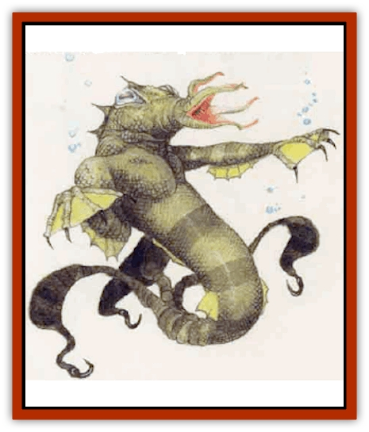

# Kopru

| Statistic | **Kopru** |
| --- | --- |
| **Activity Cycle:** | Any |
| **Alignment:** | Chaotic evil |
| **Armor Class:** | 8 |
| **Climate/Terrain:** | Tropical oceans and swamps |
| **Damage/Attack:** | 1d4 (claw)/1d4 (claw)/1d4 (bite)/3d4 (tail lash) |
| **Diet:** | Omnivore |
| **Frequency:** | Rare |
| **Hit Dice:** | 8+4 |
| **Intelligence:** | Average (8-10) |
| **Magic Resistance:** | Nil |
| **Morale:** | Elite (13) |
| **Movement:** | 8, Sw 15 |
| **No. Appearing:** | 1d3 |
| **No. of Attacks:** | 4 |
| **Organization:** | Pack |
| **Size:** | M (6'+ long) |
| **Special Attacks:** | Tail crush (3d6), charm |
| **Special Defenses:** | +2 saving throw vs. magic |
| **THAC0:** | 13 |
| **Treasure:** | I,N |
| **XP Value:** | 3,000 |

Koprus are a degenerate race of heat-loving amphibians. Though they possess intelligence and power, their civilization has been in decline for generations.

The kopru, a man-sized creature with a humanoid upper body, has a smooth head, large eyes, and a tentacled, sphincteral mouth. Its two arms end in webbed, clawed hands, and its sinuous lower body splits into three flukelike, prehensile tails, each capped with a sharp hook. Kopru skin, light tan at the creature's hatching, gradually tums to olive in adulthood and fades to a sickly brown in old age.

**Combat:** A kopru eschews weapons, instead attacking with a bite and claws that cause 1d4 points of damage each. A kopru also can use its tails in combat; all three tails attack as one and cause 3d4 points of damage on a successful strike, as the hooks on the tails dig in and hold. The round after hitring an opponent with its tails, the creature draws the victim closer, wrapping its tails around the opponent and beginning to crush. On this and subsequent rounds, crushing automatically causes 3d6 points of damage, though a kopru can choose simply to hold an enemy fast with its tails, inflicting no damage. While the tail crush generally has enough power to kill a victim, a kopru also can bite a held victim automatically.

The creature seldom uses claws on a held victim, because it needs them to stabilize itself or to attack other opponents. If it does claw a held victim, the kopru gains a +4 bonus to its attack rolls. A victim held by the tails cannot wield weapons or otherwise move except to struggle; a successful bend bars roll frees a held victim. On land, the kopru needs its arms for locomotion, so it cannot attack with them. It can use its tails to hit only targets behind it while out of the water.

The kopru's most insidious assault is the *charm* spell it can cast instead of attacking physically. The beast may direct this power at any one opponent within a 30-foot radius. A victim who fails a saving throw vs. death magic becomes totally obedient to the kopru's mental commands. If the target makes a successful saving throw, no other kopru of that pack can charm the character successfully during the encounter. This charm differs from the spell *charm person* in that the subject acts normally in day-to-day affairs, but obeys the kopru immediately when mentally compelled to do so. The kopru that cast the spell receives immediate mental access to the victim's thoughts and memories. A character can be controlled by only one kopru at a time. Once the creature establishes control, distance does not limit the spell's effects. A kopru can manipulate a charmed mind so the victim acts under its compulsion, then resumes normal life again, unaware of being controlled. A caster can maintain this arrangement indefinitely.

The charm remains in effect until dispelled with a *dispel magic* or *wish* spell or the creature dies. (For purposes of *dispel magic*, call koprus 9th-level casters.) Because of their affinity to magic, koprus gain a +2 bonus to saving throws vs. magic.

Koprus hate all intelligent air breathers, especially [[Elf|elves]], due to their resistance to charm spells. These creatures take special delight in killing elves; their logic tells them that if one cannot control something, better to kill it than let it go free.

**Habitat/Society:** Koprus enjoy making lairs in very hot, wet environments, seeking out quiet grottos and undewater caves.

In their lairs, koprus live in packs of 3 to 24 (3dQ led by a dominant female. Of all the females in the pack, only the leader lays eggs, twice a year. A clutch includes 2d6 eggs, though only 1d4 immature offspring make it to the hatchling stage.

Evidence suggests that koprus once boasted a powerful undersea civilizi%on. They mastered magic and psionics and built an extensive culture. But climactic shifts or increased competition from other marine races started these creatures on a descent into barbarism that continues to spiral. Advenrurers tell of finding ruined kopru cities on the ocean floor, filled with exotic treasures and occupied by nighmarish marine life.

Scholars guess that the kopru ability to read a charmed creature's thoughts may be the last remnant of the psionic abilities so common during their days as a civilized power.

Koprus view humans as brutes to toy with and control. They stalk strangers that wander into their realm, then attack at the victim's most vulnerable moment. Koprus and [[Kna|knas]] - natural competitors - still fight constantly. Some sages suggest kopru are related to [[Mind_Flayer|mind flayers]] as [[Merman|mermen]] are related to humans.

---
## Discovery & Documentation

**Source Publication:** Mystara Appendix (1994)
**Campaign Setting:** Mystara
**Author(s):** John Nephew, Teeuwynn Woodruff, John Terra, Skip Williams

### Other Creatures Found in This Source Book
   * [[Actaeon|Actaeon]]
   * [[Agarat|Agarat]]
   * [[Ash_Crawler|Ash Crawler]]
   * [[Baldandar|Baldandar]]
   * [[Bargda|Bargda]]
   * [[Bhut|Bhut]]
   * [[Bird_Mystara|Bird (Mystara)]]
   * [[Blackball|Blackball]]
   * [[Choker|Choker]]
   * [[Coltpixie|Coltpixie]]
   * [[Crone_of_Chaos|Crone of Chaos]]
   * [[Darkhood|Darkhood]]
   * [[Darkwing|Darkwing]]
   * [[Decapus|Decapus]]
   * [[Deep_Glaurant|Deep Glaurant]]
   * [[Diabolus|Diabolus]]
   * [[Dimensional_Warper|Dimensional Warper]]
   * [[Dragon_Mystara_Crystalline|Dragon (Mystara), Crystalline]]
   * [[Dragon_Mystara_Jade|Dragon (Mystara), Jade]]
   * [[Dragon_Mystara_Onyx|Dragon (Mystara), Onyx]]
   * [[Dragon_Mystara_Ruby|Dragon (Mystara), Ruby]]
   * [[Drake_Mystara|Drake (Mystara)]]
   * [[Dragonfly|Dragonfly]]
   * [[Dusanu|Dusanu]]
   * [[Elemental_of_Chaos_Air_Earth|Elemental of Chaos, Air/Earth]]
   * [[Elemental_of_Chaos_Fire_Water|Elemental of Chaos, Fire/Water]]
   * [[Elemental_of_Law_Air_Earth|Elemental of Law, Air/Earth]]
   * [[Elemental_of_Law_Fire_Water|Elemental of Law, Fire/Water]]
   * [[Familiar_Mystara|Familiar (Mystara)]]
   * [[Frost_Salamander|Frost Salamander]]
   * [[Fundamental_Air_Earth|Fundamental, Air/Earth]]
   * [[Fundamental_Fire_Water|Fundamental, Fire/Water]]
   * [[Gargantua_Mystara|Gargantua (Mystara)]]
   * [[Geonid|Geonid]]
   * [[Ghostly_Horde|Ghostly Horde]]
   * [[Giant_Athach|Giant, Athach]]
   * [[Giant_Hephaeston|Giant, Hephaeston]]
   * [[Golem_Drolem|Golem, Drolem]]
   * [[Golem_Mystara_I|Golem (Mystara) I]]
   * [[Golem_Mystara_II|Golem (Mystara) II]]
   * [[Golem_Mystara_III|Golem (Mystara) III]]
   * [[Gray_Philosopher|Gray Philosopher]]
   * [[Guardian_Warrior|Guardian Warrior]]
   * [[Gyerian|Gyerian]]
   * [[Herex|Herex]]
   * [[Hivebrood|Hivebrood]]
   * [[Horde|Horde]]
   * [[Hsiao|Hsiao]]
   * [[Huptzeen|Huptzeen]]
   * [[Hutaakan|Hutaakan]]
   * [[Imp_Mystara|Imp (Mystara)]]
   * [[Jellyfish_Giant_Mystara|Jellyfish, Giant (Mystara)]]
   * [[Kna|Kna]]
   * [[Lizard_Mystara|Lizard (Mystara)]]
   * [[Lizard-kin_Mystara|Lizard-kin (Mystara)]]
   * [[Lupin|Lupin]]
   * [[Lycanthrope_Werejaguar_Mystara|Lycanthrope, Werejaguar (Mystara)]]
   * [[Lycanthrope_Wereswine|Lycanthrope, Wereswine]]
   * [[Magen|Magen]]
   * [[Manikin|Manikin]]
   * [[Mek|Mek]]
   * [[Mujina|Mujina]]
   * [[Nagpa|Nagpa]]
   * [[Neh-thalggu|Neh-thalggu]]
   * [[Nightshade_Mystara|Nightshade (Mystara)]]
   * [[Nuckalavee|Nuckalavee]]
   * [[Pegataur|Pegataur]]
   * [[Phanaton|Phanaton]]
   * [[Plant_Dangerous_Mystara|Plant, Dangerous (Mystara)]]
   * [[Plasm|Plasm]]
   * [[Rakasta|Rakasta]]
   * [[Rock_Man|Rock Man]]
   * [[Sabreclaw|Sabreclaw]]
   * [[Sacrol|Sacrol]]
   * [[Scamille|Scamille]]
   * [[Shapeshifter|Shapeshifter]]
   * [[Shargugh|Shargugh]]
   * [[Shark-kin|Shark-kin]]
   * [[Sollux|Sollux]]
   * [[Spectral_Death|Spectral Death]]
   * [[Spectral_Hound|Spectral Hound]]
   * [[Spider-kin|Spider-kin]]
   * [[Spirit_Mystara|Spirit (Mystara)]]
   * [[Statue_Living|Statue, Living]]
   * [[Surtaki|Surtaki]]
   * [[Tabi|Tabi]]
   * [[Thoul|Thoul]]
   * [[Thunderhead|Thunderhead]]
   * [[Tiger_Ebon|Tiger, Ebon]]
   * [[Topi|Topi]]
   * [[Tortle|Tortle]]
   * [[Vampire_Velya|Vampire, Velya]]
   * [[White_Fang|White Fang]]
   * [[Worm_Mystara|Worm (Mystara)]]
   * [[Wyrd|Wyrd]]
   * [[Yowler|Yowler]]
   * [[Zombie_Lightning|Zombie, Lightning]]
