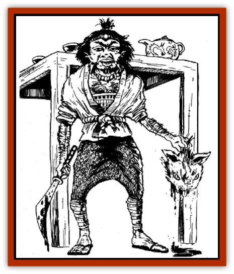

# Korobokuru

| Statistic | **Common Korobokuru** | **Ishikorobokuru** |
| --- | --- | --- |
| **Activity Cycle:** | Any | Any |
| **Alignment:** | Chaotic good | Chaotic good |
| **Armor Class:** | 10 | 10 |
| **Climate/Terrain:** | Tropical, subtropical, and temperate mountains, hills, jungles, and forests | Arctic and subarctic mountains hills, jungles, and forests |
| **Damage/Attack:** | By weapon | By weapon |
| **Diet:** | Omnivore | Omnivore |
| **Frequency:** | Uncommon | Very rare |
| **Hit Dice:** | 1 | 1+2 |
| **Intelligence:** | Semi- to highly (3-15) | Semi- to highly (3-15) |
| **Magic Resistance:** | See below | See below |
| **Morale:** | Elite (13) | Elite (13) |
| **Movement:** | 6 | 6 |
| **No. Appearing:** | 20-200 | 10-100 |
| **No. of Attacks:** | 1 | 1 |
| **Organization:** | Clans | Clans |
| **Size:** | S (4' tall) | S (3' tall) |
| **Special Attacks:** | See below | See below |
| **Special Defenses:** | See below | See below |
| **THAC0:** | 20 | 20 |
| **Treasure:** | Individual: L,N; Clan: R,X | Individual: M,N,Q; Clan: A |
| **XP Value:** | 175 | 270 |

The korobokuru are a race of Oriental [[Dwarf|dwarves]] who live in remote areas. They seldom come in contact with other races.

Korobokuru stand about 4 feet tall. Their arms and legs are slightly longer in proportion to their bodies than those of a human. They are leaner than western dwarves, with an average weight of about 120 to 140 pounds. Most are bowlegged. They have big, bright eyes - either blue, green, or brown. Their ears are small and somewhat pointed. Their noses are round with flaring nostrils, and their lips are wide and full. Thick hair, usually light brown or blonde, covers their arms and legs, and grows in wild tangles from their heads. Most adult males have sparse beards, and even a few women have short whiskers sprouting beneath their chins. The majority of korobokuru are chaotic or neutral, although they have no alignment restrictions.

Korobokuru look wild and unkempt. They favor simple clothing, such as cotton trousers and blouses, or a kimono tied at the waist with a rope sash. Clothing is often loose or oversized, wrinkled but clean. Bright colors are shunned in favor of muted greens and browns. As a rule, korobokuru avoid gaudy jewelry and other flashy accessories, but they wear colorful stones on leather straps around their necks, and sometimes decorate their hair with flowers.

Korobokuru can be barbarians, bushi, samurai, and wu jen. The most common class is barbarian, and samurai are rare. No korobokuru clans hold a position high enough to be samurai. As a result, korobokuru clans must be sponsored by a human clan.

Korobokuru are an extremely hardy race, and as such, they gain a +1 bonus to their initial Strength and Constitution scores. However, they are not exceptionally bright, and their initial Intelligence scores are modified by -2.

All korobokuru speak the language of their tribe. They also can speak the trade language, plus the tongues of the [[Spirit_Folk|spirit folk]] and [[Hengeyokai|hengeyokai]]. They do not speak an alignment language and cannot learn additional tongues.

**Combat:** These dwarves live in harmony with creatures who share their environment, provided those creatures do not compete with them directly. Korobokuru prefer not to associate with other races, however, and they're fiercely territorial. They challenge all unwanted trespassers, attacking if necessary to drive them away.

By nature, korobokuru are more resistant to magical attacks than most other eastern races. They gain a saving throw bonus of +1 per 4½ points of Constitution. (For example, a korobokuru with a Constitution of 10 gains a +2 bonus, while a korobokuru with a Constitution of 7 has a + 1 bonus.) The +1 bonus applies to saves vs. magical rods, staves, wands, or spells.

Korobokuru also resist harm from toxic substances. Because of their exceptionally strong Constitution, all korobokuru make saves vs. poison with the same bonus that applies to magical attacks (+1 for every 4½ points of Constitution).

Korobokuru boast many of the special survival skills of western dwarves, exceeding them in some cases. For instance, the korobokuru have exceptionally keen infravision with a range of 120'. When studying an underground passage, they can accurately determine its grade and slope 80% of the time. They can determine their approximate depth underground 70% of the time. When studying an underground area within 10 feet of their current position, they can detect new tunnel construction 80% of the time, sliding or shifting walls or rooms 70% of the time, and stonework traps, pits, and deadfalls 60% of the time. Additionally, korobokuru have a 66% chance of recognizing and identifying any normal (nonmagical and unintelligent) plant or animal.

Korobokuru enjoy an advantage when battling certain foe. They hate [[Bakemono|bakemono]], [[Goblin|goblins]], [[Goblin_Rat|goblin rats]], and [[Hobgoblin|hobgoblins]]. This hatred is so intense that korobokuru receive a +1 attack bonus when fighting these creatures. In addition, large opponents (giants, [[Oni|oni]], [[Ogre|ogres]], [[Ogre|ogre magi]], [[Titan|titans]], etc.) suffer a -4 penalty when attempting to hit a korobokuru. (This results from the korokoburu's small size, plus their skill at battling larger creatures.)

A typical korobokuru force is half male, half female. Males and females are equally adept at fighting. When prepared for battle, korobokuru usually carry shields and wear leather scale armor, which gives them an AC of 6. Generally, a force is armed as follows: short sword (25%), spear (20%), naginata (20%), bow with leaf head arrows (15%), bow with frog crotch arrows (10%), and blowgun (10%). Because of their size, korobokuru cannot use the no-dachi (two-handed swords), pole arms other than naginata, or any bow but the horsebow.

A korobokuru force consists of 20-200 members, with the following chain of command. A 2nd- to 5th-level barbarian leads each unit of 20 korobokuru. (To determine the level randomly, roll 1d4+1.) If a force includes 60 or more members, a 6th-level barbarian acts as overall commander. (He's the superior of the three barbarian leaders, who each command a group of 20.) If a force has 80 or more members, a supreme commander of 7th or 8th level (50% chance of either) heads up the entire group, including the leaders and commander below him. This supreme commander may be a barbarian (60% chance), bushi (30% chance), or samurai (10% chance). Finally, a force of 80 or more also includes one wu jen of 2nd to 5th level (roll 1d4+1 to randomly determine the level).

Korobokuru avoid the affairs of men. However, humans occasionally may recruit them as allies if the korobokuru can be convinced that a cause is righteous.

**Habitat/Society:** Members of this race dwell in remote sites of great natural beauty, such as lush mountain valleys or sprawling tropical forests. They live in simple villages or camps, and move only when the advance of human settlements requires it. Their buildings are quite crude, with thatched roofs and walls of mud, sticks, and rocks.

These Oriental dwarves organize into families and clans much as humans do. A korobokuru settlement is a huge, extended family, comprising 20-200 (1d100x20) adult males, an equal number of adult females, and a number of children equal to 25% of the adults. Korobokuru mate for life and share a profound bond with their spouses; it is not unusual for a mate to refuse all nourishment if his or her spouse is killed, eventually succumbing to starvation. A female rarely gives birth to more than one or two children during her life. The parents are extremely protective of their young, fighting to the death if necessary to defend them. Korobokuru live for about 400 years.

Culturally, korobokuru are much less advanced than their human neighbors. Some create simple pieces of art, such as modest makimono and kakemono (picture scrolls), and nishiki-e (colored woodcuts). Most of their time is devoted to practical tasks, however, such as hunting and tending small farms near their secluded settlements.

Each family tends to specialize in a certain craft or skill, which the parents teach their children. Common specialties include farming, hunting, fishing, weaving, weaponry, military arts, and painting. At least 50 years of study is required before a korobokuru considers himself a master of his craft. On occasion, an especially skilled korobokuru will accept nonfamily members as apprentices. This practice is encouraged if a settlement needs more members of the master's occupation.

Korobokuru enjoy collecting treasure, especially coins and gems. However, they consider it in poor taste to display their wealth. While traveling, they carry only a few coins. While at home, they rarely keep treasure items on their person. Families bury their treasures in deep holes inside their huts.

Most other races find korobokuru primitive and inferior. Human societies rarely embrace them as equals. Korobokuru typically are seen as rude, pugnacious, boastful, and somewhat comical by the rest of the world. The dwarfish folk resent this reputation, but do little to disprove it.

Korobokuru tend to avoid or shun outsiders, but occasionally they invite a friendly visitor to participate in a special incense ceremony conducted by community elders. This ancient ritual signifies trust and mutual respect. The ritual lasts 24 hours, though characters with the etiquette or tea ceremony proficiency can reduce this time by 25%. The ritual involves the meticulous preparation and burning of an incense, which is made from powdered herbs, roots, and minerals. The korobokuru carefully explain each step of the ceremony to invited participants. If a participant attempts to leave early, the elders become insulted and permanently banish him from the settlement. If a participant completes the ceremony, he is accepted as an equal and is welcome to share the settlement's hospitality for as long as it pleases him.

**Ecology:** Korobokuru produce few items that interest most outsiders, but their makimono, kakemono, and nishiki-e can fetch high prices from collectors of primitive art. In human communities, armor and weapons manufactured by korobokuru are bought for prices up to 10% higher than locally forged items.

Korobokuru tend small farms of vegetables and grains, and supplement their diets with fish and small game. Larger korobokuru settlements raise herds of cattle, sheep, and swine.

**Ishikorobokuru**

  Ishikorobokuru are a rare strain of korobokuru adapted for survival in the coldest regions of Kara-Tur. The ishikorobokuru are shorter and stockier than the common korobokuru. Their skins are bluish, and their hair is silver. They speak their own language as well as the languages of common korobokuru, spirit-folk, hengeyokai, and any human or humanoid races living in the same area. The ishikorobokuru share the same ability restrictions as the common korobokuru. Except for an occasional wu jen, ishikorobokuru are exclusively barbarians.

Ishikorobokuru share the outlook, habits, and abilities of the common korobokuru. In addition to attack bonuses received by korobokuru, the ishikorobokuru also gain a +1 attack bonus against [[Kala|kala]], with whom they sometimes compete for territory. Ishikorobokuru are immune to all cold-based attacks, but they receive double damage from fire-based attacks. A typical ishikorobokuru force is armed with hand axes (30%), spears (25%), clubs (25%), and bows with leaf head arrows (20%). Females fight with the same skill as males.

An ishikorobokuru tribe comprises 10-60 (1d6x10) adult males, an equal number of females, and a number of children equal to 25% of the number of adults. For every 20 males, there is a 2nd- to 5th-level barbarian who serves as leader (roll 1d4+2 to randomly determine the level). In tribes of more than 20 males, a single 6th- or 7th-level barbarian (50% chance of either) serves as the supreme leader. Additionally, these larger tribes include one 2nd- to 5th-level wu jen. The tribes are nomadic, and make temporary settlements in easily defended caves, moving on when they exhaust the game in the area.

---
## Discovery & Documentation

**Source Publication:** MC6 Kara-Tur Appendix (1990)
**Campaign Setting:** Kara-Tur (Forgotten Realms)
**Author(s):** Rick Swan

### Other Creatures Found in This Source Book
   * [[Bajang|Bajang]]
   * [[Bakemono|Bakemono]]
   * [[Bisan|Bisan]]
   * [[Buso|Buso]]
   * [[Carp_Giant|Carp, Giant]]
   * [[Centipede_Spirit|Centipede, Spirit]]
   * [[Chu-u|Chu-u]]
   * [[Con-tinh|Con-tinh]]
   * [[Doc_cu'o'c|Doc cu'o'c]]
   * [[Duruch'i-lin|Duruch'i-lin]]
   * [[Flame_Spirit|Flame Spirit]]
   * [[Foo_Creature|Foo Creature]]
   * [[Gaki|Gaki]]
   * [[Gargantua|Gargantua]]
   * [[Goblin_Rat|Goblin Rat]]
   * [[Hai_Nu|Hai Nu]]
   * [[Hannya|Hannya]]
   * [[Hengeyokai|Hengeyokai]]
   * [[Hsing-sing|Hsing-sing]]
   * [[Hu_Hsien|Hu Hsien]]
   * [[Human_Kara-Tur|Human (Kara-Tur)]]
   * [[Ikiryo|Ikiryo]]
   * [[Jishin_Mushi|Jishin Mushi]]
   * [[Kala|Kala]]
   * [[Kaluk|Kaluk]]
   * [[Kappa|Kappa]]
   * [[Krakentua|Krakentua]]
   * [[Kuei|Kuei]]
   * [[Memedi|Memedi]]
   * [[Men-shen|Men-shen]]
   * [[Nat|Nat]]
   * [[Ningyo|Ningyo]]
   * [[Oni|Oni]]
   * [[P'oh|P'oh]]
   * [[P'oh_Gohei|P'oh, Gohei]]
   * [[Shan_Sao|Shan Sao]]
   * [[Shirokinukatsukami|Shirokinukatsukami]]
   * [[Spirit_Folk|Spirit Folk]]
   * [[Spirit_Nature|Spirit, Nature]]
   * [[Spirit_Stone|Spirit, Stone]]
   * [[Tako|Tako]]
   * [[Tengu|Tengu]]
   * [[Wang-Liang|Wang-Liang]]
   * [[Yuan-ti_Histachii|Yuan-ti, Histachii]]
   * [[Yuki-on-na|Yuki-on-na]]
