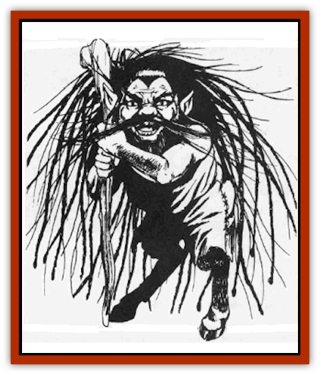

# Korred

| Statistic | **Korred** |
| --- | --- |
| **Activity Cycle:** | Any |
| **Alignment:** | Chaotic neutral |
| **Armor Class:** | 5 |
| **Climate/Terrain:** | Temperate forest and sylvan settings |
| **Damage/Attack:** | 3-6 (1d2+4) or by weapon +4 |
| **Diet:** | Omnivore |
| **Frequency:** | Very rare |
| **Hit Dice:** | 6+1 |
| **Intelligence:** | Very (11-12) |
| **Magic Resistance:** | 25% |
| **Morale:** | Elite (13-14) |
| **Movement:** | 9 |
| **No. Appearing:** | 1-4 |
| **No. of Attacks:** | 1 |
| **Organization:** | Clan |
| **Size:** | S (3' tall) |
| **Special Attacks:** | See below |
| **Special Defenses:** | See below |
| **THAC0:** | 15 |
| **Treasure:** | E |
| **XP Value:** | 1,400 |

When wandering through the world's sylvan forests, travelers should be wary of music and laughter coming from a clearing. More than likely, the cause is the dance-loving korred, a race that is close to nature and jealously protects its way of life.

Perhaps the most striking feature of this gnome-sized race of humanoids is their wildly flowing beards and hair, which seem to snake out in all directions. Their bodies are hairy, with their lower quarters being those of a goat. The korred wear little, usually only a pair of leather britches. Korred smell like pine trees and fresh earth after a spring rainstorm. A stout oaken cudgel is the favored weapon and no korred is seen without his large leather pouches.

They speak their own language and often know the [[Satyr|satyr]], [[Dryad|dryad]], centaur, and [[Elf|elf]] tongues. On rare occasions (10%), a korred may be found who can speak the secret language of the druids. Being a boisterous folk, they usually shout when they talk.

**Combat:** Korred have great strength (average of 18/76) and they use it to hurl boulders up to 100' (damage 2d8). They also use cudgels (damage 1d6+4), or shears which are found in their pouches (damage 1d4+4). Without a weapon the korred can strike for 1 or 2 points of damage, while its great strength adds +4 to this total.

They can trap intruders by weaving their hair into animated entangling ropes and snares in 1-4 rounds. Such ropes are AC 1, have 5 hit points, and a movement rate of 3. Anyone attacked by the rope must save versus paralysis or become entangled. Sometimes a band of korred will leave these entangling strands of hair around the perimeter of their party glen as this enables them to turn their full attention away from such mundane tasks as guard duty and focus their attention on truly worthwhile (to a korrcd) pursuits like dancing and singing.

Korred may employ their magical *laugh* up to three time a day. Anyone within 60' of them must roll his charisma or higher on a d20 or be stunned for 1-4 rounds. Note that a bard's singing can nullify this effect.

In addition to their *laugh*, korred can use the following abilities at will: *stone shape*, *animate rock*, *stone door* (teleport 30'), *shatter rock*, *transmute rock to mud*, and *stone tell*.

**Habitat/Society:** Wooded hills and sylvan settings are favored by the korred, who usually lair in caves or burrows. The korred are clannish, using the word "clan" as a title (for example, Clan Korefyr). In keeping with their chaotic nature, they do not have structured communities. Typically, there are 1-4 adults and 2-8 (2d4) children per family with 2-8 (2d4) families being part of each individual clan. These families are scattered throughout an area of roughly five miles.

In respect of nature, korred are mostly herbivores, though at times they are known to indulge in some game, especially if plants are scarce, as is the case during winter. Korred are reclusive and do not tolerate outsiders, the only possible exception being rangers, druids, and elves. Even then, the stranger must be sure not to interrupt a korred celebration or dance. Satyrs are well-received by korred, and it is not unusual to see a celebration with korred, satyrs and dryads.

Each week the korred have a holiday where they dance and play music using pipes, drums and harps. Those who interrupt the dance must save versus spell or dance themselves, losing 1-4 hit points per round until they are dead, restrained, or the korred flee.

The korred pouches contain hair (for weaving their ropes), shears, and other items. These items will turn to gold if sprinkled with holy water (5d4x10 gp value). No korred will voluntarily give up this pouch.

There is much debate among sages and scholars as to the korred's purpose in life. It seems to be to dance, sing, celebrate, and build strange things out of stone. They are rumored to have built the druid stone circles. They love nature and freedom and often take it upon themselves to preserve both if threatened.

**Ecology:** This magical race is sought out for the creation of several magical items. Their hair is a key ingredient for *ropes of entangling* and *nets of snaring*. The fermented fruit beverages which the korred consume can also be used as a component for *love philters* and *potions of human control*.

---
## Discovery & Documentation

**Source Publication:** MC1 Volume I (w/binder #1) (1991)
**Campaign Setting:** Advanced Dungeons & Dragons 2nd Edition
**Author(s):** Jay Batista, Scott Bennie, Grant Boucher, William W. Connors, Steve Gilbert, Heike Kubasch, James Lowder, David Edward Martin, Bruce Nesmith, Jean Rabe, Rick Swan, John J. Terra, Gary L. Thomas

### Other Creatures Found in This Source Book
   * [[Bat|Bat]]
   * [[Bear|Bear]]
   * [[Behir|Behir]]
   * [[Boar|Boar]]
   * [[Bookworm|Bookworm]]
   * [[Brownie|Brownie]]
   * [[Bugbear|Bugbear]]
   * [[Carrion_Crawler|Carrion Crawler]]
   * [[Cat_Great|Cat, Great]]
   * [[Catoblepas|Catoblepas]]
   * [[Dragon_General_Information|Dragon, General Information]]
   * [[Dragonfish|Dragonfish]]
   * [[Elemental_Air_Kin_Aerial_Servant|Elemental, Air Kin, Aerial Servant]]
   * [[Elemental_Earth_Kin_Sandling|Elemental, Earth Kin, Sandling]]
   * [[Elephant|Elephant]]
   * [[Gnoll|Gnoll]]
   * [[Hobgoblin|Hobgoblin]]
   * [[Homunculus|Homunculus]]
   * [[Hornet_Giant|Hornet, Giant]]
   * [[Horse|Horse]]
   * [[Hyena|Hyena]]
   * [[Jackal|Jackal]]
   * [[Jackalwere|Jackalwere]]
   * [[Lich|Lich]]
   * [[Lizard|Lizard]]
   * [[Lizard_Man|Lizard Man]]
   * [[Lycanthrope_General_Information|Lycanthrope, General Information]]
   * [[Lycanthrope_Seawolf|Lycanthrope, Seawolf]]
   * [[Lycanthrope_Werebear|Lycanthrope, Werebear]]
   * [[Lycanthrope_Weretiger|Lycanthrope, Weretiger]]
   * [[Lycanthrope_Werewolf|Lycanthrope, Werewolf]]
   * [[Manticore|Manticore]]
   * [[Medusa|Medusa]]
   * [[Mind_Flayer|Mind Flayer]]
   * [[Minotaur|Minotaur]]
   * [[Mudman|Mudman]]
   * [[Mummy|Mummy]]
   * [[Nixie|Nixie]]
   * [[Nymph|Nymph]]
   * [[Ogre|Ogre]]
   * [[Ooze_Slime_Jelly_I|Ooze/Slime/Jelly I]]
   * [[Ooze_Slime_Jelly_II|Ooze/Slime/Jelly II]]
   * [[Orc|Orc]]
   * [[Owl|Owl]]
   * [[Owlbear_I|Owlbear I]]
   * [[Pegasus|Pegasus]]
   * [[Piercer|Piercer]]
   * [[Pudding_Deadly|Pudding, Deadly]]
   * [[Rakshasa|Rakshasa]]
   * [[Rat|Rat]]
   * [[Ray|Ray]]
   * [[Remorhaz|Remorhaz]]
   * [[Satyr|Satyr]]
   * [[Scorpion|Scorpion]]
   * [[Selkie|Selkie]]
   * [[Shadow|Shadow]]
   * [[Skeleton|Skeleton]]
   * [[Skunk|Skunk]]
   * [[Snake|Snake]]
   * [[Spectre|Spectre]]
   * [[Spider|Spider]]
   * [[Sprite|Sprite]]
   * [[Toad_Giant|Toad, Giant]]
   * [[Treant|Treant]]
   * [[Troll|Troll]]
   * [[Umber_Hulk|Umber Hulk]]
   * [[Unicorn|Unicorn]]
   * [[Vampire|Vampire]]
   * [[Wight|Wight]]
   * [[Will_O'Wisp|Will O'Wisp]]
   * [[Wolf|Wolf]]
   * [[Wolfwere|Wolfwere]]
   * [[Wraith|Wraith]]
   * [[Wyvern|Wyvern]]
   * [[Yeti|Yeti]]
   * [[Yuan-ti|Yuan-ti]]
   * [[Zombie|Zombie]]
