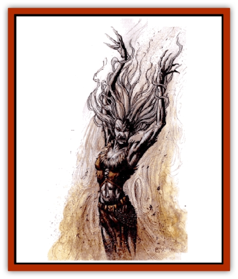

# Krag

| Statistic | **Krag** |
| --- | --- |
| **Activity Cycle:** | Any |
| **Alignment:** | Chaotic evil |
| **Armor Class:** | 4 |
| **Climate/Terrain:** | Special |
| **Damage/Attack:** | By weapon or 1-6/1-6 |
| **Diet:** | Nil |
| **Frequency:** | Very rare |
| **Hit Dice:** | 11 |
| **Intelligence:** | Exceptional (15-16) |
| **Magic Resistance:** | 20% |
| **Morale:** | Champion (15) |
| **Movement:** | 12 |
| **No. Appearing:** | 1 |
| **No. of Attacks:** | 1 or 2 |
| **Organization:** | Solitary |
| **Size:** | M (5-7' tall) |
| **Special Attacks:** | By type, elemental transfusion |
| **Special Defenses:** | Psionics |
| **THAC0:** | 12 |
| **Treasure:** | C |
| **XP Value:** | 5,000 +600 for magma krags |

**Psionics Summary**

| Level | Dis/Sci/Dev | Attack/Defense | Score | PSPs |
| --- | --- | --- | --- | --- |
| 10 | 2/3/11 | All/All | 15 | 120 |

**Psychokinesis -** *Science:* telekinesis; *Devotions:* animate object, animate shadow, ballistic attack.

**Clairsentience -** *Sciences:* clairaudience, clairvoyance; *Devotions:* all-round vision, combat mind, danger sense, feel light, feel sound, know direction, know location, radial navigation.

Krags are undead created when a cleric aligned to an element or para-element dies in the medium diametrically opposed to his own. The anguish and trauma of dying to the very force he devoted his life to opposing is sometimes enough to transform a cleric into a wicked and bitter undead. The elemental lords of the new power quickly enslave such an undead cleric to their service.

Not all elements and para-elements have opponents in this sense, but a general rule is that if one element can destroy or change another, the two are diametrically opposed. Of the eight, water is the element with the most powers aligned against it. The entries should be read both ways. If fire is opposed to water, then water is opposed to fire.

| Element | Opposition | Element | Opposition |
| --- | --- | --- | --- |
| Earth | Magma | Silt | Water |
| Air | Sun | Sun | Water, air, rain |
| Fire | Water | Rain | Silt, sun |
| Water | Fire, sun, silt, magma | Magma | Water, earth |

Krags look much like the individuals they were created from, except that they also take on the appearance of the element that killed them. A silt-krag, for instance, would have dry leathery skin and choking dust would constantly fall from its mouth, nose, and ears. A magma-krag, on the other hand, would be a mass of dripping, molten earth.

**Combat:** Krags can use weapons or their claws in melee. They can also deliver an elemental transfusion through their bite which poisons the victim's blood with the krag's element. The bite causes 2d6 points of damage if it hits. A bitten character must make a saving throw versus death, or his blood will slowly turn into the krag's element. As the blood changes, the victim suffers 1d4 additional points of damage per round. If death results, there is a 45% chance that the victim will become a kragling in 1d4 days. This infection counts as a poison or a disease for purposes of countering, so *sweet water* or even a cure *disease spell* will halt the process instantly.

Krags also gain complete immunity to their element. They can't be affected or harmed by it in any way. Twice per day, the undead can exercise control over its element. This is limited to 1 cubic foot of material per Hit Die of the krag. Each element may be manipulated however the krag desires, but the attacks listed below are the most common:

*Magma jet:* The cone is 1 foot wide at the base, 11 feet long, and 11 feet wide at the end. Anything hit by the magma takes 11d6 points of damage. The victim takes 10d6 on the next round, 9d6 on the third, and so on until he is either incinerated or the molten earth is extinguished or removed. This damage is halved if a character makes a saving throw versus breath weapon.

*Sun beam:* A sun beam is 22 feet long and can strike targets in a straight line from the creature's hand to the end of the beam. Anything in the path must make a save versus breath weapon. Failure inflicts 11d6 points of damage and may set combustible materials on fire. A successful save halves this damage.

*Silt storm:* Silt krags generally use cunning and traps instead of direct attacks. A favorite tactic is to create a storm 22 feet in diameter around potential prey, then attack in the confusion with claws and bite. Anyone caught in a silt storm receives a -2 penalty to attack, damage, save, and initiative rolls.

*Lightning bolt:* Rain krags use lightning as their weapon of choice. This acts exactly as a *lightning bolt* spell, causing 11d6 points of damage to anyone hit by it (half if save is successful).

*Flame strike:* A swath of flame leaps from the krag's mouth and bathes anyone within its cone in elemental fire for 11d6 points of damage. The cone is 1 foot wide at the base, 11 feet long, and 11 feet wide at the end.

*Water jet:* Water krags have the ability to *create water* inside a victim's lungs. The krag can affect up to 11 individuals, and each must make a save versus death magic. Failure means that they have failed to expel the fluid and drown in a number of rounds equal to 1/3 their Constitution (round up). Only *cure* spells or magic that can remove water will save a character.

Shower of stone: Earth krags can form huge chunks of rocky earth out of the land and use them to slam into opponents. Every victim in an 11-foot radius of the shower's center takes 11d6 points of damage, half if a save versus breath weapon is made.

*Cyclone:* Air krags typically create a cyclone with an 11-foot radius. The cyclone can attack aerial creatures. It whips up debris and causes 11d6 points of damage. A save versus breath weapon halves this damage.

Any attack form consisting of a krag's original element does double damage. A silt brag that once served the plane of water, for instance, would take double damage from any water-based spell. Also, a cleric of the krag's current power gains +2 to turn them, though they may never control them. Priests of the original power are at -2.

**Habitat/Society:** Krags haunt the area they were killed in and remain only to harm those who enter their lands. Most will actively seek to make an army of kraglings to keep them company, especially if they can bring down a creature of the same race as they were in life.

**Ecology:** Krags are rare on Athas, though they are more common around places such as the Silt Sea. They can also be found wherever one element threatens another and clerics are sent to protect their patron.

---
## Discovery & Documentation

**Source Publication:** City by the Silt Sea (1994)
**Campaign Setting:** Dark Sun
**Author(s):** Shane Lacy Hensley

### Other Creatures Found in This Source Book
   * [[Beetle_Dragon|Beetle, Dragon]]
   * [[Caller_in_Darkness|Caller in Darkness]]
   * [[Dray|Dray]]
   * [[Dregoth|Dregoth]]
   * [[Dwarf_Cursed_Dead|Dwarf, Cursed Dead]]
   * [[Kalin|Kalin]]
   * [[Kragling|Kragling]]
   * [[Pit_Snatcher|Pit Snatcher]]
   * [[Silt_Serpent|Silt Serpent]]
   * [[Silt_Spawn|Silt Spawn]]
   * [[Venger|Venger]]
   * [[Wall_Walker|Wall Walker]]
