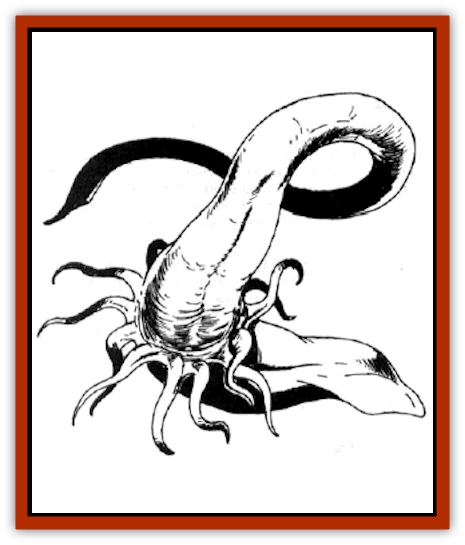
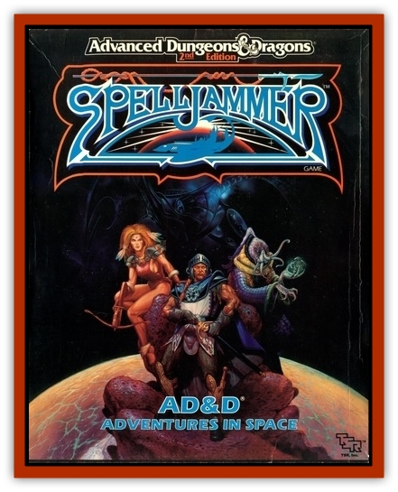

# Krajen

| Statistic | **Adult** | **Immature** |
| --- | --- | --- |
| **Activity Cycle:** | Any | Any |
| **Alignment:** | Neutral | Neutral |
| **Armor Class:** | 3 | 9 |
| **Climate/Terrain:** | Any | Any |
| **Damage/Attack:** | 3-18 and 1-3 | 1-3 |
| **Diet:** | Omnivore | Scavenger |
| **Frequency:** | Very rare | Common |
| **Hit Dice:** | 12 | ½ |
| **Intelligence:** | Semi- (2) | Non- (0) |
| **Magic Resistance:** | 30% | Nil |
| **Morale:** | Elite (13) | Unsteady (7) |
| **Movement:** | 18 | 3 |
| **No. Appearing:** | 1 | 10-100 |
| **No. of Attacks:** | 1-12 | 1 |
| **Organization:** | Solitary | Colony |
| **Size:** | G (40' high) | S (1' high) |
| **Special Attacks:** | Paralysis, crush | Paralysis |
| **Special Defenses:** | Nil | Nil |
| **THAC0:** | 9 | 20 |
| **Treasure:** | G | Nil |
| **XP Value:** | 8,000 | 35 |

The krajen develops in three stages: small spaceborne spores, a barnaclelike immature stage, and the huge, adult krajen that is the bane of the shipways. In its adult stage, the krajen can grow longer than most ships, and resembles a [[Squid_Giant|gargantuan aquatic squid]]. Its tubelike body is dominated at one end by a thick central tentacle, the base of which is surrounded by a cluster of smaller tentacles.

**Combat:** Adult krajens are holy terrors, attacking anything that comes within comfortable distance of them with a huge central tentacle and a cluster of twelve lesser tentacles. The krajen's central tentacle can crush objects of more than huge size, inflicting either 3-30 hit points or 1-3 hull points of damage, depending on the target. On a hit of 18 or better, the central tentacle has looped around the target and can crush each round thereafter automatically. Even when not crushing the life out of a victim, the central tentacle can inflict up to 3-18 points of damage in combat.

The smaller tentacles that ring the large central tentacle are called sentries, and act to protect the main shaft. They are thin, snakelike members, tipped with a paralysis poison that causes those hit to save vs. poison or be paralyzed for 3-30 rounds. The adult krajen can use all its tentacles at one time, though no more than two tentacles will engage a man-sized target.

A common krajen tactic is to snare a ship and crush it with the central tentacle, while the smaller sentries deal with the crew and other creatures trying to attack it. Only after all the attackers are paralyzed or slain will the krajen feed, crushing the paralyzed survivors. The krajen will feed over several days, fall into slumber for a few months, then move off for new conquests.

**Habitat/Society:** The krajen has no real social organization. The monstrous adult krajens are solitary creatures, and should one encounter another, it will treat it as any other creature and probably attack. The krajens are immune to their own paralysis poison and that of their young, and will destroy ships that are carrying their young and consume them as readily as not.

**Ecology:** In the krajen's youngest form, its spores are harmless, and can be slain by such simple spells as cure disease. They drift like windborne seeds in the void, waiting for the approach of a ship or other solid body. They are so small that a spelljamming ship can pass through a cloud of them without stopping and without its crew noticing. It is only when the spores take root in the hull of the ship that they are noticeable.

Krajen spores can take root in any solid object, including asteroids, ship hulls, and large living creatures. Once planted, the base of the spore widens and digs into the surfacer while the outer surface hardens into a shell similar to a barnacle's. The central tentacle is nested in an opening at the top of this shell. In case of normal attacks on the immature krajen, the tentacle can whip out to attack enemies in the area, lashing out at random. When dormant, the tentacle is tucked inside the top of the shell.

Immature krajens can survive without air, and in fact prefer the stale air of bad air envelopes over the healthy air of areas replenished by green plants. They do need a solid surface to draw nutrients from, though each one can also absorb nutrients from dead bodies that it and the rest of the colony have destroyed.

When the immature krajens have pulled the equivalent of 2 hull points of material from a surface (i.e. in about two months), they disengage and float into space. At this point the gripping base closes and the sentry tentacles appear. Feeding on the stored, concentrated energy, the krajen attains its adult size and goes hunting. Large groups of immature krajens often hunt other krajens, until only one member of the group survives and reaches full size.

Adult krajens grow throughout their entire lives, such that legends of particularly huge individuals surface from time to time. Krajens feed on ships almost accidentally, as their main prey are [[Kindori|kindori]], [[Dragon_Radiant|radiant dragons]], and other large creatures.

One rumor that has appeared in a number of spheres is of a lesser race of human barbarians who have tamed the krajens through use of alchemic mixtures. They have traded these mixtures to the [[Arcane|arcane]] in exchange for lifejammers, which they have hooked up to the relatively mindless kraken. Using the lifejammer-driven krajen, this lesser race is suddenly appearing as a major menace to shipping, often preying on other pirates and marauders.

---
## Discovery & Documentation

**Source Publication:** AD&D Adventures In Space (1989)
**Campaign Setting:** Spelljammer
**Author(s):** Jeff Grub

### Other Creatures Found in This Source Book
   * [[Arcane|Arcane]]
   * [[Beholder_and_Beholder-kin_I|Beholder and Beholder-kin I]]
   * [[Beholder_and_Beholder-kin_II|Beholder and Beholder-kin II]]
   * [[Dracon|Dracon]]
   * [[Dragon_Radiant|Dragon, Radiant]]
   * [[Elmarin|Elmarin]]
   * [[Ephemeral|Ephemeral]]
   * [[Giff|Giff]]
   * [[Kindori|Kindori]]
   * [[Neogi|Neogi]]
   * [[Scavver|Scavver]]
