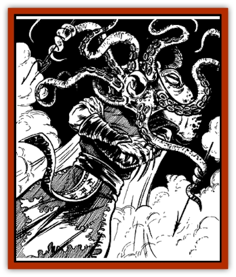

# Krakentua

| Statistic | **Krakentua** |
| --- | --- |
| **Activity Cycle:** | Night |
| **Alignment:** | Chaotic evil |
| **Armor Class:** | 4 |
| **Climate/Terrain:** | Tropical, subtropical, temperate oceans |
| **Damage/Attack:** | See below |
| **Diet:** | Special |
| **Frequency:** | Very rare |
| **Hit Dice:** | 50 |
| **Intelligence:** | Genius (17) |
| **Magic Resistance:** | Nil |
| **Morale:** | Fanatic (17) |
| **Movement:** | 18, Sw 12 (females: Fl 12), Tentacles: 12 |
| **No. Appearing:** | 1 |
| **No. of Attacks:** | 7 (tentacles), 2 (fists) |
| **Organization:** | Solitary |
| **Size:** | G (80-100') |
| **Special Attacks:** | Trample, spit, mist |
| **Special Defenses:** | See below |
| **THAC0:** | 7 |
| **Treasure:** | Nil |
| **XP Value:** | 45,000 |

Among the most fearsome creatures in all of Kara-Tur, the krakentua is a powerful demon spirit with an insatiable appetite for destruction and an obsessive desire to enslave those it considers inferior.

The krakentua has the body of a human and the head of a [[Squid_Giant|kraken]]. It stands 80-100 feet tall, and wears luxuriant silken robes in rich colors, usually violet or red. Its leathery, dark green skin is as cool to the touch as a serpent's scales. Seven tentacles extend from its head, each nearly 20 feet long. The tentacles are as agile as human hands, capable of wielding weapons and tools with ease.

The krakentua has huge red eyes with black pupils, and a chitinous beak hidden beneath its tentacles. Red mist continually oozes from the pores of its body. As a result, many observers to mistakenly believe the creature hovers atop a crimson cloud. The beast can breathe both water and air.

A master of language, the krakentua is conversant in the tongues of all lands and creatures of Kara-Tur.

**Combat:** A male krakentua typically has 200-250 hit points, while the average female boasts 350. The male attacks with its tentacles, using them like whips to inflict 1-4 hp of damage each. If a tentacle makes a successful hit, it can grab its victim too, inflicting 1-10 hp of crushing damage in each subsequent round. The tentacle has the following chances of pinning its victim's arms: one upper limb, 50%; neither limb, 25%; both limbs, 25%. The victim cannot free himself unless the tentacle is severed. Each of the seven tentacles has 15 hp (which is in addition to the hit points of the body). A krakentua commonly wields weapons in some of its tentacles, preferring katana and wakizashi.

A male krakentua can attack with his fists for 1-10 hp of damage each. He also can trample victims who fall underfoot for 1-100 hp of damage. He can spit a stream of cherry milk at any single victim up to a distance of 100'; the victim must save vs. poison or be blinded for 2-12 segments. He can belch a cloud of foul red mist 50 feet in diameter; victims within the mist cloud must save vs. poison or suffer 1 hit point of damage.

A female krakentua is considerably more powerful than the male. Her tentacles strike for 1-8 hp of damage and inflict 2-12 hp of constriction damage per round. In addition to all of the male's abilities, she boasts continual *ESP*, *clairaudience*, *detect lie*, *detect evil*, and *detect good*.

In intelligent victims, a female can induce dreams so lifelike that they are indistinguishable from reality. While her victims dream, the krakentua can imprint their mental aura, which allows her to track them later. The more energy the victims expend in their dreams (e.g., by fighting for their lives in the dreamworld), the stronger the imprint. The stronger the imprint, the greater the krakentua's ability to find them later. Creating the dreams is extremely stressful for the krakentua. She cannot create dreams for more than an hour a month, and she can never create more than three dreams in immediate succession.

Unlike males, female krakentua have a limited ability to fly, hovering through the air as if levitating. The female can fly for up to 10 hours before she must immerse herself in sea water for a full day. When flying, she sheds a mysterious "trail" of dead octopi. The octopi seldom exceed 3' in diameter. It is thought that the krakentua *gates* in octopi from the ocean, and absorbs their lifeforce to power her flight.

**Habitat/Society:** Krakentua can be found in any remote sea area of Kara-Tur. They prefer uninhabited islands or the warm ocean depths, but occasionally they dwell off-shore near civilized coasts.

Krakentua reproduce asexually. The female has an eighth tentacle that functions solely as a reproductive organ. When the female reaches full maturity (about 1,000 years old), the eighth tentacle breaks off and sinks to the bottom of the ocean. One to four buds form on the tentacle. Each bud swells into a pod, 30' in diameter, then hatches a new krakentua.

Krakentua have no affinity for treasure. However, they are obsessed with maintaining a congregation of slaves, who must worship and honor them. Human slaves are preferred.

**Ecology:** Krakentua consume any type of vegetable matter. In particular, they relish cherries and cherry tree milk.

---
## Discovery & Documentation

**Source Publication:** MC6 Kara-Tur Appendix (1990)
**Campaign Setting:** Kara-Tur (Forgotten Realms)
**Author(s):** Rick Swan

### Other Creatures Found in This Source Book
   * [[Bajang|Bajang]]
   * [[Bakemono|Bakemono]]
   * [[Bisan|Bisan]]
   * [[Buso|Buso]]
   * [[Carp_Giant|Carp, Giant]]
   * [[Centipede_Spirit|Centipede, Spirit]]
   * [[Chu-u|Chu-u]]
   * [[Con-tinh|Con-tinh]]
   * [[Doc_cu'o'c|Doc cu'o'c]]
   * [[Duruch'i-lin|Duruch'i-lin]]
   * [[Flame_Spirit|Flame Spirit]]
   * [[Foo_Creature|Foo Creature]]
   * [[Gaki|Gaki]]
   * [[Gargantua|Gargantua]]
   * [[Goblin_Rat|Goblin Rat]]
   * [[Hai_Nu|Hai Nu]]
   * [[Hannya|Hannya]]
   * [[Hengeyokai|Hengeyokai]]
   * [[Hsing-sing|Hsing-sing]]
   * [[Hu_Hsien|Hu Hsien]]
   * [[Human_Kara-Tur|Human (Kara-Tur)]]
   * [[Ikiryo|Ikiryo]]
   * [[Jishin_Mushi|Jishin Mushi]]
   * [[Kala|Kala]]
   * [[Kaluk|Kaluk]]
   * [[Kappa|Kappa]]
   * [[Korobokuru|Korobokuru]]
   * [[Kuei|Kuei]]
   * [[Memedi|Memedi]]
   * [[Men-shen|Men-shen]]
   * [[Nat|Nat]]
   * [[Ningyo|Ningyo]]
   * [[Oni|Oni]]
   * [[P'oh|P'oh]]
   * [[P'oh_Gohei|P'oh, Gohei]]
   * [[Shan_Sao|Shan Sao]]
   * [[Shirokinukatsukami|Shirokinukatsukami]]
   * [[Spirit_Folk|Spirit Folk]]
   * [[Spirit_Nature|Spirit, Nature]]
   * [[Spirit_Stone|Spirit, Stone]]
   * [[Tako|Tako]]
   * [[Tengu|Tengu]]
   * [[Wang-Liang|Wang-Liang]]
   * [[Yuan-ti_Histachii|Yuan-ti, Histachii]]
   * [[Yuki-on-na|Yuki-on-na]]
