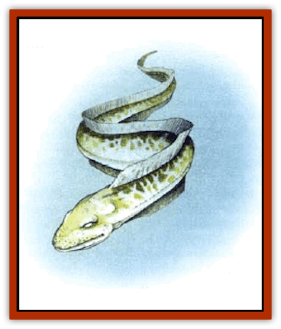

# Kreel

| Statistic | **Kreel** |
| --- | --- |
| **Activity Cycle:** | Day |
| **Alignment:** | Neutral |
| **Armor Class:** | 7 |
| **Climate/Terrain:** | The Last Sea |
| **Damage/Attack:** | 1-6 |
| **Diet:** | Herbivore |
| **Frequency:** | Uncommon |
| **Hit Dice:** | 3 |
| **Intelligence:** | Animal (1) |
| **Magic Resistance:** | Nil |
| **Morale:** | Unsteady (7) |
| **Movement:** | Sw 12 |
| **No. Appearing:** | 2-20 (1-4 in the wild) |
| **No. of Attacks:** | 1 |
| **Organization:** | School |
| **Size:** | M (4-6' long) |
| **Special Attacks:** | Nil |
| **Special Defenses:** | Nil |
| **THAC0:** | 18 |
| **Treasure:** | Nil |
| **XP Value:** | 65 |

Kreel are large domesticated [[Eel|eels]] that [[Lizard_Man_Athas|lizard men]] use both as a source of food and as beasts of burden. When mature, they range from four to six feet long, and can be up to one foot in diameter.

Their coloration changes in a chameleonlike way to help camouflage them against their background. When near the surface of the sea, their backs turn blue-green and their bellies white. This helps to protect them from predators both above and below. When nearer the bottom of the sea, they become entirely dark.

**Combat:** Kreel are peaceful creatures, and they will only fight to defend themselves. They are incapable of using group tactics to fend off predators, tending to rely upon their camouflaging abilities to hide from such creatures.

When cornered, kreel will retaliate, but even then they will flee at the first opportunity. They often use their relative slimness to slip into places in the sea floor where predators cannot fit. A kreel caught by a [[Shark_Athas|shark]] in open waters, however, is an easy meal.

**Habitat/Society:** While a few kreel can be found swimming wild in Marnita, most belong to flocks tended by pairs of lizard men kreelherders. These lizard men ensure that the flock is well fed on the kelp growing wild throughout the sea and that it is safe from any wandering predators. Long-time kreelherders carry the scars of many battles with sharks, and some even tell of seeing the legendary [[Squid_Squark|squark]].

**Ecology:** Down through the centuries, even rudimentary cunning has been bred out of the kreel. After all, sneaky creatures are difficult to care for. There is little doubt that, were the lizard men to abandon them, the kreel would be hunted to extinction by their natural enemies within a very short period of time.

Kreel graze on wild kelp, easily available just about anywhere in Marnita. Their meat is tasty (at least to lizard men), and their hides are extremely useful in all sorts of ways. They are the basis of the lizard man culture in the Last Sea, for without them the reptilian humanoids would be forced to look elsewhere for a large portion of their meals.

---
## Discovery & Documentation

**Source Publication:** Monstrous Compendium, 1997 Annual, Volume 4 (1995)
**Campaign Setting:** Advanced Dungeons & Dragons 2nd Edition
**Author(s):** Jon Pickens

### Other Creatures Found in This Source Book
   * [[Anemone_Giant_Sea|Anemone, Giant Sea]]
   * [[Asperii|Asperii]]
   * [[Bainligor|Bainligor]]
   * [[Beast_of_Chaos|Beast of Chaos]]
   * [[Blindheim|Blindheim]]
   * [[Bloodsipper_Far_Realm|Bloodsipper (Far Realm)]]
   * [[Bulette_Gohlbrorn|Bulette, Gohlbrorn]]
   * [[Child_of_the_Sea|Child of the Sea]]
   * [[Clockwork_Horror|Clockwork Horror]]
   * [[Clockwork_Swordsman|Clockwork Swordsman]]
   * [[Coral|Coral]]
   * [[Darklore|Darklore]]
   * [[Dharculus|Dharculus]]
   * [[Dolphin_Athas|Dolphin (Athas)]]
   * [[Dragon_Neutral_Moonstone|Dragon, Neutral, Moonstone]]
   * [[Dragon_Prismatic|Dragon, Prismatic]]
   * [[Dream_Stalker|Dream Stalker]]
   * [[Dragon-kin_Albino_Wyrm|Dragon-kin, Albino Wyrm]]
   * [[Echyan|Echyan]]
   * [[Firestar|Firestar]]
   * [[Firetail|Firetail]]
   * [[Fish_Ascallion|Fish, Ascallion]]
   * [[Fish_Deep_Ocean|Fish, Deep Ocean]]
   * [[Fish_Tropical|Fish, Tropical]]
   * [[Fish_Vurgens|Fish, Vurgens]]
   * [[Fogwarden|Fogwarden]]
   * [[Fraal|Fraal]]
   * [[Giant_Crag|Giant, Crag]]
   * [[Gibberling_Brood|Gibberling, Brood]]
   * [[Glutton_Sea|Glutton, Sea]]
   * [[Golden_Ammonite|Golden Ammonite]]
   * [[Golem_Brass_Minotaur|Golem, Brass Minotaur]]
   * [[Golem_Gemstone|Golem, Gemstone]]
   * [[Golem_Maggot|Golem, Maggot]]
   * [[Groundling|Groundling]]
   * [[Hermit_Sea|Hermit, Sea]]
   * [[Hound_of_Law|Hound of Law]]
   * [[Human_Amazon|Human, Amazon]]
   * [[Human_Pygmy|Human, Pygmy]]
   * [[Inquisitor|Inquisitor]]
   * [[Kercpa|Kercpa]]
   * [[Lycanthrope_Lythari|Lycanthrope, Lythari]]
   * [[Mercurial|Mercurial]]
   * [[Mold_Chromatic|Mold, Chromatic]]
   * [[Mummy_Bog|Mummy, Bog]]
   * [[Neh-thalggu|Neh-thalggu]]
   * [[Nymph_Grain|Nymph, Grain]]
   * [[Nymph_Unseelie|Nymph, Unseelie]]
   * [[Octopus_Octo-Jelly|Octopus, Octo-Jelly]]
   * [[Puddingfish|Puddingfish]]
   * [[Sea_Demon|Sea Demon]]
   * [[Shade|Shade]]
   * [[Shadowrath|Shadowrath]]
   * [[Shark_Athas|Shark (Athas)]]
   * [[Siren_Ravenloft|Siren (Ravenloft)]]
   * [[Skeleton_Variant|Skeleton, Variant]]
   * [[Skyfish|Skyfish]]
   * [[Spectral_Scion|Spectral Scion]]
   * [[Spyder_Fiend|Spyder Fiend]]
   * [[Squid_Squark|Squid, Squark]]
   * [[Tanar'ri_Lesser_Uridezu|Tanar'ri, Lesser, Uridezu]]
   * [[Troll_Mutate|Troll Mutate]]
   * [[Vaati|Vaati]]
   * [[Vampire_Cerebral|Vampire, Cerebral]]
   * [[Varkha|Varkha]]
   * [[Wizshade|Wizshade]]
   * [[Worm_Lukhorn|Worm, Lukhorn]]
   * [[Wyste|Wyste]]
   * [[Yugoloth_Lesser_Gacholoth|Yugoloth, Lesser, Gacholoth]]
   * [[Zombie_Mud|Zombie, Mud]]
