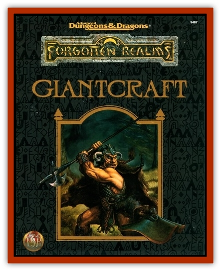

# Krotter

| Statistic | **Krotter** |
| --- | --- |
| **Activity Cycle:** | Any |
| **Alignment:** | Neutral |
| **Armor Class:** | 3 |
| **Climate/Terrain:** | Ice Spires, arctic |
| **Damage/Attack:** | 1d4/1d4/1-3 |
| **Diet:** | Herbivore |
| **Frequency:** | Uncommon |
| **Hit Dice:** | 4 |
| **Intelligence:** | Animal (1) |
| **Magic Resistance:** | Nil |
| **Morale:** | Average (10) |
| **Movement:** | 6 |
| **No. Appearing:** | 4d10 |
| **No. of Attacks:** | 3 |
| **Organization:** | Herd |
| **Size:** | L (6' at shoulder) |
| **Special Attacks:** | Stampede |
| **Special Defenses:** | None |
| **THAC0:** | 17 |
| **Treasure:** | None |
| **XP Value:** | 80 |

Krotter are heavy, well muscled herd animals resembling large [[Mammal_Herd_II|yaks]]. They sport thick, stringy fur that hangs down off their bodies so far that it nearly touches the ground. Atop their heads are two small, jagged antlers (useless in combat), their hooves are cloven and smaller than one might expect, and their backs are sharply humped. Krotter's eyes are thin and tucked within several layers of fat to protect them from the snow glare and the blowing debris during snowstorms.

Most krotter are a dirty ivory color, though some are brown, black, even dull red. Whenever their herds pass an obviously living creature they all emit a characteristic high pitched whine in series (each krotter whining as it spots the creature) as a warning. Other than these few outbursts, the creatures are generally totally silent save for the occasional grunt or snort.

**Combat:** Although their bodies are adapted to blistering arctic temperatures and therefore armored in thick hide and fat, krotter are poorly adapted to combat. If threatened the beasts can do little more than kick at their foes with their powerful forelimbs and attempt an occasional bite with their strong, pulling jaws. Given enough space, a krotter might charge an opponent, increasing its movement rate to 12 and doubling its kick damage, but the beasts' incredible bulk makes it impossible for them to perform this manuever more than once.

Although krotter are not particularly intelligent, they do have a sort of strange instinct that protects them against the kinds of attacks commonly employed against them by the predators who try to trap or kill them. Pack hunting tactics, snare and lure techniques, and common herding tactics typically fail to snare them.

The one real danger krotter pose lies in their thundering stampedes. Any time one of the beasts suffers damage in combat, there is a 25% chance of triggering a stampede. During such these mad rushes, the creatures instinctively herd together and thunder in the general direction of their nearest adversary. Unless the target can outrun the herd (the krotter's movement jumps to 15 during a stampede), it is automatically hit and struck for 2d10 points of damage (successful save vs. breath weapon cuts damage in half), provided the herd consists of 12 or more animals. Smaller herds inflict only 1d12 points of damage. After a stampeding herd runs roughshod over its target, it generally keeps running until it reaches safety, never turning around to attack again.

**Habitat/Society:** Although they are remarkably stupid beasts in almost all other respects, krotter have the aforementioned abilities to warn each other in times of potential crisis and avoid common traps.

Krotter survive by locating the scant vegetation capable of surviving in the arctic environment. In fact, travelers who find themselves lost amidst snow storms often follow any stray krotter they stumble across, knowing the beasts will eventually lead them back to a landmark.

Unlike other forms of cattle, krotter do not battle for dominance amongst themselves. In fact, at times, the creatures are remarkably cooperative. At night, they sleep standing up in tight clusters to conserve body warmth and provide additional protection.

Krotter reproduce and grow and an almost incredible rate. Nearly every cow in a typical herd gives birth to single calf almost every year, and these calfs grow to almost half their final size by the end of that year - yet another adaptation necessary for survival in harsh arctic environments.

**Ecology:** Although the taste of their flesh is perhaps below human standards (though many humans eat it), krotter are herded and tendered by a wide variety of artic cultures, among them almost all of the various Jotunbrud tribes of the Ice Spires. In fact, the large krotter herds that roam through the valley between the Ice Spires are so important to the various giant settlements in the region that the giant population tends to vary in perfect proportion with that of the krotter. Any disease or other calamity that runs through the herds is ultimately reflected in dead giants back at the steadings.

Most of the races that tend krotter herds also craft parkas, tents, and other cold weather gear from their thick hides. Similarly, krotter fat makes an ideal fuel for lamps and campfires.

---
## Discovery & Documentation

**Source Publication:** FOR7 Giantcraft (1993)
**Campaign Setting:** Forgotten Realms
**Author(s):** Ray Winninger

### Other Creatures Found in This Source Book
   * [[Ogre_Ice_Spire|Ogre, Ice Spire]]
   * [[Shadowhound|Shadowhound]]
