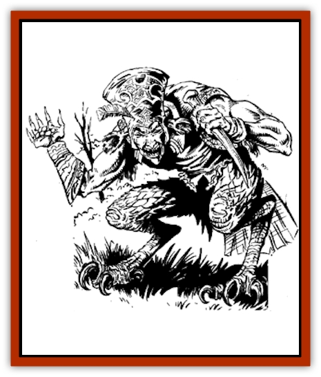

# Kruel

| Statistic | **Kruel** |
| --- | --- |
| **Activity Cycle:** | Any |
| **Alignment:** | Chaotic evil (neutral) |
| **Armor Class:** | 4 |
| **Climate/Terrain:** | Temperate/Forests, hills, rural |
| **Damage/Attack:** | 1d4 +4/1d4 (see text) |
| **Diet:** | Omnivore |
| **Frequency:** | Rare |
| **Hit Dice:** | 1+8 |
| **Intelligence:** | Very (11-12) |
| **Magic Resistance:** | 10% |
| **Morale:** | Steady (11) |
| **Movement:** | 15 |
| **No. Appearing:** | 2-5 |
| **No. of Attacks:** | 2 |
| **Organization:** | Group |
| **Size:** | M (5' tall) |
| **Special Attacks:** | Missiles, set fires |
| **Special Defenses:** | Resist fire, evade blows, minor spells |
| **THAC0:** | 19 |
| **Treasure:** | W&times;½ |
| **XP Value:** | 270 |

These creatures were once good sylvan folk, but some great evil blighted their race and gained them their new name. They reportedly still have dealings with [[Sprite|pixies]] and some [[Elf|wood elves]], and it is known that they do not wantonly destroy woodlands with their powers, so perhaps some traces of their original nature remain. Even so, kruels are now undoubtedly evil and spiteful monsters in most respects, and they cause much suffering in rural communities. They speak Common and a smattering of woodland tongues.

Kruels appear as sharp-featured elves from the waist up, with long bony fingers, large cowlike ears, and eyes that are (except for the pupil) startlingly blood-red. Their legs are birdlike and green scaled. They prefer bright green, lilac, and scarlet garb, also wearing tall hats, each set off with a red feather.

**Combat:** Kruels fight only the apparently weak, preferring to harass more powerful opponents from a distance. Any pebble they hurl becomes magically empowered for that round, burning like a red-hot coal. They can throw two pebbles a round at +2 to hit, at a range of 40 yards (no range penalties apply). The stones cause 1-4 hp damage if they hit. The stones will ignite combustibles (item saving throws vs. normal fire are required) but cease burning themselves after one round.

Kruels can use the spell *flame blade* at will, and they enter melee with this spell and a dagger, striking once per round with each with no penalty. They are quick, agile, and unpredictable in combat; if they win initiative, they have a 30% chance that round to evade each blow struck at them that would have otherwise hit, regardless of the attacker's roll.

Kruels can cast both *cantrip* and *alter self* twice per day at the 1st level of magic use, but since their eyes retain their distinctive coloration in any form, the latter power is commonly used for escape (flying or swimming) rather than disguise. They naturally resist fire as the spell, and they are intelligent enough to take advantage of this in combat if the situation permits.

**Habitat/Society:** Kruels usually dwell on the fringes of civilization, where they prey on farmers and their cattle, occasionally firing a hayrick or barn. Kruels would never destroy a whole year's crops or burn down an entire village - the fun would be over much too quickly. They often use their magical abilities to frighten or attack passing travelers, especially the seemingly helpless. A captive is sometimes taken for torture; victims are not always killed, but few recover completely from the experience. Kruels roam far from their lairs in search of an evening's "entertainment". Like most faerie-kin, they are unpredictable and may consistently raid a distant farm, ignoring one close at hand.

Their preferred lairs are woodland caves, always difficult to find, where they keep their treasure in individual caches. They live in small groups that split up or change members with other groups of kruels on a random basis. Mating is infrequent and results in a clutch of eggs that take a few weeks (and a fair amount of heat) to hatch, whereupon the young kruels grow to adulthood within a year or two. There is a 20% chance that a group will have a [[Cockatrice|pyrolisk]] as a pet, as they get along well with such creatures. This and their form may indicate some distant kinship between the two species.

**Ecology:** Kruels prey on others. They steal produce and livestock from farms and goods from travelers when they can, otherwise hunting small animals and gathering nuts and berries in the forest. It is thought they trade with unscrupulous creatures for the things they cannot plunder. They enjoy finery but produce nothing of worth themselves.

Farmers and villagers in regions frequented by these creatures would be overjoyed if adventurers sought out and slew kruels for body parts that were vital components in some spell or potion, but so far no use has been found for them.

---
## Discovery & Documentation

**Source Publication:** Dragon187 (1992)
**Campaign Setting:** Dragon Magazine
**Author(s):** 

### Other Creatures Found in This Source Book
   * [[Pardal|Pardal]]
