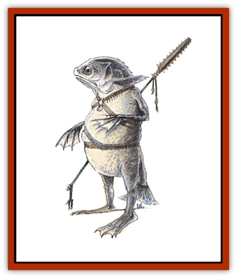

# Kuo-Toa

| Statistic | **Kuo-Toa** |
| --- | --- |
| **Activity Cycle:** | Night |
| **Alignment:** | Neutral evil (with chaotic tendencies) |
| **Armor Class:** | 4 |
| **Climate/Terrain:** | Aquatic subterranean |
| **Damage/Attack:** | 2-5 and/or by weapon type |
| **Diet:** | Carnivore |
| **Frequency:** | Very rare |
| **Hit Dice:** | 2 or more |
| **Intelligence:** | High and up (13+) |
| **Magic Resistance:** | See below |
| **Morale:** | Elite (13) |
| **Movement:** | 9, Sw 18 |
| **No. Appearing:** | 2-24 |
| **No. of Attacks:** | 1 or 2 |
| **Organization:** | Tribal |
| **Size:** | M (higher levels L) |
| **Special Attacks:** | See below |
| **Special Defenses:** | See below |
| **THAC0:** | 19 |
| **Treasure:** | L,M,N (Z) |
| **XP Value:** | Normal: 175 / Captain: 3,000 / Lieutenant: 1,400 / Whip: 420 / Monitor: 975 |

Kuo-toa are an ancient race of fish-men that dwells underground and harbors a deep hatred of surface dwellers and sunlight.

A kuo-toan presents a cold and horrible appearance. A typical specimen looks much like a human body, albeit a paunchy one, covered in scales and topped with a fish's head. The huge fish eyes tend to swivel in different directions when observing an area or creature. The hands and feet are very long, with three fingers and an opposing digit, partially webbed. The legs and arms are short for the body size. Its coloration is pale grey, with undertones of tan or yellow in males only. The skin has a sheen from its slimy covering. The color darkens when the kuo-toan is angry and pales when it is badly frightened. A strong odor of dead fish follows it around.

It wears no clothing, only leather harnesses for its weapons and gear. Typically, a kuo-toan warrior carries daggers, spears, shields, harpoons and weighted throwing nets.

Kuo-toa speak the strange subterranean trade language common to most intelligent underworld dwellers. Additionally, they speak their own arcane tongue and have empathic contact with most fish. Their religious speech is a corruption of the language used on the elemental plane of Water; if a kuo-toan priest is in a group of kuo-toa, it is 75% unlikely that a creature native to the plane of Water will attack, for the priest will request mercy in the name of the Sea Mother, Blibdoolpoolp.

**Combat:** These creatures normally travel in well-armed bands. If more than 20 kuo-toa are encountered, it is 50% likely that they are within 1d6 miles of their lair. For every four normal warriors encountered there is an additional fighter of 3rd or 4th level. For every eight normal fighters there is an additional fighter of 5th or 6th level. For every 12 normal kuo-toa in the group there is a cleric/thief of 1d4+3 levels each. If more than 20 normal fighters are encountered, the group is a war consisting of the following:

<ul><li>One 10th-level fighter as Captain</li><li>Two 8th-level fighters as Lieutenants</li><li>Four 3rd/3rd-level fighter/thief Whips</li><li>One Monitor (see below)</li><li>One slave per four kuo-toa</li></ul>The whips are fanatical devotees of the Sea Mother goddess of the kuo-toa. They inspire the troops to stand firm and fight without quarter for the glory of their ruler and their deity.

It is 50% probable that any kuo-toan priest above 6th level is armed with a pincer staff. This is a 5-foot-long pole topped by a three-foot-long claw. If the user scores a hit, the claw has closed upon the opponent, making escape impossible. The weapon can be used only on enemies with a girth range between an [[Elf|elf]] and a [[Gnoll|gnoll]]. It is 10% probable that both arms are pinned by the claw and 40% probable that one arm is trapped. If the victim is right handed, the claw traps the left hand 75% of the time. Trapped opponents lose shield and Dexterity bonuses. If the weapon arm is trapped, the victim cannot attack and the Dexterity bonus is lost, but the shield bonus remains.

The harpoon is mostly used only by higher level fighters. It is a wickedly barbed throwing weapon with a 30 yard range. It inflicts 2d6 points of damage, exclusive of bonuses. Victims must roll a successful saving throw of 13+ on 1d20 to avoid being snagged by the weapon. Man-sized or smaller beings who fail this saving throw are jerked off their feet and stunned for 1d4 rounds. The kuo-toan, who is attached to his weapon by a stout cord, then tries to haul in its victim and slay him with a dagger thrust.

Kuo-toan shields are made of special boiled leather and are treated with a unique glue-like substance before a battle. Anyone who attacks a kuo-toan from the front has a 25% chance of getting his weapon stuck fast. The chance of the victim freeing the weapon is the same as his chance for opening doors.

Hit probability for kuo-toa is the same as that of a human of similar level, but males also gain a +1 bonus to both attack rolls and damage rolls when using a weapon, due to Strength. When fighting with a dagger only, kuo-toa can bite, which causes 1d4+1 points of damage.

When two or more kuo-toan priests or priest/thieves operate together, they can generate a lightning stroke by joining hands. The bolt is two feet wide and hits only one target unless by mischance a second victim gets in the way. The bolt inflicts 6 points of damage per priest, half that if a saving throw vs. spell is successful. The chances of such a stroke occurring is 10% cumulative per caster per round.

The special defenses of these creatures include skin secretions, which gives attempts to grapple, grasp, tie, or web a kuo-toan only a 25% chance of success. Despite their eyes being set on the sides of their heads, they have excellent independent monocular vision, with a 180-degree field of vision and the ability to spot movement even though the subject is invisible, astral, or ethereal. Thus, by maintaining complete motionlessness, a subject can avoid detection. Kuo-toa also have 60-foot infravision and have the ability to sense vibrations up to 10 yards away. They are surprised only on a 1 on the 1d10 surprise roll.

Kuo-toa are totally immune to poison and are not affected by paralysis. Spells that generally affect only humanoid types have no effect on them. Electrical attacks cause half damage, or none if the saving throw is successful; *magic missiles* cause only 1 point of damage; illusions are useless against them. However, kuo-toa hate bright light and suffer a -1 penalty to their attack roll in such circumstances as daylight or *light* spells. They suffer full damage from fire attacks and save with a -2 penalty against them.

Sometimes kuo-toa are encountered in small bands journeying in the upper world to kidnap humans for slaves and sacrifices. Such parties are sometimes also found in dungeon labyrinths that connect to the extensive system of underworld passages and caverns that honeycomb the crust of the earth. Only far below the surface of the earth can the intrepid explorer find the caverns in which the kuo-toa build their underground communities.

**Habitat/Society:** Kuo-toa spawn as do [[Fish|fish]], and hatchlings, or fingerlings as they call their young, are raised in pools until their amphibian qualities develop, about one year after hatching. The young, now a foot or so high, are then able to breathe air and they are raised in pens according to their sex and fitness. There are no families, as we know them, in kuo-toan society.

Especially fit fingerlings, usually of noble spawning, are trained for the priesthood as priests, priest/thieves, or special celibate monks. The latter are called "monitors" whose role is to control the community members who become violent or go insane. The monitor is capable of attacking to subdue or kill. A monitor has 56 hit points, attacks as a 7th-level fighter and has the following additional abilities: twice the normal movement rate, AC 1, and receives four attacks per round - two barehanded for 2d4 points of damage (double if trying to subdue) and two attacks with teeth for 1d4+1 points of damage. One hand/bite attack occurs according to the initiative roll, the other occurs at the end of the round.

Subdued creatures cannot be larger than eight feet tall and 500 pounds. Subduing attacks cause only half real damage, but when the points of damage inflicted equal the victim's total, the creature is rendered unconscious for 3d4 rounds.

Kuo-toan communities do not generally cooperate, though they have special places of worship in common. These places are usually for intergroup trade, councils, and worship of the Sea Mother, so they are open to all kuo-toa. These religious communities, as well as other settlements, are open to [[Elf_Drow|drow]] and their servants, for the dark elves provide useful goods and services, though the drow are both feared and hated by the kuo-toa. This leads to many minor skirmishes and frequent kidnappings between the peoples. The [[Mind_Flayer|illithids (mind flayers)]] are greatly hated by the kuo-toa and they and their allies are attacked on sight.

The ancient kuo-toa once inhabited the shores and islands of the upper world, but as the race of mankind grew more numerous and powerful, these men-fish were slowly driven to remote regions. Continual warfare upon these evil, human-sacrificing creatures threatened to exterminate the species, for a number of powerful beings were aiding mankind, their sworn enemies. Some kuo-toa sought refuge in sea caverns and secret subterranean waters, and while their fellows were being slaughtered, these few prospered and developed new powers to adapt to their lightless habitat. The seas contained other fierce and evil creatures, however, and the deep-dwelling kuo-toa were eventually wiped out, leaving only those in the underworld to carry on, unnoticed and eventually forgotten by mankind. But the remaining kuo-toa have not forgotten mankind, and woe to any who fall into their slimy clutches.

Now the kuo-toa are haters of sunlight and are almost never encountered on the earth's surface. This, and their inborn hatred of discipline, prevent the resurgence of these creatures, for they have become numerous once again and acquired new powers. However, they have also become somewhat unstable, possibly as a result of inbreeding, and insanity is common among the species.

If a kuo-toan lair is found, it contains 4d10x10 2nd-level males. In addition, there are higher level fighters in the same ratio as noted for wandering groups. The leader of the group is one of the following, depending on the lair's population:

<ul><li>A priest/thief king of 12/14th level, if 350 or more normal kuo-toa are present, or</li><li>A priest/thief prince of 11/13th level, if 275-349 normal kuo-toa are present, or</li><li>A priest/thief duke of 10/12th level, if fewer than 275 normal kuo-toa are present</li></ul>There are also the following additional kuo-toa in the lair:

<ul><li>Eight Eyes of the priest leader - 6th- to 8th-level priest/thieves</li><li>One Chief Whip - 6th/6th-level fighter/thief</li><li>Two Whips of 4th/4th or 5th/5th level (see whip description)</li><li>One Monitor per 20 2nd-level kuo-toa</li><li>Females equal to 20% of the male population</li><li>Young (noncombatant) equal to 20% of the total kuo-toa</li><li>Slaves equal to 50% of the total male population</li></ul>In special religious areas there are also a number of kuo-toan priests. For every 20 kuo-toa in the community there is a 3rd-level priest, for every 40 there is a 4th-level priest, for every 80 there is a 5th-level priest, all in addition to the others. These priests are headed by one of the following groups:

Though kuo-toa prefer a diet of flesh, they also raise fields of kelp and fungi to supplement their food supply. These fields, lit by strange phosphorescent fungi, are tended by slaves, who are also used for food and sacrifices.

Kuo-toan treasures tend more toward pearls, gem-encrusted items of a water motif, and mineral ores mined by their slaves. Any magical items in the possession of a kuo-toan are usually obtained from adventuring parties that never made it home again.

**Ecology:** Not much is known to surface-dwelling sages about this enigmatic, violent, subterranean race, but some of the more astute scholars speculate that the kuo-toa are but one-third of the three-way rivalry that includes mind flayers and drow. It is partially because of this continuing warfare that none of the three races has been able to achieve dominance of the surface world.

---
## Discovery & Documentation

**Source Publication:** MC2 Volume II (1993)
**Campaign Setting:** Advanced Dungeons & Dragons 2nd Edition
**Author(s):** Jay Batista, Scott Bennie, Grant Boucher, William W. Connors, Steve Gilbert, Heike Kubasch, James Lowder, David Edward Martin, Bruce Nesmith, Jean Rabe, Rick Swan, John J. Terra, Gary L. Thomas

### Other Creatures Found in This Source Book
   * [[Ant|Ant]]
   * [[Ant_Lion_Giant|Ant Lion, Giant]]
   * [[Ape_Carnivorous|Ape, Carnivorous]]
   * [[Baboon|Baboon]]
   * [[Badger|Badger]]
   * [[Barracuda|Barracuda]]
   * [[Beetle_Giant|Beetle, Giant]]
   * [[Bulette|Bulette]]
   * [[Bullywug|Bullywug]]
   * [[Dwarf_Duergar|Dwarf, Duergar]]
   * [[Dwarf_Gully|Dwarf, Gully]]
   * [[Eagle|Eagle]]
   * [[Eel|Eel]]
   * [[Elemental_Air_Kin|Elemental, Air Kin]]
   * [[Elemental_Water_Kin|Elemental, Water Kin]]
   * [[Elemental_Water_Kin_Water_Weird|Elemental, Water Kin, Water Weird]]
   * [[Firestar|Firestar]]
   * [[Firetail|Firetail]]
   * [[Fish_Giant|Fish, Giant]]
   * [[Frog|Frog]]
   * [[Gorgon|Gorgon]]
   * [[Hawk|Hawk]]
   * [[Heucuva|Heucuva]]
   * [[Hippocampus|Hippocampus]]
   * [[Hippogriff|Hippogriff]]
   * [[Kelpie|Kelpie]]
   * [[Kenku|Kenku]]
   * [[Killmoulis|Killmoulis]]
   * [[Lamia|Lamia]]
   * [[Lammasu|Lammasu]]
   * [[Lamprey|Lamprey]]
   * [[Leech|Leech]]
   * [[Leprechaun|Leprechaun]]
   * [[Leucrotta|Leucrotta]]
   * [[Locathah|Locathah]]
   * [[Lycanthrope_Wereboar|Lycanthrope, Wereboar]]
   * [[Lycanthrope_Werefox|Lycanthrope, Werefox]]
   * [[Mammal_Minimal|Mammal, Minimal]]
   * [[Mammal_Small|Mammal, Small]]
   * [[Mimic|Mimic]]
   * [[Morkoth|Morkoth]]
   * [[Muckdweller|Muckdweller]]
   * [[Myconid|Myconid]]
   * [[Naga|Naga]]
   * [[Obliviax|Obliviax]]
   * [[Octopus_Giant|Octopus, Giant]]
   * [[Otyugh|Otyugh]]
   * [[Piranha|Piranha]]
   * [[Plant_Dangerous_I|Plant, Dangerous I]]
   * [[Plant_Intelligent|Plant, Intelligent]]
   * [[Poltergeist|Poltergeist]]
   * [[Porcupine|Porcupine]]
   * [[Rat_Osquip|Rat, Osquip]]
   * [[Roc|Roc]]
   * [[Roper|Roper]]
   * [[Rot_Grub|Rot Grub]]
   * [[Rust_Monster|Rust Monster]]
   * [[Sahuagin|Sahuagin]]
   * [[Sea_Lion|Sea Lion]]
   * [[Sea_Horse_Giant|Sea Horse, Giant]]
   * [[Shambling_Mound|Shambling Mound]]
   * [[Shark|Shark]]
   * [[Sphinx|Sphinx]]
   * [[Squid_Giant|Squid, Giant]]
   * [[Stirge|Stirge]]
   * [[Swanmay|Swanmay]]
   * [[Tarrasque|Tarrasque]]
   * [[Tasloi|Tasloi]]
   * [[Triton|Triton]]
   * [[Troglodyte|Troglodyte]]
   * [[Urchin|Urchin]]
   * [[Urd|Urd]]
   * [[Weasel|Weasel]]
   * [[Wolverine|Wolverine]]
   * [[Yellow_Musk_Creeper|Yellow Musk Creeper]]
