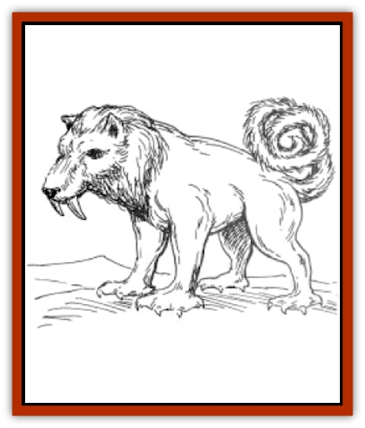

# Kupuk

| Statistic | **Kupuk** |
| --- | --- |
| **Activity Cycle:** | Any |
| **Alignment:** | Neutral |
| **Armor Class:** | 4 |
| **Climate/Terrain:** | Arctic (Great Glacier) |
| **Damage/Attack:** | 1-4/1-4/1-8 or 1-12 |
| **Diet:** | Carnivore |
| **Frequency:** | Rare |
| **Hit Dice:** | 5 |
| **Intelligence:** | Semi- (2-4) |
| **Magic Resistance:** | See below |
| **Morale:** | Champion (16) |
| **Movement:** | 9, Sw 15 |
| **No. Appearing:** | 1 or 4-16 (4d4) |
| **No. of Attacks:** | 3 or 1 |
| **Organization:** | Solitary or pack |
| **Size:** | M (6' long) |
| **Special Attacks:** | Tail strike |
| **Special Defenses:** | See below |
| **THAC0:** | 15 |
| **Treasure:** | Nil |
| **XP Value:** | 420 |

Trustworthy, dependable, and easily domesticated, the [[Dog|dog]]-like kupuk is one of the most valuable creatures to the tribes of the Great Glacier, both as a pack animal and loyal companion.

The kupuk has a thick body and the hairless, leathery hide of a walrus, colored tan, dull yellow, or light gray. Its round head resembles that of a husky, with a long muzzle, black eyes and nose, and upright ears. Soft fur, the same color as its body, covers its head, and two six-inch-long tusks protrude from its mouth. It has four strong legs with broad flat feet and sharp claws, enabling it to move easily in the snow and on icy surfaces. An able swimmer, the kupuk uses its flat feet to propel it in the water.

The kupuk's most unusual feature is its long tail, a snake-like appendage about six inches thick and five feet long, covered with fur and typically coiled on the creature's back so as not to drag in the snow. Powerfully muscled, the tail functions as both a weapon and a tool; for instance, the kupuk can uproot a small tree by wrapping its tail around the trunk, or smooth a snowy surface by sweeping its tail from side to side.

The kupuk's mournful howl is easily mistaken for that of a [[Wolf|wolf]]. It can understand simple commands from human companions, and can distinguish scents from up to 100 yards away.

**Combat:** Kupuk are as vicious towards their enemies as they are loving to their friends. They can attack with their claws and bite, but prefer to lash at opponents with their tails, inflicting 1-12 hit points of damage with the retractable spike in their tail tip, assuming they can maneuver to position their opponents behind them. A successful tail-lash is followed by a loud howl, with the kupuk raising its muzzle triumphantly towards the sky.

Kupuk are particularly fierce when protecting their eggs or pups. In such situations, the kupuk whips itself into a frenzy, gaining a +1 to its attack and damage rolls. The bonus remains in effect until the opponent is killed or withdraws.

Kupuk are immune to all ill effects of cold, including cold-based spells and magically-generated cold effects (such as [[Dragon_Chromatic_White|white dragon's]] breath).

**Habitat/Society:** In the wilderness, kupuk make no permanent lairs, instead roaming in packs in search of food. A typical pack consists of about 12 adults and half as many pups. The largest female serves as leader; she.s usually the one with the strongest sense of smell, and the most able to locate prey.

More commonly, kupuk live among Ulutiuns, with whom they share a mutually beneficial relationship; the kupuk serve as workers and protectors, while the humans furnish food, shelter, and medical care. Though Ulutiuns typically raise their own kupuk, wild kupuk are easily tamed. An offer of food and a few gentle words are usually all it takes it earn their friendship. Once a bond of trust is established, a kupuk remains fiercely loyal to its human companions, willingly sacrificing its own life to protect them.

Kupuk make excellent pack animals, easily carrying up to 500 pounds of weight on their backs, though they balk at carrying human passengers. A single kupuk can pull a sled of up to 1,000 pounds for an entire day without tiring. With a natural affinity for human children, kupuk are superb babysitters. Once a kupuk gently encoils its tail around an infant, parents can rest assured that their child is safe and comfortable.

A kupuk reproduces about once a year by digging a shallow hole in the snow, laying from 1-4 eggs, then covering them with a layer of snow about 3 feet deep. The eggs resemble lumps of gold, each about a foot across, with the texture of soft metal. Explorers unfamiliar with kupuk sometimes mistake kupuk eggs for real gold; their excitement at their discovery disappears when they find themselves suddenly faced with a snarling kupuk mother, tail erect, crouched to kill the interloper who dared disturb her nest.

**Ecology:** Kupuk are meat-eaters, preferring a diet of fish and seal. In turn, kupuk count white dragons and [[Tirichik|tirichik]] among their natural enemies. Though kupuk eggs are not, in fact, made of gold or any other precious metal, egg fragments are highly prized by collectors in lands south of the Great Glacier, fetching as much as 500 gp each. Transport problems, however, prevent kupuk eggs from reaching many collectors, since the egg fragments melt into liquid at temperatures above freezing.

---
## Discovery & Documentation

**Source Publication:** FR14 The Great Glacier (1991)
**Campaign Setting:** Forgotten Realms
**Author(s):** Rick Swan

### Other Creatures Found in This Source Book
   * [[Dwarf_Arctic|Dwarf, Arctic]]
   * [[Fish_Great_Glacier|Fish (Great Glacier)]]
   * [[Tirichik|Tirichik]]
