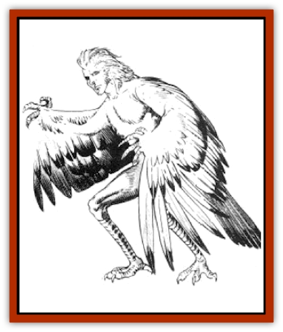

# Kyrie

| Statistic | **Kyrie** |
| --- | --- |
| **Activity Cycle:** | Any |
| **Alignment:** | Neutral |
| **Armor Class:** | 5 |
| **Climate/Terrain:** | Tropical and subtropical Mountains |
| **Damage/Attack:** | 1-6 or by weapon |
| **Diet:** | Omnivore |
| **Frequency:** | Very rare |
| **Hit Dice:** | 4 |
| **Intelligence:** | Average (8-10) |
| **Magic Resistance:** | 25% |
| **Morale:** | Steady (11) |
| **Movement:** | 6, Fl 18 (B) |
| **No. Appearing:** | 2-12 |
| **No. of Attacks:** | 1 |
| **Organization:** | Flock |
| **Size:** | M (7' tall) |
| **Special Attacks:** | Spells |
| **Special Defenses:** | Nil |
| **THAC0:** | 17 |
| **Treasure:** | B |
| **XP Value:** | 1,400 |

Kyrie are an ancient race of [[Bird|bird]]-men. Small in numbers, their primary holdings are a few high, steep-walled valleys along the main mountain ridge of Mithas, homeland of the [[Minotaur|minotaurs]].

Resembling a bizarre mix of [[Hawk|hawk]] and human, a mature kyrie stands upright on long wiry legs ending in bird-like claws. Its arms are actually wings, though it they have human hands with long, thin fingers ending in talons. The back and wings of a kyrie are covered with brown feathers; the chest is covered with soft, golden fur. The kyrie has a human torso and a human head with a small nose, thin lips, and tiny eyes, usually light blue or yellow.

On the average, kyrie are taller than humans, though much lighter. With a hollow bone structure and thin but wiry musculature it is rare for one of these creatures to reach 100 pounds in weight. Kyrie are nimble fliers with powerful wings. They can climb in the air at a rate of 3.

In addition to their own language, 80% of kyrie speak the common language. They speak in a clipped and precise, but understandable, fashion.

**Combat:** Normally, kyrie are peaceful and passive. But they are fierce and proud, with a low tolerance for trespassers and no tolerance for aggressors. They do not allow themselves to be taken prisoner, in all cases preferring death to subjugation.

A kyrie can make one claw attack per round to inflict 1d6points of damage, but they more often use simple weapons. For instance, a kyrie often carries one or two fist-sized stones when flying. A favorite combat tactic is to drop these stones on an opponent, one per round, for 1d8 points of damage with each successful hit. After a kyrie has attacked with its stones, it lands and melees with the lightweight stone axe carried by all adult kyrie. The axe inflicts 1d6 points of damage.

Kyrie are also capable of casting spells as 3rd-level druids. The most common spells used by kyrie are *animal friendship*, *invisibility to animals*, *predict weather*, *charm person or mammal*, *warp wood*, and *hold animal*. However, kyrie are not limited to just these particular spells. In tact, all 1st- to 3rd-level spells available to druids can be learned by kyrie.

**Habitat/Society:** Kyrie originally inhabited numerous islands around the periphery of Ansalon. They migrated from island to island, completing a circuit of the world over the course of several decades. Their long, soaring fights over the expansive oceans of Krynn were made possible by a magical device called the Northstone that enabled their leaders to keep track of direction. By depending on this device, kyrie gradually lost the ability to navigate on their own. A few years ago, they lost the Northstone to the minotaurs, effectively stranding the kyrie in their primary homes in Mithas. Though they eventually recovered the Northstone, they chose to remain on Mithas. in spite of the minotaurs' hostility, defiantly claiming they had as much right to the island as the minotaurs.

Kyrie lairs, called aeries, are located in caves high on the most inaccessible mountain peaks or mid-way on sheer cliffs. An aerie is a clean and pleasant nest of twigs and branches, offering a spectacular view of the surrounding mountains. Each aerie contains as many as 3d6 mature kyrie, equally split between males and females, and 4d6 kyrie young. They have little in the way of possessions, except for their stone axes and a supply of rocks to use as missiles or bombs. They enjoy coins and gems, which they collect more for beauty than value.

**Ecology:** The mortal enemies of kyrie are minotaurs. Kyrie sometimes raid isolated minotaur mining villages and supply caravans, killing them ruthlessly and stealing their food and weapons. The minotaurs retaliate by assaulting the kyrie's aeries.

Kyrie eat rodents, seeds, and fruit. They have a special fondness for wine and other strong drink, which they steal from the minotaurs. Most creatures find the tough kyrie eggs to be inedible, but minotaurs mix the yolks with mutton fat to make a thick soup.

---
## Discovery & Documentation

**Source Publication:** MC4 Dragonlance Appendix (w/binder #2) (1989)
**Campaign Setting:** Dragonlance
**Author(s):** Rick Swan

### Other Creatures Found in This Source Book
   * [[Anemone_Giant_Sea|Anemone, Giant Sea]]
   * [[Bear_Ice|Bear, Ice]]
   * [[Beast_Undead|Beast, Undead]]
   * [[Bird_Krynn|Bird (Krynn)]]
   * [[Disir|Disir]]
   * [[Draconian_Aurak|Draconian, Aurak]]
   * [[Draconian_Baaz|Draconian, Baaz]]
   * [[Draconian_Bozak|Draconian, Bozak]]
   * [[Draconian_Kapak|Draconian, Kapak]]
   * [[Draconian_General_Information|Draconian, General Information]]
   * [[Draconian_Sivak|Draconian, Sivak]]
   * [[Draconian_Proto-_Traag|Draconian, Proto-, Traag]]
   * [[Dragon_Amphi|Dragon, Amphi]]
   * [[Dragon_Astral|Dragon, Astral]]
   * [[Dragon_Kodragon|Dragon, Kodragon]]
   * [[Dragon_Krynn_Othlorx_General_Information|Dragon (Krynn), Othlorx, General Information]]
   * [[Dragon_Krynn_General_Information|Dragon (Krynn), General Information]]
   * [[Dragon_Sea|Dragon, Sea]]
   * [[Dreamshadow|Dreamshadow]]
   * [[Dreamwraith|Dreamwraith]]
   * [[Dwarf_Daergar|Dwarf, Daergar]]
   * [[Dwarf_Hill_Neidar|Dwarf, Hill, Neidar]]
   * [[Dwarf_Mountain_Hylar|Dwarf, Mountain, Hylar]]
   * [[Dwarf_Theiwar|Dwarf, Theiwar]]
   * [[Dwarf_Zakhar|Dwarf, Zakhar]]
   * [[Elf_Half-|Elf, Half-]]
   * [[Elf_High_Qualinesti|Elf, High, Qualinesti]]
   * [[Elf_High_Silvanesti|Elf, High, Silvanesti]]
   * [[Elf_Sea_Dargonesti|Elf, Sea, Dargonesti]]
   * [[Elf_Sea_Dimernesti|Elf, Sea, Dimernesti]]
   * [[Elf_Wild_Kagonesti|Elf, Wild, Kagonesti]]
   * [[Eyewing|Eyewing]]
   * [[Fetch|Fetch]]
   * [[Fire_Minion|Fire Minion]]
   * [[Fireshadow|Fireshadow]]
   * [[Gnome_Tinker|Gnome, Tinker]]
   * [[Gurik_Cha'ahl|Gurik Cha'ahl]]
   * [[Haunt_Knight|Haunt, Knight]]
   * [[Horax|Horax]]
   * [[Human_Krynn|Human (Krynn)]]
   * [[Imp_Blood_Sea|Imp, Blood Sea]]
   * [[Kalothagh|Kalothagh]]
   * [[Kani_Doll|Kani Doll]]
   * [[Kender|Kender]]
   * [[Lizard_Man_Krynn|Lizard Man (Krynn)]]
   * [[Minotaur_Krynn|Minotaur, Krynn]]
   * [[Ogre_High|Ogre, High]]
   * [[Ogre_Krynn|Ogre (Krynn)]]
   * [[Phaethon|Phaethon]]
   * [[Saqualaminoi|Saqualaminoi]]
   * [[Shadowperson|Shadowperson]]
   * [[Shimmerweed|Shimmerweed]]
   * [[Skrit|Skrit]]
   * [[Spectral_Minion|Spectral Minion]]
   * [[Spider_Krynn|Spider (Krynn)]]
   * [[Stag|Stag]]
   * [[Tayling|Tayling]]
   * [[Thanoi|Thanoi]]
   * [[Tylor|Tylor]]
   * [[Wichtlin|Wichtlin]]
   * [[Wyndlass|Wyndlass]]
   * [[Yaggol|Yaggol]]
