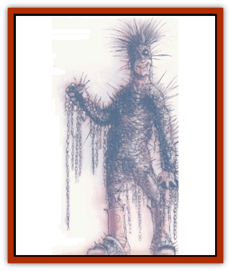

# Kyton

| Statistic | **Kyton** |
| --- | --- |
| **Activity Cycle:** | Any |
| **Alignment:** | Lawful evil |
| **Armor Class:** | 2 |
| **Climate/Terrain:** | Any (Baator) |
| **Damage/Attack:** | 1d10/1d10 |
| **Diet:** | Carnivore |
| **Frequency:** | Rare |
| **Hit Dice:** | 8 |
| **Intelligence:** | Low (5) |
| **Magic Resistance:** | 25% |
| **Morale:** | Fanatic (17) |
| **Movement:** | 12 |
| **No. Appearing:** | -7 |
| **No. of Attacks:** | 2 |
| **Organization:** | Solitary |
| **Size:** | M (6' tall) |
| **Special Attacks:** | Chain snag |
| **Special Defenses:** | See below |
| **THAC0:** | 13 |
| **Treasure:** | See below |
| **XP Value:** | 6,000 |

Kytons are a race of creatures inhabiting the city of Jangling Hiter on the third layer of [[Baatezu_General_Information|Baator]]. They are the city's constabulaly, ferreting out transgressors. A soul knows when he's being stalked by one of these monstrosities if he hears tinkling chains and an accompanying malicious titter.

Kytons are humanoid, though it's hard to tell if they're human. They wear chains in lieu of clothing and armor, using this "apparel" as weapons. The body, arms, and legs are all tightly wrapped with smaller chains. When a kyton raises its arms, a cutter can see dangling ropes of metal - chains studded with barbs, welded scraps of iron, and other small sharp implements.

The kyton's head is also wrapped with chains, covering where the hair, eyes, ears, and nose would be on a normal humanoid. The only visible features on a kyton are its throat, its grimacing mouth, and occasionally one gleaming eye. Some people might wish they hadn't seen even that much. See, the kyton has a nasty habit of assuming the feature of a departed loved one or friend - or sometimes that of much-feared enemy. Though all a berk can see is the lower part of the face, he can often reconstruct the rest of it. No one's really sure whether this is an illusion the creatures create, or if it's actually the dead person come to horrible "life" in the city of chains. Regardless, anyone viewing a kyton's features must make a successful Wisdom check or suffer a -1 penalty to initiative for 1-3 rounds from the shock.

**Combat:** Kytons are, above all, brutal and cruel. They attack in ways calculated to induce as much terror as possible in their victims. If this means a cold, direct stalking through the chain-hung streets of Jangling Hiter, that's what they'll do. If it means fleeting shadows and the faint music of chains clashing, then that's their method. How do they know what the most temwing method of stalking their victim is? Perhaps they've got some sort of telepathy, or perhaps they can detect fear through their keen senses? Whatever the truth, kytons hunt for maximum terror from their victims.

A kyton's typical attack is to swing both chain-covered arms at its victim per round, using the barbs to lash the target into submission. However, a kyton has a far more frightening ability, one it uses in times of great need or to inspire great fear. It's called the "gift of chains," and it means mastery to some - and death to others.

Within a 20-foot area, kytons can control any chains near them. (Interestingly, if two kytons attempt to control the same chain, nothing happens until one kyton establishes dominance over the other; this takes 1d4 rounds.) Further, kytons can move along these chains like a spider tripping across its web. Their domination includes shaking chains, rattling them, and making them dance like snakes before a charmer. Kytons can also make chains grow 15 feet and sprout barbs and honed blades. If kytons attack with these chains, they get two attacks per round, just as if they were attacking hand-to-hand. A few cutters who've escaped Jangling Hiter talk ahout chains lunging out of nowhere and entangling their comrades. They speak of sprouted blades and the quivering masses of blood and flayed skin that're left behind.

Kytons cannot be harmed by weapons of less than +2 enchantment, and they are immune to cold. They don't bleed, and if a limb is severed with a nonmagical weapon, it reattaches itself within five rounds. Kytons regenerate lost hit points at a rate of 1 hit point per round. The only way to permanently damage kytons is to strike them with *blessed* or magical weapons. Kytons recover from *blessed* wounds half as quickly as an ordinary person (that is, at a rate of 1 hit point every 2 days); they recover from damage caused by magical weapons as would an ordinary wounded person. Kytons will always seek to flee from *blessed* weapons, though they will fight against magical weapons. Note that even if the *bless* spell is cast on a plane opposite the Great Ring from Baator, it is still effective against these creatures.

**Habitat/Society:** All Kytons are equal in Jangling Hiter. They don't disagree over standing, though they do squabble over choice scraps of unlucky berks. These fights are short-lived and usually end with the victor claiming the morsel. The loser fades (flees, really) into the metal jungle of the city.

The only treasure a kyton has is that of its victims. That hoard can valy widely, depending on the kyton's power and the resources of its quarry.

**Ecology:** Kytons are the police force of the city, enforcing its edicts and trampling those who don't live by them. It's rumored that they eat their victims, though it's been put forth that what the kytons really consume are the spirits of those they hunt. These sages speculate that kytons survive on the anguish of the screaming spirits they catch.

This is conjecture, for kytons have never been studied in depth. Bloods know a captured kyton can kill itself simply by willing it. And a dead kyton dissolves, leaving behind an acrid stench and a greasy puddle of chains and ichor - nothing much there to study.

---
## Discovery & Documentation

**Source Publication:** Monstrous Compendium, 1996 Annual, Volume 3 (1995)
**Campaign Setting:** Advanced Dungeons & Dragons 2nd Edition
**Author(s):** Jon Pickens

### Other Creatures Found in This Source Book
   * [[Alaghi|Alaghi]]
   * [[Alhoon|Alhoon]]
   * [[Aranea_Savage_Coast|Aranea (Savage Coast)]]
   * [[Arcane_Head|Arcane Head]]
   * [[Banedead|Banedead]]
   * [[Banelich|Banelich]]
   * [[Bat_Bonebat|Bat, Bonebat]]
   * [[Beetle|Beetle]]
   * [[Belgoi|Belgoi]]
   * [[Bladeling|Bladeling]]
   * [[Braxat|Braxat]]
   * [[Bunyip|Bunyip]]
   * [[Burbur|Burbur]]
   * [[Bvanen|Bvanen]]
   * [[Cat_Great_Snow_Tiger|Cat, Great, Snow Tiger]]
   * [[Chosen_One|Chosen One]]
   * [[Chronovoid|Chronovoid]]
   * [[Cildabrin|Cildabrin]]
   * [[Coffer_Corpse|Coffer Corpse]]
   * [[Disenchanter|Disenchanter]]
   * [[Dog_Temporal|Dog, Temporal]]
   * [[Dragon_Cerilia|Dragon (Cerilia)]]
   * [[Dragon_Ghost|Dragon, Ghost]]
   * [[Dragon_Lesser_Undead|Dragon, Lesser Undead]]
   * [[Dragon_Neutral_Amber|Dragon, Neutral, Amber]]
   * [[Dread_Warrior|Dread Warrior]]
   * [[Dreamweaver|Dreamweaver]]
   * [[Dream_Spawn_Greater_Ennui|Dream Spawn, Greater, Ennui]]
   * [[Dream_Spawn_Lesser_Morph|Dream Spawn, Lesser, Morph]]
   * [[Dwarf_Arctic|Dwarf, Arctic]]
   * [[Dwarf_Urdunnir|Dwarf, Urdunnir]]
   * [[Eel_Giant_Moray|Eel, Giant Moray]]
   * [[Elemental_Fire_Kin_Tome_Guardian|Elemental, Fire Kin, Tome Guardian]]
   * [[Elf_Rockseer|Elf, Rockseer]]
   * [[Ethyk|Ethyk]]
   * [[Faerie_Faerie_Fiddler|Faerie, Faerie Fiddler]]
   * [[Faerie_Petty_Bramble|Faerie, Petty, Bramble]]
   * [[Faerie_Petty_Gorse|Faerie, Petty, Gorse]]
   * [[Faerie_Petty|Faerie, Petty]]
   * [[Firenewt|Firenewt]]
   * [[Formian|Formian]]
   * [[Gargoyle_II|Gargoyle II]]
   * [[Giant_Cerilia|Giant (Cerilia)]]
   * [[Goblin_Cerilia|Goblin (Cerilia)]]
   * [[Golem_Magic|Golem, Magic]]
   * [[Golem_Shaboath|Golem, Shaboath]]
   * [[Hag_Bheur|Hag, Bheur]]
   * [[Hamadryad|Hamadryad]]
   * [[Hound_of_Ill-Omen|Hound of Ill-Omen]]
   * [[Human_Cerilia|Human (Cerilia)]]
   * [[Hybsil|Hybsil]]
   * [[Ibrandlin|Ibrandlin]]
   * [[Imp_Chaos|Imp, Chaos]]
   * [[Ixitxachitl_Ixzan|Ixitxachitl, Ixzan]]
   * [[Jabberwock|Jabberwock]]
   * [[Kyuss_Son_of|Kyuss, Son of]]
   * [[Lillend|Lillend]]
   * [[Life-Shaped_Creation_Guardian|Life-Shaped Creation, Guardian]]
   * [[Life-Shaped_Creation_Transport|Life-Shaped Creation, Transport]]
   * [[Lycanthrope_Werecrocodile|Lycanthrope, Werecrocodile]]
   * [[Lycanthrope_Werespider|Lycanthrope, Werespider]]
   * [[Magedoom|Magedoom]]
   * [[Manotaur|Manotaur]]
   * [[Mastiff_Shadow|Mastiff, Shadow]]
   * [[Meazel|Meazel]]
   * [[Mist_Scarlet_Dancer|Mist, Scarlet Dancer]]
   * [[Needleman|Needleman]]
   * [[Orc_Neo-Orog|Orc, Neo-Orog]]
   * [[Orc_Ondonti|Orc, Ondonti]]
   * [[Owlbear_II|Owlbear II]]
   * [[Pegataur|Pegataur]]
   * [[Phaerimm|Phaerimm]]
   * [[Reggelid|Reggelid]]
   * [[Render|Render]]
   * [[Saurial|Saurial]]
   * [[Scalamagdrion|Scalamagdrion]]
   * [[Sharn|Sharn]]
   * [[Snake_Messenger|Snake, Messenger]]
   * [[Spirit_Forest_Uthraki|Spirit, Forest, Uthraki]]
   * [[Spirit_Forest_Wood_Man|Spirit, Forest, Wood Man]]
   * [[Spirit_Ice_Orglash|Spirit, Ice, Orglash]]
   * [[Spirit_Rock_Thomil|Spirit, Rock, Thomil]]
   * [[Strider_Giant|Strider, Giant]]
   * [[Tembo|Tembo]]
   * [[Temporal_Glider|Temporal Glider]]
   * [[Temporal_Stalker|Temporal Stalker]]
   * [[Tether_Beast|Tether Beast]]
   * [[Thessalmonster|Thessalmonster]]
   * [[Time_Dimensional|Time Dimensional]]
   * [[Tomb_Tapper|Tomb Tapper]]
   * [[Undead_Dragon_Slayer|Undead Dragon Slayer]]
   * [[Unicorn_Black_Toril|Unicorn, Black (Toril)]]
   * [[Vaath|Vaath]]
   * [[Vortex_Spider|Vortex Spider]]
   * [[Weredragon|Weredragon]]
   * [[Zhentarim_Spirit|Zhentarim Spirit]]
