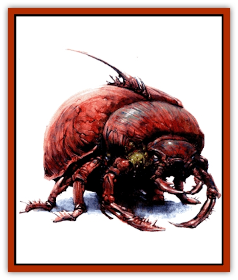

# Kyuss - Hound of

| Statistic | **Kyuss, Hound of** |
| --- | --- |
| **Activity Cycle:** | Any |
| **Alignment:** | Chaotic evil |
| **Armor Class:** | 8 |
| **Climate/Terrain:** | Empire of Iuz, Rift Canyon |
| **Damage/Attack:** | 2d4 |
| **Diet:** | Living beings |
| **Frequency:** | Rare |
| **Hit Dice:** | 2+2 |
| **Intelligence:** | Non- (0) |
| **Magic Resistance:** | Nil |
| **Morale:** | Fearless (20) |
| **Movement:** | 12, jump 9 |
| **No. Appearing:** | 2d6 |
| **No. of Attacks:** | 1 |
| **Organization:** | Swarm |
| **Size:** | M (4' long) |
| **Special Attacks:** | Confusion, vermin, eggs |
| **Special Defenses:** | Regeneration |
| **THAC0:** | 19 |
| **Treasure:** | Nil |
| **XP Value:** | 650 |

The Hounds of Kyuss were created ages ago by the high priest Kyuss for use as guardians and pets. A Hound of Kyuss appears as a huge undead [[Beetle_Scarab_Giant|scarab beetle]] the size of a large mastiff. These creatures constantly emit an unnerving sound not unlike the sound of fingernails scraping slate. Hounds of Kyuss possess a powerful pair of mandibles they use to grasp their prey, and they have retractable stingers on their backs located at the junction of the thorax and abdomen. Their exoskeletons are often cracked and badly damaged (hence their poor Armor Class), and swarms of vermin and parasitic beings scuttle across their decaying bodies.

**Combat:** The cluttering of a Hound of Kyuss is maddening. Anyone within 30' of one of these horrors must make a successful saving throw vs. paralyzation at the start of the round or be confused (as the 4th-level wizard spell *>confusion*) for that round. This saving throw must be made each round that the victim remains in the area of effect. Hounds of Kyuss can be turned as if they were wights.

Hounds of Kyuss regenerate at the rate of 2 hit points per round; this even allows the re-growth of severed limbs. Hounds reduced to 0 hit points collapse to the ground but continue to regenerate; once their hit points become positive again, the Hounds spring back to life. Damage caused by fire, acid, lightning, and holy water cannot be regenerated. Pouring holy water on a Hound's wounds or touching a good holy symbol to the Hound's body once it is below 0 hit points causes it to stop regenerating and die.

A Hound of Kyuss attacks once per round with its powerful bite. Anyone bitten by a Hound of Kyuss is also attacked by the Hound's stinger; if the stinger hits, it causes no damage, but it does implant a tiny red egg in the victim. The victim must make a successful saving throw vs. poison or else the egg quickly hatches the next round into a tiny Hound. This Hound begins burrowing through the victim's body, inflicting 1 point of damage per turn. During this time, the victim suffers a -2 penalty to saving throws and AC, and spells cast by the victim suffer a flat 25% chance of failure. If not treated, this infestation eventually slays the victim. A cure disease or heal spell cures the infestation. Within 1d6 hours after the victim's death, a fully grown Hound of Kyuss erupts from the victim's body.

Hounds of Kyuss are seething with diseased vermin. Anyone struck by a Hound or making a successful melee attack on it must make a successful saving throw vs. death magic or become infested with vermin. Infested characters cannot heal wounds except through magic, and they lose 1 point of Constitution per day. Once a victim's Constitution reaches 0, he or she dies. The vermin can be slain by applying of any of the following spells: *cloud of purification*, *cure disease*, *remove curse*, *heal*, or *dispel evil*. *Anti-vermin barrier* stills the vermin so that they cannot infest others, but those already infested remain so.

**Habitat/Society:** Hounds of Kyuss roam in search of food. They are found most often in the Wormcrawl Fissure near the Rift Canyon. The Bonehart has captured many of the creatures and have started "breeding" programs in Dorakaa. Hounds are often released into enemy cities and allowed to wreak havoc. Although unintelligent, they can be controlled by evil priests who can command undead. Many of Iuz's faithful use them as temple guardians or instruments of torture.

**Ecology:** Hound of Kyuss eggs die within a matter of minutes if not encased in living flesh. The vermin that coat the Hounds are more hardy and can live for nearly an hour after separation from their host, at which time they die and melt into brackish water. Once the host is slain, the vermin die as well.

---
## Discovery & Documentation

**Source Publication:** Dragon270 (2000)
**Campaign Setting:** Dragon Magazine
**Author(s):** 

### Other Creatures Found in This Source Book
   * [[Blackroot_Marauder|Blackroot Marauder]]
   * [[Dirtwraith|Dirtwraith]]
   * [[Murdakus|Murdakus]]
