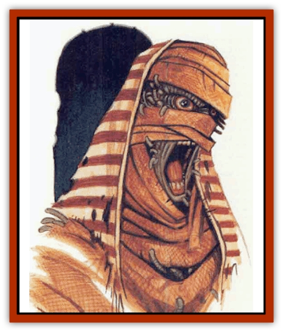

# Kyuss - Son of

| Statistic | **Kyuss, Son of** |
| --- | --- |
| **Activity Cycle:** | Any |
| **Alignment:** | Chaotic evil |
| **Armor Class:** | 10 |
| **Climate/Terrain:** | Ruins or subterranean |
| **Damage/Attack:** | 1d8 |
| **Diet:** | Living beings |
| **Frequency:** | Very rare |
| **Hit Dice:** | 4 |
| **Intelligence:** | Low (5-7) |
| **Magic Resistance:** | Nil |
| **Morale:** | Champion (15-16) |
| **Movement:** | 9 |
| **No. Appearing:** | 1-3 |
| **No. of Attacks:** | 1 |
| **Organization:** | Group |
| **Size:** | M (5-6' tall) |
| **Special Attacks:** | Fear, disease, worms |
| **Special Defenses:** | Regeneration |
| **THAC0:** | 17 |
| **Treasure:** | 1 with type Q (25%) |
| **XP Value:** | 1,400 |

Sons of Kyuss are horrible undead beings that convert living humans and demihumans into cursed undead like themselves. Sons look similar to [[Zombie|zombies]] and are often (75%) mistaken for them when seen from a distance. Putrid flesh hangs loosely from their bones. Their skulls are completely devoid of skin, with only a few strands of hair and fungus remaining. Most revolting of all, writhing green worms crawl in and out of every skull orifice. Their clothing is usually filthy, tattered rags, but recent converts occasionally have fine garments.

**Combat:** Sons of Kyuss are surrounded by a spherical zone of fear that is 30 feet in diameter. Those who fail saving throws vs. spell when entering this zone flee in terror for one turn. Fleeing characters are 60% likely to drop whatever they are carrying in hand.

Sons can be turned by priests. Treat them as [[Mummy|mummies]] on the Turning Undead table.

Sons regenerate 2 hit points per round. Their limbs also regenerate, even if severed. Sons reduced to 0 or fewer hit points collapse as if dead but continue to regenerate normally; they stand up to fight when their hit points reach 1 or more. Fire, lightning, acid, and holy water cause permanent damage to sons of Kyuss. Pouring holy water or touching a holy symbol to the wounds of sons stop them from regenerating these procedures destroy them if undertaken while they are at 0 hit points or less.

Sons are exceptionally strong. They attack in melee with a double-handed flailing of fists, causing 1d8 points of damage. Each hit has a 25% chance of inflicting a rotting disease on the victim. This disease is fatal in 1d6 months. Each month that the disease progresses, the victim loses 2 points of Charisma permanently. The rotting disease can be cured only by the priest spell *cure disease*. Victims suffering from the disease heal wounds at 10% of the normal rate. The disease also negates all *cure wound* spells cast upon the victim.

In addition to flailing fists, one worm per round attempts to jump from a son's head to a character the son is meleeing. The worm needs only to roll a successful attack roll (same THAC0 as the son) to land on the victim. The worm burrows into the victim on the next round unless killed by the touch of cold iron, holy water, or a blessed object. After penetrating the victim's skin, the worm burrows toward the victim's brain, taking 1d4 rounds to reach it. During this time a *remove curse* or *cure disease* spell will kill the worm, and *neutralize poison* or *dispel evil* will delay the worm for 1d6 turns. If the worm reaches the brain, the victim dies immediately and becomes a son of Kyuss. Decay and putrification set in without further delay.

A *cure disease* or *remove curse* spell will transform a son into a zombie, but both spells require that the priest touch the son. Any character voluntarily touching a son is attacked by 1d4 worms. These worms must roll a successful attacks to land on the character.

Sons travel in pairs or threes, stalking ruins or dungeons in search of victims. They attack unceasingly using their sphere of fear to scatter their victims and then hunt them down individually.

**Habitat/Society:** Kyuss was an evil high priest who created the first of these creatures, via a special curse, under instruction from an evil deity. Since then the number of sons has increased dramatically.

Sons are completely insane. There is no pattern to their wanderings. Some stalk the dungeon or ruin where they died, others conceal themselves within crypts, a few walk the land in broad daylight attacking settlements without hesitation.

Rumors persist that high-level evil clerics sometims use sons to spread terror, promising the sons eternal rest for their cooperation.

**Ecology:** The worms are tied to the curse of the sons but exactly how remains a mystery. It is known that the worms cannot survive apart from a victim or on a son. Worms that fail to burrow into a victim die as soon as they touch the ground. Any worm removed from a son dies within one round of separation from the son who carried it. When a son is killed permanently, the worms die with him. Some sages have proposed that the worms might not be living creatures per se, but incarnations of the curse. Sons keep no treasure hoard, but dungeons inhabited by sons often contain items dropped by fleeing and past victims. Some sons still wear precious items that they carried when they were transformed.

---
## Discovery & Documentation

**Source Publication:** MC5 Greyhawk Appendix (1989)
**Campaign Setting:** Advanced Dungeons & Dragons 2nd Edition
**Author(s):** Grant Boucher, William W. Connors, Steve Gilbert, Bruce Nesmith, Chris Mortika, Skip Williams

### Other Creatures Found in This Source Book
   * [[Aspis|Aspis]]
   * [[Beastman|Beastman]]
   * [[Bonesnapper|Bonesnapper]]
   * [[Booka|Booka]]
   * [[Brownie_Buckawn|Brownie, Buckawn]]
   * [[Brownie_Quickling|Brownie, Quickling]]
   * [[Crystalmist|Crystalmist]]
   * [[Dragon_Cloud|Dragon, Cloud]]
   * [[Dragon_Oerth_Greyhawk|Dragon (Oerth), Greyhawk]]
   * [[Dragonfly_Giant|Dragonfly, Giant]]
   * [[Dragonnel|Dragonnel]]
   * [[Elf_Grugach|Elf, Grugach]]
   * [[Elf_Valley|Elf, Valley]]
   * [[Golem_Necrophidius|Golem, Necrophidius]]
   * [[Grell_Wild|Grell, Wild]]
   * [[Grung|Grung]]
   * [[Hobgoblin_Norker|Hobgoblin, Norker]]
   * [[Hook_Horror|Hook Horror]]
   * [[Horgar|Horgar]]
   * [[Hound_Yeth|Hound, Yeth]]
   * [[Iguana_Giant|Iguana, Giant]]
   * [[Ingundi|Ingundi]]
   * [[Kech|Kech]]
   * [[Mite|Mite]]
   * [[Needleman|Needleman]]
   * [[Plant_Carnivorous_Oerth|Plant, Carnivorous (Oerth)]]
   * [[Plant_Carnivorous_Vampire_Cactus|Plant, Carnivorous, Vampire Cactus]]
   * [[Plasmoid_General_Information|Plasmoid, General Information]]
   * [[Rat_Oerth|Rat (Oerth)]]
   * [[Raven_Crow|Raven/Crow]]
   * [[Scarecrow|Scarecrow]]
   * [[Shadow_Slow|Shadow, Slow]]
   * [[Skulk|Skulk]]
   * [[Snail|Snail]]
   * [[Sprite|Sprite]]
   * [[Taer|Taer]]
   * [[Tentamort|Tentamort]]
   * [[Turtle_Giant|Turtle, Giant]]
   * [[Tyrg|Tyrg]]
   * [[Wolf_Mist|Wolf, Mist]]
   * [[Wraith_Oerth|Wraith (Oerth)]]
   * [[Zygom|Zygom]]
