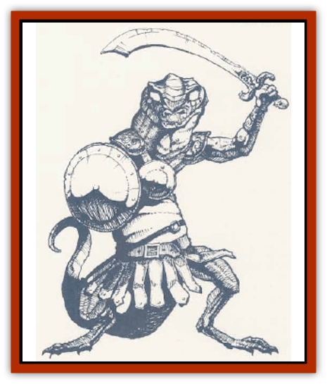

# Laerti

| Statistic | **Laerti** | **Stingtail** |
| --- | --- | --- |
| **Activity Cycle:** | Night | Night |
| **Alignment:** | Lawful evil | Neutral evil |
| **Armor Class:** | 5 | 3 |
| **Climate/Terrain:** | Temperate dry | Temperate dry |
| **Damage/Attack:** | 1d2 &times;2 (or by weapon)/1d6 (bite) | 1d4+1 &times;2 (or by weapon)/1d6 (bite)/2d4 (tail) |
| **Diet:** | Omnivore | Omnivore |
| **Frequency:** | Rare | Very rare |
| **Hit Dice:** | 3+3 | 7 |
| **Intelligence:** | Very (11-12) | Low (5-7) |
| **Magic Resistance:** | Nil | Nil |
| **Morale:** | M (7' tall, 9' tail) | L (12' tall, 14' tail) |
| **Movement:** | 18, Br 8 | 14, Br 10 |
| **No. Appearing:** | 6-48 | 2-13 |
| **No. of Attacks:** | 3 | 4 |
| **Organization:** | Tribe | Tribe |
| **Size:** | -15 | -18 |
| **Special Attacks:** | Nil | Poison (tail) |
| **Special Defenses:** | Nil | Spell immunities |
| **THAC0:** | 17 | 13 |
| **Treasure:** | O (D) | O (QRU) |
| **XP Value:** | 120 | 1,400 |

Also called *asabis*, these desert-dwelling reptilian humanoids are superficially like the [[Lizard_Man|lizard men]] of the swamplands. Laertis tend to be brown or gray in hue, with dun or light green underbellies. They have yellow, egg-shaped eyes so bright that they flash in darkness, with horizontal slit pupils. Laertis can run on all fours or stand upright, but their tails are not prehensile.

Laertis resemble the tiny lizards of the sands; unlike lizard men their limbs protrude from their sinuous bodies at right angles, and they move with quick, ungainly gestures. Their narrow skulls have sloping foreheads that end in protruding brows and swing from side to side atop thin, awkward necks. They touch and smell partially with their flicking tongues, and have rough pebbly skin, with gashes for ears and noses. They wear only leather armor, and their sexes appear identical to human eyes.

They speak their own sharp, chattery language.

**Combat:** Lads hire themselves out as mercenaries to surface beings or they hunt desert nomads and less intelligent creatures on their own. They use any sort of one-handed sword they can fashion or capture, and crude crossbows (equal to light crossbows) which they carry slung on their backs. Laertis are quite cunning and enjoy ambushing prey. By strict rule, they do not fight among themselves.

Laertis can readily burrow into and out of the sand, rising silently from buried concealment to strike down foes. They can run swiftly on all fours, their serpentine tails twitching behind (their speed inmases their effective Armor Class to 4 against missile weapons). At will they can rise upright on their rear legs to fight, or leap up to 20 feet horizontally or 15 feet upwards.

The same poisons affect laertis as affect humans, except that laertis are immune to stingtail poison.

**Habitat/Society:** On the surface of desert lands, laertis are only encountered at night. They spend the day hiding from the sun, either burrowed a few feet beneath the sand, in a cave, or huddled in a rock crevice. Their body temperatures prohibit them from activity in the hot sun; more than 2 to 5 turns of enforced marching or carrying in the sun will cause a laerti to collapse.

Left to themselves, laertis dwell in tribes under the rule of a council of elders and a war-leader. They may ally themselves with dark nagas and other evil creatures for mutual gain, or even adopt these into the tribe. Every laerti tribe has at least 2d8 stingtail members. Laertis have tunnels everywhere under the desert and often emerge by night to raid surface locales.

**Ecology:** Laertis eat the internal organs ("soft parts") of humans, camels, and other prey, tearing open the bodies and leaving the rest for the vultures. They also eat certain subterranean fungi, such as lichens, mushrooms, and myconids, and certain taproots that enter the depths from the surface world above.

**Stingtail**

  A rarer, larger variety of laerti, stingtails live peacefully with their laerti brethren. The two species are cross-fertile, 10% of the young being stingtails and the rest laertis. Stingtails are less intelligent, but larger and stronger, and usually content to follow the orders and aims of laertis. Stingtail color tends to be brown or dark reddish-brown.

Stingtails employ the same sorts of weapons in battle; however, their tails are prehensile and can slap for 2d4 points of damage or wield weapons. A stingtail making a successful tail slap can choose to release a spray of liquid poison through its pores (at will, up to 6 times per day). This caustic, vinegar-scented secretion causes victims to be *confused* for the round of striking and the following round, and the victim must save vs. poison or take type M poison effects (20/5, onset 1-4 minutes). Stingtails are immune to their own poison and to all known magics of the enchantment/charm school.

---
## Discovery & Documentation

**Source Publication:** Monstrous Compendium, 1995 Annual, Volume 2 (1995)
**Campaign Setting:** Advanced Dungeons & Dragons 2nd Edition
**Author(s):** Jon Pickens

### Other Creatures Found in This Source Book
   * [[Aboleth_Savant|Aboleth, Savant]]
   * [[Addazahr|Addazahr]]
   * [[Amiq_Rasol|Amiq Rasol]]
   * [[Arch-Shadow|Arch-Shadow]]
   * [[Automaton_Scaladar|Automaton, Scaladar]]
   * [[Automaton_Trobriand's|Automaton, Trobriand's]]
   * [[Bat_Sporebat|Bat, Sporebat]]
   * [[Beetle_Dragon|Beetle, Dragon]]
   * [[Bi-nou|Bi-nou]]
   * [[Boggle|Boggle]]
   * [[Brownie_Dobie|Brownie, Dobie]]
   * [[Brownie_Quickling|Brownie, Quickling]]
   * [[Cat_Crypt|Cat, Crypt]]
   * [[Cat_Great_Cath_Shee|Cat, Great, Cath Shee]]
   * [[Centaur-kin_Dorvesh|Centaur-kin, Dorvesh]]
   * [[Centaur-kin_Gnoat|Centaur-kin, Gnoat]]
   * [[Centaur-kin_Ha'pony|Centaur-kin, Ha'pony]]
   * [[Centaur-kin_Zebranaur|Centaur-kin, Zebranaur]]
   * [[Chronolily|Chronolily]]
   * [[Curst|Curst]]
   * [[Darktentacles|Darktentacles]]
   * [[Dinosaur_Aquatic|Dinosaur, Aquatic]]
   * [[Dinosaur_II|Dinosaur II]]
   * [[Dinosaur_III|Dinosaur III]]
   * [[Doppelganger_Greater|Doppelganger, Greater]]
   * [[Dragon_Brine|Dragon, Brine]]
   * [[Dragon_Half-|Dragon, Half-]]
   * [[Dragon-kin_Sea_Wyrm|Dragon-kin, Sea Wyrm]]
   * [[Dwarf_Wild|Dwarf, Wild]]
   * [[Ekimmu|Ekimmu]]
   * [[Elemental_Nature|Elemental, Nature]]
   * [[Elf_Winged|Elf, Winged]]
   * [[Fish_Great_Glacier|Fish (Great Glacier)]]
   * [[Fish_Subterranean|Fish, Subterranean]]
   * [[Fish_Toril|Fish (Toril)]]
   * [[Flareater|Flareater]]
   * [[Flumph|Flumph]]
   * [[Froghemoth|Froghemoth]]
   * [[Ghost_Casurua|Ghost, Casurua]]
   * [[Ghost_Ker|Ghost, Ker]]
   * [[Ghul|Ghul]]
   * [[Ghul-Kin|Ghul-Kin]]
   * [[Giant_Half-giant|Giant, Half-giant]]
   * [[Golem_Burning_Man|Golem, Burning Man]]
   * [[Golem_Phantom_Flyer|Golem, Phantom Flyer]]
   * [[Gulguthhydra|Gulguthhydra]]
   * [[Hakeashar|Hakeashar]]
   * [[Horse_Moon-|Horse, Moon-]]
   * [[Human_Dragonslayer|Human, Dragonslayer]]
   * [[Human_Vistana|Human, Vistana]]
   * [[Jellyfish_Giant|Jellyfish, Giant]]
   * [[Kalin|Kalin]]
   * [[Kholiathra|Kholiathra]]
   * [[Leucrotta_Greater|Leucrotta, Greater]]
   * [[Lich_Suel|Lich, Suel]]
   * [[Lurker_Shadow|Lurker, Shadow]]
   * [[Lycanthrope_Werepanther|Lycanthrope, Werepanther]]
   * [[Lycanthrope_Wereshark|Lycanthrope, Wereshark]]
   * [[Mammal_Herd_II|Mammal, Herd II]]
   * [[Marl|Marl]]
   * [[Meenlock|Meenlock]]
   * [[Mimic_Greater|Mimic, Greater]]
   * [[Mold_II|Mold II]]
   * [[Mummy_Creature|Mummy, Creature]]
   * [[Nyth|Nyth]]
   * [[Ooze_Slime_Jelly_Ghaunadan|Ooze/Slime/Jelly, Ghaunadan]]
   * [[Palimpsest|Palimpsest]]
   * [[Peltast|Peltast]]
   * [[Plant_Dangerous_II|Plant, Dangerous II]]
   * [[Pleistocene_Animal|Pleistocene Animal]]
   * [[Pudding_Subterranean|Pudding, Subterranean]]
   * [[Raggamoffyn|Raggamoffyn]]
   * [[Snake_Serpent|Snake, Serpent]]
   * [[Snake_Serpent_Vine|Snake, Serpent Vine]]
   * [[Sphinx_Draco-|Sphinx, Draco-]]
   * [[Sprite_Seelie_Faerie|Sprite, Seelie Faerie]]
   * [[Sprite_Unseelie_Faerie|Sprite, Unseelie Faerie]]
   * [[Squealer|Squealer]]
   * [[Turtle_Giant|Turtle, Giant]]
   * [[Umpleby|Umpleby]]
   * [[Vizier's_Turban|Vizier's Turban]]
   * [[Wall_Walker|Wall Walker]]
   * [[Webbird|Webbird]]
   * [[Yak-Man|Yak-Man]]
   * [[Zorbo|Zorbo]]
