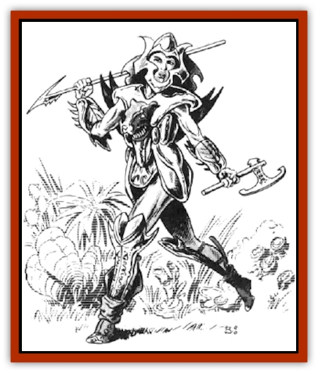

# Lakshu

| Statistic | **Lakshu** |
| --- | --- |
| **Activity Cycle:** | Mainly day |
| **Alignment:** | Neutral |
| **Armor Class:** | 0 (7) |
| **Climate/Terrain:** | Any |
| **Damage/Attack:** | By weapon and by shakti |
| **Diet:** | Omnivore |
| **Frequency:** | Very rare |
| **Hit Dice:** | 5 |
| **Intelligence:** | Very (11-12) |
| **Magic Resistance:** | 20% |
| **Morale:** | Fanatic (17-18) |
| **Movement:** | 12 |
| **No. Appearing:** | 2-20 |
| **No. of Attacks:** | One by weapon and by shakti |
| **Organization:** | Division |
| **Size:** | M (5'6&rdquo;-6' tall) |
| **Special Attacks:** | Shakti |
| **Special Defenses:** | Shakti |
| **THAC0:** | See below |
| **Treasure:** | Nil |
| **XP Value:** | 2,000 |

Lakshu are tall, beautiful, well-muscled, green-haired amazons. These teeth-gritting, armored harridans have laid waste to a thousand worlds, all in the name of their masters, the [[Reigar|reigar]]. Lakshu have a fondness for tattoos, body paint, and ornate raiment (when not in battle dress). Their physical appearance is virtually identical; the only identifying marks are their tattoos, and their individual tastes in off-duty clothing. The principle form of identification comes from their individual shaktis (see entry on [[Reigar|Reigar]] for complete shakti information). Consequently. each lakshu is known by her totem animal (e.g., Phoenix, Manta, etc.)

**Combat:** Lakshu are deadly in combat, exhibiting extreme proficiency in their weapon of choice. They are equally skilled in armes and unarmed combat, having been adapted by the reigar expressly as bodyguards/shock troops and shakti repair experts. Lakshu enter a berserker rage (morale 20, lasting until no opponents remain standing, +2 to attack and damage rolled when reduced to half their hit point total.

In battle, each lakshu can call and command up to three helots ([[Golem_General_Information|golem]]-like creatures that have the same attacks as their organic counterparts: AC 2, MV by creature type, HD by creature type +2, unaffected by *sleep* and *charm* spells; helots do not have any special abilities or spell-like abilities their organic forms may possess). These helots are used by the reigar in coordination with the lakshu as organizes fighting units, in addition to serving as crew members on the reigar esthetics.

**Habitat/Society:** It is not known how the association of the reigar and the lakshu came to be, but for as long as either race can remember they have been partners of sorts. The most accepted theory is that a raiding party of lakshu landed on the reigar homeworld with intent to dominate, little knowing what awaited them. (They had heard abut these namby-pamby artistes, but nothing was said to them about the lengths to which these artistes would go in their search for the ultimate experience.) As soon as the lakshu saw the shakti devices, they realized that an alliance was the best possible move for them. By accident it was discovered that the lakshu also had an affinity for shakti repair, which suited the reigar. (Repairs are not part of the reigar style - they as repetitious and mundane, two concepts that are foreign to the reigar.)

The reigar liked the lakshu's war-like temperament, and they were likewise pleased at the lakshu's ease with the shaktis. So the reigar set about appropriating the lakshu as a work of art. This entailed creating a uniform appearance for their race, in keeping with the reigar ideal of a single work of art. In this case, that meant re-creating the appearance of the lakshu as a whole, to gain the currently uniform height, weight, body mass, etc.

Lakshu are now the elite troops of the reigar, and they serve as crew members on esthetics, in which capacity they are in charge of the daily operations of the crafts. In return for their services, lakshu receive room, board, travel, and (for those who are especially favored or who perform above and beyond the call) sometimes even gifts, uniquely created for them by their commanding reigar. And, of course, they are given personal shaktis that function in the same way as the reigar's.

Their society, such as it is, is military in structure. Whenever two or more lakshu are present in one place, one must be superior to the others. A strict hierarchy is maintained, so that each lakshu knows her place and does not aspire to elevate herself. Lakshu reproduce via parthenogenesis. At specific times they give birth to a young lakshu, who is raised in a creche with the other offspring.

**Ecology:** Since their alliance with the reigar, the lakshu have become dependent on the esthetics for all their food needs. Their war-like raiding has been controlled as well; no longer are they laying waste at will. Now they lay waste when told to by their masters.

---
## Discovery & Documentation

**Source Publication:** MC7 Spelljammer Appendix I (1990)
**Campaign Setting:** Advanced Dungeons & Dragons 2nd Edition
**Author(s):** various

### Other Creatures Found in This Source Book
   * [[Aartuk|Aartuk]]
   * [[Albari|Albari]]
   * [[Ancient_Mariner|Ancient Mariner]]
   * [[Argos|Argos]]
   * [[Beholder_Abomination_Astereater|Beholder (Abomination), Astereater]]
   * [[Blazozoid|Blazozoid]]
   * [[Chattur|Chattur]]
   * [[Chevall|Chevall]]
   * [[Clockwork_Horror|Clockwork Horror]]
   * [[Colossus|Colossus]]
   * [[Delphinid|Delphinid]]
   * [[Dizantar|Dizantar]]
   * [[Dog|Dog]]
   * [[Dog_Bog_Hound|Dog, Bog Hound]]
   * [[Esthetic|Esthetic]]
   * [[Focoid|Focoid]]
   * [[Fractine|Fractine]]
   * [[Giant_Spacesea|Giant, Spacesea]]
   * [[Golem_Furnace|Golem, Furnace]]
   * [[Golem_Radiant|Golem, Radiant]]
   * [[Gravislayer|Gravislayer]]
   * [[Grommam|Grommam]]
   * [[Hadozee|Hadozee]]
   * [[Hamster_Giant_Space|Hamster, Giant Space]]
   * [[Jammer_Leech|Jammer Leech]]
   * [[Lumineaux|Lumineaux]]
   * [[Lutum|Lutum]]
   * [[Mimic_Space|Mimic, Space]]
   * [[Misi|Misi]]
   * [[Moon_Rogue|Moon, Rogue]]
   * [[Mortiss|Mortiss]]
   * [[Murderoid|Murderoid]]
   * [[Nay-Churr|Nay-Churr]]
   * [[Phlog-Crawler|Phlog-Crawler]]
   * [[Plasman|Plasman]]
   * [[Plasmoid_DeGleash|Plasmoid, DeGleash]]
   * [[Plasmoid_DelNoric|Plasmoid, DelNoric]]
   * [[Plasmoid_General_Information|Plasmoid, General Information]]
   * [[Plasmoid_Ontalak|Plasmoid, Ontalak]]
   * [[Puffer|Puffer]]
   * [[Q'nidar|Q'nidar]]
   * [[Rastipede|Rastipede]]
   * [[Reigar|Reigar]]
   * [[Rock_Hopper|Rock Hopper]]
   * [[Slinker|Slinker]]
   * [[Spider_Asteroid|Spider, Asteroid]]
   * [[Spiritjam|Spiritjam]]
   * [[Survivor|Survivor]]
   * [[Syllix|Syllix]]
   * [[Symbiont_Power|Symbiont, Power]]
   * [[Vine_Infinity|Vine, Infinity]]
   * [[Wiggle|Wiggle]]
   * [[Wizshade|Wizshade]]
   * [[Wryback|Wryback]]
   * [[Zard|Zard]]
   * [[Zodar|Zodar]]
